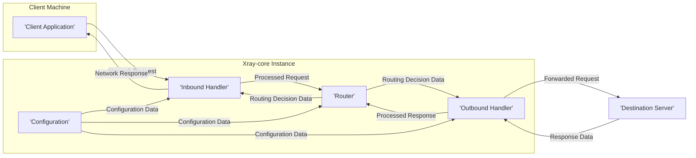

# Project Design Document: Xray-core

**Version:** 1.1
**Date:** October 26, 2023
**Author:** AI Software Architect

## 1. Introduction

This document provides an enhanced and detailed design overview of the Xray-core project, an open-source platform for building proxies and network tools. This document aims to provide a comprehensive and precise understanding of the system's architecture, components, and data flow. This detailed design will serve as a robust foundation for subsequent threat modeling activities, enabling a thorough analysis of potential security vulnerabilities.

## 2. Goals and Objectives

The primary goals of Xray-core are to provide:

*   A highly flexible and extensible platform for building diverse proxy types (e.g., SOCKS, HTTP, Shadowsocks, VMess, Trojan, and more).
*   Robust support for advanced routing and traffic manipulation capabilities, allowing for complex network configurations.
*   A modular design that facilitates the easy addition of new features, protocols, and transport mechanisms without impacting core functionality.
*   High performance and efficiency in handling network traffic, minimizing latency and resource consumption.
*   Cross-platform compatibility, enabling deployment on various operating systems and architectures.

This design document aims to clearly articulate the architecture with sufficient detail to facilitate:

*   Precise identification of potential security vulnerabilities within each component and interaction.
*   A comprehensive understanding of the attack surface of the system, considering various deployment scenarios.
*   The development of targeted and effective mitigation strategies to address identified threats.

## 3. High-Level Architecture

Xray-core operates as a network traffic processor, intercepting and forwarding connections based on its configuration. The following diagram illustrates the high-level architecture and the interaction between key components:



**Key Components:**

*   **Client Application:** The software application initiating the network request that will be proxied through the Xray-core instance.
*   **Xray-core Instance:** The central process responsible for intercepting, processing, and forwarding network traffic according to its configuration.
    *   **Inbound Handler:**  The entry point for client connections, responsible for accepting and processing incoming requests based on configured protocols.
    *   **Router:** The decision-making component that examines processed requests and applies routing rules to determine the appropriate outbound handling.
    *   **Outbound Handler:** Responsible for establishing connections to destination servers and forwarding requests based on the Router's decisions.
    *   **Configuration:**  The repository of rules, protocols, and settings that govern the behavior of the entire Xray-core instance.
*   **Destination Server:** The target server that the client application intends to communicate with, reached via the Xray-core proxy.

## 4. Detailed Component Description

This section provides a more granular description of each key component within the Xray-core architecture, outlining their specific responsibilities and functionalities.

### 4.1. Client Application

*   Represents any software application (e.g., web browser, custom application) that is configured to utilize Xray-core as a proxy server.
*   Initiates network connections intended for external servers, directing traffic to the configured Xray-core instance.
*   Communicates with the Xray-core instance using a supported inbound protocol (e.g., SOCKS5, HTTP, specific tunneling protocols).

### 4.2. Xray-core Instance

*   The core runtime environment of the Xray platform, responsible for managing and orchestrating network traffic processing.
*   Loads and interprets the configuration, dynamically adjusting its behavior based on the defined rules and settings.
*   Manages the lifecycle of inbound and outbound connections, ensuring efficient resource utilization.
*   Applies sophisticated routing logic to direct traffic through different outbound handlers based on various criteria.

#### 4.2.1. Inbound Handler

*   Acts as the network listener, accepting incoming connection requests from client applications on specified ports and protocols.
*   Supports a variety of inbound protocols, including but not limited to: SOCKS5, HTTP/HTTPS, Shadowsocks, VMess, Trojan, and potentially custom protocols.
*   Performs protocol-specific handshakes and authentication procedures as defined in the configuration, verifying client identity and authorization.
*   Handles the decryption of incoming traffic if the inbound protocol involves encryption (e.g., Shadowsocks, VMess, Trojan).
*   Parses the client's request to extract essential information such as the destination address (IP or domain name) and port.
*   May enforce access control lists (ACLs) based on source IP or other client attributes.

#### 4.2.2. Router

*   The intelligent traffic management component that receives processed requests from the Inbound Handler.
*   Evaluates the request against a configurable set of routing rules, which can be defined based on a wide range of criteria:
    *   Destination IP address or domain name (including support for wildcards and regular expressions).
    *   Destination port number.
    *   Source IP address or network.
    *   Inbound protocol used.
    *   User information (if authenticated by the Inbound Handler).
    *   Time of day or other contextual factors.
*   Determines the appropriate Outbound Handler to which the request should be forwarded based on the matching routing rule.
*   Supports advanced routing strategies such as:
    *   Load balancing across multiple outbound handlers.
    *   Failover to backup outbound handlers in case of failure.
    *   Conditional routing based on network conditions or other dynamic factors.
*   May perform traffic shaping or quality of service (QoS) adjustments based on routing rules.

#### 4.2.3. Outbound Handler

*   Responsible for establishing connections to the target destination servers as determined by the Router.
*   Supports various outbound protocols and transport mechanisms, including: direct connection, HTTP/HTTPS proxying, SOCKS proxying, and tunneling protocols like VMess and Trojan.
*   Handles the encryption of outgoing traffic if the selected outbound protocol requires it.
*   Forwards the processed request to the destination server using the chosen outbound protocol.
*   Receives the response from the destination server.
*   Handles decryption of the response if the outbound protocol involves encryption.
*   May implement features like connection pooling and reuse to optimize performance.

#### 4.2.4. Configuration

*   The central repository for all settings and rules that govern the operation of the Xray-core instance.
*   Typically stored in a structured file format such as JSON or YAML, allowing for human-readable and machine-parsable configuration.
*   Includes detailed configurations for:
    *   Inbound and outbound handlers, specifying protocols, ports, authentication methods, and encryption settings.
    *   Routing rules, defining the criteria for matching requests and the corresponding outbound handlers.
    *   Security settings, such as TLS certificates, private keys, and authentication credentials.
    *   Logging and debugging options, controlling the level of detail and destination of log messages.
    *   DNS settings, including custom DNS servers and DNS over HTTPS (DoH) configurations.
    *   Advanced features like transport settings (e.g., TCP, mKCP, WebSocket, HTTP/2).

## 5. Data Flow

The following diagram provides a more detailed illustration of the typical data flow through the Xray-core system, highlighting the transformations and processing steps involved:

```mermaid
graph LR
    subgraph "Client"
        A["'Client Request Data'"]
    end
    subgraph "Inbound Handler"
        B["'Receive Raw Data'"]
        C["'Protocol Handshake & Authentication'"]
        D["'Decryption (if applicable)'"]
        E["'Parse Request & Extract Metadata'"]
    end
    subgraph "Router"
        F["'Match Request Against Routing Rules'"]
        G["'Select Target Outbound Handler'"]
    end
    subgraph "Outbound Handler"
        H["'Establish Connection to Destination'"]
        I["'Encryption (if applicable)'"]
        J["'Forward Processed Request'"]
        K["'Receive Response Data'"]
        L["'Decryption (if applicable)'"]
    end
    subgraph "Destination Server"
        M["'Process Request'"]
        N["'Send Response Data'"]
    end

    A --> B
    B --> C
    C --> D
    D --> E
    E --> F
    F --> G
    G --> H
    H --> I
    I --> J
    J --> M
    M --> N
    N --> K
    K --> L
    L --> F  :::invisible
    F --> E  :::invisible
    E --> D  :::invisible
    D --> C  :::invisible
    C --> B  :::invisible
    B --> O["'Client Response Data'"]

    classDef invisible fill:#fff,stroke:#fff,stroke-width:0px;
```

**Detailed Data Flow Steps:**

1. **Client Request Data:** The client application sends its initial network request.
2. **Receive Raw Data:** The Inbound Handler receives the raw network data stream from the client.
3. **Protocol Handshake & Authentication:** The Inbound Handler performs the necessary protocol-specific handshake and authentication procedures to establish a secure and verified connection with the client.
4. **Decryption (if applicable):** If the inbound protocol utilizes encryption, the Inbound Handler decrypts the received data to access the underlying request.
5. **Parse Request & Extract Metadata:** The Inbound Handler parses the decrypted request to extract relevant metadata, such as the destination address, port, and protocol.
6. **Match Request Against Routing Rules:** The Router receives the extracted metadata and compares it against the configured routing rules to determine the appropriate handling.
7. **Select Target Outbound Handler:** Based on the matching routing rule, the Router selects the specific Outbound Handler responsible for forwarding the request.
8. **Establish Connection to Destination:** The selected Outbound Handler establishes a connection to the target destination server.
9. **Encryption (if applicable):** If the outbound protocol requires encryption, the Outbound Handler encrypts the processed request data.
10. **Forward Processed Request:** The Outbound Handler forwards the encrypted (or unencrypted) request to the destination server.
11. **Process Request:** The Destination Server receives and processes the incoming request.
12. **Send Response Data:** The Destination Server sends the response data back to the Outbound Handler.
13. **Receive Response Data:** The Outbound Handler receives the response data from the destination server.
14. **Decryption (if applicable):** If the outbound protocol utilized encryption, the Outbound Handler decrypts the received response data.
15. **Return Path (Invisible in Diagram for Clarity):** The response data flows back through the Router and Inbound Handler, undergoing similar processing steps in reverse (e.g., encryption by the Inbound Handler if required by the inbound protocol).
16. **Client Response Data:** The Inbound Handler sends the processed response data back to the client application.

## 6. Key Technologies

*   **Go Programming Language:** The primary language used for developing Xray-core, providing performance and concurrency benefits.
*   **gRPC Framework:** Potentially used for internal communication between different components within the Xray-core instance, enabling efficient and structured communication.
*   **TLS/SSL Protocol:** Essential for secure communication, providing encryption and authentication for various protocols.
*   **Diverse Set of Proxy Protocols:** Implementation of various proxy protocols like SOCKS5, HTTP/HTTPS, Shadowsocks, VMess, Trojan, allowing for flexible proxying capabilities.
*   **JSON and YAML:** Standard data serialization formats used for configuration files, enabling easy management and modification of settings.
*   **Various Transport Protocols:** Support for different transport protocols like TCP, mKCP, WebSocket, and HTTP/2, offering flexibility in network connectivity.

## 7. Security Considerations (Preliminary)

This section expands on the initial security considerations, providing more specific examples of potential risks and vulnerabilities based on the architecture. A comprehensive threat model will further detail these and other potential threats.

*   **Configuration Security:**
    *   **Risk:** Exposure of sensitive information (private keys, passwords, API keys) if the configuration file is not properly secured.
    *   **Mitigation:** Implement strong access controls on the configuration file, consider encryption at rest, and avoid storing sensitive information directly in plain text.
*   **Inbound Protocol Vulnerabilities:**
    *   **Risk:** Exploitation of vulnerabilities within specific inbound protocols (e.g., authentication bypasses, buffer overflows).
    *   **Mitigation:**  Regularly update Xray-core to patch known vulnerabilities, carefully review and configure protocol-specific security settings.
*   **Authentication and Authorization Flaws:**
    *   **Risk:** Unauthorized access to the proxy service or specific resources if authentication or authorization mechanisms are weak or improperly implemented.
    *   **Mitigation:** Utilize strong authentication methods, implement robust authorization policies, and regularly audit access controls.
*   **Data Confidentiality and Integrity Breaches:**
    *   **Risk:** Interception or modification of data transmitted through the proxy if encryption is not properly implemented or configured.
    *   **Mitigation:** Enforce encryption for sensitive protocols, use strong cryptographic algorithms, and ensure proper TLS/SSL certificate management.
*   **Denial of Service (DoS) Attacks:**
    *   **Risk:**  Overwhelming the Xray-core instance with excessive traffic, rendering it unavailable.
    *   **Mitigation:** Implement rate limiting, connection limits, and other traffic management techniques to mitigate DoS attacks.
*   **Code Injection Vulnerabilities:**
    *   **Risk:**  Execution of malicious code if user-supplied input is not properly validated and sanitized.
    *   **Mitigation:** Implement strict input validation and sanitization measures across all components that handle external input.
*   **Logging and Monitoring Deficiencies:**
    *   **Risk:**  Failure to detect and respond to security incidents due to insufficient logging or monitoring capabilities.
    *   **Mitigation:** Implement comprehensive logging of security-relevant events, establish monitoring systems to detect anomalies, and define incident response procedures.
*   **Routing Logic Exploitation:**
    *   **Risk:**  Malicious actors manipulating routing rules to redirect traffic to unintended destinations or bypass security controls.
    *   **Mitigation:** Secure the configuration and restrict access to routing rule modifications. Implement mechanisms to validate routing rule integrity.
*   **Outbound Protocol Vulnerabilities:**
    *   **Risk:** Exploitation of vulnerabilities in outbound protocols, potentially exposing the Xray-core instance or the destination server.
    *   **Mitigation:** Keep Xray-core updated, carefully configure outbound protocol settings, and be aware of known vulnerabilities in used protocols.

## 8. Deployment Model

Xray-core's versatility allows for various deployment models, each with its own security implications:

*   **Standalone Application on a Server:**
    *   **Implication:** Security relies heavily on the server's operating system security, network configuration, and the secure configuration of Xray-core itself.
*   **Containerized Environment (Docker, Kubernetes):**
    *   **Implication:**  Security considerations include container image security, orchestration platform security, and network policies within the container environment.
*   **Embedded within Another Application:**
    *   **Implication:** The security of Xray-core becomes intertwined with the security of the host application. Vulnerabilities in either can impact the other.
*   **Cloud-Based Deployment (e.g., AWS, Azure, GCP):**
    *   **Implication:** Security involves managing cloud provider security controls, network configurations (VPCs, security groups), and access management.

The chosen deployment model significantly influences the overall security posture and must be carefully considered during threat modeling and security hardening.

## 9. Assumptions and Constraints

*   The configuration is treated as the authoritative source of truth for the system's behavior, and its integrity is paramount.
*   The underlying operating system and network infrastructure on which Xray-core is deployed are assumed to be reasonably secure and maintained with necessary security updates.
*   This design document primarily focuses on the core Xray-core process and its immediate components. External dependencies such as DNS resolvers and certificate authorities are considered external entities for the scope of this document, although their interaction will be considered during threat modeling.
*   Performance and efficiency are key design considerations, but security should not be compromised for performance gains.

This enhanced design document provides a more detailed and comprehensive understanding of the Xray-core project's architecture. This detailed information will be invaluable for conducting a thorough and effective threat model, enabling the identification of potential security risks and the development of robust mitigation strategies.