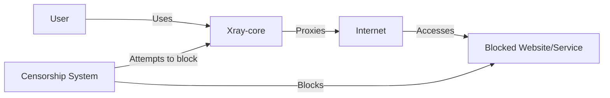
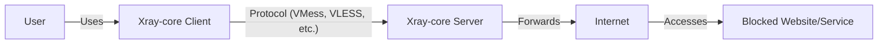
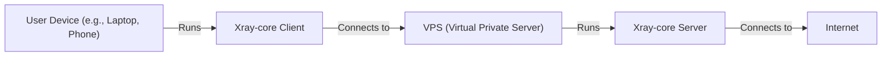
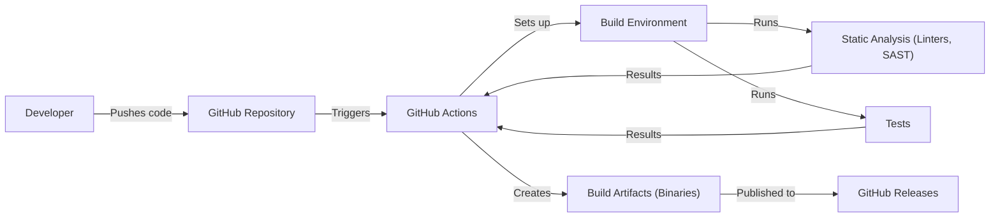

Okay, let's create a design document for the Xray-core project. I'll follow the instructions precisely, focusing on clarity, detail, and security considerations.

# BUSINESS POSTURE

Xray-core is a command-line utility and core component of Project X, a platform designed to circumvent internet censorship and provide secure, private communication.  It's likely used in environments with high levels of surveillance and restrictions on internet access.  The project's success hinges on its ability to reliably bypass censorship while maintaining user privacy and security.

Business Priorities:

*   Reliability: The software must consistently function as intended, providing uninterrupted access to the open internet.
*   Security: User data and communication must be protected from interception and surveillance.
*   Performance: The software should minimize latency and maximize throughput to provide a usable internet experience.
*   Obfuscation: The software's traffic must be difficult to detect and block by censors.
*   Maintainability: The codebase should be easy to update and maintain to adapt to evolving censorship techniques.
*   Community: Foster a strong community of users and developers to support the project's long-term viability.

Business Risks:

*   Compromise of user privacy and security: If Xray-core is compromised, users could be identified and subjected to surveillance or other harm.
*   Detection and blocking by censors: If censors can identify and block Xray-core traffic, the software becomes useless.
*   Legal and regulatory challenges: The project may face legal challenges or be targeted by governments.
*   Resource exhaustion: The project relies on community support and resources; if these are insufficient, the project may fail.
*   Reputational damage: Security vulnerabilities or failures could damage the project's reputation and erode user trust.
*   Supply chain attacks: Compromise of the build or distribution process could lead to malicious versions of the software being distributed.

# SECURITY POSTURE

Existing Security Controls:

*   security control: Cryptography: Xray-core uses various cryptographic protocols (VMess, VLESS, Trojan, Shadowsocks, Socks, etc.) to encrypt and authenticate communication between the client and server. (Described in project documentation and implemented in code).
*   security control: Obfuscation: Xray-core employs various techniques to obfuscate traffic and make it resemble legitimate internet traffic. (Described in project documentation and implemented in code).
*   security control: Regular Updates: The project is actively maintained, with frequent updates to address vulnerabilities and improve performance. (Evidenced by the GitHub repository's activity).
*   security control: Community Scrutiny: The open-source nature of the project allows for community review and identification of potential vulnerabilities. (Evidenced by the GitHub repository's issues and pull requests).
*   security control: Multiple Protocols: Support for multiple protocols provides redundancy and flexibility in circumventing censorship. (Described in project documentation).

Accepted Risks:

*   accepted risk: Zero-day vulnerabilities: Like all software, Xray-core is susceptible to unknown vulnerabilities that could be exploited.
*   accepted risk: Advanced persistent threats (APTs): Nation-state actors with significant resources may be able to develop custom attacks against Xray-core.
*   accepted risk: User error: Misconfiguration or improper use of Xray-core by users could compromise their security.
*   accepted risk: Reliance on external libraries: Xray-core depends on external libraries, which could contain vulnerabilities.
*   accepted risk: Server-side vulnerabilities: If a user's chosen Xray server is compromised, their traffic could be intercepted.

Recommended Security Controls:

*   security control: Formal Security Audits: Conduct regular, independent security audits of the codebase.
*   security control: Bug Bounty Program: Implement a bug bounty program to incentivize security researchers to find and report vulnerabilities.
*   security control: Hardening Guidelines: Provide clear and comprehensive hardening guidelines for users and server operators.
*   security control: Supply Chain Security: Implement robust measures to secure the build and distribution process, such as code signing and software bill of materials (SBOM).
*   security control: Memory Safe Language: Consider migrating critical components to a memory-safe language (e.g., Rust) to mitigate memory-related vulnerabilities.

Security Requirements:

*   Authentication:
    *   Clients must authenticate to servers using strong cryptographic methods.
    *   Support for multi-factor authentication should be considered.
*   Authorization:
    *   Access control mechanisms should be in place to restrict access to sensitive resources.
    *   Principle of least privilege should be followed.
*   Input Validation:
    *   All input from external sources (e.g., configuration files, network traffic) must be rigorously validated to prevent injection attacks.
    *   Fuzz testing should be employed to identify potential vulnerabilities.
*   Cryptography:
    *   Use only strong, well-vetted cryptographic algorithms and protocols.
    *   Key management must be secure and follow best practices.
    *   Regularly review and update cryptographic implementations to address new threats.
*   Configuration:
    *   Secure defaults should be used for all configuration options.
    *   Configuration files should be protected from unauthorized access.

# DESIGN

## C4 CONTEXT

Element Descriptions:

*   Element:
    *   Name: User
    *   Type: Person
    *   Description: An individual who wants to access the internet without censorship.
    *   Responsibilities: Configures and uses Xray-core client.
    *   Security controls: Uses strong passwords, keeps software updated, follows security best practices.

*   Element:
    *   Name: Xray-core
    *   Type: Software System
    *   Description: The core component of Project X, responsible for proxying and obfuscating internet traffic.
    *   Responsibilities: Encrypts and decrypts traffic, obfuscates traffic, routes traffic through proxy servers.
    *   Security controls: Cryptography, obfuscation, regular updates, community scrutiny.

*   Element:
    *   Name: Internet
    *   Type: External System
    *   Description: The global network of interconnected computer networks.
    *   Responsibilities: Provides access to websites and services.
    *   Security controls: N/A (External System)

*   Element:
    *   Name: Blocked Website/Service
    *   Type: External System
    *   Description: A website or service that is blocked by the censorship system.
    *   Responsibilities: Provides content or services.
    *   Security controls: N/A (External System)

*   Element:
    *   Name: Censorship System
    *   Type: External System
    *   Description: A system that monitors and blocks internet traffic based on various criteria.
    *   Responsibilities: Filters internet traffic, blocks access to specific websites and services.
    *   Security controls: N/A (External System)

## C4 CONTAINER

Element Descriptions:

*   Element:
    *   Name: User
    *   Type: Person
    *   Description: An individual who wants to access the internet without censorship.
    *   Responsibilities: Configures and uses Xray-core client.
    *   Security controls: Uses strong passwords, keeps software updated, follows security best practices.

*   Element:
    *   Name: Client
    *   Type: Application
    *   Description: An instance of Xray-core running on the user's device.
    *   Responsibilities: Encrypts and decrypts traffic, obfuscates traffic, connects to the Xray-core server.
    *   Security controls: Cryptography, obfuscation, input validation.

*   Element:
    *   Name: Server
    *   Type: Application
    *   Description: An instance of Xray-core running on a server in a non-censored location.
    *   Responsibilities: Receives traffic from the client, decrypts and forwards it to the internet, encrypts and returns responses to the client.
    *   Security controls: Cryptography, input validation, secure configuration.

*   Element:
    *   Name: Internet
    *   Type: External System
    *   Description: The global network of interconnected computer networks.
    *   Responsibilities: Provides access to websites and services.
    *   Security controls: N/A (External System)

*   Element:
    *   Name: Blocked Website/Service
    *   Type: External System
    *   Description: A website or service that is blocked by the censorship system.
    *   Responsibilities: Provides content or services.
    *   Security controls: N/A (External System)

## DEPLOYMENT

Possible Deployment Solutions:

1.  Self-hosted server: Users can deploy Xray-core on their own servers (VPS, dedicated servers) in a non-censored location.
2.  Community-provided servers: Users can rely on servers provided by the Xray community or trusted third parties.
3.  Cloud platforms: Deploying on cloud platforms like AWS, Google Cloud, Azure, etc.

Chosen Solution (Self-hosted server - for detailed description):

Element Descriptions:

*   Element:
    *   Name: User Device
    *   Type: Device
    *   Description: The user's computer or mobile device.
    *   Responsibilities: Runs the Xray-core client.
    *   Security controls: Operating system security, firewall, antivirus.

*   Element:
    *   Name: UserXrayClient
    *   Type: Application
    *   Description: Instance of Xray-core client.
    *   Responsibilities: Encrypt and forward traffic.
    *   Security controls: Xray-core client security features.

*   Element:
    *   Name: VPS (Virtual Private Server)
    *   Type: Server
    *   Description: A virtual server rented from a hosting provider.
    *   Responsibilities: Hosts the Xray-core server.
    *   Security controls: Operating system security, firewall, SSH access control.

*   Element:
    *   Name: ServerXrayCore
    *   Type: Application
    *   Description: Instance of Xray-core server.
    *   Responsibilities: Decrypt and forward traffic.
    *   Security controls: Xray-core server security features.

*   Element:
    *   Name: Internet
    *   Type: Network
    *   Description: The global network.
    *   Responsibilities: Route traffic.
    *   Security controls: N/A

## BUILD

The Xray-core build process leverages GitHub Actions for automation. The process can be summarized as follows:

1.  Developer pushes code changes to the GitHub repository.
2.  GitHub Actions triggers a workflow based on the defined events (e.g., push, pull request).
3.  The workflow sets up the build environment (e.g., Go compiler, dependencies).
4.  The code is compiled, and tests are executed.
5.  Static analysis tools (linters, security scanners) are run to identify potential issues.  While the provided repository doesn't explicitly show *which* SAST tools are used, this is a *highly recommended* step.  Tools like `gosec` (for Go security) and others should be integrated.
6.  If all checks pass, release artifacts (binaries for various platforms) are created.
7.  These artifacts are often published as GitHub Releases, making them available for download.

Security Controls in Build Process:

*   security control: Automated Build: GitHub Actions provides a consistent and reproducible build process.
*   security control: Dependency Management: Go modules (go.mod, go.sum) are used to manage dependencies and their versions, reducing the risk of using vulnerable libraries.  Regular dependency updates are crucial.
*   security control: (Recommended) Static Analysis: Integration of SAST tools to detect vulnerabilities during the build.
*   security control: (Recommended) Software Bill of Materials (SBOM): Generation of an SBOM to track all components and dependencies.
*   security control: (Recommended) Code Signing: Digitally signing the released binaries to ensure their integrity and authenticity.

# RISK ASSESSMENT

Critical Business Processes:

*   Providing uncensored internet access to users in censored environments.
*   Maintaining user privacy and anonymity.
*   Ensuring the continuous operation and availability of the Xray-core service.

Data Sensitivity:

*   User IP addresses: Highly sensitive, as they can be used to identify and locate users.
*   Browsing history: Highly sensitive, as it reveals users' online activity.
*   Communication content: Highly sensitive, as it may contain personal or confidential information.
*   Configuration data: Sensitive, as it may contain credentials or other secrets.
*   Xray-core server IP addresses: Sensitive, as they can be targeted by censors.

# QUESTIONS & ASSUMPTIONS

Questions:

*   What specific threat actors are considered the highest priority (e.g., nation-state actors, script kiddies)?
*   What is the acceptable level of downtime for the service?
*   What resources are available for security audits and penetration testing?
*   Are there any specific compliance requirements (e.g., GDPR, CCPA)?
*   What is the process for handling security vulnerabilities reported by external researchers?
*   What are the specific obfuscation techniques used, and how are they evaluated for effectiveness?
*   What mechanisms are in place to detect and respond to server compromise?
*   How are cryptographic keys managed and protected?
*   What is the process for updating dependencies and ensuring their security?
*   What kind of testing (unit, integration, end-to-end) is performed, and what is the code coverage?

Assumptions:

*   BUSINESS POSTURE: The primary goal is to circumvent censorship, even at the potential cost of some performance.
*   BUSINESS POSTURE: Users are aware of the risks associated with using censorship circumvention tools.
*   SECURITY POSTURE: The development team prioritizes security and follows secure coding practices.
*   SECURITY POSTURE: Users are responsible for securing their own devices and choosing trustworthy servers.
*   DESIGN: The Xray-core client and server are designed to be lightweight and efficient.
*   DESIGN: The project relies on community contributions for development and support.
*   DESIGN: The build process is automated using GitHub Actions.
*   DESIGN: Go is the primary programming language.