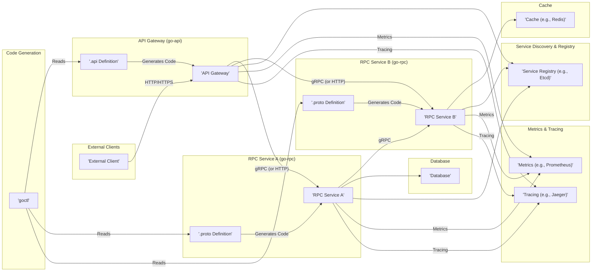
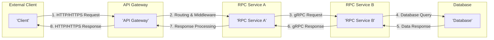

# Project Design Document: go-zero Microservice Framework (Improved)

**Version:** 1.1
**Date:** October 26, 2023
**Author:** AI Software Architect

## 1. Introduction

This document provides an enhanced architectural design of the go-zero microservice framework, based on the project at [https://github.com/zeromicro/go-zero](https://github.com/zeromicro/go-zero). Its primary purpose is to serve as a robust foundation for threat modeling, offering a clear understanding of the framework's components, their interactions, and data flow from a security perspective.

## 2. Goals

*   Clearly define the core components within the go-zero framework and their security-relevant responsibilities.
*   Illustrate the typical request lifecycle and data handling patterns within a go-zero application, highlighting potential security touchpoints.
*   Identify key interfaces and communication pathways that are critical for security analysis and threat identification.
*   Provide a detailed architectural overview to facilitate comprehensive and effective threat modeling exercises.

## 3. Target Audience

This document is intended for individuals and teams involved in the security and development lifecycle of go-zero based applications:

*   Security engineers and architects conducting threat modeling and security assessments.
*   Software developers building and maintaining services using the go-zero framework.
*   DevOps and operations teams responsible for deploying and managing go-zero applications in production environments.

## 4. System Overview

go-zero is a high-performance, lightweight Go framework designed for building resilient and scalable microservices. It simplifies the development process by providing built-in support for API definition, RPC communication, comprehensive middleware, and observability features. Its architecture promotes independent service deployment and communication.

## 5. Architectural Design

go-zero applications adhere to a microservice architecture, typically composed of several independent services that communicate to fulfill business functionalities.

### 5.1. Major Components

*   **API Gateway (`go-api`):**
    *   The single entry point for all external client requests (typically using HTTP/HTTPS).
    *   Responsible for request routing to appropriate backend services.
    *   Handles cross-cutting concerns like authentication, authorization, rate limiting, and request transformation.
    *   API endpoints are defined declaratively using `.api` specification files.
    *   `goctl` generates server-side code and client SDKs from these definitions.
*   **RPC Services (`go-rpc`):**
    *   Implement specific business capabilities and logic.
    *   Communicate with each other primarily using gRPC for efficient and type-safe communication.
    *   Service interfaces and data structures are defined using Protocol Buffers (`.proto` files).
    *   `goctl` generates service interfaces, data structures, and client/server stubs.
*   **`goctl` (Code Generation Toolkit):**
    *   A command-line tool central to the go-zero development workflow.
    *   Generates boilerplate code for API handlers, RPC service implementations, data access logic, and more.
    *   Ensures consistency and reduces manual coding effort, but also introduces a dependency on the tool itself.
*   **Middleware (Interceptors):**
    *   Provides a powerful mechanism to intercept and process requests and responses at various stages.
    *   Used for implementing cross-cutting concerns such as logging, tracing, metrics collection, authentication, authorization, and error handling.
    *   Can be applied at both the API Gateway and individual RPC service levels.
*   **Service Discovery and Registry (e.g., Etcd, Consul, Nacos):**
    *   Enables dynamic service location and management in a distributed environment.
    *   RPC services register their network addresses with the registry upon startup.
    *   API Gateways and other RPC services query the registry to discover available instances of target services.
*   **Circuit Breaker and Adaptive Load Balancing:**
    *   Built-in resilience mechanisms to prevent cascading failures and optimize resource utilization.
    *   Circuit breakers stop sending requests to failing services, while adaptive load balancing distributes traffic based on service health and performance.
*   **Metrics and Tracing Integration (e.g., Prometheus, Jaeger, OpenTelemetry):**
    *   Provides observability into the performance and behavior of services.
    *   Allows for monitoring key metrics (latency, error rates, etc.) and tracing requests across service boundaries for debugging and performance analysis.
*   **Caching (Optional, e.g., Redis, Memcached):**
    *   An optional layer for improving performance by storing frequently accessed data in memory.
    *   Can be implemented at various levels within services to reduce database load.
*   **Data Storage (Optional, e.g., MySQL, PostgreSQL, MongoDB):**
    *   Persistent storage for application data.
    *   Accessed by RPC services to store and retrieve information based on business requirements.

### 5.2. Component Diagram

## 6. Data Flow

A typical request flow within a go-zero application proceeds as follows, with potential security implications at each stage:

1. **External Client Initiates Request:** An external client sends an HTTP/HTTPS request to the API Gateway. *Security Consideration: This is the initial point of contact and requires robust authentication, authorization, and input validation.*
2. **API Gateway Receives and Routes:** The API Gateway receives the request and uses its routing configuration (defined in the `.api` file) to determine the appropriate backend RPC service. *Security Consideration: Improperly configured routing can lead to unintended access to services.*
3. **API Gateway Middleware Processing:**  Configured middleware within the API Gateway intercepts the request. This may include authentication checks (e.g., verifying JWTs), authorization checks (e.g., RBAC), and rate limiting. *Security Consideration: Vulnerabilities in middleware or misconfiguration can bypass security controls.*
4. **Request Forwarding to RPC Service:** The API Gateway forwards the request to the designated RPC service, typically using gRPC. *Security Consideration: Secure communication channels (e.g., TLS) are crucial for protecting data in transit.*
5. **RPC Service Receives Request:** The target RPC service receives the request.
6. **RPC Service Middleware Processing:** Similar to the API Gateway, RPC services can have their own middleware for tasks like logging, tracing, and potentially further authentication/authorization checks. *Security Consideration: Consistent security enforcement across all layers is important.*
7. **Business Logic Execution:** The RPC service executes its core business logic, potentially involving interactions with other services, databases, or caches.
8. **Inter-Service Communication (Optional):** The RPC service might need to communicate with other RPC services to fulfill the request. This communication also typically uses gRPC, leveraging service discovery. *Security Consideration: Secure inter-service communication and proper authorization are essential to prevent lateral movement.*
9. **Data Access (Optional):** The RPC service may interact with a database to retrieve or persist data. *Security Consideration: Secure database credentials, parameterized queries, and proper data sanitization are critical.*
10. **Response Generation:** The RPC service generates a response.
11. **Response Middleware Processing (RPC Service):** Outgoing middleware in the RPC service can process the response (e.g., adding headers, logging).
12. **Response Transmission to API Gateway:** The RPC service sends the response back to the API Gateway.
13. **Response Middleware Processing (API Gateway):** Outgoing middleware in the API Gateway can process the response.
14. **Response Aggregation (If Applicable):** If the initial request involved multiple backend services, the API Gateway aggregates the responses.
15. **Response to External Client:** The API Gateway sends the final response back to the external client. *Security Consideration: Ensure sensitive information is not inadvertently exposed in the response.*
16. **Metrics and Tracing Data Collection:** Throughout the entire request lifecycle, metrics and tracing information are collected by monitoring systems. *Security Consideration: Secure storage and access control for sensitive monitoring data are important.*

## 7. Security Considerations and Potential Threats

This section details security considerations for each component and outlines potential threats.

*   **API Gateway Security:**
    *   **Authentication:**
        *   Considerations: Choice of authentication mechanism (API keys, OAuth 2.0, JWT), secure key management, protection against brute-force attacks.
        *   Potential Threats: Unauthorized access, credential stuffing, session hijacking.
    *   **Authorization:**
        *   Considerations: Implementation of fine-grained access control (RBAC, ABAC), secure policy enforcement.
        *   Potential Threats: Privilege escalation, unauthorized data access.
    *   **Rate Limiting:**
        *   Considerations: Configuration of appropriate rate limits to prevent denial-of-service attacks.
        *   Potential Threats: Application-level DDoS, resource exhaustion.
    *   **Input Validation:**
        *   Considerations: Strict validation of all incoming requests to prevent injection attacks (SQL injection, XSS, command injection).
        *   Potential Threats: Data breaches, code execution.
    *   **TLS/SSL Configuration:**
        *   Considerations: Proper configuration of TLS/SSL certificates, enforcement of HTTPS.
        *   Potential Threats: Man-in-the-middle attacks, eavesdropping.
*   **RPC Service Security:**
    *   **Authentication and Authorization:**
        *   Considerations: Secure authentication and authorization mechanisms for inter-service communication (e.g., mTLS, JWT propagation).
        *   Potential Threats: Service impersonation, unauthorized access to service functionalities.
    *   **Input Validation:**
        *   Considerations: Validation of data received from other services to prevent injection attacks and data corruption.
        *   Potential Threats: Data integrity issues, service compromise.
    *   **Secure Inter-Service Communication:**
        *   Considerations: Encryption of communication channels between services (e.g., using gRPC with TLS).
        *   Potential Threats: Eavesdropping on inter-service communication, data breaches.
*   **Service Discovery Security:**
    *   **Access Control:**
        *   Considerations: Restricting access to the service registry to authorized services and administrators.
        *   Potential Threats: Unauthorized service registration, service discovery poisoning, denial of service.
    *   **Data Integrity:**
        *   Considerations: Ensuring the integrity and authenticity of data stored in the service registry.
        *   Potential Threats: Man-in-the-middle attacks on registry communication, data manipulation.
*   **Data Security:**
    *   **Data at Rest:**
        *   Considerations: Encryption of sensitive data stored in databases.
        *   Potential Threats: Data breaches due to unauthorized access to storage.
    *   **Data in Transit:**
        *   Considerations: Encryption of communication between services and databases.
        *   Potential Threats: Eavesdropping on database communication.
    *   **Access Control:**
        *   Considerations: Implementing strict access control policies for database access.
        *   Potential Threats: Unauthorized data modification or deletion.
*   **`goctl` Security:**
    *   Considerations: Ensuring the integrity of the `goctl` tool and its dependencies to prevent the introduction of vulnerabilities during code generation.
    *   Potential Threats: Supply chain attacks, generation of insecure code.
*   **Observability Security:**
    *   Considerations: Secure storage and access control for metrics and tracing data to prevent unauthorized access to sensitive information.
    *   Potential Threats: Exposure of sensitive data in logs or traces, unauthorized monitoring of system behavior.

## 8. Deployment Considerations and Security

Security during deployment is crucial for protecting go-zero applications:

*   **Container Security:**
    *   Considerations: Using minimal base images, regularly scanning container images for vulnerabilities, implementing proper resource limits and security contexts.
    *   Potential Threats: Container escape, exploitation of vulnerabilities in container images.
*   **Kubernetes Security (if applicable):**
    *   Considerations: Implementing network policies to restrict inter-service communication, utilizing Role-Based Access Control (RBAC) for managing access to Kubernetes resources, secure secrets management (e.g., HashiCorp Vault, Kubernetes Secrets with encryption at rest).
    *   Potential Threats: Unauthorized access to Kubernetes resources, container compromise, network segmentation bypass.
*   **Infrastructure Security:**
    *   Considerations: Securely configuring the underlying infrastructure (cloud providers, virtual machines), implementing firewalls and intrusion detection systems.
    *   Potential Threats: Infrastructure compromise, network attacks.
*   **Secrets Management:**
    *   Considerations: Securely managing sensitive information like database credentials, API keys, and TLS certificates. Avoid storing secrets in code or configuration files.
    *   Potential Threats: Exposure of sensitive credentials, unauthorized access to resources.

## 9. Future Considerations

*   **Formal Threat Modeling Sessions:** Conduct regular threat modeling sessions using frameworks like STRIDE or PASTA to identify and mitigate potential security risks.
*   **Security Audits and Penetration Testing:** Perform periodic security audits and penetration testing to identify vulnerabilities in the framework and deployed applications.
*   **Integration with Security Scanning Tools:** Integrate with static and dynamic application security testing (SAST/DAST) tools to automate vulnerability detection.
*   **Security Best Practices Documentation:** Develop and maintain comprehensive security best practices documentation for developers using go-zero.
*   **Explore Advanced Authentication/Authorization:** Investigate and implement more advanced authentication and authorization mechanisms as needed.

## 10. Conclusion

This improved design document provides a more detailed and security-focused overview of the go-zero microservice framework. By understanding the architecture, data flow, and potential threats associated with each component, security professionals and development teams can effectively perform threat modeling and implement appropriate security measures to build resilient and secure applications using go-zero. This document serves as a valuable resource for ongoing security analysis and improvement efforts.