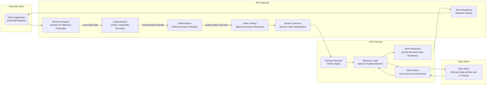

## Project Design Document: go-zero Microservice Framework (Improved)

**1. Introduction**

This document provides an enhanced design overview of the go-zero microservice framework (as found at [https://github.com/zeromicro/go-zero](https://github.com/zeromicro/go-zero)). This revised document offers a more detailed and security-focused perspective on the framework's architecture, key components, and data flow, specifically tailored to support comprehensive threat modeling activities.

**2. Goals**

*   Provide a clear, concise, and security-focused description of the go-zero framework's architecture and components.
*   Identify key functionalities, interactions, and potential security vulnerabilities within the framework.
*   Outline the typical data flow within a go-zero application, emphasizing security-relevant stages.
*   Describe common deployment models for go-zero applications and their associated security considerations.
*   Highlight specific security considerations and potential threats relevant to the framework.

**3. Target Audience**

This document is intended for individuals involved in:

*   Security architecture and threat modeling of systems built with go-zero.
*   Development and deployment of secure applications using go-zero.
*   Security auditing and penetration testing of go-zero based systems.
*   Understanding the security implications of the internal workings and design principles of go-zero.

**4. System Architecture**

The go-zero framework facilitates the development of high-performance, resilient microservices. The architecture, with a security lens, can be visualized as follows:

```mermaid
graph LR
    subgraph "External Client"
        EC("External Client Application")
    end
    subgraph "API Gateway (go-zero)"
        AG_Receive["Receive Request\n(Potential DoS Point)"] --> AG_AuthN["Authentication\n(Auth Bypass Risk)"];
        AG_AuthN --> AG_AuthZ["Authorization\n(Privilege Escalation Risk)"];
        AG_AuthZ --> AG_RateLimit["Rate Limiting\n(Bypass Risk)"];
        AG_RateLimit --> AG_Route["Routing\n(Misrouting Risk)"];
        AG_Route --> TargetService;
        TargetService --> AG_Response["Response Handling\n(Data Leakage Risk)"];
    end
    subgraph "RPC Service (go-zero)"
        TargetService_Receive["Receive Request"] --> TargetService_Validate["Input Validation\n(Injection Vulnerabilities)"];
        TargetService_Validate --> TargetService_Logic["Logic Processing"];
        TargetService_Logic --> TargetService_Data["Data Access\n(Data Breach Risk)"];
        TargetService_Data --> DS[/"Data Store(s)\n(e.g., MySQL, Redis)\n(Data at Rest Security)"];
        TargetService_Logic --> TargetService_Response["Response Generation"];
    end
    EC --> AG_Receive;
    AG_Response --> EC;
```

**5. Key Components (Security Focused)**

The go-zero framework's components, viewed through a security perspective, are described below:

*   **API Gateway:**
    *   **Description:** The hardened entry point for external requests, responsible for crucial security functions.
    *   **Responsibilities:**
        *   Receiving and rigorously validating incoming requests to prevent malformed input attacks.
        *   Authenticating clients using secure mechanisms (e.g., OAuth 2.0, JWT) and protecting credentials.
        *   Authorizing access based on roles and permissions, mitigating unauthorized access.
        *   Applying rate limiting and throttling policies to defend against denial-of-service attacks.
        *   Securely routing requests to backend services, preventing misrouting or unauthorized access.
        *   Handling responses and sanitizing data to prevent information leakage.
    *   **Key Technologies:** `go-zero/rest` package, middleware for authentication and authorization.

*   **RPC Service:**
    *   **Description:**  The core logic layer, requiring robust security measures to protect sensitive operations and data.
    *   **Responsibilities:**
        *   Implementing specific business functionalities securely, avoiding common vulnerabilities.
        *   Receiving requests, ensuring proper authentication and authorization even for internal calls.
        *   Performing thorough input validation to prevent injection attacks and data corruption.
        *   Accessing and manipulating data securely, adhering to the principle of least privilege.
        *   Returning responses without exposing sensitive information or error details unnecessarily.
    *   **Key Technologies:** `go-zero/zrpc` package, gRPC with potential for TLS encryption.

*   **Data Stores:**
    *   **Description:**  Critical assets requiring strong security measures to protect data confidentiality, integrity, and availability.
    *   **Examples:** MySQL, PostgreSQL (requiring secure connection strings and access controls), Redis (potential for data injection if not secured), MongoDB (requiring authentication and authorization).
    *   **Responsibilities:**
        *   Storing sensitive application data securely, employing encryption at rest.
        *   Providing secure data access interfaces, enforcing authentication and authorization.
        *   Ensuring data integrity through validation and transaction management.
        *   Implementing backup and recovery mechanisms to maintain data availability.

*   **Concurrency Control:**
    *   **Description:** Mechanisms to prevent race conditions, which can sometimes lead to security vulnerabilities.
    *   **Key Features:** `go-zero/core/syncx` package, usage requires careful implementation to avoid unintended side effects.
    *   **Responsibilities:**
        *   Protecting shared resources from concurrent modification, preventing data corruption or inconsistent state.
        *   Ensuring that concurrent operations do not introduce security vulnerabilities.

*   **Circuit Breaker:**
    *   **Description:** While primarily for resilience, it indirectly contributes to security by preventing cascading failures that could expose vulnerabilities.
    *   **Key Technologies:** Integrated within the `zrpc` package, configuration is important for effectiveness.
    *   **Responsibilities:**
        *   Preventing repeated attempts to failing services, which could be under attack.
        *   Improving overall system stability, reducing the attack surface exposed by failing components.

*   **Rate Limiter:**
    *   **Description:** A crucial security control to prevent abuse and denial-of-service attacks.
    *   **Key Technologies:** Integrated within the API Gateway, requires careful configuration of limits and thresholds.
    *   **Responsibilities:**
        *   Enforcing predefined request limits based on various criteria (e.g., IP address, user).
        *   Protecting services from being overwhelmed by malicious or accidental traffic.

*   **Metrics and Tracing:**
    *   **Description:** Essential for security monitoring and incident response.
    *   **Key Technologies:** Integration with Prometheus, Jaeger, requiring secure configuration and access control.
    *   **Responsibilities:**
        *   Collecting security-relevant performance metrics (e.g., error rates, authentication failures).
        *   Tracking requests across services to identify suspicious patterns or anomalies.
        *   Facilitating debugging and security incident analysis.

*   **Configuration Management:**
    *   **Description:** Securely managing application configurations is critical to prevent unauthorized modifications.
    *   **Key Technologies:** YAML configuration files, environment variables (requires secure handling of secrets), potentially external configuration stores.
    *   **Responsibilities:**
        *   Providing a centralized and secure way to manage application settings, including sensitive credentials.
        *   Enabling controlled and audited configuration updates.

**6. Data Flow (Security Perspective)**

A typical request flow in a go-zero application, highlighting security checkpoints and potential risks, is as follows:



**Detailed Steps (Security Focus):**

1. **Client Request:** A client application (potentially malicious) sends a request to the API Gateway. This is the first point of potential attack.
2. **API Gateway Reception:** The API Gateway receives the incoming request and should immediately inspect it for suspicious patterns or malicious payloads.
3. **Authentication:** The API Gateway attempts to verify the identity of the client using secure methods, protecting against credential theft or brute-force attacks.
4. **Authorization:** The API Gateway checks if the authenticated client has the necessary permissions to access the requested resource, preventing unauthorized actions.
5. **Rate Limiting:** The API Gateway enforces rate limits to prevent denial-of-service attacks by blocking excessive requests from a single source.
6. **Routing:** The API Gateway determines the appropriate backend RPC service to handle the request, ensuring requests are not misdirected to unintended or vulnerable services.
7. **RPC Request:** The API Gateway securely forwards the request to the target RPC service, potentially using encrypted communication.
8. **RPC Service Reception:** The RPC service receives the request and should verify its origin and integrity.
9. **Business Logic:** The RPC service executes the core business logic, which must be implemented securely to avoid vulnerabilities like injection flaws or insecure deserialization.
10. **Data Access:** If necessary, the RPC service interacts with data stores using secure connections and with appropriate authorization, protecting against data breaches.
11. **Data Store Interaction:** The data store performs the requested data operations, ensuring data integrity and confidentiality through encryption and access controls.
12. **RPC Response:** The RPC service generates a response, taking care not to expose sensitive information or unnecessary error details.
13. **API Gateway Response:** The API Gateway receives the response from the RPC service and sanitizes it before sending it back to the client, preventing information leakage.
14. **Client Receives Response:** The client application receives the final response.

**7. Deployment Model (Security Implications)**

go-zero applications deployed in various environments have different security considerations:

*   **Kubernetes:**
    *   **Security Considerations:** Requires careful configuration of network policies, RBAC (Role-Based Access Control), Secrets management, and container security scanning. Vulnerabilities in the Kubernetes control plane or worker nodes can impact application security.
    *   **Example Threats:** Container escape, unauthorized access to Kubernetes API, compromised secrets.

*   **Virtual Machines (VMs):**
    *   **Security Considerations:** Requires proper hardening of the operating system, network segmentation, firewall rules, and secure access management. Patch management is crucial.
    *   **Example Threats:** SSH brute-forcing, compromised VM leading to lateral movement.

*   **Cloud Platforms (AWS, GCP, Azure):**
    *   **Security Considerations:** Leveraging cloud-native security services like IAM (Identity and Access Management), security groups, and managed key management services is essential. Misconfiguration of cloud resources is a common risk.
    *   **Example Threats:** Exposed S3 buckets, misconfigured IAM roles, insecure network configurations.

**8. Security Considerations (Specific Threats and Mitigations)**

This section provides more specific security considerations and potential threats relevant to go-zero applications, along with potential mitigations.

*   **Authentication and Authorization:**
    *   **Threats:** Authentication bypass, weak password policies, insecure storage of credentials, privilege escalation.
    *   **Mitigations:** Implement strong authentication mechanisms (e.g., OAuth 2.0, JWT), enforce strong password policies, securely store credentials (e.g., using HashiCorp Vault), implement robust role-based access control.

*   **Input Validation:**
    *   **Threats:** SQL injection, cross-site scripting (XSS), command injection, path traversal.
    *   **Mitigations:** Sanitize and validate all user inputs, use parameterized queries, implement output encoding, avoid constructing commands from user input.

*   **Rate Limiting and Throttling:**
    *   **Threats:** Denial-of-service (DoS) attacks, brute-force attacks.
    *   **Mitigations:** Implement rate limiting at the API Gateway, use adaptive rate limiting, block malicious IP addresses.

*   **Secure Communication:**
    *   **Threats:** Man-in-the-middle (MITM) attacks, eavesdropping.
    *   **Mitigations:** Enforce HTTPS for all external communication, use TLS for internal communication (mTLS), avoid transmitting sensitive data over unencrypted channels.

*   **Data Protection:**
    *   **Threats:** Data breaches, unauthorized access to sensitive data.
    *   **Mitigations:** Encrypt sensitive data at rest and in transit, implement strong access controls to data stores, use data masking or anonymization techniques where appropriate.

*   **Dependency Management:**
    *   **Threats:** Exploiting vulnerabilities in third-party libraries.
    *   **Mitigations:** Regularly scan dependencies for known vulnerabilities, keep dependencies up-to-date, use dependency management tools.

*   **Logging and Monitoring:**
    *   **Threats:** Failure to detect security incidents, delayed incident response.
    *   **Mitigations:** Implement comprehensive logging of security-related events, set up real-time monitoring and alerting for suspicious activity, securely store and manage logs.

*   **Configuration Security:**
    *   **Threats:** Exposure of sensitive configuration data (e.g., API keys, database credentials).
    *   **Mitigations:** Store sensitive configuration data securely (e.g., using secrets management tools), restrict access to configuration files, avoid hardcoding secrets in code.

*   **Vulnerability Management:**
    *   **Threats:** Unpatched vulnerabilities being exploited.
    *   **Mitigations:** Establish a process for identifying and addressing security vulnerabilities, conduct regular security assessments and penetration testing.

**9. Assumptions and Dependencies**

*   It is assumed that developers using go-zero are aware of common security best practices and implement them in their application code.
*   The security of the underlying infrastructure and supporting services is critical for the overall security posture.
*   This document assumes a standard deployment model. Custom deployments may introduce unique security considerations.

**10. Future Considerations**

*   Conducting detailed threat modeling workshops based on this design document.
*   Performing security code reviews and static analysis of go-zero applications.
*   Executing penetration testing to identify exploitable vulnerabilities.
*   Developing and maintaining security best practices and secure coding guidelines specifically for go-zero.

This improved document provides a more comprehensive and security-focused understanding of the go-zero framework. It serves as a valuable resource for security professionals to conduct thorough threat modeling and for developers to build more secure applications using go-zero.
