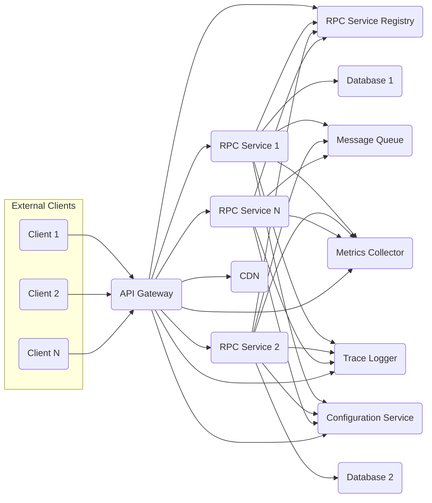
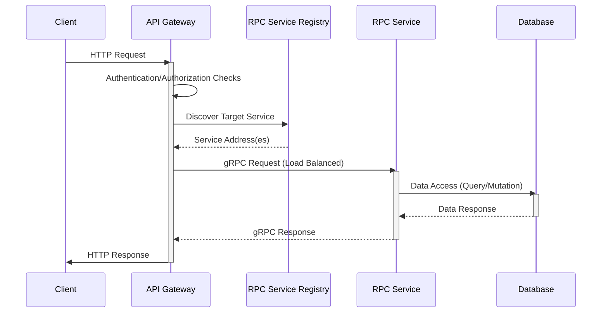

# Project Design Document: Go-Zero Microservice Framework

**Version:** 1.1
**Date:** October 26, 2023
**Author:** AI Software Architect

## 1. Introduction

This document provides an enhanced architectural design of the Go-Zero microservice framework, based on the project available at [https://github.com/zeromicro/go-zero](https://github.com/zeromicro/go-zero). This revision aims to provide a more detailed and comprehensive understanding of the framework's components, their interactions, and the overall system architecture, specifically tailored for threat modeling purposes.

## 2. Goals and Objectives

The primary goals of the Go-Zero framework, as reflected in its design, are:

*   **High Performance:**  Minimize latency and maximize throughput for inter-service communication and external request handling.
*   **Stability and Reliability:** Provide a robust and fault-tolerant environment for running microservices, including mechanisms for handling failures.
*   **Ease of Use:** Offer a simple, intuitive, and developer-friendly API and tooling for building and deploying microservices efficiently.
*   **Scalability:** Enable horizontal scaling of individual microservices based on demand, ensuring the system can handle increasing load.
*   **Observability:** Provide comprehensive tools and mechanisms for monitoring, logging, and tracing microservice interactions to facilitate debugging and performance analysis.
*   **Comprehensive Tooling:** Offer a complete and integrated set of tools for common microservice development tasks, reducing the need for external dependencies.

## 3. High-Level Architecture

The Go-Zero framework adheres to a standard microservice architecture pattern, emphasizing a clear separation of concerns and independent deployability of services.

**Components:**

*   **External Clients:** Represent various consumers of the microservices, including web browsers, mobile applications, other internal services, or third-party systems.
*   **API Gateway (`go-zero/rest`):** The single entry point for all external requests. It handles routing, authentication, authorization, rate limiting, request transformation, and response aggregation.
*   **RPC Service Registry (`go-zero/zrpc`):** A central directory that maintains information about available RPC services, their network locations, and health status. Services register themselves upon startup, enabling dynamic service discovery.
*   **RPC Services (`go-zero/rpc`):** Independent, self-contained microservices that implement specific business functionalities. They communicate with each other and the API Gateway via efficient RPC calls.
*   **Databases (Various):** Persistent storage solutions used by individual services to store and manage their data. Each service typically owns its data and interacts with it directly.
*   **CDN (Content Delivery Network):** A distributed network of servers that caches static assets (e.g., images, CSS, JavaScript) to improve performance and reduce latency for clients.
*   **Message Queue (`go-queue`):** Facilitates asynchronous communication between services, enabling decoupling, improving resilience, and supporting event-driven architectures.
*   **Metrics Collector (`go-zero/core/metric`):** Aggregates performance metrics from various services and the API Gateway, providing insights into system health and performance.
*   **Trace Logger (`go-zero/core/trace`):** Collects distributed tracing information to track requests as they traverse multiple services, aiding in debugging and performance analysis.
*   **Configuration Service:** A centralized service for managing application configurations, allowing for dynamic updates without requiring service restarts.

## 4. Component Details

This section provides a more in-depth description of the key components within the Go-Zero framework, highlighting their internal workings and key features relevant for threat modeling.

### 4.1. API Gateway (`go-zero/rest`)

*   **Functionality:**
    *   **Reverse Proxy:** Acts as a reverse proxy, forwarding external requests to the appropriate backend services.
    *   **Authentication and Authorization:** Verifies the identity of clients and ensures they have the necessary permissions to access requested resources. Supports various authentication methods, including JWT.
    *   **Request Routing:** Routes incoming requests to the correct backend service based on predefined rules, often configured through a configuration file.
    *   **Rate Limiting:** Protects backend services from being overwhelmed by excessive requests from a single client or source.
    *   **Circuit Breaking:** Prevents cascading failures by temporarily stopping requests to failing backend services.
    *   **Request/Response Transformation:** Modifies request headers, bodies, or responses as needed.
    *   **CORS Handling:** Manages Cross-Origin Resource Sharing (CORS) policies.
    *   **Middleware Support:** Allows developers to inject custom logic into the request processing pipeline for tasks like logging, security checks, or request enrichment.
*   **Key Features:**
    *   Built-in support for JWT (JSON Web Token) authentication and authorization.
    *   Configuration-driven routing rules, allowing for flexible and dynamic routing configurations.
    *   Seamless integration with the RPC service registry for automatic service discovery and load balancing.
    *   Integration with metrics and tracing systems for enhanced observability.
    *   Graceful shutdown capabilities to minimize downtime during deployments or restarts.
    *   Support for custom error handling.

### 4.2. RPC Services (`go-zero/rpc`)

*   **Functionality:**
    *   **Business Logic Implementation:** Contains the core business logic for a specific domain or functionality.
    *   **RPC Interface Exposure:** Exposes its functionalities through well-defined RPC interfaces using Protocol Buffers (`.proto` files).
    *   **Service Registration:** Registers itself with the RPC service registry upon startup, making its presence known to other services.
    *   **Inter-service Communication:** Communicates with other services via efficient gRPC calls.
    *   **Data Persistence:** Interacts with databases or other data stores to manage persistent data.
    *   **Message Queue Interaction:** Publishes and consumes messages from message queues for asynchronous communication.
*   **Key Features:**
    *   Utilizes gRPC for high-performance, efficient, and type-safe communication.
    *   Automatic code generation from `.proto` files, simplifying the development of RPC interfaces and client stubs.
    *   Built-in middleware support for common tasks like logging, metrics collection, tracing, and error handling.
    *   Support for interceptors, allowing for request and response processing at the service level.
    *   Client-side load balancing and failover mechanisms when making calls to other RPC services.
    *   Health check endpoints for monitoring service availability.

### 4.3. RPC Service Registry (`go-zero/zrpc`)

*   **Functionality:**
    *   **Service Registration:** Allows RPC services to register their availability, including their network address and metadata.
    *   **Service Discovery:** Provides a mechanism for clients (like the API Gateway and other RPC services) to discover the network locations of available services.
    *   **Health Monitoring:** Periodically checks the health status of registered services and removes unhealthy instances from the registry.
*   **Key Features:**
    *   Supports various backend implementations for storing service registry data, such as etcd or Consul, providing flexibility in deployment.
    *   Provides health check mechanisms to ensure that only healthy services are considered for routing.
    *   Offers a simple and efficient API for service registration, deregistration, and discovery.
    *   Supports service versioning and metadata for more advanced service management.

### 4.4. Data Stores (Various)

*   **Functionality:**
    *   **Persistent Data Storage:** Provides durable storage for microservice data.
    *   **Data Retrieval and Management:** Enables services to store, retrieve, update, and delete data.
*   **Considerations:**
    *   **Data Consistency:**  Services need to manage data consistency, especially in distributed environments. Strategies like eventual consistency might be employed.
    *   **Data Partitioning and Sharding:** Techniques for distributing data across multiple database instances to improve scalability and performance.
    *   **Data Security:** Implementing appropriate security measures to protect sensitive data at rest and in transit, including encryption and access controls.
    *   **Database Choice:** The choice of database depends on the specific needs of the service (e.g., relational databases for structured data, NoSQL databases for unstructured or semi-structured data).

### 4.5. Message Queue (`go-queue`)

*   **Functionality:**
    *   **Asynchronous Communication:** Enables services to communicate without requiring immediate responses, improving decoupling and resilience.
    *   **Event-Driven Architecture:** Supports event-driven patterns where services react to events published by other services.
    *   **Task Queuing:** Can be used to offload long-running or resource-intensive tasks to be processed asynchronously.
*   **Key Features:**
    *   Supports various message brokers like Kafka or RabbitMQ.
    *   Implements publish/subscribe patterns for broadcasting events to multiple consumers.
    *   Provides message persistence and delivery guarantees to ensure messages are not lost.
    *   Offers scalability and fault tolerance through the underlying message broker.

### 4.6. Metrics Collector (`go-zero/core/metric`)

*   **Functionality:**
    *   **Metrics Collection:** Collects performance metrics from various components, including request latency, error rates, and resource utilization.
    *   **Metrics Aggregation:** Aggregates collected metrics for analysis and visualization.
    *   **Metrics Export:** Exports metrics in standard formats (e.g., Prometheus) for integration with monitoring systems.
*   **Key Metrics:**
    *   Request latency (P50, P90, P99).
    *   Error rates (e.g., HTTP status codes).
    *   Request throughput (requests per second).
    *   Resource utilization (CPU usage, memory usage).
    *   Custom application-specific metrics.

### 4.7. Trace Logger (`go-zero/core/trace`)

*   **Functionality:**
    *   **Distributed Tracing:** Tracks requests as they propagate through multiple services, providing insights into the request flow and potential bottlenecks.
    *   **Span Management:** Creates and manages spans representing individual units of work within a request.
    *   **Context Propagation:** Propagates tracing context across service boundaries, allowing for end-to-end request tracking.
    *   **Integration with Tracing Backends:** Integrates with tracing backends like Jaeger or Zipkin for visualizing and analyzing traces.
*   **Key Features:**
    *   Automatic request ID generation and propagation.
    *   Support for creating custom spans to track specific operations.
    *   Integration with logging systems to correlate logs with trace data.

### 4.8. Configuration Service

*   **Functionality:**
    *   **Centralized Configuration Management:** Provides a central repository for storing and managing application configurations.
    *   **Dynamic Configuration Updates:** Allows for updating configurations without requiring service restarts.
    *   **Configuration Versioning:** Supports versioning of configurations for rollback and auditing purposes.
*   **Considerations:**
    *   **Security:** Securely storing and accessing configuration data, especially sensitive information.
    *   **Availability:** Ensuring the configuration service is highly available to prevent service disruptions.

## 5. Data Flow

The typical data flow for an external request is as follows, with more detail on component interactions:

**Detailed Steps:**

1. **Client Request:** An external client sends an HTTP request to the API Gateway.
2. **Authentication/Authorization:** The API Gateway intercepts the request and performs authentication (verifying the client's identity) and authorization (ensuring the client has permission to access the requested resource).
3. **Service Discovery:** The API Gateway consults the RPC Service Registry to find the network address(es) of the target RPC service responsible for handling the request.
4. **RPC Call:** The API Gateway makes an RPC call to one of the available instances of the target RPC service. Load balancing mechanisms are typically employed to distribute requests across multiple instances.
5. **Business Logic Execution:** The RPC service receives the request and executes its business logic, which may involve data processing, calculations, or interactions with other internal services.
6. **Data Access:** The RPC service interacts with its associated database to retrieve or store data required for processing the request.
7. **RPC Response:** The RPC service sends a response back to the API Gateway, containing the result of the operation.
8. **Client Response:** The API Gateway receives the response from the RPC service, potentially performs response transformation or aggregation, and sends the final HTTP response back to the client.

For asynchronous communication via the message queue:

1. A service publishes a message to the message queue, indicating an event or a task to be processed.
2. The message queue persists the message.
3. One or more other services that have subscribed to the relevant topic or queue receive the message.
4. The receiving services independently process the message and perform their respective actions.

## 6. Security Considerations

Security is paramount in a microservice architecture. The Go-Zero framework provides several features and considerations for building secure applications.

*   **Authentication:**
    *   **API Gateway Authentication:** The API Gateway is the primary point for authenticating external clients. Go-Zero provides built-in support for JWT authentication, where clients provide a signed token to verify their identity.
    *   **Service-to-Service Authentication:** For internal communication between services, mechanisms like mutual TLS (mTLS) can be implemented to ensure secure and authenticated communication. API keys or internal tokens can also be used.
*   **Authorization:**
    *   **API Gateway Authorization:** The API Gateway enforces authorization policies to control access to resources based on the authenticated user's roles or permissions. This can be implemented using role-based access control (RBAC) or attribute-based access control (ABAC).
    *   **Service-Level Authorization:** Individual services may implement further fine-grained authorization checks to control access to specific functionalities or data.
*   **Data Validation:**
    *   **Input Validation:** Rigorous input validation should be performed at the API Gateway and within individual services to prevent injection attacks (e.g., SQL injection, cross-site scripting). Data types, formats, and ranges should be validated.
    *   **Schema Validation:** Using schema validation for request and response bodies can help ensure data integrity and prevent unexpected data from being processed.
*   **Transport Security:**
    *   **HTTPS:** All external communication between clients and the API Gateway should use HTTPS to encrypt data in transit and protect against eavesdropping and man-in-the-middle attacks.
    *   **gRPC over TLS:** gRPC communication between services should be secured using TLS to encrypt communication channels.
*   **Data at Rest Encryption:**
    *   Sensitive data stored in databases should be encrypted at rest using database-level encryption or encryption at the application level.
*   **Rate Limiting:**
    *   The API Gateway should implement rate limiting to prevent denial-of-service (DoS) attacks by limiting the number of requests from a single client or source within a specific time window.
*   **Input Sanitization:**
    *   User-provided input should be sanitized before being displayed or used in any potentially vulnerable context to prevent cross-site scripting (XSS) attacks.
*   **Dependency Management:**
    *   Regularly audit and update dependencies to address known security vulnerabilities. Use tools like dependency checkers to identify and remediate vulnerabilities.
*   **Secrets Management:**
    *   Securely store and manage sensitive information like API keys, database credentials, and encryption keys using dedicated secrets management tools (e.g., HashiCorp Vault, AWS Secrets Manager). Avoid hardcoding secrets in the application code or configuration files.
*   **Logging and Monitoring:**
    *   Implement comprehensive logging and monitoring to detect and respond to security incidents. Security-related events, such as authentication failures and authorization violations, should be logged and monitored.
*   **Regular Security Audits:**
    *   Conduct periodic security assessments and penetration testing to identify potential vulnerabilities in the application and infrastructure.
*   **CORS Configuration:**
    *   Properly configure Cross-Origin Resource Sharing (CORS) policies on the API Gateway to restrict which domains can make requests to the API, preventing unauthorized access from malicious websites.

## 7. Deployment Considerations

Deploying Go-Zero applications effectively requires careful planning and the use of appropriate technologies.

*   **Containerization (Docker):** Package each microservice as a Docker container to ensure consistent environments, simplify deployments, and facilitate scaling.
*   **Orchestration (Kubernetes):** Utilize Kubernetes to manage the deployment, scaling, and health of the containerized microservices. Kubernetes provides features like service discovery, load balancing, and automated rollouts and rollbacks.
*   **Service Discovery:** While Go-Zero provides its own service registry, Kubernetes' built-in service discovery mechanisms can also be used, or the two can be integrated.
*   **Load Balancing:** Kubernetes provides load balancing across multiple instances of a service. The Go-Zero API Gateway also performs load balancing when routing requests to backend services.
*   **Monitoring and Logging:** Integrate with Kubernetes monitoring and logging tools such as Prometheus and Grafana for metrics, and Elasticsearch, Fluentd, and Kibana (EFK stack) for log aggregation and analysis.
*   **CI/CD Pipelines:** Implement automated CI/CD pipelines using tools like Jenkins, GitLab CI, or GitHub Actions to automate the build, test, and deployment process for Go-Zero applications.
*   **Infrastructure as Code (IaC):** Use IaC tools like Terraform or CloudFormation to manage the infrastructure on which the Go-Zero applications are deployed, ensuring consistency and repeatability.
*   **Configuration Management:** Utilize configuration management tools or Kubernetes ConfigMaps and Secrets to manage application configurations and sensitive information.

## 8. Future Considerations

The Go-Zero framework is continuously evolving. Potential future enhancements and considerations include:

*   **Enhanced Observability:** Deeper integration with more advanced tracing and metrics platforms, potentially including support for OpenTelemetry.
*   **Service Mesh Integration:** Exploring tighter integration with service mesh technologies like Istio or Linkerd to leverage their advanced traffic management, security (e.g., mTLS), and observability features.
*   **Improved Developer Experience:** Continuously improving the developer experience through enhanced tooling, code generation capabilities, and documentation.
*   **Support for More Communication Protocols:**  Investigating support for additional communication protocols beyond gRPC, where appropriate.
*   **Advanced Security Features:**  Adding built-in support for more sophisticated security patterns, such as policy enforcement points and delegated authorization.
*   **Improved Fault Tolerance and Resilience:**  Further enhancing built-in mechanisms for handling failures and ensuring system resilience.

This enhanced document provides a more detailed and comprehensive overview of the Go-Zero microservice framework's architecture, components, and security considerations. It is intended to serve as a valuable resource for threat modeling and understanding the intricacies of the framework.