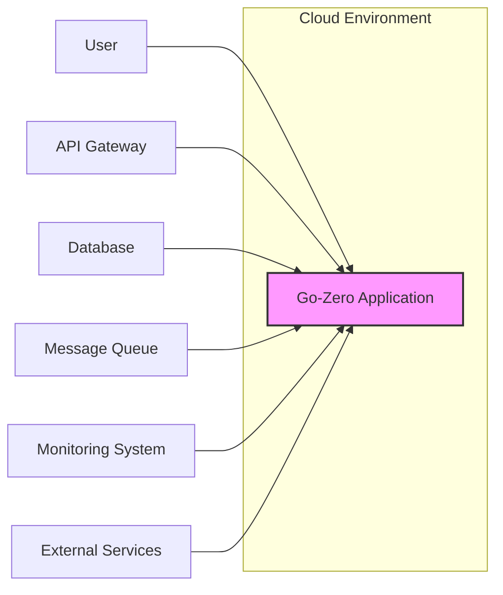

# BUSINESS POSTURE

- Business Priorities and Goals:
 - Goal: To provide a comprehensive, efficient, and developer-friendly microservice framework that simplifies the development of robust and scalable cloud-native applications.
 - Priority: Ease of use and developer productivity are paramount to enable rapid development and deployment of microservices.
 - Priority: Performance and scalability are critical to handle high traffic and ensure application responsiveness.
 - Priority: Reliability and fault tolerance are essential for building resilient microservices that can withstand failures.
 - Priority: Extensibility and customizability to allow developers to adapt the framework to specific project needs.

- Business Risks:
 - Risk: Adoption risk if the framework is perceived as too complex or lacking essential features compared to alternatives.
 - Risk: Security vulnerabilities in the framework itself could lead to widespread security issues in applications built with go-zero.
 - Risk: Performance bottlenecks in the framework could limit the scalability of applications.
 - Risk: Lack of community support or documentation could hinder adoption and problem-solving for users.
 - Risk: Compatibility issues with evolving cloud technologies and platforms could require ongoing maintenance and updates.

# SECURITY POSTURE

- Existing Security Controls:
 - security control: Input validation is expected to be implemented by developers using the framework, as go-zero provides tools for request validation. (Implemented by developers using framework features)
 - security control: Authentication and authorization are expected to be implemented by developers using the framework, as go-zero provides middleware and examples for handling authentication and authorization. (Implemented by developers using framework features)
 - security control: Transport Layer Security (TLS) encryption for communication between services and clients is configurable and recommended. (Configuration based)
 - security control: Dependency management using `go.mod` and `go.sum` to ensure reproducible builds and manage dependencies. (Go tooling)
 - security control: Code review practices within the go-zero project development. (Project development process)

- Accepted Risks:
 - accepted risk: Security vulnerabilities in user-developed application code are outside the scope of the framework itself.
 - accepted risk: Misconfiguration of security features by users can lead to security weaknesses.
 - accepted risk: Reliance on third-party libraries and dependencies introduces potential supply chain risks.

- Recommended Security Controls:
 - security control: Implement static application security testing (SAST) in the go-zero project CI/CD pipeline to automatically detect potential vulnerabilities in the framework code.
 - security control: Provide security best practice documentation and examples for developers using go-zero, covering topics like secure coding, input validation, authentication, and authorization.
 - security control: Encourage and facilitate community security audits and vulnerability reporting for the go-zero framework.
 - security control: Implement dependency scanning in the go-zero project CI/CD pipeline to identify known vulnerabilities in dependencies.
 - security control: Provide tools or guidance for developers to implement rate limiting and request throttling to mitigate denial-of-service attacks.

- Security Requirements:
 - Authentication:
  - Requirement: The framework should provide mechanisms and examples for developers to easily integrate various authentication methods (e.g., JWT, OAuth 2.0) into their microservices.
  - Requirement: Authentication middleware should be provided to simplify the enforcement of authentication policies across services.
 - Authorization:
  - Requirement: The framework should provide mechanisms and examples for developers to implement fine-grained authorization controls based on roles, permissions, or attributes.
  - Requirement: Authorization middleware should be provided to simplify the enforcement of authorization policies across services.
 - Input Validation:
  - Requirement: The framework should provide tools and guidance for developers to perform robust input validation to prevent injection attacks and data integrity issues.
  - Requirement: Input validation should be easily integrated into request handling logic.
 - Cryptography:
  - Requirement: The framework should support and encourage the use of strong cryptography for protecting sensitive data in transit and at rest.
  - Requirement: Guidance should be provided on secure key management practices for cryptographic operations.
  - Requirement: TLS should be enabled by default or strongly recommended for all inter-service and client-service communication.

# DESIGN

## C4 CONTEXT



- Context Diagram Elements:
 - - Name: Go-Zero Application
   - Type: Software System
   - Description: The microservice application built using the go-zero framework. It provides specific business functionalities and exposes APIs for users and other systems.
   - Responsibilities:
    - Implement business logic and functionalities.
    - Handle user requests and API calls.
    - Interact with databases, message queues, and external services.
    - Expose APIs for users and other systems.
   - Security controls:
    - Input validation on all API endpoints.
    - Authentication and authorization for API access.
    - Secure communication channels (TLS).
    - Logging and monitoring of security events.

 - - Name: User
   - Type: Person
   - Description: End-users who interact with the go-zero application through clients (web browsers, mobile apps, etc.).
   - Responsibilities:
    - Consume application functionalities.
    - Provide input data to the application.
    - Authenticate to access protected resources.
   - Security controls:
    - Strong password management (user responsibility).
    - Multi-factor authentication (if implemented by application).

 - - Name: API Gateway
   - Type: Software System
   - Description: A gateway that acts as a single entry point for all external requests to the go-zero application. It can handle routing, load balancing, authentication, and other cross-cutting concerns.
   - Responsibilities:
    - Route requests to appropriate microservices within the go-zero application.
    - Load balancing across microservice instances.
    - API rate limiting and throttling.
    - Potentially handle authentication and authorization.
   - Security controls:
    - TLS termination and encryption.
    - Web Application Firewall (WAF).
    - Authentication and authorization enforcement.
    - API rate limiting and throttling.

 - - Name: Database
   - Type: Software System
   - Description: Persistent storage for the go-zero application to store and retrieve data. Could be relational databases (e.g., MySQL, PostgreSQL) or NoSQL databases (e.g., Redis, MongoDB).
   - Responsibilities:
    - Store application data securely and reliably.
    - Provide data access to the go-zero application.
    - Ensure data integrity and consistency.
   - Security controls:
    - Access control lists (ACLs) and database user permissions.
    - Encryption at rest and in transit.
    - Regular backups and disaster recovery.
    - Database auditing and monitoring.

 - - Name: Message Queue
   - Type: Software System
   - Description: Asynchronous communication channel used for decoupling services and handling background tasks. Examples include Kafka, RabbitMQ, or Redis Pub/Sub.
   - Responsibilities:
    - Facilitate asynchronous communication between microservices.
    - Buffer and deliver messages reliably.
    - Enable event-driven architectures.
   - Security controls:
    - Access control for message queues.
    - Encryption of messages in transit.
    - Message queue monitoring and auditing.

 - - Name: Monitoring System
   - Type: Software System
   - Description: System for collecting, aggregating, and visualizing metrics, logs, and traces from the go-zero application and its infrastructure. Examples include Prometheus, Grafana, ELK stack.
   - Responsibilities:
    - Monitor application performance and health.
    - Detect anomalies and security incidents.
    - Provide observability into the system.
   - Security controls:
    - Access control to monitoring dashboards and data.
    - Secure storage of logs and metrics.
    - Alerting on security-related events.

 - - Name: External Services
   - Type: Software System
   - Description: External APIs or services that the go-zero application integrates with, such as payment gateways, third-party APIs, or other internal systems.
   - Responsibilities:
    - Provide external functionalities or data to the go-zero application.
    - Integrate with the go-zero application via APIs.
   - Security controls:
    - Secure API communication (TLS).
    - API key management and authentication.
    - Input validation of data received from external services.

## C4 CONTAINER

```mermaid
flowchart LR
    subgraph Cloud Environment
        subgraph Go-Zero Application
            A["API Service"
            \n(Go, go-zero framework)]
            B["RPC Service"
            \n(Go, go-zero framework)]
            C["Database Container"
            \n(e.g., MySQL, Redis)]
            D["Message Queue Container"
            \n(e.g., Kafka, RabbitMQ)]
        end
    end
    E["API Gateway"] --> A
    F["User"] --> E
    A -- gRPC/HTTP --> B
    A --> C
    B --> C
    B --> D
    G["Monitoring System"] --> A
    G --> B
```

- Container Diagram Elements:
 - - Name: API Service
   - Type: Container
   - Description: A go-zero service responsible for handling external API requests. It exposes HTTP/gRPC endpoints and orchestrates business logic.
   - Responsibilities:
    - Receive and process HTTP/gRPC API requests from the API Gateway and potentially directly from users.
    - Implement API endpoint logic, including input validation, authentication, and authorization.
    - Interact with RPC Services, Databases, and Message Queues.
    - Return API responses to clients.
   - Security controls:
    - Input validation on all API endpoints.
    - Authentication and authorization middleware.
    - TLS termination for external connections.
    - Rate limiting and throttling.
    - Logging and monitoring of API requests and security events.

 - - Name: RPC Service
   - Type: Container
   - Description: A go-zero service responsible for handling internal RPC calls from other services (primarily API Service). It encapsulates specific business functionalities.
   - Responsibilities:
    - Receive and process gRPC requests from other services.
    - Implement core business logic and data processing.
    - Interact with Databases and Message Queues.
    - Return RPC responses to calling services.
   - Security controls:
    - Authentication and authorization for internal RPC calls (e.g., mTLS, service accounts).
    - Input validation on RPC requests.
    - Secure communication channels (gRPC with TLS).
    - Logging and monitoring of RPC requests and security events.

 - - Name: Database Container
   - Type: Container
   - Description: Containerized database instance (e.g., MySQL, PostgreSQL, Redis) used for persistent data storage.
   - Responsibilities:
    - Store and manage application data.
    - Provide data access to API and RPC Services.
    - Ensure data persistence and availability.
   - Security controls:
    - Network segmentation and access control.
    - Database user authentication and authorization.
    - Encryption at rest and in transit.
    - Regular security patching and updates.
    - Database auditing and monitoring.

 - - Name: Message Queue Container
   - Type: Container
   - Description: Containerized message queue instance (e.g., Kafka, RabbitMQ) used for asynchronous communication and event handling.
   - Responsibilities:
    - Facilitate asynchronous message passing between services.
    - Buffer and deliver messages reliably.
    - Enable event-driven architectures.
   - Security controls:
    - Access control for message queues.
    - Encryption of messages in transit.
    - Message queue monitoring and auditing.
    - Secure configuration of message queue brokers.

## DEPLOYMENT

- Deployment Options:
 - Option 1: Cloud-based Container Orchestration (e.g., Kubernetes on AWS EKS, Google GKE, Azure AKS) - Recommended for scalability and resilience.
 - Option 2: Virtual Machines (VMs) on Cloud Providers (e.g., AWS EC2, Google Compute Engine, Azure VMs) - Suitable for simpler deployments or specific infrastructure requirements.
 - Option 3: On-Premise Deployment - For organizations with specific compliance or data residency requirements.

- Detailed Deployment Architecture (Option 1: Kubernetes on Cloud):

```mermaid
flowchart LR
    subgraph Cloud Provider (e.g., AWS, GCP, Azure)
        subgraph Kubernetes Cluster
            subgraph Namespace: go-zero-app
                A1["Pod: api-service-pod-1"]
                A2["Pod: api-service-pod-2"]
                B1["Pod: rpc-service-pod-1"]
                B2["Pod: rpc-service-pod-2"]
                C["Pod: database-pod"]
                D["Pod: message-queue-pod"]
                E["Service: api-service-svc"]
                F["Service: rpc-service-svc"]
            end
            G["Ingress"]
        end
        H["Cloud Load Balancer"]
        I["Managed Database Service"]
        J["Managed Message Queue Service"]
        K["Cloud Monitoring Service"]
    end
    L["User"] --> H
    H --> G
    G --> E
    E --> A1 & A2
    F --> B1 & B2
    A1 & A2 --> C & D
    B1 & B2 --> C & D
    C --> I
    D --> J
    K --> Kubernetes Cluster
    style Kubernetes Cluster fill:#ccf,stroke:#333,stroke-width:2px
```

- Deployment Diagram Elements:
 - - Name: Kubernetes Cluster
   - Type: Infrastructure
   - Description: A managed Kubernetes cluster provided by a cloud provider, used to orchestrate and manage go-zero application containers.
   - Responsibilities:
    - Container orchestration and management.
    - Service discovery and load balancing within the cluster.
    - Scalability and resilience of the application.
   - Security controls:
    - Network policies to isolate namespaces and pods.
    - Role-Based Access Control (RBAC) for cluster access.
    - Security updates and patching of Kubernetes components.
    - Container image security scanning.

 - - Name: Namespace: go-zero-app
   - Type: Kubernetes Namespace
   - Description: A dedicated namespace within the Kubernetes cluster to isolate go-zero application resources.
   - Responsibilities:
    - Logical isolation of go-zero application components.
    - Resource management and quotas for the application.
   - Security controls:
    - Network policies to restrict traffic within and outside the namespace.
    - RBAC policies specific to the namespace.

 - - Name: Pod: api-service-pod-1, api-service-pod-2, rpc-service-pod-1, rpc-service-pod-2, database-pod, message-queue-pod
   - Type: Kubernetes Pod
   - Description: The smallest deployable unit in Kubernetes, containing one or more containers (in this case, likely single container per pod for simplicity). Represents instances of API Service, RPC Service, Database, and Message Queue.
   - Responsibilities:
    - Run containerized application instances.
    - Provide runtime environment for containers.
   - Security controls:
    - Container image security (base image, vulnerability scanning).
    - Resource limits and quotas.
    - Security context settings for containers.

 - - Name: Service: api-service-svc, rpc-service-svc
   - Type: Kubernetes Service
   - Description: Kubernetes Services provide stable endpoints and load balancing for pods. `api-service-svc` exposes API Service pods, `rpc-service-svc` exposes RPC Service pods for internal communication.
   - Responsibilities:
    - Service discovery and load balancing for pods.
    - Stable endpoint for accessing pods.
   - Security controls:
    - Network policies to control access to services.
    - Service account-based authentication for inter-service communication.

 - - Name: Ingress
   - Type: Kubernetes Ingress
   - Description: Manages external access to services within the Kubernetes cluster, typically handling HTTP routing and TLS termination.
   - Responsibilities:
    - Route external HTTP/HTTPS requests to services within the cluster (e.g., `api-service-svc`).
    - TLS termination for incoming HTTPS traffic.
   - Security controls:
    - TLS configuration and certificate management.
    - Web Application Firewall (WAF) integration (optional, can be placed before Ingress or within Ingress controller).
    - Rate limiting and throttling at the Ingress level.

 - - Name: Cloud Load Balancer
   - Type: Cloud Service
   - Description: Cloud provider's managed load balancer that distributes external traffic to the Kubernetes Ingress.
   - Responsibilities:
    - Distribute external traffic across Ingress controllers.
    - High availability and scalability for external access.
   - Security controls:
    - DDoS protection provided by cloud provider.
    - Basic network security controls.

 - - Name: Managed Database Service
   - Type: Cloud Service
   - Description: Cloud provider's managed database service (e.g., AWS RDS, Google Cloud SQL, Azure Database) used for persistent data storage, replacing the `database-pod` in a production setup for better manageability and scalability.
   - Responsibilities:
    - Managed database service with backups, scaling, and maintenance handled by the cloud provider.
    - Secure and reliable data storage.
   - Security controls:
    - Cloud provider's security controls for managed database services (encryption, access control, backups, etc.).
    - Database user authentication and authorization.

 - - Name: Managed Message Queue Service
   - Type: Cloud Service
   - Description: Cloud provider's managed message queue service (e.g., AWS SQS/SNS, Google Cloud Pub/Sub, Azure Service Bus) used for asynchronous communication, replacing `message-queue-pod` for better manageability and scalability.
   - Responsibilities:
    - Managed message queue service with scalability and reliability handled by the cloud provider.
    - Asynchronous message delivery.
   - Security controls:
    - Cloud provider's security controls for managed message queue services (encryption, access control, etc.).
    - Message queue access policies.

 - - Name: Cloud Monitoring Service
   - Type: Cloud Service
   - Description: Cloud provider's managed monitoring service (e.g., AWS CloudWatch, Google Cloud Monitoring, Azure Monitor) for collecting logs, metrics, and traces from the Kubernetes cluster and application.
   - Responsibilities:
    - Centralized logging, monitoring, and alerting.
    - Observability for the go-zero application.
   - Security controls:
    - Access control to monitoring data and dashboards.
    - Secure storage of logs and metrics.

## BUILD

```mermaid
flowchart LR
    A["Developer"] --> B{Code Changes};
    B --> C[Git Repository (GitHub)];
    C --> D["GitHub Actions\n(CI/CD Pipeline)"];
    D --> E["Build & Test\n(Go Build, Unit Tests, Linters, SAST)"];
    E --> F["Container Image Build\n(Docker Build)"];
    F --> G["Container Registry\n(e.g., Docker Hub, ECR, GCR)"];
    G --> H["Deployment\n(Kubernetes Cluster)"];

    style D fill:#ccf,stroke:#333,stroke-width:2px
```

- Build Process Elements:
 - - Name: Developer
   - Type: Person
   - Description: Software developer writing and modifying the go-zero application code.
   - Responsibilities:
    - Writing secure and functional code.
    - Performing local testing and code reviews.
    - Committing code changes to the Git repository.
   - Security controls:
    - Secure coding practices training.
    - Code review process.
    - Local development environment security.

 - - Name: Git Repository (GitHub)
   - Type: Software System
   - Description: Version control system (GitHub) hosting the go-zero application source code.
   - Responsibilities:
    - Source code version control and history tracking.
    - Collaboration platform for developers.
    - Triggering CI/CD pipelines on code changes.
   - Security controls:
    - Access control to the repository (branch permissions, user roles).
    - Audit logging of repository activities.
    - Branch protection rules.

 - - Name: GitHub Actions (CI/CD Pipeline)
   - Type: Software System
   - Description: GitHub Actions workflow configured for automated build, test, and deployment of the go-zero application.
   - Responsibilities:
    - Automated build process.
    - Running unit tests, linters, and security scans.
    - Building container images.
    - Pushing images to container registry.
    - Deploying application to target environments.
   - Security controls:
    - Secure configuration of CI/CD pipelines.
    - Secrets management for credentials and API keys.
    - Isolation of build environments.
    - Security scanning tools integration (SAST, dependency scanning).
    - Audit logging of CI/CD pipeline activities.

 - - Name: Build & Test (Go Build, Unit Tests, Linters, SAST)
   - Type: Build Stage
   - Description: Stage in the CI/CD pipeline responsible for compiling the Go code, running unit tests, code linters, and static application security testing (SAST).
   - Responsibilities:
    - Compile Go code.
    - Execute unit tests to ensure code functionality.
    - Run linters to enforce code style and best practices.
    - Perform SAST to identify potential security vulnerabilities in the code.
   - Security controls:
    - SAST tool configuration and vulnerability reporting.
    - Secure build environment.
    - Dependency vulnerability scanning (part of or separate from this stage).

 - - Name: Container Image Build (Docker Build)
   - Type: Build Stage
   - Description: Stage in the CI/CD pipeline responsible for building the Docker container image for the go-zero application.
   - Responsibilities:
    - Create Docker image based on Dockerfile.
    - Include application binaries and dependencies in the image.
    - Optimize image size and security.
   - Security controls:
    - Base image selection and security scanning.
    - Minimizing image layers and size.
    - Removing unnecessary tools and dependencies from the image.
    - Container image vulnerability scanning.

 - - Name: Container Registry (e.g., Docker Hub, ECR, GCR)
   - Type: Software System
   - Description: Container registry to store and manage Docker images of the go-zero application.
   - Responsibilities:
    - Secure storage of container images.
    - Image versioning and tagging.
    - Image access control and distribution.
   - Security controls:
    - Access control to the container registry.
    - Image vulnerability scanning in the registry.
    - Content trust and image signing (optional).

 - - Name: Deployment (Kubernetes Cluster)
   - Type: Deployment Stage
   - Description: Stage in the CI/CD pipeline responsible for deploying the containerized go-zero application to the Kubernetes cluster.
   - Responsibilities:
    - Deploying new versions of the application to Kubernetes.
    - Performing rolling updates or blue/green deployments.
    - Monitoring deployment status and health.
   - Security controls:
    - Secure deployment scripts and configurations.
    - Access control to Kubernetes cluster for deployment.
    - Deployment rollback mechanisms.

# RISK ASSESSMENT

- Critical Business Processes:
 - API Access and Functionality: The core business process is providing API access to users and other systems, enabling them to utilize the functionalities built with go-zero. Disruption or compromise of API services would directly impact business operations.
 - Data Processing and Storage: Processing and storing business-critical data within the go-zero application and its associated databases. Data breaches or data integrity issues could have significant financial and reputational consequences.
 - Inter-service Communication: Reliable and secure communication between microservices is crucial for the overall application functionality. Disruptions or security breaches in inter-service communication can lead to cascading failures and data compromise.

- Data Sensitivity:
 - Potentially Sensitive Data: Depending on the application built with go-zero, it might handle various types of sensitive data, including:
  - Personally Identifiable Information (PII): User names, email addresses, contact details, etc.
  - Authentication Credentials: Passwords, API keys, tokens.
  - Financial Data: Transaction details, payment information.
  - Business Confidential Data: Proprietary algorithms, trade secrets, internal business data.
 - Data Sensitivity Levels: The sensitivity level of data will vary depending on the specific application and industry regulations (e.g., GDPR, HIPAA, PCI DSS). It's crucial to classify data based on sensitivity and apply appropriate security controls accordingly.

# QUESTIONS & ASSUMPTIONS

- Questions:
 - What type of applications are being built with go-zero? (e.g., e-commerce, fintech, internal tools) - This will help refine the business posture and risk assessment.
 - What are the specific compliance requirements for applications built with go-zero? (e.g., GDPR, HIPAA, PCI DSS) - This will influence security requirements and controls.
 - What is the organization's risk appetite? (Startup vs. Fortune 500) - This will determine the prioritization of security controls.
 - What existing security infrastructure and tools are in place? (e.g., WAF, SIEM, vulnerability scanners) - This will help integrate go-zero security with existing systems.
 - What is the team's security expertise and resources? - This will influence the feasibility of implementing recommended security controls.

- Assumptions:
 - Assumption: Go-zero is used to build microservice-based applications deployed in cloud environments.
 - Assumption: Security is a concern for applications built with go-zero, and the design document should address security considerations.
 - Assumption: Developers using go-zero have some level of security awareness but may need guidance on secure development practices within the framework.
 - Assumption: The target deployment environment is Kubernetes on a cloud provider, as it's a common and scalable architecture for microservices.
 - Assumption: Automated CI/CD pipelines are used for building and deploying go-zero applications.