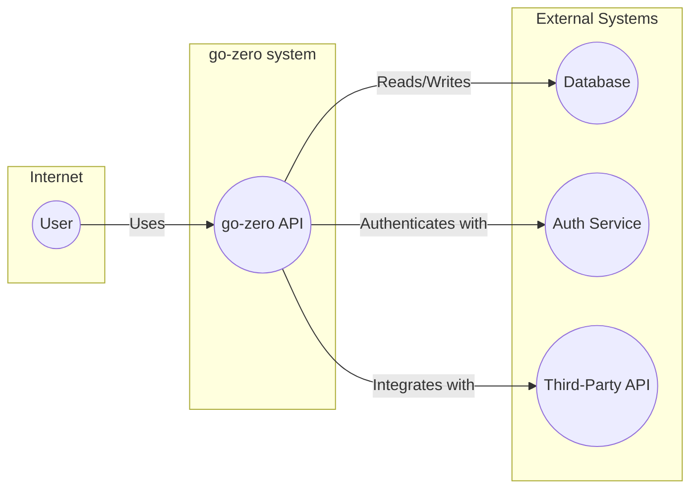
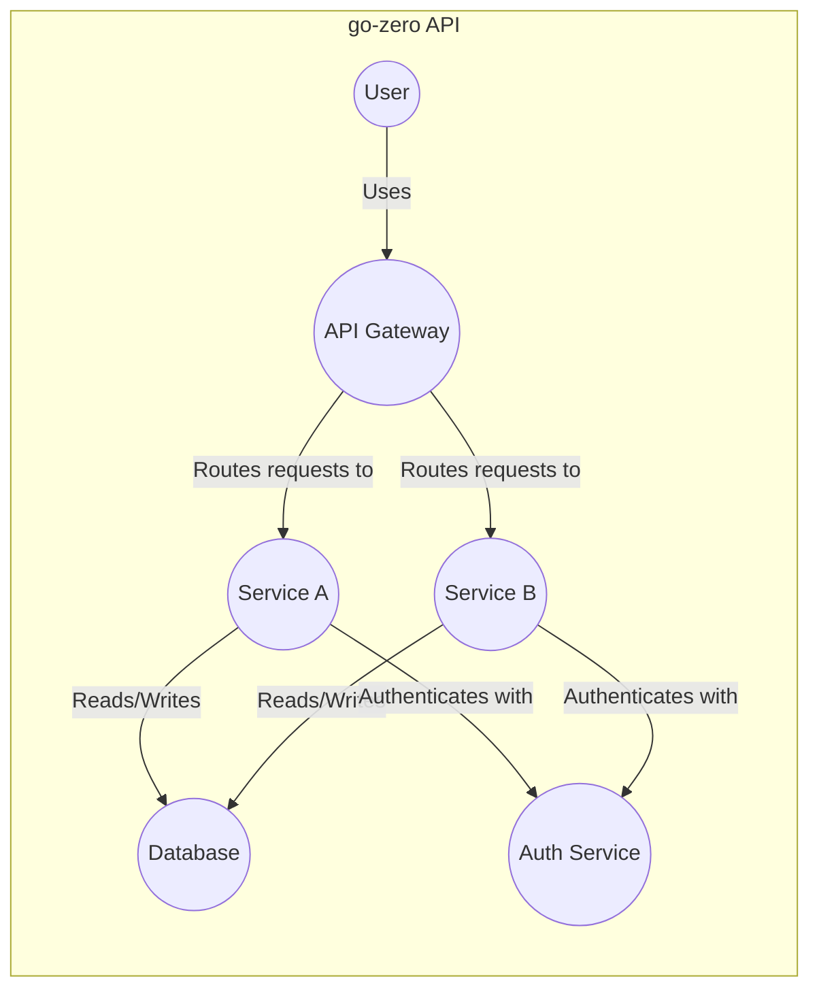
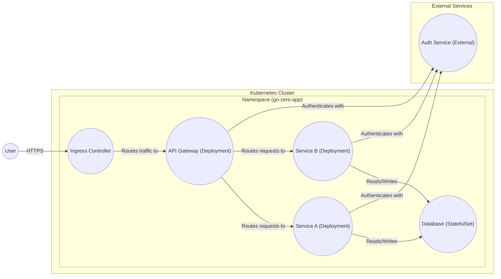
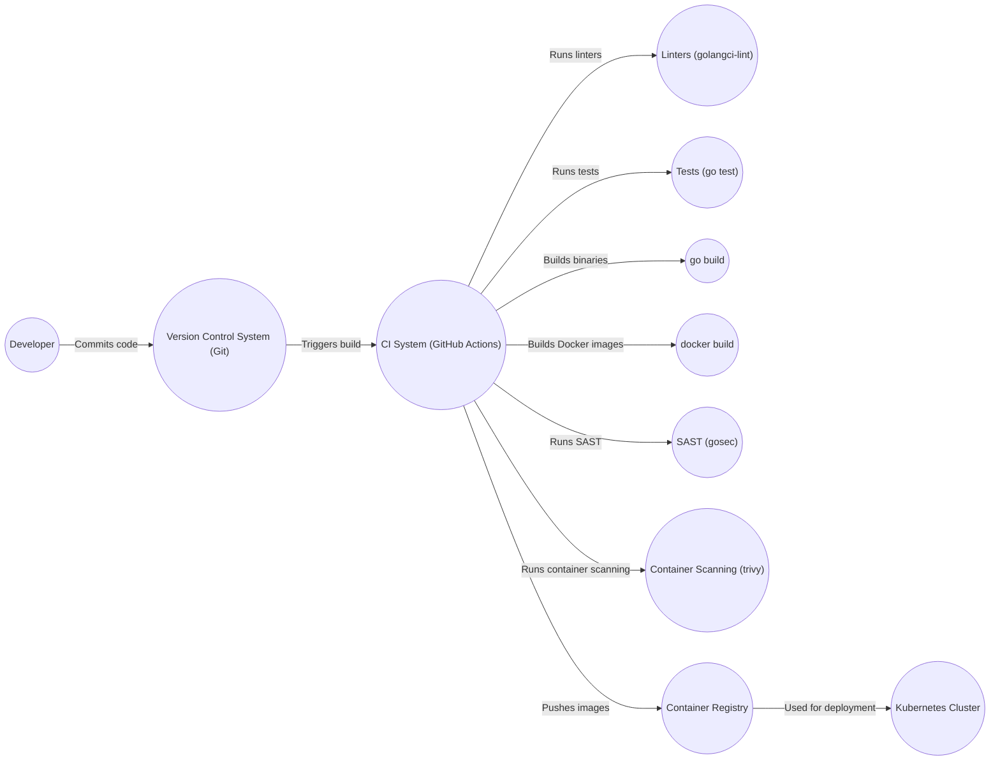

Okay, let's create a design document for the go-zero project.

# BUSINESS POSTURE

Business Priorities and Goals:

*   Provide a robust and performant web and RPC framework for building microservices in Go.
*   Simplify the development of microservices by offering built-in features like service discovery, load balancing, circuit breaking, and rate limiting.
*   Reduce development time and effort by providing code generation tools and a consistent development experience.
*   Improve the reliability and resilience of microservices through built-in fault tolerance mechanisms.
*   Enable easy integration with other systems and services.
*   Offer a framework that is easy to learn and use, even for developers new to microservices.
*   Maintain high performance and low resource consumption.

Business Risks:

*   Inconsistent adoption: If the framework is not widely adopted, community support and the availability of third-party integrations may be limited.
*   Complexity: While aiming for simplicity, the framework might introduce its own complexities, especially for larger, more intricate systems.
*   Performance bottlenecks: If not carefully designed and used, the framework's features (like middleware) could introduce performance overhead.
*   Security vulnerabilities: Any vulnerabilities in the framework could expose applications built with it to significant risks.
*   Vendor lock-in: Adopting go-zero might lead to a degree of vendor lock-in, making it harder to switch to other frameworks later.
*   Maintenance and updates: The long-term maintenance and updates of the framework are crucial for its continued viability.
*   Lack of specific features: The framework may not cover all the specific needs of every project, requiring custom solutions or workarounds.

# SECURITY POSTURE

Existing Security Controls:

*   security control: API Gateway features: go-zero includes built-in features for API gateway functionality, such as routing, middleware, and request/response transformations. (Described in go-zero documentation and examples).
*   security control: Rate limiting: go-zero provides built-in rate limiting capabilities to protect services from abuse and overload. (Described in go-zero documentation and examples).
*   security control: Circuit breaking: go-zero includes circuit breaking functionality to prevent cascading failures in distributed systems. (Described in go-zero documentation and examples).
*   security control: Timeout control: go-zero allows developers to set timeouts for requests to prevent resource exhaustion. (Described in go-zero documentation and examples).
*   security control: Middleware support: go-zero's middleware architecture allows developers to implement custom security logic, such as authentication and authorization. (Described in go-zero documentation and examples).
*   security control: Secure by default configurations (mitigation for common web vulnerabilities): While not explicitly stated, well-designed frameworks often have secure defaults. (Needs verification in go-zero documentation and code).
*   security control: Dependency management: Go's module system helps manage dependencies and their security. (Implicit in Go development).

Accepted Risks:

*   accepted risk: The framework's reliance on third-party libraries introduces the risk of vulnerabilities in those dependencies.
*   accepted risk: The framework's code generation tools, while convenient, could potentially introduce vulnerabilities if not carefully designed and used.
*   accepted risk: Misconfiguration of security features (like rate limiting or circuit breaking) could lead to denial-of-service or other security issues.
*   accepted risk: The framework itself might contain undiscovered security vulnerabilities.

Recommended Security Controls:

*   Implement authentication and authorization middleware: Ensure robust authentication and authorization mechanisms are in place for all APIs.
*   Implement input validation and sanitization: Validate and sanitize all user inputs to prevent injection attacks.
*   Use secure coding practices: Follow secure coding guidelines to minimize vulnerabilities.
*   Regularly update dependencies: Keep all dependencies up-to-date to patch known vulnerabilities.
*   Perform security audits and penetration testing: Regularly assess the security of applications built with go-zero.
*   Implement logging and monitoring: Monitor application logs for suspicious activity.
*   Consider using a Web Application Firewall (WAF): A WAF can provide an additional layer of security against common web attacks.

Security Requirements:

*   Authentication:
    *   All APIs should require authentication, except for explicitly defined public endpoints.
    *   Support multiple authentication mechanisms (e.g., JWT, OAuth 2.0, API keys).
    *   Securely store and manage user credentials.
    *   Implement robust password policies.
*   Authorization:
    *   Implement role-based access control (RBAC) or attribute-based access control (ABAC).
    *   Enforce the principle of least privilege.
    *   Authorize access to resources based on user roles and permissions.
*   Input Validation:
    *   Validate all user inputs against a strict whitelist of allowed characters and formats.
    *   Sanitize all user inputs to prevent cross-site scripting (XSS) and other injection attacks.
    *   Validate data types, lengths, and ranges.
*   Cryptography:
    *   Use strong, industry-standard cryptographic algorithms for encryption and hashing.
    *   Securely manage cryptographic keys.
    *   Use HTTPS for all communication.
    *   Protect sensitive data at rest using encryption.

# DESIGN

## C4 CONTEXT

Element Descriptions:

*   Element:
    *   Name: User
    *   Type: Person
    *   Description: A user of the go-zero API, typically a web browser or mobile application.
    *   Responsibilities: Initiates requests to the go-zero API.
    *   Security controls: Browser security features, secure communication protocols (HTTPS).

*   Element:
    *   Name: go-zero API
    *   Type: Software System
    *   Description: The main application built using the go-zero framework.
    *   Responsibilities: Handles user requests, processes data, interacts with external systems.
    *   Security controls: Authentication, authorization, input validation, rate limiting, circuit breaking, timeout control.

*   Element:
    *   Name: Database
    *   Type: Software System
    *   Description: A database used to store application data.
    *   Responsibilities: Stores and retrieves data.
    *   Security controls: Database access controls, encryption at rest, encryption in transit.

*   Element:
    *   Name: Auth Service
    *   Type: Software System
    *   Description: An external service used for authentication and authorization.
    *   Responsibilities: Authenticates users, issues tokens, manages user roles and permissions.
    *   Security controls: Secure authentication protocols, secure token management, access controls.

*   Element:
    *   Name: Third-Party API
    *   Type: Software System
    *   Description: An external API used for integration with other systems.
    *   Responsibilities: Provides specific functionality or data.
    *   Security controls: API keys, OAuth 2.0, rate limiting, input validation.

## C4 CONTAINER

Element Descriptions:

*   Element:
    *   Name: User
    *   Type: Person
    *   Description: A user of the go-zero API.
    *   Responsibilities: Initiates requests to the API Gateway.
    *   Security controls: Browser security features, secure communication protocols (HTTPS).

*   Element:
    *   Name: API Gateway
    *   Type: Container (go-zero component)
    *   Description: The entry point for all API requests. Handles routing, authentication, and other cross-cutting concerns.
    *   Responsibilities: Routes requests to the appropriate service, performs authentication and authorization, enforces rate limiting, handles circuit breaking.
    *   Security controls: Authentication, authorization, input validation, rate limiting, circuit breaking, timeout control.

*   Element:
    *   Name: Service A
    *   Type: Container (go-zero service)
    *   Description: A microservice that provides specific functionality.
    *   Responsibilities: Handles business logic, interacts with the database.
    *   Security controls: Input validation, business logic validation, secure communication with the database.

*   Element:
    *   Name: Service B
    *   Type: Container (go-zero service)
    *   Description: Another microservice that provides different functionality.
    *   Responsibilities: Handles business logic, interacts with the database.
    *   Security controls: Input validation, business logic validation, secure communication with the database.

*   Element:
    *   Name: Database
    *   Type: Container (Database)
    *   Description: A database used to store application data.
    *   Responsibilities: Stores and retrieves data.
    *   Security controls: Database access controls, encryption at rest, encryption in transit.

*   Element:
    *   Name: AuthService
    *   Type: Container (External Service)
    *   Description: External service used for authentication.
    *   Responsibilities: Authenticates users.
    *   Security controls: Secure authentication protocols.

## DEPLOYMENT

Possible Deployment Solutions:

1.  Kubernetes: Deploying go-zero services as Docker containers within a Kubernetes cluster. This is the most common and recommended approach for microservices.
2.  Virtual Machines: Deploying go-zero services directly on virtual machines (e.g., AWS EC2, Google Compute Engine).
3.  Serverless Functions: Deploying individual go-zero handlers as serverless functions (e.g., AWS Lambda, Google Cloud Functions). This is suitable for specific use cases where fine-grained scalability is required.
4.  Bare Metal: Deploying directly on physical servers.

Chosen Solution (Kubernetes):

Element Descriptions:

*   Element:
    *   Name: User
    *   Type: Person
    *   Description: A user accessing the application.
    *   Responsibilities: Initiates requests.
    *   Security controls: HTTPS connection.

*   Element:
    *   Name: Ingress Controller
    *   Type: Kubernetes Ingress
    *   Description: Manages external access to the services in the cluster, typically HTTP.
    *   Responsibilities: Routes external traffic to the API Gateway.
    *   Security controls: TLS termination, potentially a Web Application Firewall (WAF).

*   Element:
    *   Name: API Gateway (Deployment)
    *   Type: Kubernetes Deployment
    *   Description: A deployment of the API Gateway container.
    *   Responsibilities: Handles routing, authentication, and other cross-cutting concerns.
    *   Security controls: Network policies, resource limits, potentially sidecar containers for security (e.g., service mesh).

*   Element:
    *   Name: Service A (Deployment)
    *   Type: Kubernetes Deployment
    *   Description: A deployment of the Service A container.
    *   Responsibilities: Handles business logic for Service A.
    *   Security controls: Network policies, resource limits.

*   Element:
    *   Name: Service B (Deployment)
    *   Type: Kubernetes Deployment
    *   Description: A deployment of the Service B container.
    *   Responsibilities: Handles business logic for Service B.
    *   Security controls: Network policies, resource limits.

*   Element:
    *   Name: Database (StatefulSet)
    *   Type: Kubernetes StatefulSet
    *   Description: A StatefulSet managing the database deployment, ensuring persistent storage.
    *   Responsibilities: Provides persistent data storage.
    *   Security controls: Network policies, persistent volume encryption, database access controls.

*   Element:
    *   Name: Auth Service (External)
    *   Type: External Service
    *   Description: External service used for authentication.
    *   Responsibilities: Authenticates users.
    *   Security controls: Secure communication protocols.

## BUILD

The build process for go-zero projects typically involves the following steps:

1.  Developer writes code and commits it to a version control system (e.g., Git).
2.  A Continuous Integration (CI) system (e.g., GitHub Actions, Jenkins, GitLab CI) detects the changes.
3.  The CI system checks out the code.
4.  The CI system runs linters (e.g., `golangci-lint`) to check for code style and potential errors.
5.  The CI system runs unit tests and integration tests.
6.  The CI system builds the Go binaries using `go build`.
7.  The CI system builds Docker images using `docker build`.  This step often uses a Dockerfile that defines the build environment and dependencies.
8.  The CI system runs security scanners on the code (SAST - Static Application Security Testing) and on the Docker images (container scanning). Examples include `gosec` for Go code and `trivy` or `clair` for container images.
9.  The CI system pushes the Docker images to a container registry (e.g., Docker Hub, Google Container Registry, AWS Elastic Container Registry).
10. The CI system might also trigger deployments to a staging or production environment.

Security Controls in the Build Process:

*   security control: Version Control System (Git): Tracks code changes and allows for auditing and rollbacks.
*   security control: CI System (GitHub Actions): Automates the build process and ensures consistency.
*   security control: Linters (golangci-lint): Enforces code style and detects potential errors.
*   security control: Tests (go test): Ensures code functionality and helps prevent regressions.
*   security control: SAST (gosec): Scans Go code for security vulnerabilities.
*   security control: Container Scanning (trivy): Scans Docker images for known vulnerabilities in dependencies and the operating system.
*   security control: Secure Container Registry: Stores Docker images securely and controls access.
*   security control: Signed Commits: Ensures the integrity and authenticity of code commits.
*   security control: Dependency Management: Go modules help manage dependencies and their versions, reducing the risk of using vulnerable libraries.

# RISK ASSESSMENT

Critical Business Processes:

*   API availability and responsiveness: The APIs provided by go-zero applications are critical for business operations. Any downtime or performance degradation can directly impact users and business processes.
*   Data integrity and consistency: The data stored and processed by go-zero applications must be accurate and consistent. Data corruption or loss can have severe consequences.
*   User authentication and authorization: Secure access control is essential to protect sensitive data and prevent unauthorized actions.
*   Integration with external systems: The ability to reliably integrate with other systems and services is often crucial for business operations.

Data Sensitivity:

*   User data (PII): Personally identifiable information (PII) such as names, email addresses, and other personal details must be protected according to privacy regulations (e.g., GDPR, CCPA).
*   Financial data: If the application handles financial transactions or data, this data is highly sensitive and requires strong protection.
*   Authentication credentials: Usernames, passwords, API keys, and other credentials must be stored and handled securely.
*   Business-sensitive data: This may include proprietary information, trade secrets, or other data that could harm the business if exposed.
*   Application data: Data specific for application business logic.

# QUESTIONS & ASSUMPTIONS

Questions:

*   What specific third-party libraries are used by go-zero, and what is their security posture?
*   Are there any existing security audits or penetration test reports for go-zero?
*   What is the process for reporting and addressing security vulnerabilities in go-zero?
*   What are the specific performance requirements and scalability targets for applications built with go-zero?
*   What are the specific deployment environments and infrastructure used for go-zero applications?
*   What level of logging and monitoring is implemented in go-zero and applications built with it?
*   Are there any specific compliance requirements (e.g., PCI DSS, HIPAA) that need to be considered?
*   What is the expected lifespan of applications built with go-zero, and what is the plan for long-term maintenance and updates?
*   What is the process for managing secrets (e.g., API keys, database credentials) in go-zero applications?
*   What is the team's experience and expertise in building secure microservices?

Assumptions:

*   BUSINESS POSTURE: The go-zero project aims to provide a secure and reliable framework for building microservices, but ultimate security responsibility lies with the developers using the framework.
*   SECURITY POSTURE: Developers will follow secure coding practices and implement appropriate security controls in their applications.
*   SECURITY POSTURE: The go-zero community will actively address reported security vulnerabilities.
*   SECURITY POSTURE: The deployment environment will be properly secured and configured.
*   DESIGN: The application will be deployed in a Kubernetes environment.
*   DESIGN: An external authentication service will be used.
*   DESIGN: The application will use a relational database.
*   DESIGN: The CI/CD pipeline will include security scanning tools.