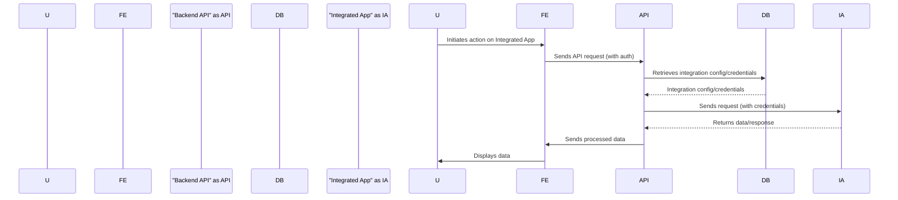

# Project Design Document: AppJoint

**Version:** 1.1
**Date:** October 26, 2023
**Prepared By:** Gemini (AI Language Model)

## 1. Introduction

This document provides an enhanced design overview of the AppJoint project, as described in the GitHub repository: [https://github.com/PrototypeZ/AppJoint](https://github.com/PrototypeZ/AppJoint). This revised document aims to provide greater clarity and detail regarding the system's architecture, components, data flow, and key functionalities, specifically for use in subsequent threat modeling activities.

## 2. Project Goals and Scope

*   **Goal:** To create a platform ("AppJoint") that empowers users to seamlessly connect and interact with a diverse range of applications through a unified and intuitive interface.
*   **Scope:** This design document encompasses the core components and interactions within the AppJoint platform. This includes user management, the mechanisms for integrating various applications, and the processes governing data exchange between them. The focus remains on architectural aspects that are critical for comprehensive security analysis.

## 3. High-Level Architecture

The AppJoint platform is structured using a layered, multi-tier architecture. This design promotes modularity, scalability, and maintainability. The key layers are:

*   **Presentation Layer ("Frontend"):**  The user-facing layer responsible for rendering the user interface and handling user interactions.
*   **Application Layer ("Backend API"):**  The core logic layer that processes requests, enforces business rules, and manages communication between the frontend and the data layer, as well as with integrated applications.
*   **Data Layer ("Database"):**  The persistence layer responsible for storing application data, user information, and integration configurations.

```mermaid
graph LR
    subgraph "User"
        U("User")
    end
    subgraph "Presentation Layer (Frontend)")
        FE("Frontend Application")
    end
    subgraph "Application Layer (Backend API)")
        API("Backend API")
    end
    subgraph "Data Layer (Database)")
        DB("Database")
    end
    subgraph "Integrated Applications"
        IA1("Integrated App 1")
        IAN("Integrated App N")
    end

    U --> FE
    FE --> API
    API --> DB
    API --> IA1
    API --> IAN
    IA1 --> API
    IAN --> API
```

**Description:**

*   The **"User"** interacts with the platform through the **"Frontend Application"**.
*   The **"Frontend Application"** communicates with the **"Backend API"** to initiate actions, retrieve data, and manage user sessions.
*   The **"Backend API"** orchestrates the application's core logic, including user authentication, authorization checks, and data validation.
*   The **"Backend API"** interacts with the **"Database"** to persist and retrieve essential data, such as user profiles and integration settings.
*   The **"Backend API"** also facilitates communication with **"Integrated App 1"** to **"Integrated App N"**, enabling data exchange and functionality access based on user configurations.

## 4. Component Details

This section provides a more granular description of the key components within the AppJoint architecture, highlighting their functionalities, responsibilities, and potential security considerations.

### 4.1. Frontend Application

*   **Functionality:**
    *   Presents the user interface (UI) for all AppJoint interactions.
    *   Manages user authentication flows, including login and logout.
    *   Displays a catalog of available integrated applications and their functionalities.
    *   Provides tools for users to configure connections and define data flows between applications.
    *   Renders data retrieved from integrated applications in a user-friendly format.
*   **Key Responsibilities:**
    *   Rendering dynamic UI elements based on application state and user interactions.
    *   Handling user input events (e.g., button clicks, form submissions).
    *   Making asynchronous API calls to the Backend API using protocols like HTTP/S.
    *   Managing client-side user sessions, often using techniques like local storage or session cookies.
    *   Enforcing basic input validation to improve user experience and reduce unnecessary backend requests.
*   **Potential Security Concerns:**
    *   Susceptibility to Cross-Site Scripting (XSS) attacks if user-provided data is not properly escaped before rendering.
    *   Risk of exposing sensitive data (e.g., API keys, user tokens) if not handled carefully in client-side code or browser storage.
    *   Vulnerability to Man-in-the-Middle (MITM) attacks if communication with the backend is not secured using HTTPS.
    *   Potential for Cross-Site Request Forgery (CSRF) attacks if proper anti-CSRF measures are not implemented.
    *   Security risks associated with the use of third-party JavaScript libraries with known vulnerabilities.

### 4.2. Backend API

*   **Functionality:**
    *   Authenticates users and authorizes their access to specific resources and functionalities.
    *   Manages user profiles, settings, and permissions.
    *   Orchestrates the communication and data exchange with integrated applications.
    *   Provides a well-defined set of API endpoints for the Frontend Application to interact with.
    *   Implements the core business logic for data transformation, processing, and validation.
    *   Securely manages integration configurations, including API keys and authentication credentials for integrated applications.
*   **Key Responsibilities:**
    *   Verifying user credentials and issuing authentication tokens (e.g., JWT).
    *   Enforcing authorization policies to control access to resources.
    *   Validating and sanitizing all incoming data from the Frontend Application.
    *   Interacting with the Database to store and retrieve persistent data.
    *   Securely storing and retrieving integration credentials, potentially using encryption or secrets management services.
    *   Implementing rate limiting and request throttling to prevent abuse and denial-of-service attacks.
    *   Logging and monitoring system activity for security auditing and troubleshooting.
    *   Handling errors gracefully and providing informative error responses without revealing sensitive information.
*   **Potential Security Concerns:**
    *   Vulnerabilities in authentication and authorization mechanisms, leading to unauthorized access.
    *   Injection vulnerabilities (e.g., SQL injection, NoSQL injection, command injection) if input is not properly sanitized before being used in database queries or system commands.
    *   Exposure of sensitive data through insecure API endpoints or verbose error messages.
    *   Risk of Mass Assignment vulnerabilities if request parameters are directly mapped to internal objects without proper filtering.
    *   Susceptibility to Denial-of-Service (DoS) or Distributed Denial-of-Service (DDoS) attacks if not properly protected.
    *   Improper handling of exceptions and errors, potentially revealing sensitive information about the system's internal workings.
    *   Insecure direct object references (IDOR) if access to resources is based on predictable identifiers without proper authorization checks.

### 4.3. Database

*   **Functionality:**
    *   Persistently stores user account information, including credentials and profile details.
    *   Stores integration configurations, such as API endpoints, authentication details, and data mapping rules.
    *   Potentially stores data retrieved from integrated applications, depending on the specific integration requirements and data retention policies.
    *   Maintains audit logs of significant system events and data modifications.
*   **Key Responsibilities:**
    *   Ensuring the durability and availability of stored data.
    *   Maintaining data integrity and consistency through constraints and transactions.
    *   Implementing robust security measures to control access to sensitive data.
    *   Performing regular backups and having a disaster recovery plan in place.
    *   Optimizing database performance for efficient data retrieval and storage.
*   **Potential Security Concerns:**
    *   SQL injection vulnerabilities if the Backend API constructs database queries using unsanitized user input.
    *   Unauthorized access to sensitive data due to weak access controls or misconfigurations.
    *   Data breaches resulting from compromised database credentials or vulnerabilities in the database software itself.
    *   Data loss or corruption due to hardware failures, software bugs, or malicious attacks.
    *   Lack of encryption at rest for sensitive data stored in the database.

### 4.4. Integrated Applications

*   **Functionality:**
    *   Represent external applications that AppJoint connects to in order to provide users with a unified experience.
    *   Expose APIs or other interfaces that AppJoint can use to retrieve data and trigger actions.
*   **Key Responsibilities:**
    *   Providing secure and reliable APIs for AppJoint to interact with.
    *   Authenticating and authorizing requests originating from AppJoint.
    *   Ensuring the security and integrity of their own data and systems.
    *   Adhering to agreed-upon data exchange protocols and formats.
*   **Potential Security Concerns:**
    *   Vulnerabilities in their APIs that could be exploited by AppJoint if not properly handled.
    *   Exposure of sensitive data if AppJoint is granted excessive permissions or if the integration is not properly secured.
    *   Potential for data breaches in the integrated application to impact AppJoint if there are shared vulnerabilities or compromised credentials.
    *   Risks associated with the security posture and compliance of third-party applications.

## 5. Data Flow

The following describes a typical data flow scenario within the AppJoint platform when a user interacts with an integrated application:

1. **User Initiates Action:** The **"User"** interacts with the **"Frontend Application"**, triggering an action related to a specific integrated application (e.g., requesting a report, updating a record).
2. **Frontend Sends API Request:** The **"Frontend Application"** sends an API request to the **"Backend API"**. This request includes the user's authentication information (e.g., a JWT) and details about the requested action and target integrated application.
3. **Backend Authentication and Authorization:** The **"Backend API"** authenticates the user using the provided credentials and verifies if the user is authorized to perform the requested action on the specified integrated application.
4. **Backend Retrieves Integration Details:** The **"Backend API"** retrieves the necessary integration configuration and credentials for the target integrated application from the **"Database"**.
5. **Backend Communicates with Integrated App:** The **"Backend API"** communicates with the **"Integrated App"** using its API, sending the request along with the appropriate authentication credentials for that application.
6. **Integrated App Processes Request:** The **"Integrated App"** processes the request, performs the necessary actions, and prepares a response.
7. **Integrated App Returns Response:** The **"Integrated App"** sends the response back to the **"Backend API"**.
8. **Backend Processes Data:** The **"Backend API"** receives the response from the **"Integrated App"**. It may transform or process this data before sending it to the frontend.
9. **Backend Sends Response to Frontend:** The **"Backend API"** sends the processed data back to the **"Frontend Application"**.
10. **Frontend Displays Data to User:** The **"Frontend Application"** renders the received data and presents it to the **"User"**.



## 6. Security Considerations

This section outlines key security considerations that are crucial for threat modeling and risk assessment of the AppJoint platform.

*   **Authentication and Authorization:**
    *   Evaluate the strength of user authentication mechanisms (e.g., password policies, multi-factor authentication).
    *   Analyze the effectiveness of authorization controls in preventing unauthorized access to resources and functionalities.
    *   Consider potential vulnerabilities like brute-force attacks, credential stuffing, and privilege escalation.
*   **Input Validation and Sanitization:**
    *   Assess the robustness of input validation implemented on both the frontend and backend to prevent injection attacks.
    *   Examine the techniques used for sanitizing user-provided data before it's used in database queries or displayed to other users.
    *   Identify potential bypasses or weaknesses in the validation logic.
*   **Data Protection:**
    *   Review the methods used to protect sensitive data at rest (e.g., database encryption) and in transit (e.g., HTTPS).
    *   Analyze the security of data storage mechanisms and access controls.
    *   Consider the risks of data leakage through insecure logging or error handling.
*   **API Security:**
    *   Evaluate the security of API endpoints, including authentication and authorization requirements.
    *   Assess the potential for API abuse through techniques like parameter tampering or replay attacks.
    *   Review the implementation of rate limiting and other protective measures against denial-of-service attacks.
*   **Integration Security:**
    *   Analyze the security of connections to integrated applications, including authentication and authorization protocols.
    *   Assess the risks associated with storing and managing integration credentials.
    *   Consider the potential impact of vulnerabilities in integrated applications on the AppJoint platform.
*   **Session Management:**
    *   Evaluate the security of session management mechanisms, including the generation, storage, and invalidation of session tokens.
    *   Consider vulnerabilities like session hijacking, session fixation, and insecure session timeouts.
*   **Logging and Monitoring:**
    *   Assess the comprehensiveness and security of logging mechanisms for tracking user actions and system events.
    *   Evaluate the effectiveness of monitoring systems in detecting and alerting on suspicious activity.
    *   Consider the security of log storage and access controls.
*   **Dependency Management:**
    *   Review the process for managing and updating third-party dependencies to address known vulnerabilities.
    *   Assess the risks associated with using outdated or vulnerable libraries and frameworks.

## 7. Technology Stack (Illustrative Examples)

*   **Frontend:**
    *   JavaScript framework: React, Vue.js, or Angular
    *   State management library: Redux, Vuex, or Context API
    *   UI component library: Material UI, Ant Design, or Bootstrap
*   **Backend API:**
    *   Programming language: Node.js with Express.js, Python with Django or Flask, Java with Spring Boot
    *   Authentication library: Passport.js, Authlib, or Spring Security
    *   Database ORM/ODM: Sequelize, Django ORM, or Spring Data JPA
*   **Database:**
    *   Relational database: PostgreSQL or MySQL
    *   NoSQL database: MongoDB or Cassandra
*   **Communication Protocol:**
    *   HTTPS for all communication
    *   RESTful APIs using JSON for data exchange
*   **Deployment Environment:**
    *   Cloud platform: AWS, Azure, or GCP
    *   Containerization: Docker
    *   Orchestration: Kubernetes

## 8. Deployment Architecture (Conceptual)

The AppJoint platform is envisioned to be deployed on a cloud-based infrastructure to leverage scalability and reliability.

*   **Frontend:**  Built as a Single Page Application (SPA) and served via a Content Delivery Network (CDN) for optimal performance and global availability.
*   **Backend API:** Deployed as a cluster of containerized microservices or a monolithic application within containers, managed by an orchestration platform like Kubernetes for scalability and resilience.
*   **Database:**  Utilizing a managed database service provided by the cloud provider (e.g., AWS RDS, Azure SQL Database, Google Cloud SQL) for ease of management and high availability.
*   **Load Balancers:** Employed to distribute incoming traffic across multiple instances of the Backend API, ensuring high availability and preventing overload on individual servers.
*   **Firewalls and Security Groups:** Configured to restrict network access to the different components, allowing only necessary communication between them.
*   **API Gateway:**  Used as a central point of entry for all API requests, providing functionalities like authentication, authorization, rate limiting, and request routing.

## 9. Future Considerations

*   **Enhanced Scalability:**  Further optimizing the architecture to handle a significantly larger number of users and integrated applications.
*   **Improved Extensibility:**  Designing the system to facilitate the easy integration of new applications and functionalities with minimal code changes.
*   **Comprehensive Auditing:** Implementing detailed auditing of all user actions, data modifications, and system events for security and compliance purposes.
*   **Proactive Security Hardening:**  Continuously reviewing and improving the security posture of the platform through regular security assessments and penetration testing.
*   **Support for Event-Driven Architecture:** Exploring the use of message queues or event streams to enable asynchronous communication and improve system responsiveness.

This enhanced design document provides a more detailed and comprehensive overview of the AppJoint project, specifically tailored for effective threat modeling. The information presented here aims to facilitate a thorough analysis of potential security vulnerabilities and the development of robust mitigation strategies.