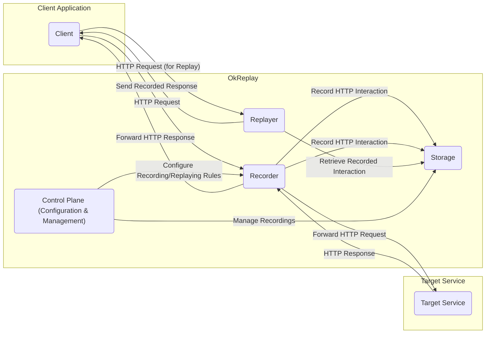
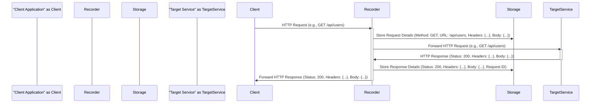
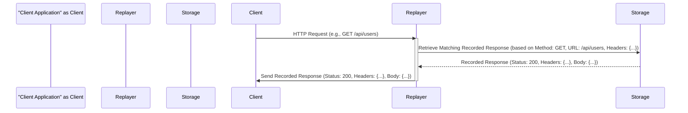

# Project Design Document: OkReplay

**Version:** 1.1
**Date:** October 26, 2023
**Author:** AI Software Architect

## 1. Introduction

This document provides an enhanced design overview of the OkReplay project, an open-source tool developed by Airbnb for recording and replaying HTTP interactions. This detailed description of the system's architecture, components, and data flow is intended to serve as a robust foundation for subsequent threat modeling activities. This revision aims to provide greater clarity and depth compared to the initial version.

## 2. Goals

*   Clearly and comprehensively define the architecture and components of OkReplay.
*   Precisely describe the data flow within the system during both recording and replaying operations.
*   Identify key functionalities and elucidate their interactions with each other.
*   Provide a solid and detailed basis for identifying potential security vulnerabilities and attack vectors during threat modeling.

## 3. System Overview

OkReplay operates as an intercepting proxy, strategically positioned between a client application and a target service. Its core function is to record HTTP requests and responses, enabling the subsequent replay of these interactions for deterministic testing, debugging, and development purposes.

## 4. Component Details

This section provides a more in-depth look at the individual components of the OkReplay system and their specific responsibilities and potential implementation details.

### 4.1. Recorder

*   **Functionality:** The Recorder component is the entry point for outgoing requests and incoming responses, responsible for capturing HTTP traffic.
*   **Key Responsibilities:**
    *   **Request Interception:** Intercepting all outgoing HTTP requests originating from the client application. This often involves acting as an HTTP proxy.
    *   **Request Forwarding:**  Forwarding the intercepted requests to the intended target service without modification during recording.
    *   **Response Interception:** Intercepting the corresponding HTTP responses returned by the target service.
    *   **Interaction Storage:**  Persisting the complete HTTP interaction (request and response pair) to the Storage component. This includes headers, body, and metadata.
    *   **Rule-Based Recording:** Applying user-defined configuration rules to determine which interactions should be recorded. This might involve filtering based on URL patterns, headers, or other criteria.
*   **Implementation Details:**
    *   Typically implemented using libraries that facilitate HTTP proxying.
    *   May involve mechanisms for handling different HTTP protocols and versions.
    *   Configuration options might include specifying upstream proxy settings.

### 4.2. Storage

*   **Functionality:** The Storage component serves as the repository for all recorded HTTP interactions.
*   **Key Responsibilities:**
    *   **Persistent Storage:**  Storing recorded request and response pairs in a durable manner.
    *   **Retrieval Mechanisms:** Providing efficient ways to retrieve specific recorded interactions based on criteria relevant for replay (e.g., matching incoming request details).
    *   **Recording Management:**  Offering functionalities for managing the lifecycle of recordings, such as listing available recordings, deleting specific recordings, or organizing them into collections.
    *   **Data Format:**  Defining and managing the format in which interactions are stored.
*   **Implementation Details:**
    *   Commonly implemented using file systems, where each recording might be stored as a separate file (e.g., in YAML or JSON format).
    *   Could also utilize simple databases (e.g., SQLite) for more structured storage and querying.
    *   Cloud storage options (e.g., AWS S3, Google Cloud Storage) could be used for more scalable and durable storage.

### 4.3. Replayer

*   **Functionality:** The Replayer component intercepts outgoing requests and attempts to fulfill them with previously recorded responses, effectively simulating the target service.
*   **Key Responsibilities:**
    *   **Request Interception:** Intercepting outgoing HTTP requests from the client application when in replay mode.
    *   **Matching Logic:** Implementing the core logic for matching an incoming request against the stored recordings. This often involves comparing request method, URL, headers, and potentially the request body.
    *   **Response Retrieval:**  Retrieving the matching recorded response from the Storage component.
    *   **Response Delivery:**  Returning the retrieved recorded response to the client application, bypassing the actual target service.
    *   **Response Modification (Optional):**  Potentially allowing for modifications or transformations of the recorded response before sending it back to the client. This could be useful for simulating different error scenarios or edge cases.
*   **Implementation Details:**
    *   Similar to the Recorder, often implemented using HTTP proxying libraries.
    *   The matching logic can be complex and configurable, allowing users to define how strictly requests should be matched against recordings.
    *   May include features for handling dynamic data or timestamps in recorded responses.

### 4.4. Control Plane (Configuration & Management)

*   **Functionality:** This component provides the user interface for configuring and managing the behavior of OkReplay.
*   **Key Responsibilities:**
    *   **Rule Definition:** Allowing users to define rules for recording and replaying interactions. This includes specifying which requests to record, which recordings to use for replay, and the matching criteria.
    *   **Recording Management:** Providing tools for managing stored recordings, such as listing, inspecting, deleting, and potentially organizing them.
    *   **Configuration Settings:**  Managing global configuration settings for the Recorder and Replayer components (e.g., storage location, matching algorithm).
    *   **Operational Control:**  Providing mechanisms to start and stop the Recorder and Replayer components, and to switch between recording and replaying modes.
*   **Implementation Details:**
    *   Frequently implemented as a command-line interface (CLI) for ease of automation and integration with development workflows.
    *   Configuration can also be managed through configuration files (e.g., YAML, JSON).
    *   A web-based user interface (UI) could be provided for a more user-friendly experience.

## 5. Data Flow

This section provides more detailed sequence diagrams illustrating the flow of data during recording and replaying.

### 5.1. Recording Flow

**Detailed Steps:**

*   The Client Application initiates an HTTP request to a specific endpoint on the Target Service.
*   The Recorder intercepts this request.
*   The Recorder persists detailed information about the request, including the HTTP method, URL, headers, and body, to the Storage component. A unique identifier might be generated to link the request and response.
*   The Recorder forwards the original HTTP request to the intended Target Service.
*   The Target Service processes the request and generates an HTTP response.
*   The Recorder intercepts the response from the Target Service.
*   The Recorder stores detailed information about the response, including the HTTP status code, headers, and body, in the Storage component, associating it with the corresponding request (using the generated identifier or matching criteria).
*   The Recorder forwards the original HTTP response back to the Client Application, completing the transaction.

### 5.2. Replaying Flow

**Detailed Steps:**

*   The Client Application initiates an HTTP request, intending to communicate with the Target Service.
*   The Replayer intercepts this request.
*   The Replayer analyzes the incoming request (method, URL, headers, body) and queries the Storage component to find a previously recorded response that matches the current request based on the configured matching rules.
*   The Storage component retrieves and returns the matching recorded response to the Replayer.
*   The Replayer sends the retrieved recorded response back to the Client Application. The actual Target Service is not involved in this process.

## 6. Key Functionalities and Interactions

*   **HTTP Traffic Interception:** The fundamental capability of both the Recorder and Replayer to act as intercepting proxies.
*   **Request-Response Pairing:** The Recorder's responsibility to correctly associate incoming responses with their corresponding outgoing requests.
*   **Storage Read/Write Operations:** Both the Recorder (writes) and Replayer (reads) heavily rely on the Storage component for persistence and retrieval of recorded interactions.
*   **Configurable Matching:** The Replayer's matching logic is a key functionality, allowing users to define how strictly incoming requests should be matched against stored recordings.
*   **Control Plane Management:** The Control Plane provides the user interface for configuring all aspects of OkReplay's behavior, directly influencing the operation of the Recorder, Replayer, and Storage interactions.

## 7. Deployment Considerations

OkReplay offers flexibility in deployment, catering to various development and testing needs.

*   **Local Development Environment:** Running OkReplay as a local proxy on a developer's machine allows for isolated testing of client applications against simulated services. This simplifies debugging and development by removing external dependencies.
*   **Integration Testing Environments:** Deploying OkReplay within integration test environments enables repeatable and deterministic testing of interactions between services. This ensures consistent test results and reduces flakiness caused by external factors.
*   **Continuous Integration/Continuous Delivery (CI/CD) Pipelines:** Integrating OkReplay into CI/CD pipelines allows for automated testing of service interactions as part of the build and deployment process. This helps to catch integration issues early in the development lifecycle.
*   **Shared Testing Environments:**  Deploying a central OkReplay instance that can be used by multiple developers or teams for sharing and reusing recorded interactions. This can improve efficiency and consistency across teams.

## 8. Security Considerations (Detailed for Threat Modeling)

This section expands on the initial security considerations, providing more specific examples of potential threats and vulnerabilities.

*   **Confidentiality of Recorded Data:**
    *   **Threat:** Unauthorized access to the Storage component could expose sensitive data contained within recorded interactions (e.g., API keys, authentication tokens, personal information).
    *   **Mitigation:** Implement appropriate access controls on the Storage component (file system permissions, database authentication). Consider encrypting sensitive data at rest.
*   **Integrity of Recorded Data:**
    *   **Threat:** Tampering with stored recordings could lead to incorrect replay behavior and potentially mask bugs or vulnerabilities in the client application.
    *   **Mitigation:** Implement mechanisms to ensure the integrity of stored recordings (e.g., checksums, digital signatures). Restrict write access to the Storage component.
*   **Access Control to the Control Plane:**
    *   **Threat:** Unauthorized access to the Control Plane could allow malicious actors to manipulate recording and replaying rules, potentially leading to denial of service or the injection of malicious responses.
    *   **Mitigation:** Implement strong authentication and authorization mechanisms for accessing the Control Plane (e.g., API keys, OAuth 2.0).
*   **Man-in-the-Middle Attacks on OkReplay:**
    *   **Threat:** If communication between the client application and OkReplay (or between OkReplay and the target service during recording) is not secured, attackers could intercept and modify traffic.
    *   **Mitigation:** Enforce the use of HTTPS for all communication involving OkReplay. Ensure proper certificate validation.
*   **Security of Configuration Files:**
    *   **Threat:** Sensitive information (e.g., credentials, API keys) might be stored in configuration files.
    *   **Mitigation:** Securely store and manage configuration files. Avoid storing sensitive information directly in plain text. Consider using environment variables or dedicated secrets management solutions.
*   **Dependency Vulnerabilities:**
    *   **Threat:** OkReplay relies on third-party libraries, which might contain security vulnerabilities.
    *   **Mitigation:** Regularly update dependencies to their latest versions. Implement a process for monitoring and addressing security advisories related to dependencies.
*   **Injection Attacks:**
    *   **Threat:** If user-provided input is not properly sanitized, it could be used to inject malicious code or commands, potentially affecting the Storage component or the underlying system.
    *   **Mitigation:** Implement robust input validation and sanitization techniques.
*   **Denial of Service:**
    *   **Threat:** An attacker could flood OkReplay with requests, potentially overwhelming its resources and preventing legitimate use.
    *   **Mitigation:** Implement rate limiting and other mechanisms to protect against denial-of-service attacks.

## 9. Future Considerations

*   **Enhanced Matching Algorithms:** Implementing more sophisticated and flexible matching algorithms for the Replayer, allowing for more nuanced and context-aware replay scenarios. Examples include regular expression matching on request bodies or header values.
*   **Data Masking and Redaction:** Adding built-in features to automatically mask or redact sensitive data within recorded interactions before they are stored. This would enhance data privacy and security.
*   **Integration with Testing Frameworks:** Providing tighter integration with popular testing frameworks (e.g., JUnit, pytest) to simplify the process of using OkReplay in automated tests. This could involve providing custom assertions or helper functions.
*   **Web-Based User Interface (UI):** Developing a comprehensive web UI for managing recordings, configuring rules, and monitoring OkReplay's activity. This would improve usability and accessibility.
*   **Support for Additional Protocols:** Expanding OkReplay's capabilities to support recording and replaying interactions beyond HTTP, such as gRPC or WebSockets.
*   **Collaboration and Sharing Features:** Implementing features that allow teams to easily share and collaborate on recorded interactions, fostering reuse and consistency in testing.

This enhanced design document provides a more detailed and comprehensive understanding of the OkReplay project. It is intended to be a valuable resource for conducting thorough threat modeling and identifying potential security risks associated with the system.