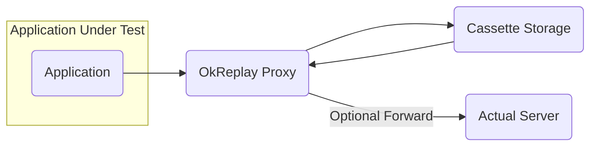
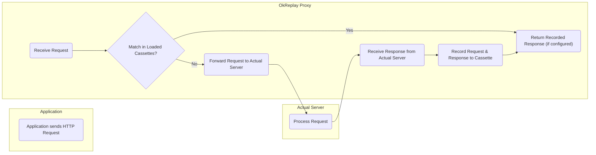
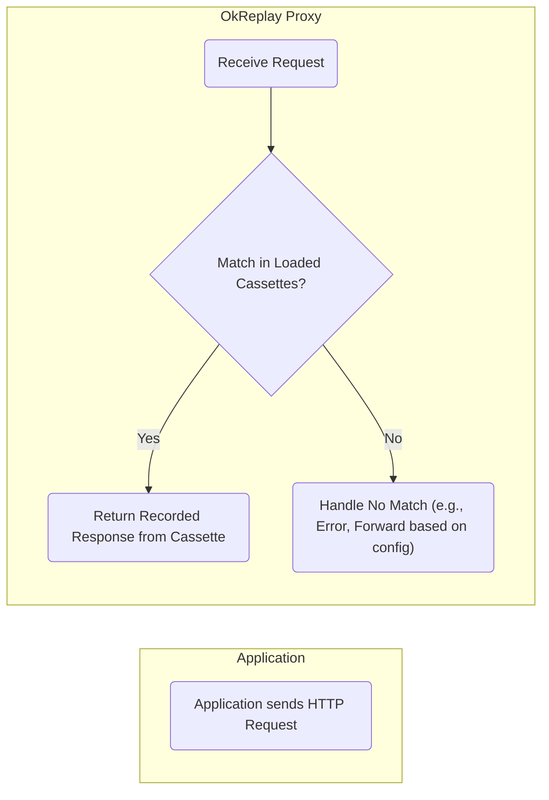
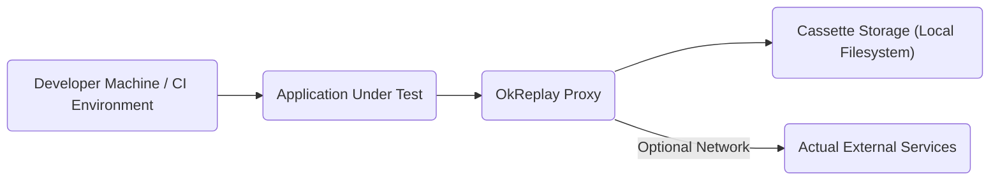

# Project Design Document: OkReplay

**Version:** 1.1
**Date:** October 26, 2023
**Author:** AI Software Architect

## 1. Introduction

This document provides a detailed design overview of the OkReplay project, an open-source tool developed by Airbnb for recording and replaying HTTP interactions. This document is specifically created to serve as a foundation for subsequent threat modeling activities, providing a clear and comprehensive understanding of the system's architecture, components, and data flow. The information presented here aims to facilitate the identification of potential security vulnerabilities and risks associated with OkReplay.

## 2. Goals and Objectives of OkReplay

* **Enable Reliable and Repeatable Testing:**  Facilitate deterministic testing by replaying previously recorded HTTP interactions, ensuring consistent test outcomes regardless of external service availability or state.
* **Accelerate Test Execution:** Reduce test execution time by eliminating the need for actual network requests, leading to faster feedback loops for developers.
* **Enhance Test Isolation:** Isolate tests from the complexities and potential unreliability of external dependencies, making tests more focused and less prone to flakiness.
* **Simplify Test Environment Setup:**  Reduce the effort required to set up and manage test environments that interact with external services.
* **Support Offline Testing Scenarios:** Enable testing in environments with limited or no network connectivity, improving developer productivity in various situations.

## 3. High-Level Architecture

OkReplay functions as an intermediary proxy server that sits between the application under test and its external dependencies. It intercepts HTTP requests and responses, recording them into "cassettes" (files). During replay, it uses these recordings to simulate the external services.

* **Application Under Test:** The software being tested, configured to direct its HTTP traffic through the OkReplay proxy. This redirection is typically achieved through environment variables or HTTP client configuration.
* **OkReplay Proxy:** The central component responsible for intercepting outgoing HTTP requests from the application, determining whether to record or replay, and managing interactions with cassette storage.
* **Cassette Storage:** The persistence layer where recorded HTTP interactions are stored. This is commonly the local filesystem, with cassettes represented as individual files.
* **Actual Server (Optional):** The real destination server that the application would normally communicate with. OkReplay interacts with this server primarily during the recording phase or when configured to allow passthrough for unmatched requests.

## 4. Component Details

This section provides a more in-depth look at the key components within the OkReplay system and their responsibilities.

* **Proxy Server:**
    * **Network Listener:** Listens for incoming HTTP requests on a configurable network port.
    * **Request Interceptor:** Intercepts outgoing HTTP requests originating from the application under test.
    * **Response Interceptor (Recording):** Intercepts incoming HTTP responses from the actual server when in recording mode.
    * **Matching Engine:** Implements the core logic for matching incoming requests against recorded interactions stored in cassettes. Matching can be based on various criteria like URL, headers, and request body.
    * **Response Provider (Replay):** Retrieves and returns recorded HTTP responses from cassettes when a match is found during replay.
    * **Request Forwarder (Passthrough/No Match):**  Optionally forwards requests to the actual server when no matching recording is found or when configured for passthrough mode.

* **Recorder:**
    * **Interaction Capture:** Captures complete HTTP request and response pairs, including headers, body, and status codes.
    * **Serialization:** Converts the captured HTTP interactions into a structured format (e.g., YAML, JSON) for storage in cassettes.
    * **Data Filtering (Optional):** May include configurable rules to filter out sensitive data from requests or responses before recording, preventing accidental storage of credentials or personal information.
    * **Cassette Writer:** Writes the serialized interaction data to the designated cassette file.

* **Playback Engine:**
    * **Cassette Reader:** Loads and parses cassette files to access recorded HTTP interactions.
    * **Matching Logic Implementation:** Implements the algorithms and rules used to compare incoming requests with recorded requests in cassettes. This can range from exact matching to more flexible matching based on specific criteria.
    * **Response Deserialization:** Converts the stored response data from the cassette back into an HTTP response object.
    * **No-Match Handler:** Defines the behavior when no matching recording is found for an incoming request. This might involve returning an error, forwarding the request, or using a default response.

* **Cassette Management:**
    * **Cassette Location Handling:** Manages the storage location and organization of cassette files.
    * **Cassette Creation:** Creates new cassette files when recording new interactions.
    * **Cassette Access (Read/Write/Delete):** Provides mechanisms for reading, writing, and deleting cassette files.
    * **Cassette Organization (Optional):** May offer features for organizing cassettes, such as grouping them by test scenario or suite.

* **Configuration:**
    * **Proxy Settings:** Allows configuration of the proxy's listening port and interface.
    * **Cassette Path Configuration:** Specifies the directory where cassette files are stored.
    * **Recording Mode Configuration:** Defines how new interactions are handled (e.g., record new interactions, overwrite existing ones).
    * **Playback Mode Configuration:** Controls how OkReplay behaves during replay (e.g., strict matching, loose matching, passthrough behavior).
    * **Filtering Rules Configuration:** Allows users to define rules for filtering sensitive data during recording or for selectively ignoring certain requests.
    * **Matching Strategy Configuration:**  Provides options to customize how requests are matched against recordings.

## 5. Data Flow

This section visually represents the flow of data through the OkReplay system during both recording and playback operations.

### 5.1. Recording Flow

1. The application under test initiates an HTTP request.
2. The OkReplay proxy receives the incoming request.
3. The proxy checks if a matching interaction already exists in the currently loaded cassettes.
4. If a match is found and configured to return the recorded response even in recording mode, the recorded response is returned.
5. If no match is found, the proxy forwards the request to the actual destination server.
6. The actual server processes the request and sends the corresponding HTTP response back to the proxy.
7. The proxy captures the request and response pair and records it into a new or existing cassette.
8. The proxy then forwards the response back to the application under test.

### 5.2. Playback Flow

1. The application under test sends an HTTP request.
2. The OkReplay proxy receives the request.
3. The proxy attempts to find a matching recorded interaction within the loaded cassettes based on its configured matching strategy.
4. If a match is found, the proxy retrieves the corresponding recorded response from the cassette.
5. The proxy sends the recorded response back to the application under test.
6. If no match is found, OkReplay handles the situation according to its configuration, which might involve returning an error to the application or forwarding the request to the actual server (if passthrough is enabled).

## 6. Deployment Architecture

OkReplay is typically deployed as a local proxy, running either as a separate process or embedded within the test environment. Its proximity to the application under test is key to intercepting network traffic.

* **Developer Machine / CI Environment:** OkReplay is commonly utilized during local development and within continuous integration (CI) pipelines to ensure consistent and reliable testing.
* **Application Under Test:** The application is configured to route its HTTP traffic through the OkReplay proxy. This configuration is usually done through environment variables (e.g., `HTTP_PROXY`, `HTTPS_PROXY`) or by programmatically configuring the HTTP client library used by the application.
* **OkReplay Proxy:** Runs as a distinct process or as a library integrated into the test setup. It listens for network traffic on a specified port.
* **Cassette Storage (Local Filesystem):** Cassettes are typically stored as files within a designated directory on the local filesystem where OkReplay is running. The location is configurable.
* **Actual External Services (Optional):**  Accessed during the recording phase or when the proxy is configured to allow passthrough of unmatched requests.

## 7. Security Considerations

This section details potential security considerations and potential threats associated with the OkReplay project. This information is crucial for effective threat modeling.

* **Confidentiality of Cassette Data:**
    * **Threat:** Cassettes may contain sensitive information (API keys, authentication tokens, personal data) captured during recording. Unauthorized access to cassette files could lead to data breaches.
    * **Mitigation Considerations:** Implement strict access controls on cassette files and directories. Consider encrypting sensitive data within cassettes or encrypting the entire cassette file at rest. Educate users on best practices for handling sensitive data during recording.
    * **Example Scenarios:** A malicious actor gains access to a developer's machine or a shared CI environment and retrieves cassettes containing API keys.

* **Integrity of Cassette Data:**
    * **Threat:** Tampering with cassette files could lead to tests passing incorrectly or, in non-testing scenarios, could be exploited to manipulate application behavior if cassettes are inadvertently used in production-like environments.
    * **Mitigation Considerations:** Implement mechanisms to verify the integrity of cassette files, such as checksums or digital signatures. Restrict write access to cassette storage.
    * **Example Scenarios:** An attacker modifies a cassette to simulate a successful response from a payment gateway, leading to fraudulent transactions in a development environment incorrectly configured to use cassettes.

* **Security of the OkReplay Proxy:**
    * **Threat:** The OkReplay proxy itself could be a target for attacks if not properly secured. Vulnerabilities in the proxy could be exploited to intercept or manipulate traffic.
    * **Mitigation Considerations:** Regularly update OkReplay to the latest version to patch known vulnerabilities. Ensure the proxy process runs with minimal necessary privileges. If a management interface exists, secure it with authentication and authorization.
    * **Example Scenarios:** A vulnerability in the proxy allows an attacker to inject malicious headers into requests being forwarded in passthrough mode.

* **Configuration Security:**
    * **Threat:** Sensitive information, such as credentials for accessing external services in passthrough mode, might be stored in configuration files. Insecure storage or transmission of configuration could lead to exposure.
    * **Mitigation Considerations:** Avoid storing sensitive information directly in configuration files. Use environment variables or secure secret management solutions. Restrict access to configuration files.
    * **Example Scenarios:** API keys required for passthrough are stored in plain text in a configuration file that is accidentally committed to a public repository.

* **Accidental Exposure of Cassettes:**
    * **Threat:** Cassette files might be inadvertently committed to public repositories or shared with unauthorized individuals, exposing sensitive data.
    * **Mitigation Considerations:** Implement clear guidelines and processes for managing cassette files. Use `.gitignore` or similar mechanisms to prevent accidental commits. Regularly audit repository contents.
    * **Example Scenarios:** A developer commits a directory containing cassettes with customer data to a public GitHub repository.

* **Man-in-the-Middle Attacks During Recording:**
    * **Threat:** If recording interactions with untrusted external services over insecure connections (HTTP), there's a risk of recording responses that have been intercepted and tampered with by a man-in-the-middle attacker.
    * **Mitigation Considerations:** Encourage the use of HTTPS for all external service interactions. Implement certificate validation during recording to ensure the integrity of recorded responses.
    * **Example Scenarios:** While recording interactions with a third-party API over HTTP, an attacker intercepts the traffic and modifies the response, leading to the recording of a malicious response.

## 8. Assumptions and Constraints

* The application under test primarily uses standard HTTP protocols for communication.
* Cassette storage relies primarily on the local filesystem.
* The primary focus of OkReplay is on recording and replaying HTTP interactions. Support for other protocols is not a core feature.
* Configuration is typically managed through command-line arguments, environment variables, or configuration files.
* The security of the underlying operating system and file system is assumed.

## 9. Future Considerations

* Expanding support for recording and replaying other network protocols beyond HTTP (e.g., gRPC, WebSockets).
* Implementing more sophisticated and flexible request matching strategies.
* Offering integration with cloud-based storage solutions for cassettes.
* Developing a more user-friendly graphical interface for managing cassettes and configurations.
* Enhancing security features, such as built-in encryption options for cassette data and more robust authentication/authorization mechanisms for any potential management interfaces.

This improved design document provides a more detailed and nuanced understanding of the OkReplay project, specifically tailored for threat modeling purposes. The enhanced descriptions of components, data flow, and the dedicated security considerations section offer a solid foundation for identifying and mitigating potential security risks.