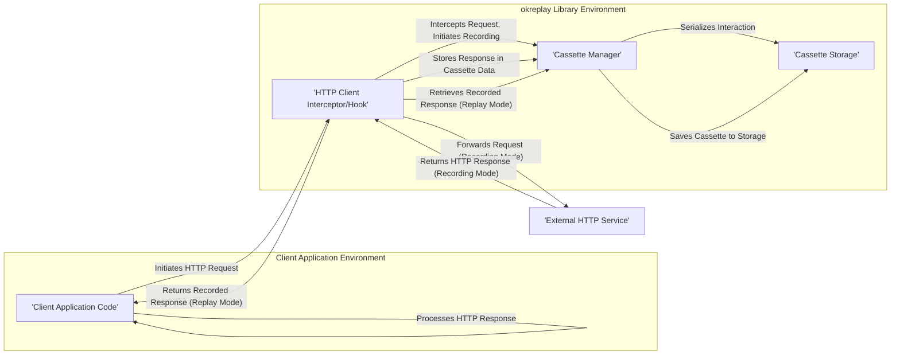

## Project Design Document: okreplay (Improved)

**1. Introduction**

This document provides an enhanced design overview of the `okreplay` project, an open-source library by Airbnb for recording and replaying HTTP interactions. This detailed description is specifically crafted to facilitate comprehensive threat modeling. Understanding the project's architecture, components, and data flow is crucial for identifying potential security vulnerabilities and attack vectors.

**1.1. Purpose**

The primary goal of this document is to provide a clear and detailed understanding of the `okreplay` design to enable effective threat modeling. It meticulously outlines the key components, their interactions, and the data they process, empowering security professionals to proactively identify and assess potential security risks.

**1.2. Scope**

This document focuses on the core functionalities of the `okreplay` library, specifically the mechanisms for recording and replaying HTTP interactions, the management of cassette storage, and its integration points with various HTTP client libraries. The scope is limited to the `okreplay` library itself and does not cover the internal workings of specific HTTP clients or the underlying operating systems where `okreplay` might be deployed.

**1.3. Goals**

* To present a clear and unambiguous description of the `okreplay` architecture.
* To precisely identify the key components and delineate their respective responsibilities.
* To thoroughly illustrate the data flow during both the recording and replaying of HTTP interactions.
* To explicitly highlight areas of particular interest for security analysis and potential vulnerabilities.

**2. Project Overview**

`okreplay` is a library designed to record HTTP interactions (both requests and responses) and subsequently replay them. Its primary use case is in software testing, enabling developers to create deterministic and repeatable tests that do not rely on the availability or state of external services. The central concept is the "cassette," a file that stores these recorded interactions.

**3. System Architecture**

The `okreplay` architecture comprises several interacting components:

* **Client Application:** The software application that utilizes the `okreplay` library to either record or replay HTTP interactions. This application employs a standard HTTP client library (e.g., `requests` in Python, `axios` in JavaScript).
* **okreplay Core Library:** The central library responsible for intercepting HTTP requests, managing the recording of these interactions into cassettes, and orchestrating the replay of responses from those cassettes.
* **HTTP Client Interceptor/Hook:** A mechanism within `okreplay` that intercepts HTTP requests initiated by the client application *before* they are transmitted over the network. The specific implementation of this interceptor is dependent on the HTTP client library being used.
* **Cassette Manager Component:** A module within `okreplay` dedicated to the management of cassette files. This includes loading cassettes, saving updated cassettes, and searching for matching interactions.
* **Cassette Storage Mechanism:** The designated location where cassette files are persisted. The most common implementation is the local file system, but `okreplay` can be configured to utilize other storage mechanisms.
* **External HTTP Service (during recording phase):** The actual external service that the client application intends to communicate with when `okreplay` is in recording mode.

**4. Data Flow Description**

The flow of data within `okreplay` differs significantly depending on whether the library is operating in recording mode or replaying mode.

**4.1. Data Flow in Recording Mode:**

1. The client application constructs and initiates an HTTP request.
2. The `okreplay` HTTP client interceptor captures the outgoing request.
3. The interceptor forwards the original request to the intended external HTTP service.
4. The external HTTP service processes the request and returns an HTTP response.
5. The `okreplay` interceptor captures the incoming response from the external service.
6. The interceptor passes both the captured HTTP request and the corresponding HTTP response to the Cassette Manager.
7. The Cassette Manager serializes the complete HTTP interaction (request and response details) and persists it into a cassette file within the designated Cassette Storage.
8. Finally, the interceptor returns the actual response received from the external service back to the client application.

**4.2. Data Flow in Replaying Mode:**

1. The client application constructs and initiates an HTTP request.
2. The `okreplay` HTTP client interceptor captures the outgoing request.
3. The interceptor queries the Cassette Manager to determine if a matching HTTP interaction exists within the currently loaded cassettes. The matching process typically involves comparing request attributes such as URL, HTTP method, headers, and request body.
4. If a matching interaction is found:
    * The Cassette Manager retrieves the stored HTTP response from the relevant cassette.
    * The interceptor returns this stored response directly to the client application, effectively bypassing the need to send the request to the actual external service.
5. If no matching interaction is found within the loaded cassettes (and depending on the configured behavior):
    * The request might be allowed to proceed to the external service.
    * The interaction might be recorded into a new cassette for future replays, if recording is enabled and configured for unmatched requests.

**5. Detailed Component Descriptions**

* **HTTP Client Interceptor/Hook:** This is a critical component responsible for the seamless interception of HTTP traffic. Its implementation is tightly coupled with the specific HTTP client library being used by the client application. Common techniques include:
    * **Monkey Patching:** Dynamically modifying the behavior of the HTTP client's request methods.
    * **Client-Specific Interceptors:** Utilizing built-in interception mechanisms provided by the HTTP client library itself.
    * **Custom Transport Layers:** Replacing the default transport layer of the HTTP client with a custom implementation that includes interception logic.
* **Cassette Manager:** This component is central to the operation of `okreplay` and manages the lifecycle of cassette files. Its responsibilities include:
    * **Cassette Loading:** Loading cassette files from the configured Cassette Storage location into memory.
    * **Cassette Creation:** Creating new cassette files when recording new interactions.
    * **Interaction Matching:** Searching loaded cassettes for existing interactions that match the current outgoing HTTP request based on defined matching rules.
    * **Interaction Addition:** Adding new HTTP interactions (request and response pairs) to the appropriate cassette.
    * **Cassette Saving:** Persisting updated cassettes back to the Cassette Storage.
    * **Cassette Indexing/Metadata Management:** Potentially managing indexes or metadata associated with cassettes to improve search efficiency.
* **Cassette Storage:** This defines the mechanism and location for storing cassette files. Common implementations include:
    * **Local File System:** Cassettes are stored as individual files, often in formats like YAML or JSON. This is the most common and default storage mechanism.
    * **In-Memory Storage:** Cassettes are stored in the application's memory. This is typically used for testing or scenarios where persistence is not required.
    * **Custom Storage Implementations:** `okreplay` may provide interfaces or mechanisms to allow developers to implement custom storage solutions, such as storing cassettes in databases or cloud storage services.
* **Configuration Options:** `okreplay` offers a range of configuration options to customize its behavior, including:
    * **Recording Mode Toggle:** Enabling or disabling the recording of HTTP interactions.
    * **Replaying Mode Toggle:** Enabling or disabling the replaying of HTTP interactions from cassettes.
    * **Cassette Storage Path:** Specifying the directory or location where cassette files are stored.
    * **Request Matching Rules:** Defining the criteria used to match outgoing requests with stored interactions in cassettes (e.g., matching based on URL, HTTP method, specific headers, request body content).
    * **Request Filtering:** Options to selectively include or exclude specific requests from being recorded or replayed based on certain criteria.
    * **Cassette Ejection:** Mechanisms to programmatically remove specific interactions from cassettes.

**6. Security Considerations for Threat Modeling**

Based on the architecture and data flow described above, several potential security considerations are relevant for threat modeling:

* **Exposure of Sensitive Data in Cassettes:** Cassette files may inadvertently contain sensitive information such as API keys, authentication tokens (e.g., OAuth tokens, session IDs), personally identifiable information (PII), or other confidential data present in recorded requests or responses. Secure storage, access control, and potentially encryption of cassette files are critical.
* **Integrity and Tampering of Cassette Files:** If cassette files are stored without adequate protection, they could be tampered with. Malicious modification of cassette content could lead to unexpected application behavior, bypass security controls, or introduce vulnerabilities during replay. Mechanisms to ensure the integrity of cassette files (e.g., checksums, digital signatures) should be considered.
* **Injection Vulnerabilities via Replayed Responses:** If the content of replayed responses from cassettes is not properly handled and sanitized by the client application, it could potentially introduce various injection vulnerabilities (e.g., Cross-Site Scripting (XSS), HTML injection) if the replayed data is directly rendered in a web browser or processed without validation.
* **Security of Configuration Data:** The configuration settings of `okreplay`, including storage paths and matching rules, could be sensitive. If these configurations are not securely managed, an attacker might be able to manipulate them to record or replay unintended interactions, potentially exposing sensitive data or disrupting application functionality.
* **Vulnerabilities in `okreplay` Library and Dependencies:** Like any software, `okreplay` and its dependencies may contain security vulnerabilities. Keeping the library and its dependencies up-to-date is crucial to mitigate known risks. Regular security audits and vulnerability scanning should be performed.
* **Accidental Recording of Sensitive Interactions:** If recording is enabled in production or staging environments (which is generally discouraged), interactions with internal or sensitive endpoints might be unintentionally recorded into cassettes, potentially leading to data leaks if these cassettes are not properly secured.
* **Data Leakage through Cassette Sharing:** Sharing cassette files without careful consideration and redaction of sensitive information can lead to unintended data disclosure. Clear guidelines and processes for sharing cassettes are necessary.

**7. Future Development and Security Implications**

Potential future enhancements to `okreplay` could introduce new security considerations:

* **Encryption of Cassette Data:** Implementing encryption for cassette files would significantly enhance the security of sensitive data at rest. The choice of encryption algorithm and key management strategy would be critical.
* **Centralized Cassette Management System:** A centralized system for managing and sharing cassettes across teams could improve collaboration but would also introduce new security challenges related to access control, authentication, and secure storage of cassettes in a shared environment.
* **Role-Based Access Control for Cassettes:** Implementing granular access controls for cassettes, allowing only authorized users or roles to access specific recordings, would enhance data security and prevent unauthorized access to sensitive information.
* **Advanced Request Matching Algorithms:** More sophisticated matching algorithms could improve the accuracy and flexibility of replay but might also introduce complexities that could lead to unexpected behavior or potential security vulnerabilities if not carefully designed and implemented.

**8. Conclusion**

This improved design document provides a comprehensive and detailed overview of the `okreplay` project, focusing on its architecture, data flow, and key components. This information is essential for conducting thorough threat modeling exercises to identify and mitigate potential security risks associated with the use of `okreplay`. The security considerations outlined in this document serve as a starting point for a more in-depth security analysis and will be further explored during the threat modeling process.