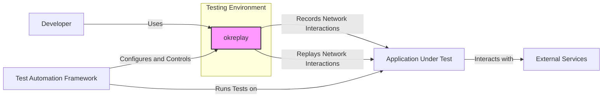

# BUSINESS POSTURE

- Business Priorities and Goals:
 - Improve software testing efficiency and reliability by enabling deterministic replay of network interactions.
 - Reduce the flakiness of integration and end-to-end tests, leading to faster development cycles and higher quality software.
 - Facilitate offline testing and debugging of applications that rely on external services.
 - Enable easier reproduction of bug scenarios by capturing and replaying the exact network conditions.

- Business Risks:
 - Risk of exposing sensitive data if recordings are not properly secured, potentially leading to data breaches or compliance violations.
 - Risk of test environment instability if the replay system itself is unreliable or vulnerable, impacting development velocity.
 - Risk of misinterpreting test results if the replay mechanism is not accurate or introduces unintended side effects.
 - Risk of increased development complexity if the integration of the replay system is cumbersome or poorly documented.

# SECURITY POSTURE

- Existing Security Controls:
 - security control: Code review process for contributions to the open-source project. (Implemented in: GitHub repository contribution workflow)
 - security control: Publicly accessible codebase for community security review. (Implemented in: GitHub repository visibility)
 - accepted risk: Reliance on community contributions for identifying and addressing security vulnerabilities.
 - accepted risk: Potential vulnerabilities in dependencies used by the project.
 - accepted risk: Lack of formal security audits or penetration testing for the open-source project.

- Recommended Security Controls:
 - security control: Implement automated Static Application Security Testing (SAST) and Dependency Scanning in the CI/CD pipeline to identify potential vulnerabilities in code and dependencies.
 - security control: Establish a process for reporting and triaging security vulnerabilities, including a security contact and response plan.
 - security control: Provide security guidelines for users on how to handle sensitive data when using the replay system, emphasizing data minimization and anonymization.
 - security control: Consider implementing Dynamic Application Security Testing (DAST) to assess the security of deployed replay infrastructure if applicable.

- Security Requirements:
 - Authentication:
  - Requirement: Access to the replay system's configuration and management interfaces (if any) should be authenticated to prevent unauthorized modifications.
  - Requirement: If recordings are stored centrally, access to these recordings should be authenticated and authorized.
 - Authorization:
  - Requirement: Implement role-based access control (RBAC) if multiple users or teams are using the replay system, to restrict access to recordings and configurations based on roles and responsibilities.
  - Requirement: Ensure that only authorized processes can write and read recordings to prevent tampering or unauthorized access.
 - Input Validation:
  - Requirement: Validate all inputs to the replay system, including configuration parameters, recording filters, and replay requests, to prevent injection attacks and unexpected behavior.
  - Requirement: Sanitize and validate data extracted from recordings before replaying it to prevent injection attacks into the application under test.
 - Cryptography:
  - Requirement: If sensitive data is expected to be recorded, provide options for encrypting recordings at rest and in transit to protect confidentiality.
  - Requirement: Use secure communication protocols (e.g., HTTPS) for any management interfaces or data transfer between components of the replay system.

# DESIGN

- C4 CONTEXT



- C4 CONTEXT Elements:
 - - Name: Developer
   - Type: Person
   - Description: Software developers who use okreplay to record and replay network interactions for testing and debugging their applications.
   - Responsibilities: Using okreplay to create recordings of network traffic, replaying recordings during testing, configuring okreplay for specific testing scenarios.
   - Security controls: Authentication to development workstations, access control to development environments.
 - - Name: okreplay
   - Type: Software System
   - Description: A network interaction recording and replaying system that acts as a proxy to capture and simulate network traffic for testing purposes.
   - Responsibilities: Recording network interactions between the Application Under Test and External Services, storing recordings, replaying recordings to simulate External Services, providing APIs or interfaces for configuration and control.
   - Security controls: Input validation, access control to recordings, secure configuration management, potential encryption of recordings.
 - - Name: Application Under Test
   - Type: Software System
   - Description: The software application being tested using okreplay. It interacts with okreplay instead of directly with External Services during replay.
   - Responsibilities: Sending network requests as part of its functionality, processing responses, interacting with okreplay during testing.
   - Security controls: Standard application security controls (authentication, authorization, input validation, etc.), integration with secure testing practices.
 - - Name: External Services
   - Type: Software System
   - Description: External APIs, databases, or other services that the Application Under Test depends on. okreplay simulates these services during replay.
   - Responsibilities: Providing data and functionality to the Application Under Test in a real environment. Simulated by okreplay in a testing environment.
   - Security controls: Security controls of the actual external services are not directly relevant to okreplay, but the simulation should not introduce new vulnerabilities.
 - - Name: Test Automation Framework
   - Type: Software System
   - Description: Tools and frameworks used to automate the execution of tests for the Application Under Test, often integrating with okreplay to manage recordings and replay sessions.
   - Responsibilities: Orchestrating test execution, configuring okreplay, running tests against the Application Under Test using replayed network interactions, reporting test results.
   - Security controls: Authentication and authorization for accessing test automation infrastructure, secure storage of test scripts and configurations.

- C4 CONTAINER

```mermaid
graph LR
    subgraph "okreplay System"
        A["Recording Proxy"
        \nContainer]
        B["Replay Server"
        \nContainer]
        C["Storage"
        \nContainer]
        D["Configuration & Management API"
        \nContainer]
    end
    E["Developer"
    \nPerson]
    F["Application Under Test"
    \nContainer]

    E -->|Configures, Manages| D
    F -->|Network Requests (Record)| A
    F -->|Network Requests (Replay)| B
    A -->|Stores Recordings| C
    B -->|Retrieves Recordings| C
    D -->|Manages Configuration| C
    A -->> B & D

    style A fill:#f9f,stroke:#333,stroke-width:2px
    style B fill:#f9f,stroke:#333,stroke-width:2px
    style C fill:#f9f,stroke:#333,stroke-width:2px
    style D fill:#f9f,stroke:#333,stroke-width:2px
```

- C4 CONTAINER Elements:
 - - Name: Recording Proxy
   - Type: Container
   - Description: Intercepts network traffic between the Application Under Test and External Services. Records network requests and responses based on configured filters.
   - Responsibilities: Network traffic interception, request/response recording, filtering of recorded traffic, forwarding traffic to External Services during recording mode.
   - Security controls: Input validation of filtering rules, secure handling of intercepted network traffic (potential sensitive data), access control to configuration.
 - - Name: Replay Server
   - Type: Container
   - Description: Simulates External Services by serving pre-recorded responses when the Application Under Test makes network requests.
   - Responsibilities: Intercepting network requests from the Application Under Test during replay mode, matching requests to recorded interactions, serving recorded responses, potentially modifying responses based on configuration.
   - Security controls: Access control to recordings, input validation of replay requests, secure handling of replayed data, protection against replay attacks (if applicable).
 - - Name: Storage
   - Type: Container
   - Description: Persistent storage for recorded network interactions. Can be file system, database, or cloud storage.
   - Responsibilities: Storing recordings, providing access to recordings for the Replay Server and Management API, ensuring data integrity and availability.
   - Security controls: Access control to storage, encryption at rest for recordings (if required), data backup and recovery, integrity checks.
 - - Name: Configuration & Management API
   - Type: Container
   - Description: Provides an API for developers and test automation frameworks to configure and manage the okreplay system, including defining recording rules, starting/stopping recordings, and managing replay sessions.
   - Responsibilities: Exposing API endpoints for configuration and management, handling authentication and authorization for API access, managing system state, interacting with Storage.
   - Security controls: Authentication and authorization for API access, input validation for API requests, secure session management, audit logging of management operations.

- DEPLOYMENT

```mermaid
graph LR
    subgraph "Development Environment"
        A["Developer Workstation"
        \nDeployment Node]
        subgraph "okreplay Containers"
            B["Recording Proxy"
            \nContainer]
            C["Replay Server"
            \nContainer]
            D["Storage"
            \nContainer]
            E["Configuration & Management API"
            \nContainer]
        end
    end
    F["Application Under Test"
    \nDeployment Node]

    A -->> B & C & D & E
    A -->> F
    F -->> B & C

    style A fill:#ccf,stroke:#333,stroke-width:2px
    style F fill:#ccf,stroke:#333,stroke-width:2px
    style B fill:#f9f,stroke:#333,stroke-width:2px
    style C fill:#f9f,stroke:#333,stroke-width:2px
    style D fill:#f9f,stroke:#333,stroke-width:2px
    style E fill:#f9f,stroke:#333,stroke-width:2px
```

- DEPLOYMENT Elements:
 - - Name: Developer Workstation
   - Type: Deployment Node
   - Description: The local machine used by a developer to run and interact with okreplay and the Application Under Test during development and testing.
   - Responsibilities: Hosting okreplay containers, running the Application Under Test (potentially in a container or locally), providing the environment for development and debugging.
   - Security controls: Workstation security controls (OS hardening, endpoint protection, access control), developer authentication.
 - - Name: Recording Proxy Container
   - Type: Container
   - Description: Instance of the Recording Proxy container deployed on the Developer Workstation.
   - Responsibilities: Intercepting and recording network traffic on the developer's workstation.
   - Security controls: Container security (image scanning, resource limits), access control within the container environment.
 - - Name: Replay Server Container
   - Type: Container
   - Description: Instance of the Replay Server container deployed on the Developer Workstation.
   - Responsibilities: Replaying recorded network interactions on the developer's workstation.
   - Security controls: Container security, access control within the container environment.
 - - Name: Storage Container
   - Type: Container
   - Description: Instance of the Storage container deployed on the Developer Workstation, managing local storage for recordings.
   - Responsibilities: Persisting recordings locally on the developer's workstation.
   - Security controls: Container security, file system permissions, potential encryption of local storage.
 - - Name: Configuration & Management API Container
   - Type: Container
   - Description: Instance of the Configuration & Management API container deployed on the Developer Workstation, providing management interface.
   - Responsibilities: Providing API access for configuration and management on the developer's workstation.
   - Security controls: Container security, API authentication (e.g., local access only), access logging.
 - - Name: Application Under Test Deployment Node
   - Type: Deployment Node
   - Description: Represents where the Application Under Test is deployed during development, could be on the same Developer Workstation or a separate local server/container.
   - Responsibilities: Running the Application Under Test, interacting with okreplay containers.
   - Security controls: Application security controls, access control to the deployment environment.

- BUILD

```mermaid
graph LR
    A["Developer"
    \nCode Changes] --> B["Version Control System"
    \nGitHub]
    B --> C["CI/CD System"
    \nGitHub Actions (Example)]
    C --> D{{"Build & Test Stage"}}
    D --> E["SAST & Dependency Scan"]
    D --> F["Unit & Integration Tests"]
    D -- Yes --> G["Container Image Build"]
    G --> H["Container Registry"
    \nGitHub Container Registry (Example)]
    H --> I["Deployment Artifacts"]
    C -- No --> J["Build Failure Notification"]

    style D fill:#ccf,stroke:#333,stroke-width:2px
    style E fill:#f9f,stroke:#333,stroke-width:2px
    style F fill:#f9f,stroke:#333,stroke-width:2px
```

- BUILD Elements:
 - - Name: Developer
   - Type: Person
   - Description: Software developer writing and modifying the code for okreplay.
   - Responsibilities: Writing code, committing changes to the Version Control System.
   - Security controls: Secure coding practices, code review participation, workstation security.
 - - Name: Version Control System
   - Type: System
   - Description: GitHub repository hosting the okreplay source code.
   - Responsibilities: Storing source code, managing versions, tracking changes, controlling access to the codebase.
   - Security controls: Access control (authentication and authorization), branch protection, audit logging.
 - - Name: CI/CD System
   - Type: System
   - Description: Example: GitHub Actions, Jenkins, or similar automation platform used to build, test, and publish okreplay.
   - Responsibilities: Automating the build process, running tests, performing security scans, building container images, publishing artifacts.
   - Security controls: Secure pipeline configuration, secrets management, access control to CI/CD system, audit logging.
 - - Name: Build & Test Stage
   - Type: Process
   - Description: Automated stage in the CI/CD pipeline that compiles code, runs tests, and performs security checks.
   - Responsibilities: Code compilation, unit and integration testing, static analysis security testing (SAST), dependency scanning.
   - Security controls: SAST tools, dependency scanning tools, secure build environment, test isolation.
 - - Name: SAST & Dependency Scan
   - Type: Process
   - Description: Security checks performed during the build process to identify potential vulnerabilities in the code and dependencies.
   - Responsibilities: Running SAST tools, analyzing scan results, identifying vulnerable dependencies.
   - Security controls: Regularly updated SAST and dependency scanning tools, vulnerability databases, defined thresholds for scan failures.
 - - Name: Unit & Integration Tests
   - Type: Process
   - Description: Automated tests to verify the functionality of individual components and their integration.
   - Responsibilities: Executing unit and integration tests, reporting test results, ensuring code quality and functionality.
   - Security controls: Secure test data management, test environment isolation.
 - - Name: Container Image Build
   - Type: Process
   - Description: Building container images for okreplay components if containerized deployment is used.
   - Responsibilities: Building container images from Dockerfiles, ensuring minimal and secure base images, signing container images (optional).
   - Security controls: Base image security, container image scanning, minimal image design, image signing and verification.
 - - Name: Container Registry
   - Type: System
   - Description: Example: GitHub Container Registry, Docker Hub, or private registry used to store and distribute container images.
   - Responsibilities: Storing container images, controlling access to images, providing image distribution.
   - Security controls: Access control to the registry, image scanning in the registry, vulnerability management for stored images.
 - - Name: Deployment Artifacts
   - Type: Artifacts
   - Description: Built and tested artifacts ready for deployment, including container images, binaries, or libraries.
   - Responsibilities: Providing deployable artifacts for users.
   - Security controls: Integrity checks (checksums, signatures) for artifacts, secure artifact storage and distribution.
 - - Name: Build Failure Notification
   - Type: Notification
   - Description: Automated notifications sent to developers in case of build failures.
   - Responsibilities: Informing developers about build issues for timely resolution.
   - Security controls: Secure notification channels, preventing information leakage in notifications.

# RISK ASSESSMENT

- Critical Business Processes:
 - Software Development Lifecycle: okreplay directly supports testing and debugging phases, impacting the speed and reliability of software development.
 - Quality Assurance: okreplay enhances the quality of software by enabling more robust and deterministic testing.

- Data to Protect and Sensitivity:
 - Network Interaction Recordings: These recordings might contain sensitive data depending on the applications being tested. Sensitivity varies greatly based on the application and data being recorded (e.g., API keys, personal data, financial transactions).
 - Configuration Data: Configuration settings for okreplay itself, including filtering rules and access control policies, need to be protected to maintain system security and integrity.
 - Logs and Audit Trails: Logs generated by okreplay and audit trails of user actions can contain sensitive information and are important for security monitoring and incident response. Sensitivity depends on the level of detail and data included in logs.

# QUESTIONS & ASSUMPTIONS

- Questions:
 - What type of data is expected to be recorded using okreplay in typical use cases? Is sensitive data (PII, financial data, secrets) commonly recorded?
 - What are the typical deployment environments for okreplay? Is it primarily used in local development, CI/CD pipelines, or dedicated testing environments?
 - Are there any specific compliance requirements (e.g., GDPR, PCI DSS, HIPAA) that need to be considered for the use of okreplay and the handling of recordings?
 - Is there a need for multi-user support and role-based access control for okreplay in typical deployment scenarios?
 - What is the expected scale of recordings and replay sessions? Does okreplay need to handle large volumes of data or concurrent users?

- Assumptions:
 - Assumption: okreplay is primarily used in development and testing environments, not in production.
 - Assumption: Users of okreplay are developers and QA engineers with some level of technical expertise.
 - Assumption: Security is a secondary consideration for the open-source project itself, but users deploying and using okreplay in their environments need to consider security implications.
 - Assumption: Recordings are stored temporarily for testing purposes and are not intended for long-term archival unless explicitly configured.
 - Assumption: The deployment environment is assumed to be a typical development workstation or a controlled testing infrastructure.