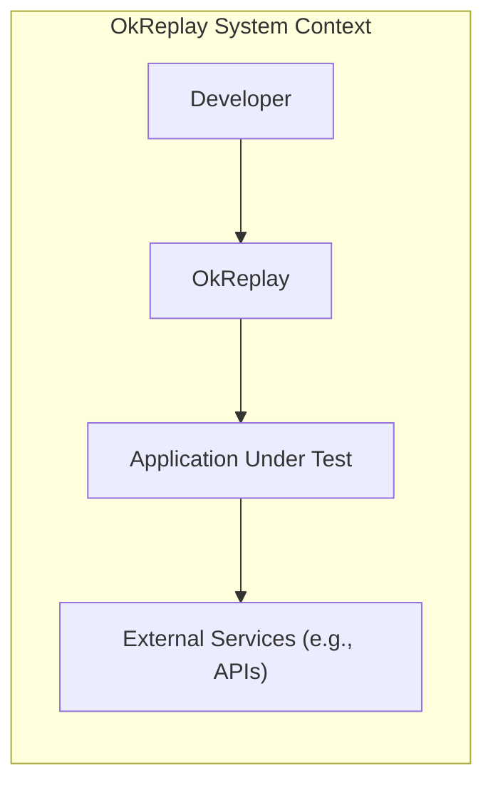
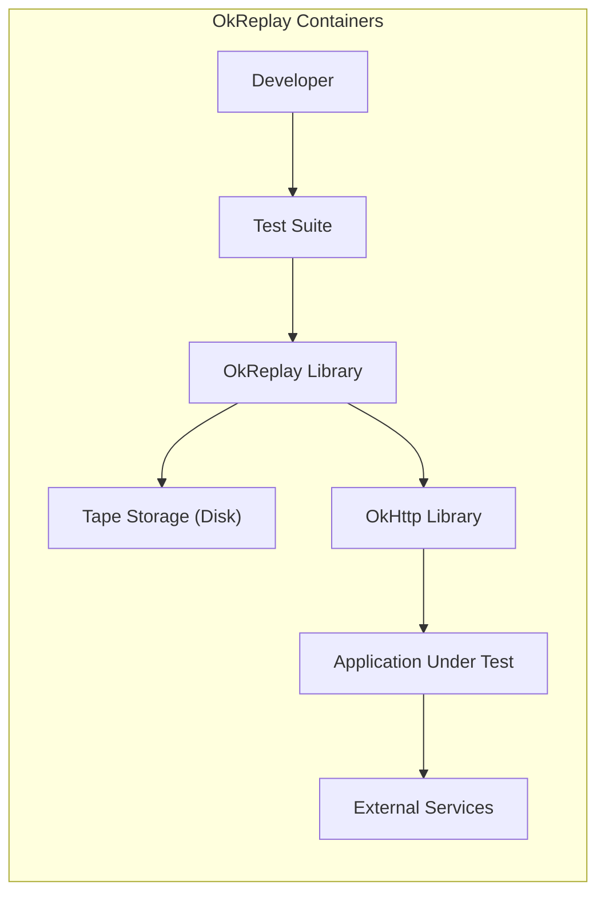
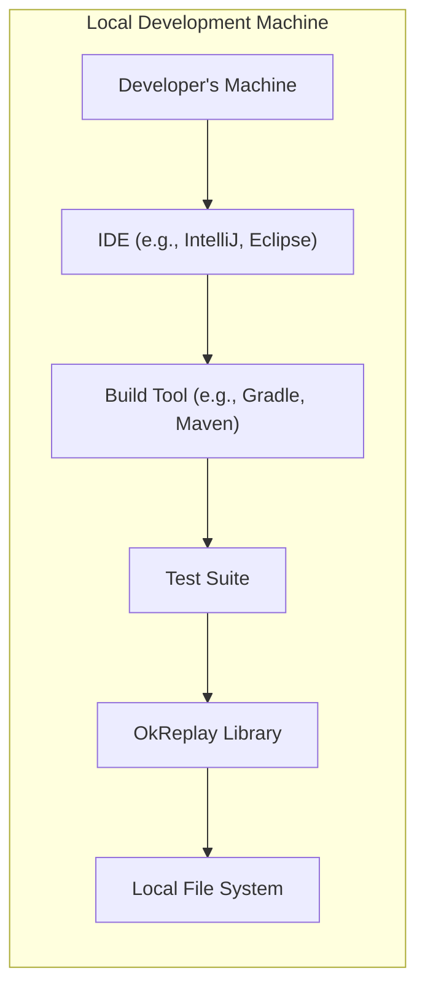

Okay, let's create a design document for OkReplay, based on the provided GitHub repository.

# BUSINESS POSTURE

OkReplay is a tool developed by Airbnb, a large, established company in the online hospitality industry. This suggests a lower risk tolerance compared to a startup. The project aims to improve the reliability and efficiency of testing by allowing developers to record and replay HTTP interactions.

Priorities:

*   Minimize disruption to existing workflows.
*   Ensure the accuracy and reliability of recorded interactions.
*   Maintain the security and privacy of potentially sensitive data within HTTP requests and responses.
*   Provide a tool that is easy to integrate and use within the existing Airbnb development environment.

Goals:

*   Reduce the flakiness of tests that rely on external services.
*   Speed up test execution by eliminating the need for live network calls during replays.
*   Enable offline testing and debugging of service interactions.
*   Improve the overall quality and reliability of Airbnb's software.

Business Risks:

*   Data leakage: If not handled carefully, recorded HTTP interactions could expose sensitive data like API keys, user credentials, or personally identifiable information (PII).
*   Test inaccuracy: If the recording or replaying mechanism is flawed, it could lead to inaccurate test results, masking real issues or creating false positives.
*   Performance overhead: The recording process could introduce latency or performance issues in the application being tested.
*   Integration challenges: The tool might not integrate seamlessly with all existing testing frameworks or infrastructure at Airbnb.
*   Tampering: Recorded interactions could be tampered, leading to incorrect test results.

# SECURITY POSTURE

Existing Security Controls (based on the GitHub repository and common practices):

*   security control: Test suite: The project includes a comprehensive test suite to ensure the functionality and reliability of the recording and replaying mechanisms. (Located in the project's test directory).
*   security control: Code reviews: As an open-source project within Airbnb, it's likely that code changes undergo thorough code reviews to identify potential security vulnerabilities. (Implicit in the development process).
*   security control: Limited scope: OkReplay focuses specifically on HTTP interactions, reducing the attack surface compared to a broader testing tool. (By design).
*   security control: Library dependencies: Project has defined dependencies, that can be audited and scanned for vulnerabilities. (Located in build.gradle file).

Accepted Risks:

*   accepted risk: Limited built-in data sanitization: The project does not appear to include robust, built-in mechanisms for automatically sanitizing sensitive data within recorded interactions. This places the responsibility on the user to configure filtering or masking appropriately.
*   accepted risk: Potential for misuse: The tool could be misused to record sensitive interactions without proper authorization or to replay interactions in unintended ways.
*   accepted risk: Reliance on underlying libraries: The security of OkReplay depends on the security of the underlying libraries it uses (e.g., OkHttp, Okio). Vulnerabilities in these libraries could impact OkReplay.

Recommended Security Controls:

*   security control: Implement data sanitization features: Provide built-in options for automatically redacting or masking sensitive data like API keys, passwords, and PII from recorded interactions.
*   security control: Integrate with secrets management: Allow users to easily integrate OkReplay with secrets management systems to avoid hardcoding sensitive information in test configurations.
*   security control: Provide clear documentation on security best practices: Guide users on how to use OkReplay securely, including recommendations for data handling, storage, and access control.
*   security control: Conduct regular security audits: Perform periodic security assessments to identify and address potential vulnerabilities in the codebase.
*   security control: Implement checksum verification: Verify the integrity of recorded interactions using checksums to detect tampering.

Security Requirements:

*   Authentication: Not directly applicable to OkReplay itself, as it operates within the context of the application being tested. However, recorded interactions might contain authentication data, which needs to be handled securely.
*   Authorization: Not directly applicable to OkReplay itself. However, access to recorded interactions should be controlled based on appropriate authorization policies.
*   Input Validation: OkReplay should validate its own configuration inputs to prevent errors or unexpected behavior. It should also handle potentially malicious input within recorded HTTP interactions gracefully, without crashing or introducing vulnerabilities.
*   Cryptography: If sensitive data is stored within recorded interactions, it should be encrypted at rest and in transit. OkReplay should leverage secure cryptographic libraries and protocols. Consider using TLS for communication with external services during recording.
*   Data Loss Prevention: OkReplay should provide options to prevent accidental data loss, e.g. by warning users before overwriting existing recordings.

# DESIGN

## C4 CONTEXT

Element Descriptions:

*   Element:
    *   Name: Developer
    *   Type: Person
    *   Description: The software developer using OkReplay to record and replay HTTP interactions.
    *   Responsibilities: Configures OkReplay, runs tests, and analyzes results.
    *   Security controls: N/A (External to the system)

*   Element:
    *   Name: OkReplay
    *   Type: Software System
    *   Description: The OkReplay library, integrated into the application's test suite.
    *   Responsibilities: Records and replays HTTP interactions between the application and external services.
    *   Security controls: Input validation, (future) data sanitization, (future) checksum verification.

*   Element:
    *   Name: Application Under Test
    *   Type: Software System
    *   Description: The application being tested, which makes HTTP requests to external services.
    *   Responsibilities: Performs its normal business logic, unaware of OkReplay's presence during replay.
    *   Security controls: Relies on its own security mechanisms, independent of OkReplay.

*   Element:
    *   Name: External Services
    *   Type: Software System
    *   Description: Third-party APIs or services that the application interacts with.
    *   Responsibilities: Responds to HTTP requests from the application. During replay, these services are not actually contacted.
    *   Security controls: Relies on its own security mechanisms, independent of OkReplay.

## C4 CONTAINER

Element Descriptions:

*   Element:
    *   Name: Developer
    *   Type: Person
    *   Description: The software developer.
    *   Responsibilities: Writes and runs tests.
    *   Security controls: N/A

*   Element:
    *   Name: Test Suite
    *   Type: Container (e.g., JUnit, TestNG)
    *   Description: The framework used to run tests.
    *   Responsibilities: Executes tests, integrates with OkReplay.
    *   Security controls: N/A

*   Element:
    *   Name: OkReplay Library
    *   Type: Container (Java Library)
    *   Description: The core OkReplay code.
    *   Responsibilities: Manages recording and replaying, interacts with OkHttp and tape storage.
    *   Security controls: Input validation, configuration parsing.

*   Element:
    *   Name: Tape Storage
    *   Type: Container (File System)
    *   Description: Storage for recorded HTTP interactions (tapes).
    *   Responsibilities: Persists and retrieves tapes.
    *   Security controls: File system permissions, (future) encryption at rest.

*   Element:
    *   Name: OkHttp Library
    *   Type: Container (Java Library)
    *   Description: The HTTP client library used by OkReplay.
    *   Responsibilities: Handles HTTP communication.
    *   Security controls: TLS configuration (if used).

*   Element:
    *   Name: Application Under Test
    *   Type: Software System
    *   Description: The application being tested.
    *   Responsibilities: Executes business logic.
    *   Security controls: Application-specific security.

*   Element:
    *   Name: External Services
    *   Type: Software System
    *   Description: External APIs and services.
    *   Responsibilities: Respond to requests (during recording).
    *   Security controls: External service security.

## DEPLOYMENT

Possible Deployment Solutions:

1.  Local Development Machine: Developers install OkReplay as a library dependency within their project. Recordings are stored locally.
2.  CI/CD Environment: OkReplay is integrated into the CI/CD pipeline. Recordings might be stored locally on the build agent or in a shared artifact repository.
3.  Dedicated Test Environment: A separate environment mimicking production, where OkReplay is used for integration or end-to-end testing. Recordings could be stored on a shared file system or a dedicated storage service.

Chosen Solution (for detailed description): Local Development Machine

Element Descriptions:

*   Element:
    *   Name: Developer's Machine
    *   Type: Infrastructure Node (Physical or Virtual Machine)
    *   Description: The developer's workstation.
    *   Responsibilities: Hosts the development environment.
    *   Security controls: OS-level security, disk encryption.

*   Element:
    *   Name: IDE
    *   Type: Software
    *   Description: Integrated Development Environment.
    *   Responsibilities: Code editing, building, debugging.
    *   Security controls: IDE security settings.

*   Element:
    *   Name: Build Tool
    *   Type: Software
    *   Description: Manages dependencies and builds the project.
    *   Responsibilities: Downloads OkReplay library, compiles code.
    *   Security controls: Dependency verification (if configured).

*   Element:
    *   Name: Test Suite
    *   Type: Software
    *   Description: Runs tests.
    *   Responsibilities: Executes tests using OkReplay.
    *   Security controls: N/A

*   Element:
    *   Name: OkReplay Library
    *   Type: Software
    *   Description: OkReplay code.
    *   Responsibilities: Records and replays interactions.
    *   Security controls: Input validation.

*   Element:
    *   Name: Local File System
    *   Type: Infrastructure Node (File System)
    *   Description: Storage for recorded tapes.
    *   Responsibilities: Stores and retrieves tape files.
    *   Security controls: File system permissions.

## BUILD

```mermaid
graph LR
    Developer["Developer"] --> Git["Git Repository (GitHub)"]
    Git --> BuildServer["Build Server (e.g., GitHub Actions, Jenkins)"]
    BuildServer --> BuildTool["Build Tool (Gradle)"]
    BuildTool --> Compile["Compile Source Code"]
    Compile --> RunTests["Run Tests (with OkReplay)"]
    RunTests --> StaticAnalysis["Static Analysis (e.g., SpotBugs, PMD)"]
    StaticAnalysis --> DependencyCheck["Dependency Check (e.g., OWASP Dependency-Check)"]
    DependencyCheck --> Package["Package Artifact (JAR)"]
    Package --> ArtifactRepository["Artifact Repository (e.g., Maven Central, JCenter)"]
```

Build Process Description:

1.  Developer commits code to the Git repository (GitHub).
2.  A build server (e.g., GitHub Actions, Jenkins) is triggered by the commit.
3.  The build server checks out the code and uses a build tool (Gradle, as specified in `build.gradle`) to manage the build process.
4.  Gradle compiles the source code.
5.  Gradle runs the test suite, which includes tests that use OkReplay for recording and replaying.
6.  Static analysis tools (e.g., SpotBugs, PMD) are run to identify potential code quality and security issues.
7.  Dependency checking tools (e.g., OWASP Dependency-Check) are used to scan project dependencies for known vulnerabilities.
8.  If all checks pass, Gradle packages the artifact (JAR file).
9.  The packaged artifact is published to an artifact repository (e.g., Maven Central, JCenter).

Security Controls in Build Process:

*   security control: Static Analysis: Tools like SpotBugs and PMD help identify potential security vulnerabilities in the code.
*   security control: Dependency Check: Tools like OWASP Dependency-Check scan for known vulnerabilities in project dependencies.
*   security control: Build Automation: Using a build server ensures a consistent and repeatable build process, reducing the risk of manual errors.
*   security control: Test Suite: Running tests during the build process helps ensure the functionality and reliability of OkReplay.
*   security control: Signed commits: Enforce developers to sign their commits.
*   security control: Code Review: Enforce branch protection rules to require code review before merging.

# RISK ASSESSMENT

Critical Business Processes:

*   Testing of applications that interact with external services.
*   Ensuring the reliability and accuracy of test results.
*   Protecting sensitive data during testing.

Data Sensitivity:

*   HTTP request and response data: This data can range from non-sensitive (public API calls) to highly sensitive (containing API keys, user credentials, PII). The sensitivity depends entirely on the application being tested and the specific interactions being recorded.
*   Tape files: These files contain the recorded HTTP interactions and therefore have the same sensitivity level as the data they contain.

# QUESTIONS & ASSUMPTIONS

Questions:

*   What specific mechanisms are in place at Airbnb for managing secrets (API keys, etc.) in test environments?
*   What are the existing policies and procedures for handling sensitive data in test recordings?
*   What are the preferred methods for integrating OkReplay with existing testing frameworks and CI/CD pipelines at Airbnb?
*   Are there any specific compliance requirements (e.g., GDPR, CCPA) that need to be considered when handling recorded data?
*   What level of logging and auditing is required for OkReplay's operations?

Assumptions:

*   BUSINESS POSTURE: Airbnb has a mature security program and a relatively low risk tolerance.
*   SECURITY POSTURE: Developers are aware of basic security best practices and will take steps to avoid recording sensitive data unnecessarily. Existing security controls like code reviews and test suites are in place.
*   DESIGN: The primary deployment model is local development machines, with potential for integration into CI/CD environments. The build process uses Gradle and includes static analysis and dependency checking.