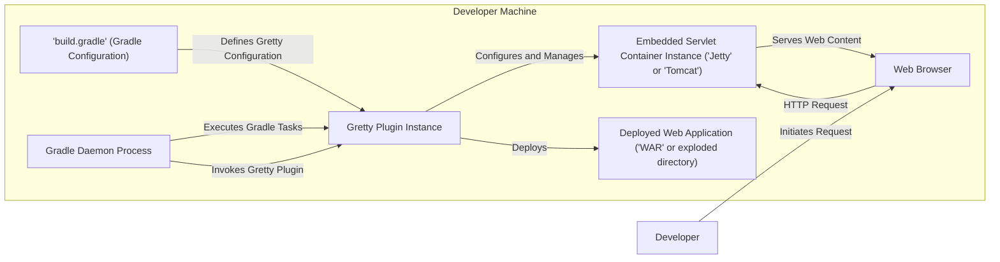
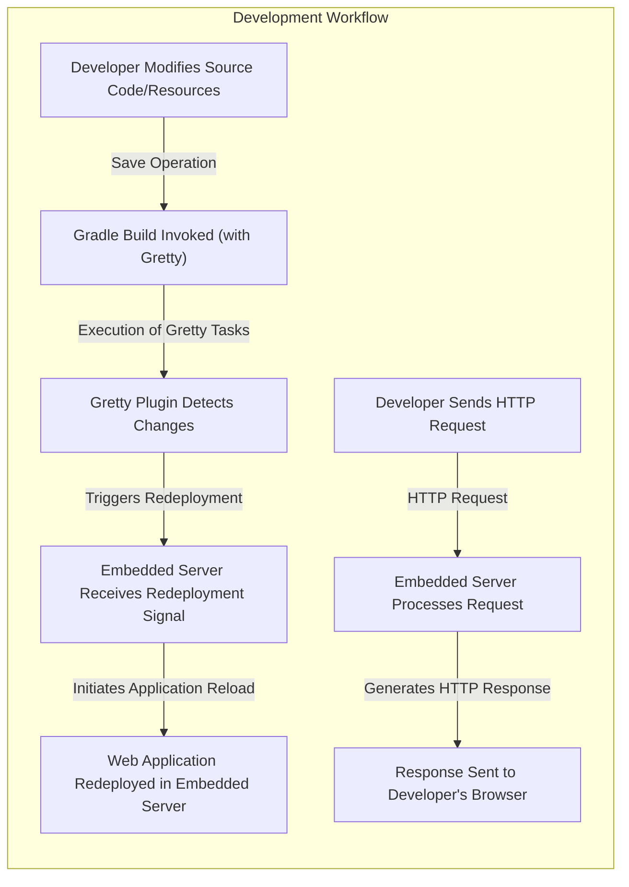

# Project Design Document: Gretty - Gradle Plugin for In-Place Web App Execution

**Version:** 1.1
**Date:** October 26, 2023
**Author:** AI Software Architect

## 1. Project Overview

Gretty is a Gradle plugin that streamlines the development workflow for Java web applications. It achieves this by embedding servlet containers (such as Jetty or Tomcat) directly within the Gradle build process. This eliminates the overhead of deploying to external application servers during development and testing, enabling faster iteration cycles and simplified debugging. This document details the architectural design of Gretty, providing a foundation for subsequent threat modeling activities.

## 2. Goals and Objectives

*   **Rapid Development Iteration:** Enable developers to run and test web applications within seconds of code changes.
*   **Simplified Configuration:** Provide an intuitive Gradle DSL to configure embedded servlet containers with minimal effort.
*   **Servlet Container Flexibility:** Support popular servlet containers like Jetty and Tomcat, allowing developers to choose their preferred option.
*   **Hot Reloading Support:** Facilitate automatic reloading of application code and static resources upon modification, enhancing the development experience.
*   **Seamless Gradle Integration:** Integrate smoothly with standard Gradle project structures and build lifecycles, leveraging existing Gradle conventions.

## 3. Non-Goals

*   **Production Deployment Solution:** Gretty is explicitly designed for development and testing environments and is not intended as a replacement for production deployment strategies.
*   **Comprehensive Server Management:** Gretty focuses on basic server lifecycle management (start, stop, restart) and does not aim to provide advanced server administration features.
*   **Full Servlet Specification Coverage:** While supporting common use cases, Gretty might not expose every configurable option of the underlying servlet containers. The focus is on typical development scenarios.
*   **General-Purpose Application Server:** Gretty's scope is limited to running web applications within the context of a Gradle build; it is not designed to be a standalone application server.

## 4. Target Audience

*   Java web application developers who utilize Gradle as their primary build tool.
*   Quality assurance engineers involved in testing web applications during the software development process, particularly in development and staging environments.

## 5. System Architecture

**Description:**

*   The `Developer` interacts with the system by modifying the `'build.gradle'` file and initiating Gradle tasks.
*   The `'build.gradle' (Gradle Configuration)` file contains the instructions for Gradle, including the configuration for the `Gretty Plugin Instance`.
*   The `Gradle Daemon Process` is responsible for executing the Gradle build, including invoking the Gretty plugin.
*   The `Gretty Plugin Instance` is activated during the Gradle build lifecycle. Its responsibilities include:
    *   Reading and interpreting the Gretty configuration from the `'build.gradle'` file.
    *   Downloading (if necessary) and managing the lifecycle of the `Embedded Servlet Container Instance`.
    *   Deploying the `Deployed Web Application` into the embedded container.
    *   Providing Gradle tasks (e.g., `grettyRun`, `grettyStop`) to control the embedded server.
*   The `Embedded Servlet Container Instance` (either `'Jetty'` or `'Tomcat'`, as configured) hosts the web application. It listens for incoming HTTP requests.
*   The `Deployed Web Application` represents the packaged or exploded web application files (e.g., WAR file contents).
*   The `Web Browser` is used by the developer to access the running web application via HTTP requests.

## 6. Key Components

*   **Gretty Gradle Plugin:**
    *   **Configuration Handling:** Parses the Gretty DSL defined in the `build.gradle` file, allowing developers to specify server port, context path, servlet container type, and other settings.
    *   **Servlet Container Management:**  Downloads and manages the lifecycle (start, stop, restart) of the embedded servlet container (Jetty or Tomcat). This involves interacting with the servlet container's API.
    *   **Web Application Deployment:**  Deploys the web application (either as a WAR file or an exploded directory) into the embedded servlet container. This typically involves copying files to the appropriate locations within the container's structure and triggering the deployment process.
    *   **Task Provisioning:** Provides custom Gradle tasks (e.g., `grettyRun`, `grettyStop`, `grettyRestart`) that developers can execute from the command line or their IDE to interact with the embedded server.
    *   **Hot Reloading Implementation:** Monitors changes in the web application's source code and static resources and triggers a redeployment or restart of the relevant components in the embedded server.
*   **Embedded Servlet Container (Jetty or Tomcat):**
    *   **HTTP Request Handling:** Listens on a specified port for incoming HTTP requests from the web browser.
    *   **Servlet Processing:**  Dispatches requests to the appropriate servlets within the deployed web application.
    *   **Resource Serving:** Serves static content (HTML, CSS, JavaScript, images) from the web application's directory structure.
    *   **Session Management:** Manages user sessions according to the servlet specification.
    *   **Security Context:** Provides a security context for the web application, handling authentication and authorization (depending on the application's configuration).
*   **Web Application (WAR or Exploded Directory):**
    *   **Servlets and Filters:** Contains the Java code that handles dynamic requests.
    *   **JSP Pages:**  Contains JavaServer Pages that generate dynamic HTML content.
    *   **Static Resources:** Includes HTML files, CSS stylesheets, JavaScript files, images, and other static assets.
    *   **`web.xml` (Deployment Descriptor):**  Configures the web application, including servlet mappings, filters, listeners, and security constraints.
    *   **Libraries (JAR files):** Contains dependencies required by the web application.
*   **Gradle API:**
    *   **Task Creation and Management:** Gretty utilizes the Gradle API to create custom tasks and integrate them into the Gradle build lifecycle.
    *   **Dependency Management:** Gradle's dependency management features are used by Gretty to manage the dependencies of the embedded servlet containers.
    *   **Project Configuration Access:** Gretty uses the Gradle API to access and interpret the project's configuration, including the Gretty-specific settings in `build.gradle`.

## 7. Data Flow

**Description:**

1. The `Developer Modifies Source Code/Resources` of the web application.
2. A `Gradle Build Invoked (with Gretty)` is triggered, either manually or automatically (e.g., through IDE integration).
3. The `Gretty Plugin Detects Changes` in the web application's files (depending on the hot reloading configuration).
4. The `Embedded Server Receives Redeployment Signal` from the Gretty plugin.
5. The `Web Application Redeployed in Embedded Server`, updating the running application with the latest changes.
6. The `Developer Sends HTTP Request` to the running application through their web browser.
7. The `Embedded Server Processes Request`, routing it to the appropriate servlet or serving the requested static resource.
8. A `Response Sent to Developer's Browser`, displaying the result of the request.

## 8. Security Considerations (Initial)

This section outlines initial security considerations relevant to Gretty, which will be further analyzed during a dedicated threat modeling exercise.

*   **Dependency Vulnerabilities:** Gretty relies on external libraries, including the embedded servlet containers (Jetty or Tomcat) and potentially other Gradle plugins. Vulnerabilities in these dependencies could be exploited.
    *   **Risk:** Compromise of the development environment or the application itself if vulnerable dependencies are present.
    *   **Mitigation:** Regularly update dependencies, utilize dependency scanning tools, and monitor security advisories.
*   **Plugin Security:** The Gretty plugin itself executes within the Gradle build process, which has broad access to the file system and network. A compromised Gretty plugin could perform malicious actions.
    *   **Risk:** Arbitrary code execution on the developer's machine, exfiltration of sensitive data.
    *   **Mitigation:** Obtain the plugin from trusted sources, verify checksums, and potentially conduct security audits of the plugin code.
*   **Embedded Server Configuration:** The default configuration of the embedded servlet container might not be secure for all scenarios. For instance, default ports or exposed administrative interfaces could be vulnerabilities.
    *   **Risk:** Unauthorized access to the embedded server or the deployed application.
    *   **Mitigation:** Configure the embedded server with appropriate security settings, such as strong authentication and restricted access to administrative endpoints. Gretty should provide options for secure configuration.
*   **Exposure of Development Endpoints:** While intended for development, if the Gretty-managed server is accessible on a wider network, development endpoints or debugging information could be exposed.
    *   **Risk:** Information disclosure, potential exploitation of development-specific features.
    *   **Mitigation:** Ensure the embedded server is only accessible on the developer's local machine or a restricted development network.
*   **Code Injection Risks (Configuration):** If Gretty allows for dynamic configuration or code execution based on user-provided input within the `build.gradle` file, it could introduce code injection vulnerabilities.
    *   **Risk:** Arbitrary code execution during the Gradle build process.
    *   **Mitigation:** Carefully sanitize and validate any user-provided input used in Gretty's configuration. Avoid features that allow for arbitrary code execution.
*   **Information Disclosure (Error Messages):** Detailed error messages or stack traces exposed by the embedded server during development could inadvertently reveal sensitive information about the application's internal workings.
    *   **Risk:** Providing attackers with information that can be used to further exploit vulnerabilities.
    *   **Mitigation:** Configure the embedded server to provide less verbose error messages in non-development environments.
*   **Hot Reloading Security:** The mechanism used for hot reloading might introduce security risks if not implemented carefully. For example, if file system watching is not properly secured, malicious files could be injected.
    *   **Risk:** Introduction of malicious code into the running application.
    *   **Mitigation:** Implement secure file system watching mechanisms and validate reloaded code.

## 9. Deployment Model

Gretty is not deployed as a standalone application. Instead, it functions as a Gradle plugin that is integrated into a web application project's build process. Developers declare the Gretty plugin dependency in their `build.gradle` file. When Gradle tasks provided by Gretty are executed (e.g., `grettyRun`), the plugin initializes and manages the embedded servlet container within the Gradle process. The web application is then deployed into this embedded container for development and testing.

## 10. Technology Stack

*   **Programming Language:** Java
*   **Build Tool:** Gradle (Minimum version recommended:  Specify recommended version for optimal compatibility)
*   **Embedded Servlet Containers (Supported):**
    *   Jetty (Specify supported versions)
    *   Tomcat (Specify supported versions)
*   **Gradle API** (Specify relevant API versions if applicable)

## 11. Future Considerations

*   Support for additional servlet containers or application servers.
*   Enhanced hot reloading capabilities, potentially with support for more advanced techniques like class reloading without full restarts.
*   Improved configuration options for the embedded server, allowing for finer-grained control over its behavior.
*   Integration with other development tools and frameworks, such as testing frameworks or code analysis tools.
*   More comprehensive documentation, including advanced configuration scenarios and troubleshooting guides.
*   Explore options for secure defaults and best practices guidance within the plugin.
