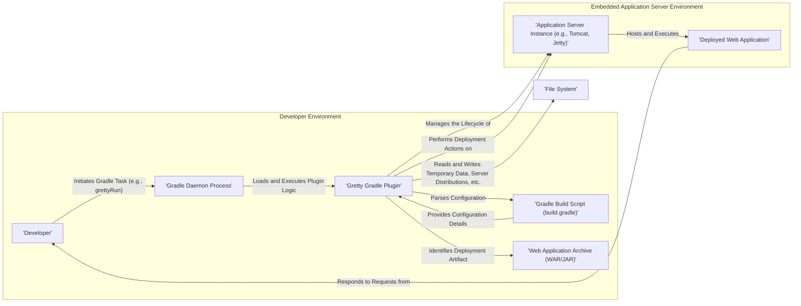

# Project Design Document: Gretty Gradle Plugin

**Version:** 1.1
**Date:** October 26, 2023
**Author:** Gemini (AI Language Model)

## 1. Introduction

This document provides an enhanced and detailed design overview of the Gretty Gradle plugin, a tool that empowers developers to run web applications directly within their Gradle build process. This revised document aims for greater clarity and depth in outlining Gretty's architecture, components, and data flow, specifically tailored for effective threat modeling.

## 2. Goals

*   Present a refined and more detailed architectural overview of the Gretty Gradle plugin.
*   Provide more specific descriptions of key components and their interactions.
*   Elaborate on the data flow within the Gretty plugin's execution, highlighting security-relevant aspects.
*   Serve as a robust and actionable foundation for identifying potential security vulnerabilities through comprehensive threat modeling.

## 3. Target Audience

This document is intended for:

*   Security engineers and architects tasked with performing threat modeling on the Gretty plugin.
*   Developers actively contributing to or maintaining the Gretty plugin codebase.
*   Users of the Gretty plugin seeking a deeper technical understanding of its internal workings and potential security implications.

## 4. System Overview

Gretty functions as a Gradle plugin that seamlessly integrates the management of application servers (such as Tomcat, Jetty, and others) directly into the Gradle build lifecycle. This integration streamlines the development process by enabling developers to rapidly deploy and test web applications without the overhead of separate application server installations or manual deployment procedures. The plugin introduces new tasks within the Gradle environment to control the lifecycle of embedded servers, including starting, stopping, and redeploying web applications.

## 5. Architectural Design

### 5.1. Components

*   **Developer:** The individual who interacts with the Gradle build system to manage and execute tasks related to the web application.
*   **Gradle Build Script (build.gradle):** This file contains the declarative configuration for the Gretty plugin, specifying crucial parameters such as the target application server, port numbers, context paths, deployment settings, and other relevant configurations.
*   **Gradle Daemon Process:** A persistent background process that executes Gradle builds, including the Gretty plugin. This daemon improves build performance by caching information and reusing resources across builds.
*   **Gretty Gradle Plugin:** The core logic of Gretty, responsible for orchestrating the embedded application server. Its key responsibilities include:
    *   Parsing and interpreting configuration directives from the `build.gradle` file.
    *   Downloading and setting up the specified application server distribution if it's not already available.
    *   Managing the complete lifecycle of the embedded application server instance (start, stop, restart).
    *   Deploying the web application archive (WAR or JAR file) to the managed application server.
    *   Providing Gradle tasks for interacting with the embedded server.
*   **Web Application Archive (WAR/JAR):** The packaged and distributable unit of the web application, containing all necessary code, libraries, and resources for deployment.
*   **Embedded Application Server Instance:** A concrete, running instance of the chosen application server (e.g., a Tomcat server process or a Jetty server instance) that is managed by the Gretty plugin.
*   **Deployed Web Application:** The active and running instance of the web application within the embedded application server, ready to handle incoming requests.
*   **File System:** The local file system used by Gretty for various purposes, including:
    *   Storing downloaded application server distributions.
    *   Creating temporary directories and files during the setup and deployment process.
    *   Potentially storing generated configuration files for the application server.

### 5.2. Interactions

1. **Task Invocation:** The developer initiates a Gretty-provided Gradle task (e.g., `grettyRun`, `grettyStop`, `grettyRedeploy`) through the Gradle command-line interface or an IDE integration.
2. **Configuration Loading:** The Gradle Daemon loads the Gretty plugin and triggers its initialization. The plugin then reads and parses its configuration from the `build.gradle` file.
3. **Server Setup/Management:** Based on the configuration, the Gretty plugin checks for the presence of the specified application server distribution. If not found, it downloads it (potentially from a remote repository). It then proceeds to set up the server environment.
4. **Deployment Execution:** Gretty locates the specified web application archive (WAR/JAR) within the project's build output directory. It then interacts with the embedded application server's deployment mechanisms (e.g., using its API or command-line tools) to deploy the application.
5. **Application Access:** Once deployed and running, the developer (or other authorized users) can access the web application by sending HTTP requests to the port and context path configured for the embedded server.
6. **Lifecycle Control:** Gretty provides tasks to manage the lifecycle of the embedded server. Executing `grettyStop` will trigger the plugin to gracefully shut down the application server instance. `grettyRedeploy` will typically undeploy the existing application and deploy a new version.
7. **File System Operations:** Throughout its execution, Gretty interacts with the file system to manage server distributions, create temporary files for deployment, and potentially write log files or configuration artifacts.

## 6. Data Flow

The data flow within the Gretty plugin's operation can be broken down as follows:

*   **Configuration Data Flow:**
    *   Developer defines configuration parameters (server type, port, context path, etc.) in `build.gradle`.
    *   Gradle Daemon loads this `build.gradle` file.
    *   Gretty plugin reads and parses this configuration data to determine its operational parameters.
*   **Web Application Archive Flow:**
    *   The Gradle build process compiles and packages the web application into a WAR or JAR file.
    *   The Gretty plugin identifies the location of this archive based on configuration or convention.
    *   The plugin transfers (or references) this archive to the embedded application server for deployment.
*   **Application Server Distribution Flow:**
    *   Gretty checks for the required application server distribution in a local cache or designated location.
    *   If not found, Gretty downloads the distribution from a configured repository (e.g., Maven Central).
    *   The downloaded distribution is stored in the file system for subsequent use.
*   **Deployment Command Flow:**
    *   Gretty constructs deployment commands or API calls based on the chosen application server.
    *   These commands are executed against the embedded application server instance to deploy the web application.
*   **HTTP Request/Response Flow:**
    *   Once deployed, HTTP requests from clients (including the developer's browser) are routed to the embedded application server.
    *   The application server processes these requests and forwards them to the deployed web application.
    *   The web application generates HTTP responses, which are sent back to the client via the application server.
*   **Logging Data Flow:**
    *   The embedded application server generates log messages related to its operation and the deployed application.
    *   These logs may be output to the Gradle console, written to specific log files within the project or server directories, or managed by the application server's logging configuration.
*   **Temporary File Flow:**
    *   Gretty might create temporary files during the deployment process (e.g., exploded WAR directories).
    *   These temporary files are typically cleaned up after deployment or server shutdown.

## 7. Security Considerations (Detailed for Threat Modeling)

This section provides a more detailed breakdown of potential security considerations, categorized for effective threat modeling.

*   **Configuration Vulnerabilities:**
    *   **Configuration Injection:** Malicious or unintended values in `build.gradle` could be interpreted by Gretty or the embedded server, leading to unexpected behavior or security flaws (e.g., specifying arbitrary file paths, insecure server configurations).
    *   **Exposure of Secrets:** Sensitive information (e.g., database credentials) might be inadvertently included in the `build.gradle` file or Gretty configurations.
*   **Embedded Application Server Security:**
    *   **Vulnerable Server Versions:** Gretty might be configured to use outdated or vulnerable versions of application servers, exposing the application to known exploits.
    *   **Default Configurations:** The embedded server might be running with insecure default configurations (e.g., default administrative passwords, exposed management interfaces).
    *   **Insecure Inter-Process Communication:** If Gretty interacts with the embedded server through insecure channels, it could be vulnerable to interception or manipulation.
*   **Dependency Management Risks:**
    *   **Vulnerable Dependencies:** Gretty itself relies on external libraries. Vulnerabilities in these dependencies could be exploited if not properly managed and updated.
    *   **Dependency Confusion:** Malicious actors could attempt to introduce compromised dependencies with similar names.
*   **File System Security:**
    *   **Insecure Permissions:** Incorrect file system permissions on downloaded server distributions or temporary files could allow unauthorized access or modification.
    *   **Path Traversal:** Vulnerabilities in Gretty's file handling could allow attackers to access or modify files outside of the intended directories.
*   **Network Security:**
    *   **Insecure Downloads:** Downloading application server distributions over unencrypted connections (HTTP) could expose them to man-in-the-middle attacks.
    *   **Exposed Ports:** The embedded server's ports might be unintentionally exposed to the network, allowing unauthorized access.
*   **Logging and Auditing:**
    *   **Information Disclosure:** Logs might contain sensitive information that could be exploited if accessed by unauthorized parties.
    *   **Insufficient Logging:** Lack of adequate logging can hinder incident response and security analysis.
*   **Access Control:**
    *   While primarily a development tool, understanding how access to the running application is controlled (e.g., through the application server's security realms) is important.
*   **Remote Code Execution:**
    *   Vulnerabilities in Gretty or the embedded server could potentially be exploited to achieve remote code execution on the developer's machine.

## 8. Future Considerations

*   **Enhanced Security Defaults:** Implement more secure default configurations for embedded application servers, prompting users to explicitly override them if necessary.
*   **Automated Dependency Scanning:** Integrate with dependency scanning tools to automatically identify and alert users about vulnerabilities in Gretty's dependencies and the chosen application server.
*   **Secure Download Verification:** Enforce the use of HTTPS for downloading server distributions and implement checksum verification to ensure integrity.
*   **Robust Configuration Validation:** Implement stricter validation of Gretty configuration parameters in `build.gradle` to prevent potentially harmful inputs.
*   **Principle of Least Privilege:** Ensure Gretty operates with the minimum necessary file system and network permissions.
*   **Sandboxing/Isolation:** Explore options for isolating the embedded application server environment to limit the impact of potential vulnerabilities.
*   **Regular Security Audits:** Conduct periodic security audits and penetration testing of the Gretty plugin.

## 9. Conclusion

This improved design document provides a more detailed and security-focused overview of the Gretty Gradle plugin. By elaborating on the architecture, component interactions, and data flow, and by providing a more structured breakdown of security considerations, this document serves as a valuable resource for conducting thorough threat modeling. This understanding is crucial for developers and security professionals to collaboratively ensure the secure development and usage of the Gretty plugin.