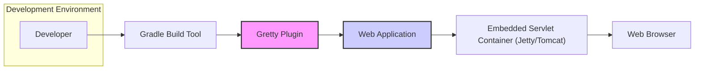
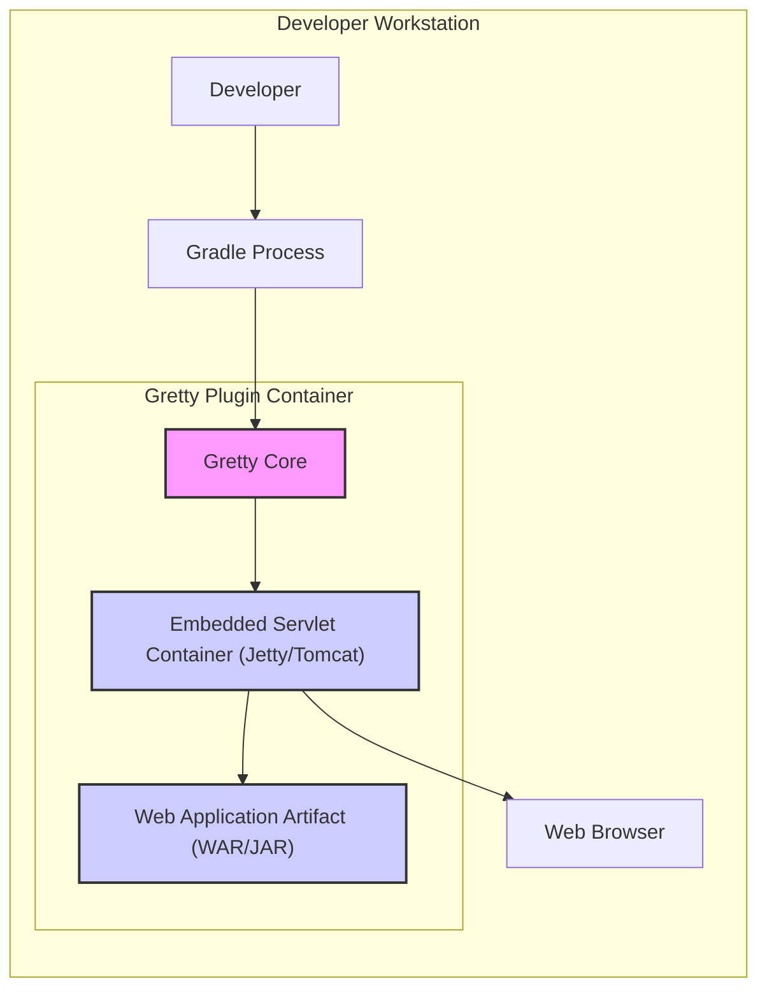
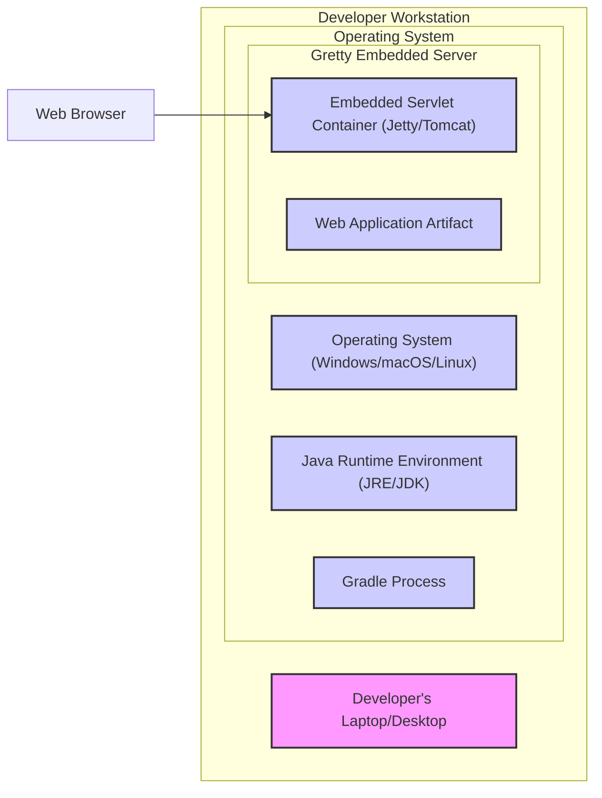

# BUSINESS POSTURE

Gretty is a Gradle plugin designed to simplify the development and testing of web applications. It embeds servlet containers directly into the Gradle build process, allowing developers to quickly run and test their web applications without needing to deploy to external servers.

- Business Priorities:
  - Accelerate web application development cycles by providing fast and easy local testing.
  - Enhance developer productivity by reducing the complexity of setting up and managing web application environments.
  - Improve the quality of web applications by enabling frequent and early testing.

- Business Goals:
  - Increase the efficiency of software development teams working on web applications.
  - Reduce the time and cost associated with web application development and testing.
  - Facilitate rapid prototyping and iteration of web application features.

- Business Risks:
  - Dependency vulnerabilities: Gretty relies on embedded servlet containers and other libraries. Vulnerabilities in these dependencies could indirectly affect developers using Gretty and potentially expose development environments if not managed properly.
  - Misconfiguration leading to insecure development practices: While Gretty is intended for development, misconfigurations or insecure coding practices during development could be carried over to production if not addressed.
  - Supply chain risks:  Compromised dependencies within the Gradle plugin itself could pose a risk to developer environments.

# SECURITY POSTURE

- Existing Security Controls:
  - security control: Gradle dependency management: Gretty is distributed as a Gradle plugin, relying on Gradle's dependency resolution and management mechanisms. (Implemented by: Gradle and build scripts)
  - security control: Open Source nature: The project is open source, allowing for community review and scrutiny of the code. (Implemented by: GitHub and community)
  - accepted risk: Reliance on embedded servlet container security: Gretty embeds servlet containers like Jetty and Tomcat. Security vulnerabilities in these containers could impact developers using Gretty. It is assumed that developers are responsible for keeping their embedded containers up to date.
  - accepted risk: Development environment security: Gretty is primarily used in development environments, which may have less stringent security controls compared to production environments. It is assumed that organizations have baseline security measures for developer workstations.

- Recommended Security Controls:
  - security control: Dependency scanning: Implement automated dependency scanning for Gretty's dependencies and the embedded servlet containers to identify and address known vulnerabilities. (To be implemented in: Build process and CI/CD pipelines)
  - security control: Software Composition Analysis (SCA): Regularly perform SCA on the Gretty plugin itself to identify potential vulnerabilities in its code and dependencies. (To be implemented in: Project development and release process)
  - security control: Secure development practices guidance: Provide guidelines to developers on secure coding practices when developing web applications using Gretty, emphasizing input validation, secure session management, and protection against common web vulnerabilities. (To be implemented in: Developer documentation and training)

- Security Requirements:
  - Authentication:
    - For Gretty itself, authentication is not directly applicable as it's a build plugin.
    - For web applications developed using Gretty, authentication requirements depend on the application's functionality. Gretty should not impose any restrictions on implementing authentication within the developed web application.
  - Authorization:
    - Similar to authentication, authorization is primarily the responsibility of the web application being developed.
    - Gretty should not interfere with the authorization mechanisms implemented in the web application.
  - Input Validation:
    - Input validation is crucial for web applications developed with Gretty. Developers should be aware of the need to validate all inputs to prevent injection attacks.
    - Gretty itself should not introduce vulnerabilities related to input handling.
  - Cryptography:
    - If web applications developed with Gretty require cryptography, developers are responsible for implementing it securely.
    - Gretty should not hinder the use of cryptography within the developed web applications. If Gretty provides any features that utilize cryptography (e.g., for secure communication with the embedded server), these features must be implemented securely.

# DESIGN

## C4 CONTEXT



- Elements of Context Diagram:
  - - Name: Developer
    - Type: Person
    - Description: Software developer using Gradle and Gretty to build and test web applications.
    - Responsibilities: Writes code for web applications, configures Gradle build scripts including Gretty plugin, tests web applications locally.
    - Security controls: Local workstation security, code repository access controls, secure coding practices.
  - - Name: Gradle Build Tool
    - Type: Software System
    - Description: Build automation tool used to manage dependencies, compile code, and run tasks, including the Gretty plugin.
    - Responsibilities: Executes build scripts, manages dependencies, invokes Gretty plugin, packages web application.
    - Security controls: Gradle plugin repository security (plugins.gradle.org), dependency verification, build script security review.
  - - Name: Gretty Plugin
    - Type: Software System
    - Description: Gradle plugin that embeds servlet containers (Jetty, Tomcat) to run web applications during development.
    - Responsibilities: Configures and starts embedded servlet containers, deploys web application to the container, provides tasks for running and stopping the server.
    - Security controls: Dependency scanning, software composition analysis, secure coding practices in plugin development.
  - - Name: Web Application
    - Type: Software System
    - Description: The web application being developed and tested using Gretty.
    - Responsibilities: Handles HTTP requests, processes business logic, interacts with data stores (if any), renders web pages.
    - Security controls: Authentication, authorization, input validation, output encoding, secure session management, vulnerability scanning.
  - - Name: Embedded Servlet Container (Jetty/Tomcat)
    - Type: Software System
    - Description: Servlet container embedded by Gretty to run the web application.
    - Responsibilities: Serves HTTP requests, manages servlet lifecycle, provides runtime environment for web application.
    - Security controls: Container configuration security, vulnerability patching, access logging.
  - - Name: Web Browser
    - Type: Person/Software System
    - Description: Web browser used by the developer to access and test the running web application.
    - Responsibilities: Sends HTTP requests to the web application, renders HTML responses.
    - Security controls: Browser security features, secure communication protocols (HTTPS if configured).

## C4 CONTAINER



- Elements of Container Diagram:
  - - Name: Gradle Process
    - Type: Process
    - Description: Instance of the Gradle build tool running on the developer's workstation.
    - Responsibilities: Executes the Gradle build script, manages plugins and dependencies, invokes Gretty plugin tasks.
    - Security controls: User access controls on developer workstation, Gradle wrapper for consistent environment.
  - - Name: Gretty Core
    - Type: Library/Plugin
    - Description: The core logic of the Gretty Gradle plugin, responsible for managing embedded servlet containers.
    - Responsibilities: Plugin configuration parsing, embedded container lifecycle management, web application deployment to the container.
    - Security controls: Secure coding practices, dependency scanning, software composition analysis, input validation of plugin configurations.
  - - Name: Embedded Servlet Container (Jetty/Tomcat)
    - Type: Application Runtime
    - Description:  An embedded instance of either Jetty or Tomcat, chosen by the developer or default configuration.
    - Responsibilities: Serves HTTP requests for the deployed web application, manages servlet lifecycle, provides a runtime environment.
    - Security controls: Container configuration security, vulnerability patching, access logging (if enabled), adherence to servlet specification security guidelines.
  - - Name: Web Application Artifact (WAR/JAR)
    - Type: File
    - Description:  The packaged web application (WAR or JAR file) built by Gradle and deployed to the embedded servlet container.
    - Responsibilities: Contains the compiled web application code, resources, and deployment descriptors.
    - Security controls: Secure build process, artifact integrity checks (e.g., checksums), vulnerability scanning of application dependencies.
  - - Name: Developer
    - Type: Person
    - Description: Software developer interacting with Gradle and the running web application.
    - Responsibilities: Initiates Gradle builds, configures Gretty plugin, tests web application through the browser.
    - Security controls: Workstation security, secure coding practices, awareness of potential vulnerabilities in development environment.
  - - Name: Web Browser
    - Type: Application
    - Description: Web browser used by the developer to interact with the running web application.
    - Responsibilities: Sends HTTP requests to the web application, renders responses, allows interaction with the application's user interface.
    - Security controls: Browser security features, secure communication protocols (HTTPS if configured for the embedded server).

## DEPLOYMENT

Gretty is primarily designed for local development and testing. The typical deployment scenario is on a developer's workstation. While it's possible to use Gretty in other environments, it's not its primary purpose.

- Deployment Architecture: Developer Workstation Deployment



- Elements of Deployment Diagram:
  - - Name: Developer's Laptop/Desktop
    - Type: Infrastructure - Physical Machine
    - Description: The physical computer used by the developer for software development.
    - Responsibilities: Hosts the operating system, Java runtime, Gradle, Gretty, and the embedded servlet container.
    - Security controls: Workstation security policies, operating system security hardening, endpoint protection software, physical security of the device.
  - - Name: Operating System (Windows/macOS/Linux)
    - Type: Infrastructure - Operating System
    - Description: The operating system running on the developer's machine.
    - Responsibilities: Provides the base environment for running Java and other software, manages system resources.
    - Security controls: OS security updates and patching, user account management, access control lists, firewall.
  - - Name: Java Runtime Environment (JRE/JDK)
    - Type: Infrastructure - Runtime Environment
    - Description: Java runtime environment required to run Gradle and Java-based web applications.
    - Responsibilities: Executes Java bytecode, provides Java libraries and APIs.
    - Security controls: JRE/JDK security updates and patching, secure JVM configuration.
  - - Name: Gradle Process
    - Type: Application Process
    - Description: Instance of the Gradle build tool running within the OS.
    - Responsibilities: Executes build scripts, manages plugins, runs Gretty plugin and embedded server.
    - Security controls: Process isolation provided by the OS, user permissions, Gradle wrapper for consistent environment.
  - - Name: Embedded Servlet Container (Jetty/Tomcat)
    - Type: Application Runtime
    - Description: Embedded instance of Jetty or Tomcat running within the Gradle process.
    - Responsibilities: Serves HTTP requests for the web application, manages servlet lifecycle.
    - Security controls: Container configuration security, vulnerability patching, limited network exposure (typically localhost only).
  - - Name: Web Application Artifact
    - Type: Data - File
    - Description: Deployed web application artifact (WAR/JAR) within the embedded servlet container.
    - Responsibilities: Contains the application code and resources served by the container.
    - Security controls: File system permissions, application-level security controls.
  - - Name: Web Browser
    - Type: Application
    - Description: Web browser used by the developer to access the running web application.
    - Responsibilities: Sends requests to the web application, renders responses.
    - Security controls: Browser security features, secure communication protocols (HTTPS if configured).

## BUILD

```mermaid
graph LR
    subgraph "Developer Workstation"
        Developer["Developer"]
        CodeRepository["Code Repository (e.g., Git)"]
    end
    subgraph "Build System (Local or CI)"
        BuildServer["Build Server (Local Gradle or CI Server)"]
        DependencyResolution["Dependency Resolution"]
        Compilation["Compilation & Packaging"]
        GrettyPluginExecution["Gretty Plugin Execution"]
        ArtifactRepository["Artifact Repository (Local .m2 or CI Artifact Storage)"]
    end

    Developer --> CodeRepository: Code Commit
    CodeRepository --> BuildServer: Code Checkout
    BuildServer --> DependencyResolution: Resolve Dependencies
    DependencyResolution --> Compilation: Compile & Package
    Compilation --> GrettyPluginExecution: Execute Gretty Plugin
    GrettyPluginExecution --> ArtifactRepository: Build Artifact (WAR/JAR)
    BuildServer --> ArtifactRepository: Publish Artifact

    style BuildServer fill:#f9f,stroke:#333,stroke-width:2px
    style DependencyResolution fill:#ccf,stroke:#333,stroke-width:2px
    style Compilation fill:#ccf,stroke:#333,stroke-width:2px
    style GrettyPluginExecution fill:#ccf,stroke:#333,stroke-width:2px
    style ArtifactRepository fill:#ccf,stroke:#333,stroke-width:2px
```

- Elements of Build Diagram:
  - - Name: Developer
    - Type: Person
    - Description: Software developer writing and committing code.
    - Responsibilities: Writes code, performs local builds, commits code to repository.
    - Security controls: Workstation security, code repository access controls, secure coding practices.
  - - Name: Code Repository (e.g., Git)
    - Type: Software System - Version Control
    - Description: Central repository for storing and managing source code (e.g., GitHub, GitLab, Bitbucket).
    - Responsibilities: Stores source code, manages versions, tracks changes, provides access control.
    - Security controls: Access control lists, authentication, authorization, audit logging, branch protection, vulnerability scanning of repository platform.
  - - Name: Build Server (Local Gradle or CI Server)
    - Type: Software System - Build Automation
    - Description: System responsible for automating the build process. Can be the developer's local machine running Gradle or a dedicated CI server.
    - Responsibilities: Checks out code, resolves dependencies, compiles code, runs tests, packages application, executes Gretty plugin tasks.
    - Security controls: Access control to build server, secure configuration of build server, build script security, secrets management, audit logging.
  - - Name: Dependency Resolution
    - Type: Process
    - Description: Process of resolving and downloading project dependencies (libraries, plugins) from repositories like Maven Central or Gradle Plugin Portal.
    - Responsibilities: Fetches dependencies based on build script configurations.
    - Security controls: Dependency verification (e.g., using checksums, signatures), dependency scanning for vulnerabilities, use of trusted dependency repositories.
  - - Name: Compilation & Packaging
    - Type: Process
    - Description: Process of compiling source code and packaging it into a deployable artifact (WAR/JAR).
    - Responsibilities: Compiles code, packages resources, creates web application archive.
    - Security controls: Secure compiler settings, static analysis security testing (SAST) during compilation, secure packaging process.
  - - Name: Gretty Plugin Execution
    - Type: Process
    - Description: Execution of the Gretty Gradle plugin during the build process.
    - Responsibilities: Configures and potentially starts embedded servlet container during build (for integration tests, etc.), integrates with the build lifecycle.
    - Security controls: Plugin security review, secure configuration of the plugin, limited privileges for plugin execution.
  - - Name: Artifact Repository (Local .m2 or CI Artifact Storage)
    - Type: Software System - Artifact Storage
    - Description: Repository for storing build artifacts. Can be the local Maven repository (.m2) or a dedicated artifact repository in a CI/CD pipeline.
    - Responsibilities: Stores build artifacts (WAR/JAR files), provides access to artifacts for deployment or further stages in the pipeline.
    - Security controls: Access control lists, authentication, authorization, artifact integrity checks, vulnerability scanning of artifact repository platform.

# RISK ASSESSMENT

- Critical Business Processes:
  - Software Development Lifecycle: Gretty directly supports the development and testing phases of the SDLC for web applications. Ensuring the efficiency and security of this process is critical.
  - Developer Productivity: Gretty aims to enhance developer productivity. Any security issues that hinder developer workflows or introduce delays would negatively impact this.

- Data to Protect and Sensitivity:
  - Source Code: Highly sensitive. Source code contains intellectual property and business logic. Unauthorized access or modification could lead to competitive disadvantage, security vulnerabilities, or reputational damage.
  - Developer Workstations: Moderately sensitive. Developer workstations may contain credentials, configuration files, and other sensitive information. Compromise could lead to code theft, unauthorized access to systems, or supply chain attacks.
  - Build Artifacts (WAR/JAR): Moderately sensitive. Build artifacts contain compiled code and resources. Unauthorized access could lead to reverse engineering or deployment of compromised applications.
  - Dependency Information: Low to Moderately sensitive. Knowing the dependencies of a project can help attackers identify potential vulnerabilities.

# QUESTIONS & ASSUMPTIONS

- Questions:
  - What are the specific security requirements for the web applications being developed using Gretty? (e.g., compliance standards, data sensitivity levels).
  - Is Gretty intended to be used only in local development environments, or are there plans to use it in more integrated testing or CI/CD pipelines?
  - What are the organization's existing security policies and procedures for software development and dependency management?
  - Are there any specific security tools or technologies already in use within the development environment that Gretty should integrate with or be compatible with?

- Assumptions:
  - BUSINESS POSTURE:
    - The primary goal of using Gretty is to improve developer productivity and accelerate web application development.
    - Security is important but should not significantly hinder developer workflows in development environments.
    - The organization has a reasonable risk appetite for development environments, understanding that they are less critical than production environments.
  - SECURITY POSTURE:
    - Developers are responsible for implementing security controls within the web applications they develop using Gretty.
    - Gretty itself is expected to be reasonably secure and not introduce new vulnerabilities into the development process.
    - Security controls in development environments are less stringent than in production, but basic security hygiene is still expected.
  - DESIGN:
    - Gretty is primarily used in local development environments on developer workstations.
    - The embedded servlet containers are configured for development purposes and may not have the same security hardening as production servers.
    - The build process involves standard Gradle practices for dependency management, compilation, and packaging.