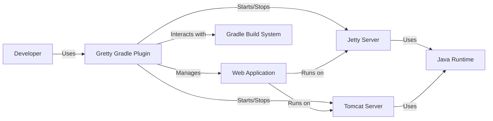
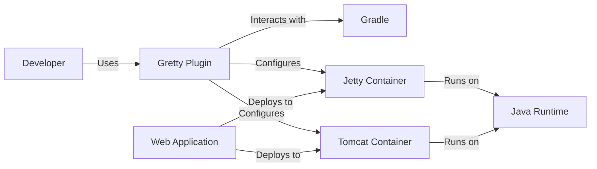
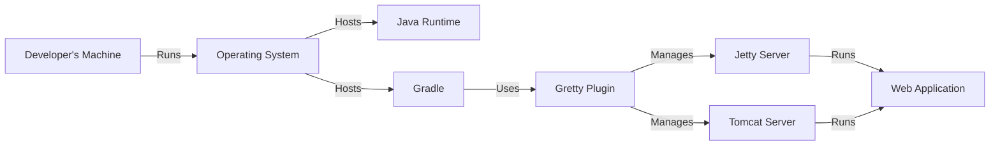
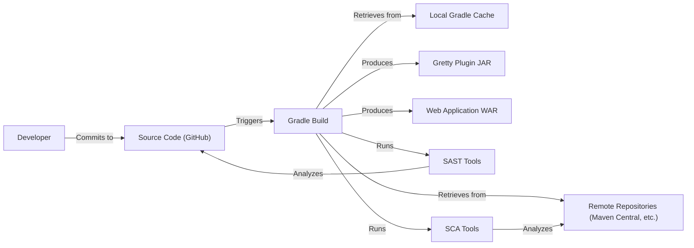

Okay, let's create a design document for the Gretty project.

# BUSINESS POSTURE

Gretty is a Gradle plugin for running web applications on embedded Jetty and Tomcat servers.  It simplifies development and testing of web applications by providing a convenient way to run them locally without the need for a separate application server installation.

Business Priorities:

*   Enable rapid development and testing of web applications.
*   Provide a consistent and reliable environment for running web applications.
*   Simplify the deployment process for developers.
*   Minimize the overhead associated with running web applications during development.
*   Support a wide range of web application configurations.
*   Support both Jetty and Tomcat.

Business Goals:

*   Increase developer productivity.
*   Reduce the time required to test and debug web applications.
*   Improve the overall quality of web applications.

Most Important Business Risks:

*   Security vulnerabilities in the plugin itself or its dependencies could expose user applications to attack.
*   Compatibility issues with different versions of Gradle, Jetty, Tomcat, or Java could hinder adoption.
*   Performance bottlenecks in the plugin could slow down development workflows.
*   Lack of features or configuration options could limit the plugin's usefulness for certain projects.
*   Inadequate documentation or support could make it difficult for developers to use the plugin effectively.

# SECURITY POSTURE

Existing Security Controls:

*   security control: Dependency management: Gretty relies on Gradle's dependency management to handle external libraries, including Jetty and Tomcat. (build.gradle.kts)
*   security control: Regular updates: The project maintainers appear to release updates, addressing potential bug fixes and security updates in dependencies. (commit history)
*   security control: Code style checks: Project uses spotless to enforce code style. (build.gradle.kts)

Accepted Risks:

*   accepted risk: Reliance on third-party libraries (Jetty, Tomcat, Gradle) introduces the risk of vulnerabilities in those dependencies.
*   accepted risk: The plugin's extensive configuration options could potentially be misused to create insecure deployments.
*   accepted risk: Limited built-in security features beyond what's provided by the underlying application servers (Jetty/Tomcat).

Recommended Security Controls:

*   security control: Implement SAST (Static Application Security Testing) scanning in the build process to identify potential vulnerabilities in the Gretty codebase itself.
*   security control: Implement SCA (Software Composition Analysis) to identify and track known vulnerabilities in dependencies.
*   security control: Provide security guidelines and best practices in the documentation, specifically addressing common misconfigurations that could lead to security issues.
*   security control: Consider implementing a security.txt file to facilitate vulnerability reporting.

Security Requirements:

*   Authentication: Gretty itself does not handle authentication. Authentication is the responsibility of the web application being run or the configured Jetty/Tomcat server.
*   Authorization: Gretty itself does not handle authorization. Authorization is the responsibility of the web application or the configured Jetty/Tomcat server.
*   Input Validation: Gretty itself does not perform input validation. Input validation is the responsibility of the web application being run. Gretty does handle configuration input, and basic validation should be performed to prevent injection vulnerabilities.
*   Cryptography: Gretty does not directly handle cryptography, but it should support the configuration of secure communication protocols (HTTPS) within the embedded Jetty/Tomcat servers. This configuration should be documented clearly.

# DESIGN

## C4 CONTEXT

Element Descriptions:

*   Element:
    *   Name: Developer
    *   Type: Person
    *   Description: A software developer who uses Gretty to run and test web applications.
    *   Responsibilities: Writes code, configures Gretty, runs the web application, and debugs issues.
    *   Security controls: Uses a secure development environment, follows secure coding practices.

*   Element:
    *   Name: Gretty Gradle Plugin
    *   Type: Software System
    *   Description: A Gradle plugin that simplifies running web applications on embedded Jetty and Tomcat servers.
    *   Responsibilities: Provides Gradle tasks for starting, stopping, and managing web applications, configures Jetty/Tomcat instances, handles classpaths and dependencies.
    *   Security controls: Relies on Gradle's dependency management, should be regularly updated.

*   Element:
    *   Name: Web Application
    *   Type: Software System
    *   Description: The web application being developed and tested using Gretty.
    *   Responsibilities: Handles HTTP requests, processes data, interacts with backend systems.
    *   Security controls: Implements authentication, authorization, input validation, output encoding, and other application-level security measures.

*   Element:
    *   Name: Gradle Build System
    *   Type: Software System
    *   Description: The build system used to manage the project, compile code, and run Gretty.
    *   Responsibilities: Manages dependencies, compiles code, executes Gradle tasks.
    *   Security controls: Uses secure repositories for dependencies, runs in a secure environment.

*   Element:
    *   Name: Jetty Server
    *   Type: Software System
    *   Description: An embedded Jetty server instance managed by Gretty.
    *   Responsibilities: Hosts and runs the web application, handles HTTP requests.
    *   Security controls: Relies on Jetty's built-in security features, should be configured securely (e.g., HTTPS).

*   Element:
    *   Name: Tomcat Server
    *   Type: Software System
    *   Description: An embedded Tomcat server instance managed by Gretty.
    *   Responsibilities: Hosts and runs the web application, handles HTTP requests.
    *   Security controls: Relies on Tomcat's built-in security features, should be configured securely (e.g., HTTPS).

*   Element:
    *   Name: Java Runtime
    *   Type: Software System
    *   Description: The Java runtime environment used by Jetty, Tomcat, and the web application.
    *   Responsibilities: Executes Java bytecode.
    *   Security controls: Should be kept up-to-date with the latest security patches.

## C4 CONTAINER

Element Descriptions:

*   Element:
    *   Name: Developer
    *   Type: Person
    *   Description: A software developer.
    *   Responsibilities: Uses Gretty to run and test web applications.
    *   Security controls: Secure development environment.

*   Element:
    *   Name: Gretty Plugin
    *   Type: Software Component
    *   Description: The core logic of the Gretty Gradle plugin.
    *   Responsibilities: Parses configuration, manages server lifecycles, provides Gradle tasks.
    *   Security controls: Input validation of configuration parameters.

*   Element:
    *   Name: Gradle
    *   Type: Software System
    *   Description: Build automation tool.
    *   Responsibilities: Dependency resolution, task execution.
    *   Security controls: Secure repository configuration.

*   Element:
    *   Name: Web Application
    *   Type: Software Component
    *   Description: The developer's web application code.
    *   Responsibilities: Handles business logic, interacts with data sources.
    *   Security controls: Application-level security measures (authentication, authorization, etc.).

*   Element:
    *   Name: Jetty Container
    *   Type: Container (Application Server)
    *   Description: An instance of the embedded Jetty server.
    *   Responsibilities: Executes the web application, handles HTTP requests.
    *   Security controls: Jetty's security features, secure configuration (HTTPS).

*   Element:
    *   Name: Tomcat Container
    *   Type: Container (Application Server)
    *   Description: An instance of the embedded Tomcat server.
    *   Responsibilities: Executes the web application, handles HTTP requests.
    *   Security controls: Tomcat's security features, secure configuration (HTTPS).

*   Element:
    *   Name: Java Runtime
    *   Type: Software System
    *   Description: Java Virtual Machine.
    *   Responsibilities: Executes Java bytecode.
    *   Security controls: Regular security updates.

## DEPLOYMENT

Possible Deployment Solutions:

1.  Developer's Local Machine: Gretty is primarily used for local development, so the most common deployment environment is the developer's own machine.
2.  CI/CD Environment: Gretty can be used in CI/CD pipelines to run integration tests against the web application.
3.  Dedicated Test Server: In some cases, Gretty might be used to deploy the web application to a dedicated test server for more extensive testing.

Chosen Solution (Developer's Local Machine):

Element Descriptions:

*   Element:
    *   Name: Developer's Machine
    *   Type: Infrastructure Node
    *   Description: The physical or virtual machine used by the developer.
    *   Responsibilities: Runs the operating system, development tools, and the Gretty-managed application server.
    *   Security controls: Secure operating system configuration, firewall, antivirus software.

*   Element:
    *   Name: Operating System
    *   Type: Software
    *   Description: The operating system running on the developer's machine (e.g., Windows, macOS, Linux).
    *   Responsibilities: Provides the foundation for running software.
    *   Security controls: Regular security updates, secure configuration.

*   Element:
    *   Name: Java Runtime
    *   Type: Software
    *   Description: The Java runtime environment.
    *   Responsibilities: Executes Java bytecode.
    *   Security controls: Regular security updates.

*   Element:
    *   Name: Gradle
    *   Type: Software
    *   Description: The Gradle build system.
    *   Responsibilities: Manages dependencies, builds the application, runs Gretty.
    *   Security controls: Secure repository configuration.

*   Element:
    *   Name: Gretty Plugin
    *   Type: Software
    *   Description: The Gretty Gradle plugin.
    *   Responsibilities: Manages the embedded Jetty/Tomcat servers.
    *   Security controls: Input validation of configuration parameters.

*   Element:
    *   Name: Jetty Server
    *   Type: Software
    *   Description: An embedded Jetty server instance.
    *   Responsibilities: Hosts and runs the web application.
    *   Security controls: Jetty's security features, secure configuration (HTTPS).

*   Element:
    *   Name: Tomcat Server
    *   Type: Software
    *   Description: An embedded Tomcat server instance.
    *   Responsibilities: Hosts and runs the web application.
    *   Security controls: Tomcat's security features, secure configuration (HTTPS).

*   Element:
    *   Name: Web Application
    *   Type: Software
    *   Description: The web application being developed.
    *   Responsibilities: Handles business logic, interacts with data sources.
    *   Security controls: Application-level security measures.

## BUILD

Build Process Description:

1.  Developer commits code changes to the source code repository (GitHub).
2.  The Gradle build process is triggered (either manually by the developer or by a CI/CD system).
3.  Gradle retrieves dependencies from the local cache or remote repositories (Maven Central, etc.).
4.  (Recommended) SAST tools analyze the Gretty source code for potential vulnerabilities.
5.  (Recommended) SCA tools analyze the project's dependencies for known vulnerabilities.
6.  Gradle compiles the Gretty plugin code and produces a JAR file.
7.  If a web application is being built, Gradle compiles the web application code and produces a WAR file.

Security Controls:

*   security control: Dependency Management: Gradle manages dependencies, ensuring that the correct versions of libraries are used.
*   security control: Local Cache: Gradle caches dependencies locally, reducing the need to download them repeatedly.
*   security control: Remote Repositories: Gradle retrieves dependencies from trusted remote repositories (e.g., Maven Central).
*   security control: (Recommended) SAST: Static Application Security Testing tools analyze the source code for vulnerabilities.
*   security control: (Recommended) SCA: Software Composition Analysis tools identify known vulnerabilities in dependencies.

# RISK ASSESSMENT

Critical Business Processes:

*   Web application development and testing.
*   Rapid iteration and deployment of web applications.

Data to Protect:

*   Source code of the Gretty plugin: Sensitivity - Medium (contains the logic of the plugin).
*   Source code of the web application being developed: Sensitivity - Varies depending on the application (could range from Low to High).
*   Configuration data for Gretty and the web application: Sensitivity - Medium (could contain sensitive information like database credentials if misconfigured).
*   Data processed by the web application during testing: Sensitivity - Varies depending on the application (could range from Low to High).

# QUESTIONS & ASSUMPTIONS

Questions:

*   Are there any specific compliance requirements (e.g., PCI DSS, HIPAA) that apply to web applications typically developed using Gretty?
*   What is the typical threat model for developers using Gretty (e.g., are they primarily concerned with external attackers, malicious insiders, or accidental misconfigurations)?
*   What level of security expertise is expected from developers using Gretty?
*   Are there any existing security testing procedures or tools used in the development of Gretty or the web applications it runs?
*   What is process of publishing new version of Gretty?

Assumptions:

*   BUSINESS POSTURE: Developers using Gretty prioritize rapid development and testing.
*   BUSINESS POSTURE: The primary use case for Gretty is local development and testing, not production deployments.
*   SECURITY POSTURE: Developers are responsible for securing their own web applications. Gretty provides a convenient way to run them, but it does not provide application-level security features.
*   SECURITY POSTURE: Developers are expected to have a basic understanding of web application security principles.
*   DESIGN: The web application being developed is a separate entity from the Gretty plugin.
*   DESIGN: Gretty relies on the underlying security features of Jetty and Tomcat.
*   DESIGN: Developers will use secure configurations for Jetty and Tomcat (e.g., enabling HTTPS).
*   DESIGN: Build process is automated using Gradle.