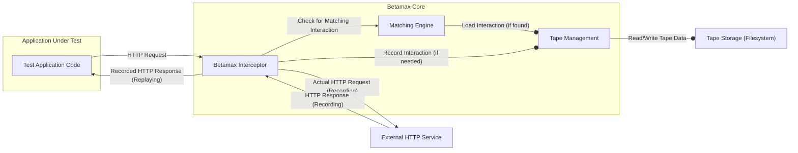

# Project Design Document: Betamax

**Version:** 1.1
**Date:** October 26, 2023
**Author:** Gemini (AI Language Model)

## 1. Introduction

This document provides an enhanced and more detailed design overview of the Betamax project, a library for recording and replaying HTTP interactions specifically designed for automated testing. This document aims to clearly articulate the system's architecture, components, and data flow with a stronger emphasis on security considerations, to facilitate effective threat modeling.

## 2. Goals

The primary goals of this design document are to:

*   Provide a comprehensive and technically detailed understanding of Betamax's architecture and functionality.
*   Clearly identify key components, their specific responsibilities, and their interactions.
*   Thoroughly describe the data flow within the system, including variations based on recording and replaying modes.
*   Serve as a robust and detailed foundation for subsequent threat modeling activities, enabling the identification of potential vulnerabilities.
*   Document design decisions with a strong focus on security implications and potential risks.

## 3. Overview

Betamax functions as an intermediary layer, strategically positioned to intercept HTTP requests originating from an application under test. It records the full request and response details into persistent "tapes." Subsequently, during test replays, Betamax intercepts the same requests and, instead of allowing them to reach external services, returns the previously recorded responses from the tapes. This mechanism offers significant advantages for testing, including increased speed, isolation from unreliable external dependencies, and the ability to consistently test error conditions and edge cases.

## 4. System Architecture

Betamax operates as a configurable interceptor integrated within the application's HTTP client layer. The specific integration method depends on the HTTP client library being used.

**Key Architectural Elements:**

*   **Test Application Code:** The software under test, typically a test suite, that makes outbound HTTP requests using a standard HTTP client library.
*   **Betamax Interceptor:** The central point of interaction. This component intercepts outgoing requests and incoming responses. It orchestrates the recording and replaying logic, interacting with the `Tape Management` and `Matching Engine`. The implementation of the interceptor is specific to the HTTP client library being used (e.g., using request hooks in Python's `requests`, or interceptors in OkHttp for Java/Android).
*   **Tape Management:** Responsible for loading, saving, and managing the lifecycle of tape files. It handles the serialization and deserialization of HTTP interactions to and from the storage medium.
*   **Matching Engine:**  Compares an outgoing HTTP request with the interactions stored in the current tape. It uses configurable matching rules to determine if a recorded interaction is a suitable match for the current request.
*   **Tape Storage:** The persistent storage mechanism where tape files are stored. This is typically the local filesystem but could potentially be extended to other storage solutions.
*   **External HTTP Service:** The actual remote server that the application would communicate with in a non-mocked environment.

## 5. Data Flow

The data flow within Betamax differs based on whether it's operating in recording or replaying mode.

### 5.1. Recording Mode (Detailed)

1. The **Test Application Code** constructs and initiates an HTTP request using its configured HTTP client.
2. The **Betamax Interceptor**, registered within the HTTP client, intercepts the outgoing request *before* it reaches the network.
3. The **Matching Engine** is consulted to check if an identical or similar interaction already exists on the currently active tape. This check uses the configured matching rules.
4. If no matching interaction is found:
    *   The **Betamax Interceptor** allows the HTTP request to proceed to the **External HTTP Service**.
    *   The **External HTTP Service** processes the request and generates an HTTP response.
    *   The **Betamax Interceptor** intercepts the incoming HTTP response.
    *   The **Tape Management** component serializes both the intercepted request and response into an interaction object.
    *   The **Tape Management** appends this new interaction to the current **Tape Storage**.
    *   The **Betamax Interceptor** forwards the original HTTP response back to the **Test Application Code**.

### 5.2. Replaying Mode (Detailed)

1. The **Test Application Code** constructs and initiates an HTTP request.
2. The **Betamax Interceptor** intercepts the outgoing request.
3. The **Matching Engine** attempts to find a matching interaction within the current **Tape Storage**. The matching process uses the configured rules (e.g., matching on URL, HTTP method, request headers, and request body).
4. If a matching interaction is found:
    *   The **Tape Management** component retrieves the recorded response from the **Tape Storage**.
    *   The **Betamax Interceptor** constructs a synthetic HTTP response object based on the recorded response.
    *   The **Betamax Interceptor** returns this recorded response to the **Test Application Code**, effectively short-circuiting the actual network request to the **External HTTP Service**.
5. If no matching interaction is found, the behavior is determined by Betamax's configuration:
    *   **Error Mode:** An exception is raised, indicating that the expected interaction was not found.
    *   **Passthrough Mode:** The request is allowed to proceed to the **External HTTP Service** (potentially recording the interaction if recording is enabled).

## 6. Key Components (Detailed)

*   **`Tape`:**
    *   The fundamental unit of storage in Betamax.
    *   Persisted as a file, typically in JSON or YAML format for human readability and ease of version control.
    *   Contains metadata such as the recording start time, Betamax version, and potentially environment details.
    *   Consists of an ordered list of `Interaction` objects.
    *   The file format includes structured data representing the HTTP request (method, URL, headers, body) and the corresponding HTTP response (status code, headers, body).
*   **`Recorder`:**
    *   The primary orchestrator of Betamax's functionality.
    *   Responsible for determining whether to record a new interaction or replay an existing one.
    *   Manages the active `Tape` object.
    *   Provides configuration options for recording mode (e.g., record once, record always).
    *   Delegates the matching of requests to the `Matcher`.
    *   Interacts with the `Tape` object to add new interactions.
*   **`Matcher`:**
    *   A crucial component for determining if a recorded interaction matches a current outgoing request.
    *   Offers a pluggable architecture, allowing users to define custom matching strategies.
    *   Common matching strategies include matching on:
        *   URL (exact match, regex match).
        *   HTTP method (GET, POST, PUT, DELETE, etc.).
        *   Request headers (exact match, subset match, ignoring specific headers).
        *   Request body (exact match, ignoring whitespace, custom comparison logic).
    *   The configuration of the `Matcher` significantly impacts the effectiveness and reliability of Betamax.
*   **`Interceptor` (HTTP Client Specific):**
    *   The bridge between Betamax and the underlying HTTP client library.
    *   Implementation details vary significantly depending on the client:
        *   **Python `requests`:** Utilizes custom `Session` objects and transport adapters.
        *   **Java OkHttp:** Implements `Interceptor` interfaces.
        *   **Other clients:** May involve custom middleware or request/response hooks.
    *   Responsible for intercepting the request and response objects, passing them to Betamax's core logic, and potentially modifying the response before it's returned to the application.
    *   This component is critical for the seamless integration of Betamax.
*   **`Configuration`:**
    *   Provides a centralized way to configure Betamax's behavior.
    *   Configuration options can be set programmatically or through configuration files.
    *   Key configuration parameters include:
        *   `tape_root`: The directory where tape files are stored.
        *   `default_mode`: The default recording mode (e.g., `once`, `new_episodes`, `none`).
        *   `match_on`: A list of request attributes to use for matching (e.g., `method`, `uri`, `headers`, `body`).
        *   `ignore_headers`: A list of headers to exclude from matching and recording.
        *   SSL certificate verification settings.
*   **`Request` and `Response` Objects:**
    *   Represent the HTTP request and response data in a structured format within Betamax.
    *   These objects are serialized and stored within the `Tape`.
    *   They encapsulate key attributes like:
        *   **Request:** URL, method, headers (as a dictionary), body (as a string or bytes).
        *   **Response:** Status code, headers (as a dictionary), body (as a string or bytes).

## 7. Security Considerations (Enhanced)

This section expands on the initial security considerations, providing more detail on potential threats and vulnerabilities.

*   **Sensitive Data Exposure in Tapes:**
    *   **Threat:** Tapes may inadvertently contain sensitive data such as API keys, authentication tokens, passwords, personally identifiable information (PII), or financial data within request headers, URLs, or request/response bodies.
    *   **Vulnerability:** If tape files are stored insecurely or accessed by unauthorized individuals, this sensitive data could be compromised, leading to data breaches or unauthorized access to external services.
    *   **Mitigation:** Implement robust filtering mechanisms in Betamax configuration to exclude sensitive headers and redact sensitive data from request/response bodies before recording. Store tapes in secure locations with appropriate access controls. Consider encrypting tape files at rest.
*   **Tape Tampering and Integrity:**
    *   **Threat:** Malicious actors could modify existing tape files to inject false responses, leading to incorrect test results, bypassing security checks in the application under test, or even influencing application behavior if tapes are used in non-testing contexts.
    *   **Vulnerability:** Lack of integrity checks on tape files makes them susceptible to unauthorized modification.
    *   **Mitigation:** Implement mechanisms to verify the integrity of tape files, such as checksums or digital signatures. Store tapes in version control systems to track changes. Restrict write access to tape storage locations.
*   **Insecure Storage of Tapes:**
    *   **Threat:** Storing tapes in publicly accessible locations or without proper access controls exposes sensitive data and allows for potential tampering.
    *   **Vulnerability:** Default storage locations or insufficient permission configurations can lead to unauthorized access.
    *   **Mitigation:** Enforce secure file system permissions on tape storage directories. Consider using encrypted file systems or dedicated secure storage solutions. Avoid storing tapes in publicly accessible repositories without proper safeguards.
*   **Configuration Vulnerabilities and Misuse:**
    *   **Threat:** Incorrect or insecure Betamax configurations can introduce vulnerabilities. For example, overly broad matching rules could lead to unintended replay of unrelated interactions, potentially masking bugs or security flaws. Disabling SSL verification during recording exposes the application to man-in-the-middle attacks.
    *   **Vulnerability:** Flexible configuration options, if not carefully managed, can create security loopholes.
    *   **Mitigation:** Provide clear documentation and guidance on secure configuration practices. Enforce least privilege principles for configuration settings. Avoid disabling SSL verification in production or shared environments. Regularly review and audit Betamax configurations.
*   **Accidental Recording in Production Environments:**
    *   **Threat:** If Betamax is inadvertently enabled or misconfigured in a production environment, it could lead to the recording of sensitive production data, potentially violating privacy regulations and exposing critical information.
    *   **Vulnerability:** Lack of clear separation between test and production configurations can lead to accidental recording.
    *   **Mitigation:** Implement strict environment separation for test and production systems. Ensure Betamax is explicitly enabled only in testing environments. Use environment variables or configuration flags to control Betamax's activation.
*   **Dependency Chain Vulnerabilities:**
    *   **Threat:** Betamax relies on underlying HTTP client libraries and other dependencies. Vulnerabilities in these dependencies could be exploited to compromise Betamax's functionality or the security of the application under test.
    *   **Vulnerability:** Outdated or vulnerable dependencies can introduce security risks.
    *   **Mitigation:** Regularly update Betamax's dependencies to the latest stable versions. Conduct security audits of dependencies using vulnerability scanning tools.

## 8. Future Considerations

*   **Encryption of Tape Contents:** Implement transparent encryption and decryption of tape data at rest using strong encryption algorithms. Explore options for key management.
*   **Role-Based Access Control for Tape Management:** Introduce a mechanism to control access to tapes based on user roles or permissions, especially in collaborative development environments.
*   **Integration with Secrets Management Systems:** Allow Betamax to retrieve sensitive data (e.g., API keys for matching or recording) from secure secrets management vaults instead of storing them directly in tape files or configurations.
*   **Advanced and Context-Aware Matching Strategies:** Develop more intelligent matching algorithms that consider the context of the request and response, potentially using semantic analysis or machine learning techniques.
*   **Centralized Tape Repository and Management:** Explore options for storing and managing tapes in a centralized repository with features like versioning, access control, and search capabilities. This could improve collaboration and maintainability.
*   **Secure Tape Exchange and Distribution:** Define secure protocols and mechanisms for sharing and distributing tape files between teams or systems, ensuring confidentiality and integrity.

## 9. Conclusion

This enhanced design document provides a more detailed and security-focused overview of the Betamax project. By elaborating on the architecture, data flow, and key components, and by thoroughly addressing potential security considerations, this document serves as a robust foundation for effective threat modeling and the development of secure testing practices. The outlined future considerations highlight potential areas for further improvement and security enhancements.
