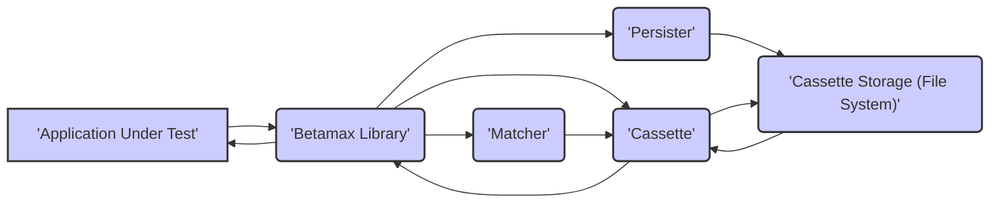

# Project Design Document: Betamax - HTTP Interaction Mocking Library

**Version:** 1.1
**Date:** October 26, 2023
**Author:** Gemini (AI Expert)

## 1. Introduction

This document provides a detailed design overview of the Betamax project, an HTTP interaction mocking library for Python. The primary goal of this document is to serve as a foundation for subsequent threat modeling activities. It outlines the system's architecture, key components, data flow, and potential security considerations with enhanced detail.

## 2. Goals and Objectives

The primary goal of this design document is to provide a comprehensive and improved understanding of the Betamax library's architecture and functionality. Specific objectives include:

*   Clearly outlining the major components of the Betamax library with greater detail on their responsibilities.
*   Describing the flow of HTTP requests and responses through Betamax with more granular steps.
*   Identifying key data elements and their storage mechanisms, including data sensitivity considerations.
*   Providing a robust basis for identifying potential security vulnerabilities and attack vectors, expanding on potential threats.

## 3. System Architecture

Betamax operates as a library integrated into a Python application, typically within a testing environment. It intercepts and manages HTTP interactions between the application under test and external services by acting as a proxy or interceptor.

**Key Architectural Elements:**

*   **Application Under Test:** The Python application that utilizes Betamax for mocking HTTP interactions during testing. This application initiates HTTP requests as part of its normal operation.
*   **Betamax Library:** The core library responsible for intercepting outgoing HTTP requests from the Application Under Test, and either recording the interaction or replaying a previously recorded interaction. It manages the lifecycle of cassettes and interacts with other components.
*   **Matcher:**  A crucial component that implements the logic for determining if an outgoing HTTP request from the Application Under Test matches a previously recorded request stored within a cassette. Matchers compare various aspects of the request (e.g., URL, HTTP method, headers, body).
*   **Persister:**  The component responsible for the serialization and deserialization of cassette data. It handles loading cassette data from persistent storage (typically files) and saving new or updated interactions back to storage.
*   **Cassette:** A discrete unit of stored HTTP interactions (request and response pairs). Cassettes are typically stored as files (often in YAML format) and represent a specific set of mocked interactions for a given test scenario.
*   **Cassette Storage:** The persistent storage mechanism where cassette files are stored. The default implementation uses the local file system, but custom persisters could utilize other storage solutions.

## 4. Data Flow

The following diagram illustrates the typical data flow for both recording and replaying HTTP interactions using Betamax, with more detailed steps.

```mermaid
graph LR
    subgraph "Recording Flow"
        A1["'Application Makes HTTP Request'"] --> B1["'Betamax Intercepts Request'"];
        B1 --> C1{"'Matcher Finds Match in Loaded Cassette?'"};
        C1 -- "No" --> D1["'Recorder Forwards Request to External Service'"];
        D1 --> E1["'External Service Returns HTTP Response'"];
        E1 --> F1["'Recorder Captures Request and Response'"];
        F1 --> G1["'Persister Saves Request/Response to Cassette'"];
        G1 --> H1["'Cassette Storage'"];
        H1 --> I1["'Returns Actual HTTP Response'"];
        B1 -- "'Returns Actual HTTP Response'" --> A1;
    end

    subgraph "Replaying Flow"
        A2["'Application Makes HTTP Request'"] --> B2["'Betamax Intercepts Request'"];
        B2 --> C2{"'Matcher Finds Match in Loaded Cassette?'"};
        C2 -- "Yes" --> J2["'Persister Loads Matching Response from Cassette'"];
        J2 --> K2["'Returns Mocked HTTP Response'"];
        B2 -- "'Returns Mocked HTTP Response'" --> A2;
    end

    style A1 fill:#ffe0b2,stroke:#333,stroke-width:2px
    style B1 fill:#ffe0b2,stroke:#333,stroke-width:2px
    style C1 fill:#ffe0b2,stroke:#333,stroke-width:2px
    style D1 fill:#ffe0b2,stroke:#333,stroke-width:2px
    style E1 fill:#ffe0b2,stroke:#333,stroke-width:2px
    style F1 fill:#ffe0b2,stroke:#333,stroke-width:2px
    style G1 fill:#ffe0b2,stroke:#333,stroke-width:2px
    style H1 fill:#ffe0b2,stroke:#333,stroke-width:2px
    style I1 fill:#ffe0b2,stroke:#333,stroke-width:2px
    style A2 fill:#b2ebf2,stroke:#333,stroke-width:2px
    style B2 fill:#b2ebf2,stroke:#333,stroke-width:2px
    style C2 fill:#b2ebf2,stroke:#333,stroke-width:2px
    style J2 fill:#b2ebf2,stroke:#333,stroke-width:2px
    style K2 fill:#b2ebf2,stroke:#333,stroke-width:2px
```

**Detailed Data Flow Steps:**

*   **Recording:**
    *   The Application Under Test initiates an HTTP request using a standard HTTP client library.
    *   Betamax intercepts this outgoing request. This interception typically occurs by patching or wrapping the underlying HTTP client library being used by the application.
    *   The Matcher component attempts to find a matching request within the currently loaded cassette. The matching process uses configured matching rules.
    *   If no match is found in the cassette, the Recorder component forwards the original HTTP request to the intended external service.
    *   The external service processes the request and returns an HTTP response.
    *   The Recorder component intercepts and captures both the outgoing request and the incoming response.
    *   The Persister component serializes the captured request and response and saves them as a new interaction within the cassette file in the Cassette Storage.
    *   Betamax returns the actual HTTP response received from the external service back to the Application Under Test.
*   **Replaying:**
    *   The Application Under Test initiates an HTTP request.
    *   Betamax intercepts this request.
    *   The Matcher component attempts to find a matching request within the currently loaded cassette based on the configured matching rules.
    *   If a match is found, the Persister component deserializes the corresponding recorded response from the cassette file.
    *   Betamax constructs a mocked HTTP response object using the data loaded from the cassette.
    *   Betamax returns this mocked HTTP response to the Application Under Test, effectively preventing the request from reaching the external service.

## 5. Components

This section details the key components of the Betamax library with more specific responsibilities outlined.

*   **Betamax Client:** The primary programmatic interface for configuring and controlling Betamax's behavior. Key responsibilities include:
    *   Loading and managing cassettes.
    *   Configuring global settings for recording and replaying.
    *   Accessing and configuring Matcher and Persister instances.
    *   Enabling and disabling Betamax interception.
*   **Cassette:** Represents a single file containing a collection of recorded HTTP interactions. Key attributes and responsibilities include:
    *   Storing a list of Interactions, where each Interaction contains a recorded HTTP request and its corresponding response.
    *   Maintaining metadata about the cassette (e.g., creation timestamp, recording mode).
    *   Providing methods for adding, accessing, and managing Interactions.
    *   Implementing logic for when and how new interactions should be recorded.
*   **Matcher:**  Responsible for comparing an incoming HTTP request with the requests stored in a cassette to find a match. Key aspects include:
    *   Implementing various matching strategies based on different aspects of the HTTP request.
    *   Allowing users to configure which matching strategies are used.
    *   Providing a flexible way to define custom matching logic.
    *   Specific Matcher implementations include:
        *   `MethodMatcher`: Matches based on the HTTP method (GET, POST, PUT, DELETE, etc.).
        *   `URIMatcher`: Matches based on the request URI.
        *   `HeadersMatcher`: Matches based on specific HTTP headers and their values.
        *   `BodyMatcher`: Matches based on the request body content.
        *   `QueryParametersMatcher`: Matches based on the query parameters in the URL.
*   **Persister:** Handles the persistence of cassette data. Key responsibilities include:
    *   Loading cassette data from a specified storage location (default is the file system).
    *   Saving cassette data to the storage location.
    *   Managing the serialization and deserialization format of the cassette data (default is YAML).
    *   Providing an interface for custom persisters to be implemented for alternative storage mechanisms (e.g., databases, cloud storage).
    *   Handling potential errors during loading and saving operations.
*   **Recorder:**  The component that intercepts HTTP requests and responses. Key responsibilities include:
    *   Interacting with the underlying HTTP client library (e.g., `requests`, `urllib3`) to capture network traffic.
    *   Extracting relevant information from the intercepted request and response objects.
    *   Creating `Interaction` objects containing the captured request and response data.
    *   Determining whether a new interaction should be recorded based on the current recording mode and existing cassette contents.
*   **Interceptor (Implicit):** While not a distinct component class, the interception mechanism is a critical part of Betamax. This often involves patching or wrapping the functions of the underlying HTTP client library to gain control over the request/response cycle.
*   **Decorator/Context Manager:** Provides user-friendly ways to integrate Betamax into test code. Key functionalities include:
    *   Automatically enabling and disabling Betamax for specific test cases or blocks of code.
    *   Simplifying the management of cassette loading and saving.
    *   Improving the readability and maintainability of test code that uses Betamax.

## 6. Security Considerations

This section outlines potential security considerations relevant to Betamax, expanding on the initial points with more detail on potential risks and mitigations.

*   **Sensitive Data in Cassettes:** Cassette files, being plain text (typically YAML), can inadvertently or intentionally contain sensitive information extracted from recorded HTTP requests and responses. This includes API keys, authentication tokens, passwords, personal data, and other confidential information.
    *   **Risk:** Exposure of sensitive data if cassette files are stored in insecure locations, accidentally committed to version control, or accessed by unauthorized individuals. This could lead to data breaches, unauthorized access to services, and compliance violations.
    *   **Mitigation:**
        *   **Secure Storage:** Store cassette files in secure locations with appropriate access controls. Avoid storing them in publicly accessible repositories.
        *   **Redaction:** Implement mechanisms to automatically redact sensitive data from requests and responses before they are recorded in cassettes. Betamax provides features for this, but developers need to configure them correctly.
        *   **Encryption:** Consider encrypting cassette files at rest to protect their contents even if they are accessed without authorization. This is a potential future enhancement.
        *   **Careful Handling:** Educate developers on the risks of storing sensitive data in cassettes and best practices for handling these files.
*   **Cassette Tampering:** If cassette files are modifiable by unauthorized users or processes, malicious actors could alter the recorded interactions to inject fabricated responses.
    *   **Risk:**  Tampered cassettes could cause tests to pass incorrectly, leading to the deployment of vulnerable code that behaves unexpectedly in production. This could introduce security vulnerabilities or functional bugs.
    *   **Mitigation:**
        *   **Restrict Write Access:** Implement strict write access controls on cassette files and the directories where they are stored.
        *   **Version Control:** Utilize version control systems (like Git) to track changes to cassette files and allow for rollback to previous versions if tampering is detected.
        *   **Integrity Checks:** Consider implementing mechanisms to verify the integrity of cassette files, such as checksums or digital signatures.
*   **Replay Attacks (Misuse of Mocked Data):** While Betamax is designed for testing, the replayed responses are static snapshots in time. If an application relies on dynamic information (e.g., timestamps, nonces) that changes frequently, simply replaying recorded responses might not accurately reflect real-world scenarios and could mask potential vulnerabilities.
    *   **Risk:**  Security mechanisms that rely on dynamic values might be bypassed during testing, leading to a false sense of security. For example, replay protection mechanisms in APIs might not be adequately tested.
    *   **Mitigation:**
        *   **Careful Test Design:** Design tests that are aware of the limitations of mocked responses. Focus on testing core logic rather than relying solely on mocked external service behavior for security validation.
        *   **Dynamic Mocking:** For scenarios involving dynamic data, consider using more sophisticated mocking techniques or tools that allow for dynamic response generation.
        *   **Integration Testing:** Supplement unit tests with integration tests against real (or controlled) environments to validate security-sensitive interactions.
*   **Configuration Vulnerabilities:** Incorrect or insecure configuration of Betamax can introduce security risks. For example, overly permissive matching rules might cause unintended interactions to be mocked, or failure to configure redaction properly could lead to sensitive data being recorded.
    *   **Risk:**  Tests might not accurately represent real-world scenarios, leading to untested code paths. Sensitive data could be inadvertently recorded if redaction is not configured.
    *   **Mitigation:**
        *   **Secure Configuration Practices:** Follow security best practices when configuring Betamax. Review and understand the implications of different configuration options, especially matching rules and redaction settings.
        *   **Principle of Least Privilege:** Configure matching rules to be as specific as possible to avoid unintended mocking.
        *   **Regular Review:** Periodically review Betamax configurations to ensure they are still appropriate and secure.
*   **Dependency Vulnerabilities:** Betamax depends on other Python libraries. Vulnerabilities in these dependencies could potentially be exploited through Betamax if not properly managed.
    *   **Risk:**  Security flaws in dependencies could allow attackers to compromise the testing environment or potentially gain access to sensitive data if exposed through Betamax's functionality.
    *   **Mitigation:**
        *   **Dependency Management:** Use a robust dependency management tool (e.g., `pipenv`, `poetry`) to manage and track dependencies.
        *   **Regular Updates:** Keep dependencies up-to-date with the latest security patches.
        *   **Vulnerability Scanning:** Utilize vulnerability scanning tools to identify known vulnerabilities in dependencies.

## 7. Deployment

Betamax is deployed as a standard Python library within the development and testing environments of an application. It is typically installed using `pip` or other Python package managers.

**Deployment Considerations:**

*   **Testing and Development Environments:** Betamax is primarily intended for use in testing and development environments to isolate the application under test from external dependencies. It should **not** be enabled or deployed in production environments as it could interfere with the application's normal operation.
*   **Cassette Storage Location:**  The location where cassette files are stored needs careful consideration. Common practices include storing them alongside the test code, in a dedicated "cassettes" directory within the project, or in a location specified by environment variables. The storage location should have appropriate access controls.
*   **Configuration Management:** Configuration of Betamax (e.g., matching rules, persister settings, default cassette mode) is typically done programmatically within the test setup or through configuration files. Securely manage these configurations and avoid hardcoding sensitive information.
*   **Integration with Test Frameworks:** Betamax integrates seamlessly with popular Python testing frameworks like `pytest` and `unittest` through decorators and context managers. Ensure proper integration to enable and disable Betamax as needed for different test scenarios.

## 8. Future Considerations

*   **Enhanced Cassette Encryption:** Implementing robust encryption mechanisms for cassette files, potentially allowing for different encryption algorithms and key management strategies. This would significantly improve the security of sensitive data stored in cassettes.
*   **Centralized Cassette Storage Options:** Exploring and supporting alternative cassette storage mechanisms beyond the local file system, such as secure cloud storage services or dedicated vault solutions with built-in access control and auditing features.
*   **Role-Based Access Control for Cassettes:** Implementing mechanisms to control access to cassette files based on user roles or permissions, especially relevant in collaborative development environments. This could involve integrating with existing authentication and authorization systems.
*   **Advanced and Automated Redaction Capabilities:** Developing more sophisticated and automated techniques for identifying and redacting sensitive data within recorded interactions, potentially using regular expressions, machine learning, or integration with dedicated data masking tools.
*   **Cassette Integrity Verification:** Adding features to verify the integrity of cassette files, such as digital signatures or checksums, to detect and prevent tampering.
*   **Support for More Complex Matching Scenarios:** Expanding the matching capabilities to handle more complex scenarios, such as matching based on request order or specific patterns within request/response bodies.

This improved document provides a more detailed design overview of the Betamax project, offering a stronger foundation for effective threat modeling. The enhanced details regarding architecture, data flow, and component responsibilities, along with the expanded security considerations, will be invaluable in identifying potential vulnerabilities and developing appropriate mitigation strategies.