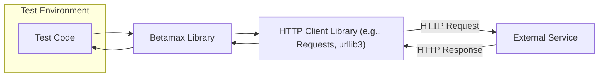
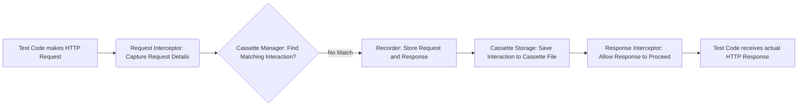
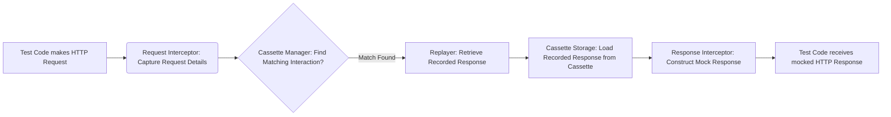

# Project Design Document: Betamax - HTTP Interaction Recording and Replay

**Version:** 1.1
**Date:** October 26, 2023
**Author:** AI Software Architect

## 1. Introduction

This document provides a detailed design overview of the Betamax project, a library for recording and replaying HTTP interactions for testing purposes. This document aims to clearly articulate the architecture, components, and data flow within Betamax to facilitate subsequent threat modeling activities.

### 1.1. Purpose

The purpose of this document is to provide a comprehensive technical description of the Betamax library. This document will serve as a foundation for understanding the system's inner workings and identifying potential security vulnerabilities during the threat modeling process. It aims to be a single source of truth for the design of Betamax, specifically tailored for security analysis.

### 1.2. Scope

This document covers the core functionality of Betamax, including:

*   Configuration and initialization, including various configuration methods.
*   Interception of HTTP requests and responses at the library level.
*   Storage and retrieval of HTTP interactions (cassettes) in various formats.
*   Matching logic for replaying interactions, including different matching strategies.
*   Integration with various HTTP client libraries and the mechanisms used for interception.

This document does not cover:

*   Specific implementation details within individual HTTP client integrations beyond the general interception mechanism.
*   The internal workings of the underlying HTTP client libraries themselves.
*   Deployment or operational aspects of using Betamax in a test environment beyond general considerations.
*   Specific details of the serialization/deserialization libraries used for cassette storage.

### 1.3. Goals

The primary goals of this design document are to:

*   Clearly define the architecture and components of Betamax with a focus on security-relevant aspects.
*   Illustrate the flow of data during recording and replay operations, highlighting potential data exposure points.
*   Provide sufficient detail for effective threat modeling, enabling the identification of potential vulnerabilities and attack vectors.
*   Serve as a reference for developers, security analysts, and anyone involved in the development or security assessment of systems using Betamax.

## 2. High-Level Architecture

Betamax operates as a middleware layer that intercepts HTTP requests made by the test code and the corresponding responses from external services. It stores these interactions in files called "cassettes" and can later replay them, preventing the need to make actual external HTTP calls during subsequent test runs. This interception typically happens by hooking into the underlying HTTP client library's request/response mechanisms.

**Key Actors:**

*   **"Test Code"**: The application code that utilizes an HTTP client library to make requests and is being tested using Betamax.
*   **"Betamax Library"**: The core component responsible for intercepting, recording, and replaying HTTP interactions. It manages cassettes and the matching process.
*   **"HTTP Client Library (e.g., Requests, urllib3)"**: The underlying library used by the test code to make HTTP requests. Betamax integrates with these libraries to intercept traffic.
*   **"External Service"**: The remote server or API being interacted with by the test code.

## 3. Component Details

This section details the key components within the Betamax library, focusing on their functionality and potential security implications.

*   **Configuration:**
    *   Responsible for managing Betamax's settings, which can be defined in various ways (e.g., programmatically, configuration files).
    *   Key configuration aspects include:
        *   **"Cassette Storage Location"**: Specifies where cassette files are stored (e.g., directory path). This is a critical security consideration as it determines where potentially sensitive data resides.
        *   **"Default Match Rules"**: Defines how Betamax determines if a recorded interaction matches a current request (e.g., matching on URL, HTTP method, headers, request body). Incorrectly configured match rules could lead to unexpected behavior or the replay of incorrect responses.
        *   **"Ignore Headers/Query Parameters"**: Allows specifying headers or query parameters to be ignored during matching. While useful for flexibility, misuse could lead to sensitive information being inadvertently ignored during matching.
        *   **"Encryption Settings for Cassettes"**:  If implemented, manages the encryption and decryption of cassette files. The strength of the encryption algorithm and key management are crucial security aspects.
        *   **"Filter Sensitive Data"**: Mechanisms to redact or remove sensitive information from recorded interactions before they are stored in cassettes. The effectiveness of these filters is vital for preventing data leaks.
    *   Configuration can be set globally or overridden per cassette, adding complexity to security management.

*   **Request Interceptor:**
    *   Intercepts HTTP requests made by the configured HTTP client library. The interception mechanism varies depending on the client library (e.g., using event hooks, monkey patching, custom transport adapters).
    *   Extracts relevant information from the request:
        *   URL (including path and query parameters).
        *   HTTP method (GET, POST, PUT, DELETE, etc.).
        *   Headers (including authorization headers, cookies).
        *   Body (which may contain sensitive data).
    *   Passes the request information to the `Cassette Manager`. The integrity of this extracted information is crucial for accurate matching and recording.

*   **Response Interceptor:**
    *   Intercepts HTTP responses received from the external service.
    *   Extracts relevant information from the response:
        *   Status code.
        *   Headers (including `Set-Cookie` headers).
        *   Body (which may contain sensitive data).
    *   Passes the response information to the `Cassette Manager` for recording. Ensuring the accurate capture of response data is important for realistic replay.

*   **Cassette Manager:**
    *   The central component responsible for managing cassettes and orchestrating the recording and replay processes.
    *   Determines whether to record a new interaction or replay an existing one based on the current request and available cassettes.
    *   Uses the configured `Matcher` to find matching interactions in existing cassettes. The efficiency and correctness of the matching algorithm are important.
    *   Delegates the actual recording of interactions to the `Recorder`.
    *   Delegates the retrieval and construction of mock responses to the `Replayer`.
    *   Handles cassette lifecycle: creation, loading, saving, and potentially deletion. Proper handling of cassette files is essential for data integrity and security.

*   **Cassette Storage:**
    *   Responsible for persisting cassettes to storage and retrieving them.
    *   Typically uses the file system to store cassettes as files (commonly JSON or YAML). The security of the file system and the permissions on cassette files are critical.
    *   May support different storage backends through plugins or extensions, each with its own security considerations.
    *   Handles serialization and deserialization of HTTP interactions to and from the storage format. Vulnerabilities in serialization libraries could be exploited.

*   **Matcher:**
    *   Defines the logic for determining if a recorded interaction matches a current request.
    *   Compares attributes of the current request with those of recorded interactions based on configured rules.
    *   Supports various matching strategies:
        *   **"URL Match"**: Matches based on the request URL.
        *   **"Method Match"**: Matches based on the HTTP method.
        *   **"Headers Match"**: Matches based on specific request headers.
        *   **"Body Match"**: Matches based on the request body content.
        *   **"Custom Matchers"**: Allows users to define their own matching logic. Insecurely implemented custom matchers could introduce vulnerabilities.
    *   The order and combination of matchers can significantly impact the matching process and potentially lead to unexpected behavior if not configured correctly.

*   **Recorder:**
    *   Responsible for recording new HTTP interactions into cassettes.
    *   Stores the intercepted request and response details in a structured format within the cassette file.
    *   Applies configured filters or transformations to the recorded data to remove sensitive information or normalize data. The effectiveness of these filters is crucial.
    *   Determines the format in which the interaction is stored (e.g., JSON, YAML).

*   **Replayer:**
    *   Responsible for replaying recorded HTTP interactions when a match is found.
    *   Retrieves the stored response details from the matching interaction in the cassette via `Cassette Storage`.
    *   Constructs a mock HTTP response object based on the stored data, mimicking the original response from the external service.
    *   Returns the mock response to the HTTP client, preventing the actual external request.

## 4. Data Flow

This section describes the flow of data during both recording and replay scenarios, highlighting potential points where sensitive data might be exposed or manipulated.

### 4.1. Recording an Interaction

**Steps:**

1. "Test Code makes HTTP Request": The test code initiates an HTTP request using a configured HTTP client library. This request may contain sensitive data in headers, cookies, or the request body.
2. "Request Interceptor: Capture Request Details": The `Request Interceptor` intercepts the outgoing request and captures details like URL, method, headers, and body. This is the first point where sensitive data is handled by Betamax.
3. "Cassette Manager: Find Matching Interaction?": The `Cassette Manager` checks if a matching interaction already exists in the cassettes.
4. "Recorder: Store Request and Response": If no match is found, the `Recorder` prepares to store the request and the upcoming response.
5. "Cassette Storage: Save Interaction to Cassette File": The `Recorder` saves the captured request details and the response (received later) into a cassette file. This is where sensitive data is persisted. The security of the storage location and the format used are critical.
6. "Response Interceptor: Allow Response to Proceed": The `Response Interceptor` allows the actual HTTP response from the external service to proceed back to the test code.
7. "Test Code receives actual HTTP Response": The test code receives the actual response from the external service.

### 4.2. Replaying an Interaction

**Steps:**

1. "Test Code makes HTTP Request": The test code initiates an HTTP request.
2. "Request Interceptor: Capture Request Details": The `Request Interceptor` intercepts the request details for matching.
3. "Cassette Manager: Find Matching Interaction?": The `Cassette Manager` searches for a matching interaction in the cassettes.
4. "Replayer: Retrieve Recorded Response": If a match is found, the `Replayer` is invoked to retrieve the recorded response.
5. "Cassette Storage: Load Recorded Response from Cassette": The `Replayer` loads the stored response data from the cassette file. If cassettes contain sensitive data, unauthorized access to these files is a risk.
6. "Response Interceptor: Construct Mock Response": The `Response Interceptor` constructs a mock HTTP response object using the data retrieved from the cassette.
7. "Test Code receives mocked HTTP Response": The test code receives the mocked response, and the actual external HTTP call is bypassed.

## 5. Security Considerations (Detailed)

This section elaborates on potential security considerations and threats associated with Betamax.

*   **Confidentiality of Cassette Data:**
    *   Cassettes often contain sensitive information like API keys, authentication tokens (e.g., OAuth tokens, session cookies), passwords, and PII within request/response headers and bodies.
    *   **Threat:** Unauthorized access to cassette files could lead to the exposure of this sensitive data. This could occur through insecure file system permissions, accidental commits to public repositories, or vulnerabilities in storage backends.
    *   **Mitigation:** Implement encryption for cassette files at rest. Enforce strict access controls on cassette storage locations. Avoid storing sensitive data in cassettes if possible, or use filtering mechanisms to redact it.

*   **Integrity of Cassette Data:**
    *   Tampering with cassette files can lead to tests passing incorrectly or, in more serious scenarios, could be exploited to inject malicious content if the replayed responses are used in security-sensitive contexts (though this is less likely in typical testing scenarios).
    *   **Threat:** Malicious actors or even accidental modifications could alter cassette content, leading to false positives in tests or misleading results.
    *   **Mitigation:** Implement mechanisms to verify the integrity of cassette files, such as checksums or digital signatures. Use version control for cassette files to track changes.

*   **Availability of Cassette Data:**
    *   If cassette files are lost or corrupted, tests relying on them will fail.
    *   **Threat:** Accidental deletion, storage failures, or malicious deletion of cassette files can disrupt the testing process.
    *   **Mitigation:** Implement backup and recovery mechanisms for cassette files. Use reliable storage solutions.

*   **Security of Configuration:**
    *   Insecurely configured matchers or ignore rules can lead to unexpected behavior, such as sensitive requests not being recorded or incorrect responses being replayed.
    *   **Threat:** Misconfigured matchers could cause tests to bypass actual external calls when they shouldn't, potentially masking integration issues. Ignoring sensitive headers during matching could lead to security vulnerabilities being missed.
    *   **Mitigation:** Provide clear documentation and guidance on secure configuration practices. Implement validation for configuration settings.

*   **Vulnerabilities in Dependencies:**
    *   Betamax relies on underlying HTTP client libraries and potentially serialization/deserialization libraries.
    *   **Threat:** Vulnerabilities in these dependencies could be exploited if Betamax doesn't handle them securely. For example, vulnerabilities in JSON or YAML parsing could lead to remote code execution if malicious cassette files are crafted.
    *   **Mitigation:** Regularly update dependencies and perform security audits of dependencies. Implement input validation when parsing cassette files.

*   **Exposure of Sensitive Data in Logs:**
    *   Logging mechanisms within Betamax might inadvertently log sensitive data from requests or responses.
    *   **Threat:** Sensitive information could be exposed in log files, potentially accessible to unauthorized individuals.
    *   **Mitigation:** Implement careful logging practices, avoiding logging sensitive data. Configure logging levels appropriately for different environments.

*   **Man-in-the-Middle Attacks on Cassette Storage (for remote storage):**
    *   If future versions support remote storage of cassettes, communication channels need to be secured.
    *   **Threat:** If cassettes are stored remotely and the communication channel is not encrypted, attackers could intercept and modify cassette data.
    *   **Mitigation:** Use secure protocols (e.g., HTTPS, SSH) for accessing remote storage. Implement authentication and authorization mechanisms for accessing remote cassettes.

## 6. Deployment Considerations

Betamax is primarily a development and testing tool, and its "deployment" typically refers to its integration within these environments.

*   **Local Development Environments:** Cassettes are often stored within the project's repository or a local directory. Security relies on developer workstation security and repository access controls.
*   **Continuous Integration/Continuous Delivery (CI/CD) Pipelines:** Cassettes might be generated and used within CI/CD pipelines. Secure storage and access control for cassette files within the CI/CD environment are crucial. Secrets management practices should be followed if cassettes contain sensitive data.
*   **Shared Test Environments:** When multiple developers or teams share test environments, managing and securing cassettes becomes more complex. Consider using separate cassette storage locations or implementing more granular access controls.

## 7. Future Considerations

These are potential future enhancements that could impact the design and security of Betamax.

*   **Support for Encrypted Cassettes:** Implementing robust encryption for cassette files using industry-standard algorithms and secure key management practices is a significant security enhancement.
*   **Pluggable Storage Backends:** Supporting various storage backends (e.g., cloud storage, databases) introduces new security considerations specific to each backend. Secure authentication, authorization, and data transmission mechanisms will be necessary.
*   **Advanced Matching Strategies:** While offering flexibility, more complex matching strategies could introduce vulnerabilities if not implemented carefully. Thorough testing and security reviews would be required.
*   **Integration with Security Scanning Tools:**  Providing mechanisms for security scanning tools to analyze cassette content for potential secrets or vulnerabilities could proactively identify security issues.
*   **Centralized Cassette Management:** A centralized system for managing and distributing cassettes could improve efficiency but would also introduce new security challenges related to access control and data protection.

This document provides a detailed and improved overview of the Betamax project's design, specifically tailored for threat modeling. It highlights key components, data flows, and potential security considerations to facilitate a comprehensive security assessment.