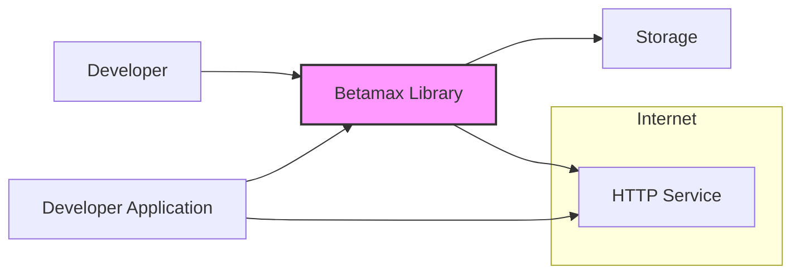
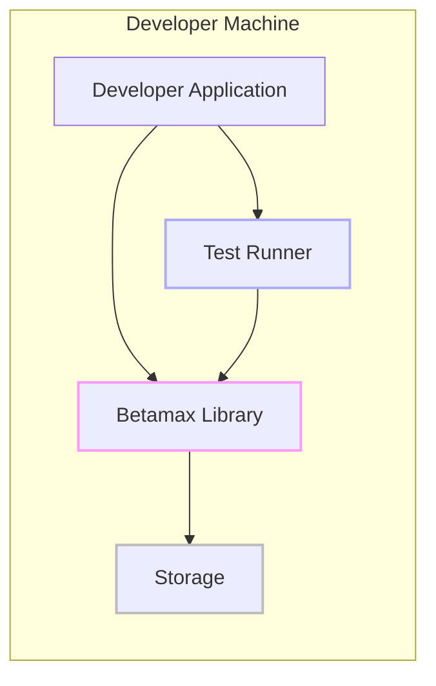
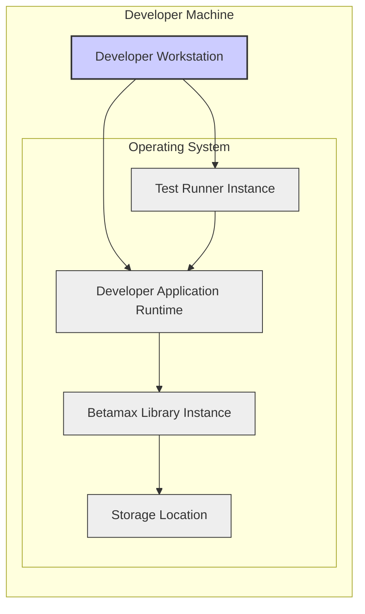

# BUSINESS POSTURE

- Business Priorities and Goals:
  - Improve software quality by enabling reliable and repeatable testing of HTTP interactions.
  - Reduce the time and effort required for integration testing by providing a tool to record and replay HTTP services.
  - Facilitate development and debugging by allowing developers to work against consistent and predictable HTTP responses.
- Business Risks:
  - Risk of exposing sensitive data if HTTP interactions containing credentials, personal information, or confidential data are recorded and stored insecurely.
  - Risk of test environment inconsistencies if recorded interactions are not properly managed or become outdated.
  - Risk of developers misusing the tool, leading to false positives or negatives in tests if recordings are not created and used appropriately.
  - Risk of security vulnerabilities within the Betamax library itself, which could be exploited if integrated into larger systems.

# SECURITY POSTURE

- Existing Security Controls:
  - security control: Code is hosted on GitHub, leveraging GitHub's security features for repository management and access control. (Implemented: GitHub platform)
  - security control: Open-source project, allowing for community review and potential identification of security vulnerabilities. (Implemented: Open-source nature)
  - security control: Standard software development practices are assumed, including version control and issue tracking. (Assumed: Development process)
- Accepted Risks:
  - accepted risk: Reliance on community contributions for security vulnerability identification and patching.
  - accepted risk: Potential for insecure usage by developers if they are not fully aware of security best practices when recording and replaying HTTP interactions.
  - accepted risk: Dependencies on third-party libraries may introduce vulnerabilities.
- Recommended Security Controls:
  - security control: Implement automated Static Application Security Testing (SAST) in the build pipeline to identify potential code-level vulnerabilities.
  - security control: Integrate Dependency Vulnerability Scanning to identify and manage vulnerabilities in third-party libraries used by Betamax.
  - security control: Conduct periodic security code reviews by security experts to proactively identify and address potential security weaknesses.
  - security control: Provide clear documentation and guidelines for developers on secure usage of Betamax, especially regarding handling sensitive data in recordings and storage.
  - security control: Implement Software Composition Analysis (SCA) to manage open source components and their licenses, ensuring compliance and security.
- Security Requirements:
  - Authentication: Not directly applicable to Betamax as a library. Authentication is the responsibility of the applications using Betamax and the HTTP services being interacted with. Betamax should not interfere with or bypass application authentication mechanisms.
  - Authorization: Not directly applicable to Betamax as a library. Authorization is the responsibility of the applications using Betamax and the HTTP services being interacted with. Betamax should not introduce any authorization bypass vulnerabilities.
  - Input Validation: Betamax should robustly handle various HTTP request and response formats. It should avoid vulnerabilities related to processing untrusted input from HTTP interactions, such as injection attacks if it parses or logs request/response data.
  - Cryptography: If Betamax stores recordings that may contain sensitive data, consider providing options for encrypting these recordings at rest. This could involve using standard encryption libraries to protect recorded data.

# DESIGN

## C4 CONTEXT



- Context Diagram Elements:
  - - Name: Developer
    - Type: Person
    - Description: Software developer using Betamax to test their applications.
    - Responsibilities: Writes and executes tests using Betamax, creates and manages Betamax recordings.
    - Security controls: Responsible for secure usage of Betamax, including handling sensitive data in recordings and storing recordings securely.
  - - Name: Developer Application
    - Type: Software System
    - Description: The application being developed and tested by the developer, which uses Betamax for testing HTTP interactions.
    - Responsibilities: Interacts with Betamax library to record and replay HTTP interactions during testing.
    - Security controls: Implements its own security controls for authentication, authorization, and data protection. Integrates with Betamax for testing purposes.
  - - Name: Betamax Library
    - Type: Software System
    - Description: The Betamax library itself, which is integrated into the Developer Application for recording and replaying HTTP interactions.
    - Responsibilities: Intercepts HTTP requests and responses, records interactions to storage, and replays interactions from storage.
    - Security controls: Input validation on HTTP requests/responses, potential encryption of stored recordings (if implemented), secure handling of temporary files.
  - - Name: HTTP Service
    - Type: Software System
    - Description: External HTTP services that the Developer Application interacts with and that are being mocked using Betamax for testing.
    - Responsibilities: Provides HTTP responses to the Developer Application.
    - Security controls: Implements its own security controls for authentication, authorization, and data protection. Security posture is independent of Betamax.
  - - Name: Storage
    - Type: Data Store
    - Description: Storage mechanism used by Betamax to persist recorded HTTP interactions. This could be the local file system, or potentially other storage solutions.
    - Responsibilities: Persistently stores HTTP interaction recordings.
    - Security controls: Access control to the storage location, encryption at rest if sensitive data is stored, regular backups.

## C4 CONTAINER



- Container Diagram Elements:
  - - Name: Developer Application
    - Type: Application
    - Description: The application code being developed and tested. It integrates with the Betamax Library and uses a Test Runner to execute tests.
    - Responsibilities: Application logic, initiating tests, using Betamax for HTTP interaction testing.
    - Security controls: Application-level security controls, secure coding practices, input validation, authorization within the application.
  - - Name: Betamax Library
    - Type: Library
    - Description: The Betamax library, a software component integrated into the Developer Application. It handles the core logic of recording and replaying HTTP interactions.
    - Responsibilities: HTTP interception, recording and replaying interactions, managing storage of recordings.
    - Security controls: Input validation on HTTP data, secure file handling for storage, potential encryption of recordings, protection against code injection vulnerabilities.
  - - Name: Test Runner
    - Type: Application
    - Description: A testing framework (e.g., pytest, unittest) used to execute tests for the Developer Application. It orchestrates the tests and interacts with the Betamax Library indirectly through the application code.
    - Responsibilities: Running tests, reporting test results, managing test suites.
    - Security controls: Test runner security is generally less critical in development environments, but secure configuration and preventing malicious test code execution are considerations.
  - - Name: Storage
    - Type: Data Store
    - Description: File system directory or other storage location where Betamax recordings are stored.
    - Responsibilities: Persistent storage of HTTP interaction recordings.
    - Security controls: File system permissions to restrict access to recordings, potential encryption at rest for sensitive recordings, regular backups of recordings if needed.

## DEPLOYMENT

- Deployment Environment: Developer's Local Machine and CI/CD Pipeline.
- Detailed Deployment for Developer's Local Machine:



- Deployment Diagram Elements:
  - - Name: Developer Workstation
    - Type: Infrastructure
    - Description: The physical or virtual machine used by the developer for software development and testing.
    - Responsibilities: Provides the environment for running the Developer Application, Betamax Library, and Test Runner.
    - Security controls: Operating system security controls, user access management, endpoint security software (antivirus, firewall).
  - - Name: Developer Application Runtime
    - Type: Container/Process
    - Description: The runtime environment (e.g., Python interpreter, JVM) in which the Developer Application is executed.
    - Responsibilities: Executing the Developer Application code, providing necessary libraries and dependencies.
    - Security controls: Runtime environment security updates, secure configuration, resource management.
  - - Name: Betamax Library Instance
    - Type: Library Instance
    - Description: An instance of the Betamax Library loaded into the Developer Application Runtime.
    - Responsibilities: Recording and replaying HTTP interactions as instructed by the Developer Application.
    - Security controls: Inherits security controls from the runtime environment and the host operating system. Library-level security controls as described in previous sections.
  - - Name: Test Runner Instance
    - Type: Process
    - Description: An instance of the Test Runner application executing tests for the Developer Application.
    - Responsibilities: Orchestrating and running tests, invoking the Developer Application and indirectly Betamax Library.
    - Security controls: Inherits security controls from the runtime environment and the host operating system. Secure test configuration.
  - - Name: Storage Location
    - Type: File System
    - Description: A directory on the Developer Workstation's file system where Betamax recordings are stored.
    - Responsibilities: Persistently storing Betamax recordings.
    - Security controls: File system permissions to control access to recordings, disk encryption if the workstation's disk is encrypted.

## BUILD

```mermaid
flowchart LR
    A[Developer] --> B{Code Changes};
    B --> C[Version Control System (e.g., Git)];
    C --> D[Build System (e.g., GitHub Actions)];
    D --> E{SAST Scanners};
    E --> F{Dependency Checkers};
    F --> G{Unit Tests};
    G --> H[Build Artifacts (e.g., Library Package)];
    H --> I[Package Repository (e.g., PyPI)];

    style D fill:#aaf,stroke:#333,stroke-width:2px
```

- Build Process Description:
  - Developer makes code changes and commits them to a Version Control System (e.g., Git/GitHub).
  - A Build System (e.g., GitHub Actions, Jenkins) is triggered by code changes.
  - The Build System performs the following steps:
    - Static Application Security Testing (SAST) is performed to identify potential security vulnerabilities in the code.
    - Dependency Checkers are run to identify known vulnerabilities in third-party libraries.
    - Unit Tests are executed to ensure code functionality and prevent regressions.
    - If all checks pass, Build Artifacts (e.g., a library package) are created.
    - Build Artifacts are published to a Package Repository (e.g., PyPI for Python libraries).
- Build Process Security Controls:
  - security control: Version Control System (Git): Tracks code changes, enables code review, and provides audit trails. (Implemented: Git/GitHub)
  - security control: Automated Build System (GitHub Actions): Automates the build process, ensuring consistency and repeatability. (Implemented: GitHub Actions or similar)
  - security control: Static Application Security Testing (SAST): Identifies potential code-level vulnerabilities early in the development cycle. (Recommended: Integrate SAST tools)
  - security control: Dependency Vulnerability Scanning: Checks for known vulnerabilities in third-party dependencies. (Recommended: Integrate dependency scanning tools)
  - security control: Unit Tests: Ensures code quality and reduces the risk of introducing vulnerabilities through code changes. (Implemented: Unit testing framework)
  - security control: Secure Build Environment: Harden the build environment to prevent tampering and ensure the integrity of the build process. (Recommended: Secure configuration of build agents)
  - security control: Code Review: Peer review of code changes before merging to the main branch to identify potential security and functional issues. (Recommended: Code review process)

# RISK ASSESSMENT

- Critical Business Processes:
  - Software Development Lifecycle: Betamax is a tool to improve the efficiency and reliability of software testing, which is a critical part of the software development lifecycle.
  - Quality Assurance: By enabling robust testing of HTTP interactions, Betamax contributes to the overall quality assurance process.
- Data to Protect and Sensitivity:
  - HTTP Request and Response Data: Betamax records HTTP requests and responses. This data can contain sensitive information depending on the application being tested.
    - Sensitivity Level: Medium to High. If the application handles sensitive data (e.g., user credentials, personal information, API keys), the recordings may contain this sensitive data.
  - Betamax Library Code: The source code of the Betamax library itself.
    - Sensitivity Level: Medium. Compromise of the library code could lead to vulnerabilities in applications using it.
  - Build Artifacts (Library Package): The packaged Betamax library distributed to developers.
    - Sensitivity Level: Medium. Compromised build artifacts could be distributed and used by developers, potentially introducing vulnerabilities.

# QUESTIONS & ASSUMPTIONS

- Questions:
  - What is the intended storage mechanism for Betamax recordings? Is it always the local file system, or are there options for other storage backends?
  - Are there any built-in mechanisms for handling sensitive data in recordings, such as masking or filtering?
  - Is there any guidance or documentation provided to developers on securely using Betamax and handling sensitive data in recordings?
  - What is the process for reporting and addressing security vulnerabilities in Betamax?
  - Are there any plans to implement encryption for stored recordings?
- Assumptions:
  - BUSINESS POSTURE:
    - The primary business goal is to improve software quality and testing efficiency. Security is a secondary but important consideration.
    - The target users are software developers and QA engineers.
  - SECURITY POSTURE:
    - Standard software development security practices are expected from projects using Betamax.
    - Developers are responsible for handling sensitive data appropriately when using Betamax.
    - The project is open to implementing recommended security controls to improve the security posture of Betamax.
  - DESIGN:
    - Betamax is primarily used in development and testing environments, not in production systems.
    - The deployment environment is typically a developer's local machine or a CI/CD pipeline.
    - The build process is automated and includes basic quality checks like unit tests.