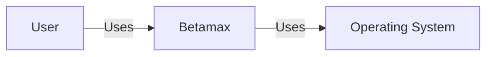
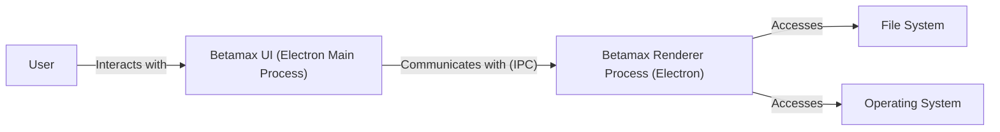
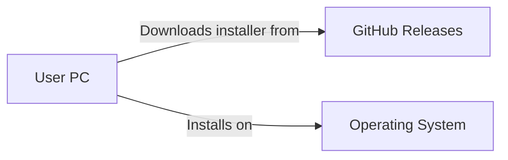
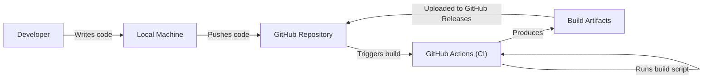

Okay, let's dive into designing a comprehensive document for the Betamax project, suitable for threat modeling.

# BUSINESS POSTURE

Business Priorities and Goals:

*   Provide a simple, user-friendly video/audio recording tool.
*   Offer a cross-platform solution (implied by Electron usage).
*   Enable users to easily capture and potentially share recordings.
*   Minimize external dependencies for ease of deployment and maintenance.
*   Potentially, to serve as a foundation for more advanced features in the future.

Most Important Business Risks:

*   Data Loss: Accidental deletion or corruption of user recordings.
*   Unauthorized Access: Malicious actors gaining access to user recordings.
*   Reputational Damage: Security vulnerabilities or privacy breaches leading to negative user perception.
*   Usability Issues: Difficulty in using the application, leading to user frustration.
*   Legal and Compliance: Potential issues related to recording consent and data privacy regulations (e.g., GDPR, CCPA).

# SECURITY POSTURE

Existing Security Controls:

*   security control: The project is open-source, allowing for community review and contributions (though this is not a guarantee of security). (Described in: Project's GitHub repository)
*   security control: Use of Electron, which inherently includes Chromium's security features (sandboxing, etc., although Electron-specific vulnerabilities are a concern). (Described in: package.json, implicit in Electron usage)
*   security control: Limited external dependencies, reducing the attack surface. (Described in: package.json)

Accepted Risks:

*   accepted risk: Reliance on the underlying operating system's security for file system permissions and access control.
*   accepted risk: Potential for vulnerabilities in Electron itself or its dependencies.
*   accepted risk: Limited built-in mechanisms for user authentication or authorization (as it appears to be a local application).
*   accepted risk: No explicit encryption of recordings at rest.

Recommended Security Controls (High Priority):

*   security control: Implement robust input validation to prevent potential injection attacks or vulnerabilities related to file handling.
*   security control: Consider adding an option for encrypting recordings at rest, especially if users intend to store sensitive information.
*   security control: Regularly update Electron and all dependencies to patch known vulnerabilities.  Automate this process.
*   security control: Conduct a thorough security review of the codebase, focusing on Electron-specific security best practices.
*   security control: Provide clear documentation on security considerations for users, including recommendations for secure storage and sharing of recordings.
*   security control: Implement a mechanism for secure software updates to prevent malicious updates from being installed.

Security Requirements:

*   Authentication:
    *   Currently, the application appears to be designed for local use without user accounts.  If user accounts or cloud storage are added in the future, strong authentication mechanisms (e.g., multi-factor authentication) will be crucial.
*   Authorization:
    *   Currently, authorization is primarily handled by the operating system's file system permissions. If features like sharing or collaboration are added, a more granular authorization model will be needed.
*   Input Validation:
    *   All user inputs, including file paths, recording settings, and any configuration options, must be strictly validated to prevent injection attacks and other vulnerabilities.  This is particularly important for Electron applications.
*   Cryptography:
    *   If sensitive data is stored (e.g., user recordings), encryption at rest should be considered.  If data is transmitted (e.g., to a cloud service), encryption in transit (TLS/SSL) is mandatory.  Key management must be carefully considered.

# DESIGN

## C4 CONTEXT

C4 Context Element Descriptions:

*   Element:
    *   Name: User
    *   Type: Person
    *   Description: A person who wants to record audio or video.
    *   Responsibilities: Initiates recordings, manages recording settings, views/plays recordings, potentially shares recordings.
    *   Security controls: Relies on operating system security and user best practices.
*   Element:
    *   Name: Betamax
    *   Type: Software System
    *   Description: The Betamax application itself.
    *   Responsibilities: Provides the user interface for recording, manages recording processes, interacts with the operating system for file storage and device access.
    *   Security controls: Input validation, dependency management, potential encryption (future).
*   Element:
    *   Name: Operating System
    *   Type: Software System
    *   Description: The underlying operating system (Windows, macOS, Linux).
    *   Responsibilities: Provides access to hardware (camera, microphone), manages file system, enforces system-level security.
    *   Security controls: OS-level security features (file permissions, user accounts, etc.).

## C4 CONTAINER

C4 Container Element Descriptions:

*   Element:
    *   Name: User
    *   Type: Person
    *   Description: A person who wants to record audio or video.
    *   Responsibilities: Initiates recordings, manages recording settings, views/plays recordings, potentially shares recordings.
    *   Security controls: Relies on operating system security and user best practices.
*   Element:
    *   Name: Betamax UI (Electron Main Process)
    *   Type: Container: Desktop Application
    *   Description: The main Electron process, responsible for creating windows and managing application lifecycle.
    *   Responsibilities: Handles application startup and shutdown, creates and manages renderer processes, interacts with the operating system.
    *   Security controls: Limited direct user interaction, acts as a bridge between the user interface and the operating system.
*   Element:
    *   Name: Betamax Renderer Process (Electron)
    *   Type: Container: Browser Window
    *   Description: An Electron renderer process, responsible for rendering the user interface and handling user interactions.
    *   Responsibilities: Displays the UI, handles user input, communicates with the main process via IPC, interacts with the file system and operating system APIs.
    *   Security controls: Input validation, sandboxing (provided by Chromium), careful use of Electron APIs.
*   Element:
    *   Name: File System
    *   Type: Container: File Storage
    *   Description: The local file system where recordings are stored.
    *   Responsibilities: Stores and retrieves recording files.
    *   Security controls: Operating system file permissions.
*   Element:
    *   Name: Operating System
    *   Type: Software System
    *   Description: The underlying operating system.
    *   Responsibilities: Provides access to hardware, manages file system, enforces system-level security.
    *   Security controls: OS-level security features.

## DEPLOYMENT

Possible Deployment Solutions:

1.  Manual Installation: Users download a pre-built package (e.g., .exe, .dmg, .deb) and install it manually.
2.  Package Manager: Distribute through package managers like apt, yum, brew, or chocolatey.
3.  App Store: Distribute through app stores (Microsoft Store, Mac App Store, Snap Store).

Chosen Solution (for detailed description): Manual Installation

Deployment Element Descriptions:

*   Element:
    *   Name: User PC
    *   Type: Desktop Computer
    *   Description: The user's computer where Betamax will be installed.
    *   Responsibilities: Runs the Betamax application.
    *   Security controls: Operating system security, user practices.
*   Element:
    *   Name: GitHub Releases
    *   Type: Web Server
    *   Description: The GitHub Releases page for the Betamax project, hosting the installer files.
    *   Responsibilities: Provides downloadable installer packages.
    *   Security controls: GitHub's security infrastructure, code signing (recommended).
*   Element:
    *   Name: Operating System
    *   Type: Software System
    *   Description: The underlying operating system.
    *   Responsibilities: Provides the environment for Betamax to run.
    *   Security controls: OS-level security features.

## BUILD

Build Process Description:

1.  Developer writes code on their local machine.
2.  Code is pushed to the GitHub repository.
3.  A GitHub Actions workflow is triggered (on push or pull request).
4.  The workflow runs a build script (likely using `electron-builder`).
5.  The build script:
    *   Installs dependencies (`npm install`).
    *   Runs linters and tests (recommended: ESLint, Prettier, unit tests).
    *   Runs security checks (recommended: static analysis tools, dependency vulnerability scanners).
    *   Builds the application for the target platforms (Windows, macOS, Linux).
    *   Packages the application into installers (e.g., .exe, .dmg, .deb).
6.  The build artifacts (installers) are produced.
7.  The workflow uploads the artifacts to GitHub Releases.

Security Controls in Build Process:

*   security control: Use of a CI/CD system (GitHub Actions) for automated builds, ensuring consistency and repeatability.
*   security control: Dependency management using `npm` (and potentially tools like `npm audit` to check for vulnerabilities).
*   security control: (Recommended) Integration of static analysis tools (SAST) into the build process to identify potential security vulnerabilities in the code.
*   security control: (Recommended) Use of linters (e.g., ESLint) to enforce coding standards and identify potential errors.
*   security control: (Recommended) Code signing of the build artifacts to ensure authenticity and prevent tampering.
*   security control: (Recommended) Software Bill of Materials (SBOM) generation to track all components and dependencies.

# RISK ASSESSMENT

Critical Business Processes to Protect:

*   User recording creation and management.
*   Application usability and stability.
*   User data privacy and security.

Data to Protect and Sensitivity:

*   User Recordings (Audio/Video): High sensitivity. These are the primary data created by the application and may contain personal or confidential information.
*   Application Configuration/Settings: Low sensitivity.  May contain user preferences, but likely no sensitive personal data.

# QUESTIONS & ASSUMPTIONS

Questions:

*   Are there any plans for future features, such as cloud storage, sharing, or collaboration? This would significantly impact the security requirements.
*   What is the target user base?  Are there any specific compliance requirements (e.g., HIPAA, FERPA) that need to be considered?
*   What level of security testing has been performed on the application?
*   Is there a process for handling security vulnerabilities reported by users or researchers?
*   What is the expected lifespan of the project, and what is the plan for long-term maintenance and updates?

Assumptions:

*   BUSINESS POSTURE: The primary goal is to provide a simple, functional recording tool.  Profitability is not the primary driver.
*   SECURITY POSTURE: The project has limited security resources.  The focus is on basic security hygiene and addressing the most obvious vulnerabilities.
*   DESIGN: The application is intended for local use, with no network connectivity or user accounts (in its current state). The user is responsible for the security of their own computer and the recordings they create.