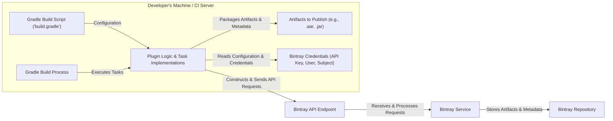

# Project Design Document: Bintray Release Gradle Plugin

**Version:** 1.1
**Date:** October 26, 2023
**Author:** AI Software Architect

## 1. Introduction

This document provides an enhanced design specification for the `bintray-release` Gradle plugin, a tool meticulously crafted to simplify the process of publishing Android libraries and other artifacts to Bintray. This document offers a detailed overview of the plugin's architecture, data flow, and key components, with a particular emphasis on aspects relevant to security and threat modeling. It serves as the foundational document for subsequent security analysis and risk assessment.

## 2. Goals and Non-Goals

### 2.1. Goals

* **Simplified Bintray Publishing:** To offer a highly intuitive and efficient mechanism for developers to publish their software artifacts to Bintray directly from their familiar Gradle build environment.
* **Automated Release Workflow:** To automate the repetitive and error-prone tasks associated with Bintray releases, including version creation, artifact uploading, and final publication.
* **Declarative Configuration:** To enable developers to define their Bintray release configurations directly within their `build.gradle` files, promoting infrastructure-as-code principles.
* **Versatile Artifact Support:** To accommodate the publishing of a wide range of artifact types, encompassing Android Archive (AAR) files, Java Archive (JAR) files, and other generic file formats.
* **Comprehensive Feedback and Status Reporting:** To provide developers with clear and timely feedback throughout the release process, indicating success or failure and offering detailed diagnostic information.
* **Secure Credential Handling:** To ensure secure management and utilization of Bintray API credentials.

### 2.2. Non-Goals

* **Bintray Account and Organization Management:** This plugin is explicitly not intended for managing Bintray accounts, organizations, or user permissions. It assumes the existence of pre-configured Bintray entities.
* **Exposure of Advanced Bintray API Features:** While aiming for robust functionality, the initial design prioritizes core release workflows and may not encompass all less frequently used or highly specialized Bintray API features.
* **Software Dependency Management:** The plugin's scope is strictly limited to the release process and does not extend to managing project dependencies or resolving conflicts.
* **Continuous Integration/Continuous Delivery (CI/CD) Pipeline Orchestration:** Although designed for seamless integration into CI/CD pipelines, the plugin itself does not manage or orchestrate the execution of these pipelines.
* **Artifact Signing:** While crucial for security, the core plugin functionality might not include artifact signing. This could be a potential extension or a responsibility delegated to other Gradle plugins.

## 3. Architectural Overview

The `bintray-release` plugin functions as a standard Gradle plugin, seamlessly integrating into the Gradle build lifecycle by introducing custom tasks and configurations. It interacts with the Bintray REST API to execute release operations.

**Components:**

* **Gradle Build Script (`build.gradle`):** The primary configuration file for the developer's project. It's where the `bintray-release` plugin is applied and its behavior is customized, including specifying Bintray repository details, package information, versioning strategies, and authentication credentials.
* **Gradle Build Process:** The execution environment provided by Gradle, responsible for interpreting the `build.gradle` script and executing the defined tasks, including those provided by the `bintray-release` plugin.
* **Artifacts to Publish:** The compiled output of the build process that is intended for release to Bintray. These can include various file types like Android Archive (AAR) files, Java Archive (JAR) files, or other distributable assets.
* **Bintray Credentials:** The sensitive authentication information required to interact with the Bintray API. This typically includes the Bintray API key, username, and potentially the subject (organization or user) under which the artifacts will be published. Secure storage and access to these credentials are critical.
* **Plugin Logic & Task Implementations:** The core of the `bintray-release` plugin, consisting of the Groovy or Kotlin code that defines the custom Gradle tasks and logic for interacting with the Bintray API. This includes tasks for creating versions, uploading files, and publishing packages.
* **Bintray API Endpoint:** The specific URL of the Bintray REST API that the plugin interacts with to perform release operations.
* **Bintray Service:** The backend infrastructure of Bintray that handles API requests, authenticates users, stores artifacts, and manages repository metadata.
* **Bintray Repository:** The designated storage location within the Bintray service where the published artifacts and their associated metadata are hosted and made available for consumption.

## 4. Data Flow

The process of releasing an artifact to Bintray using this plugin involves a detailed sequence of data flow steps:

```mermaid
graph LR
    subgraph "Developer's Machine / CI Server"
        A["Developer Invokes Gradle Task (e.g., 'bintrayUpload')"]
        B["Gradle Loads Project & Executes Plugin Tasks"]
        C["Plugin Reads Bintray Configuration from 'build.gradle'"]
        D["Plugin Resolves & Retrieves Bintray Credentials"]
        E["Plugin Identifies & Packages Artifacts for Upload"]
        F["Plugin Generates Artifact Metadata (e.g., Version, Description)"]
    end
    G["Plugin Constructs Authenticated Bintray API Request"]
    H["API Request Payload: Artifact Files, Metadata, Credentials"]
    I["Request Sent over HTTPS"]
    J["Bintray API Endpoint Receives Request"]
    K["Bintray API Authenticates Request using Provided Credentials"]
    L["Bintray API Validates Request & Data"]
    M["Bintray Service Processes Request (e.g., Creates Version, Uploads Files)"]
    N["Bintray Service Stores Artifacts & Metadata in Repository"]
    O["Bintray API Sends Response (Success/Failure, Details)"]
    P["Plugin Receives API Response"]
    Q["Plugin Parses Response & Updates Build Status"]
    R["Plugin Provides Feedback to Developer (Console Output, Logs)"]

    A --> B
    B --> C
    C --> D
    B --> E
    B --> F
    D --> G
    E --> G
    F --> G
    G --> H
    H --> I
    I --> J
    J --> K
    K --> L
    L --> M
    M --> N
    M --> O
    O --> P
    P --> Q
    Q --> R
```

**Data Elements:**

* **Bintray Configuration Data:**  The structured information defined within the `build.gradle` file that dictates the release process, including repository details, package naming conventions, versioning schemes, license information, and optional descriptions.
* **Bintray Credentials (API Key, User, Subject):** The sensitive authentication parameters required to authorize API requests to Bintray. The API Key acts as a bearer token for authentication.
* **Artifact Files (Binary Data):** The raw binary content of the software artifacts being published (e.g., the `.aar` or `.jar` file contents).
* **Artifact Metadata:**  Descriptive information about the artifact, such as its version number, a human-readable description, associated licenses, and potentially links to source code or documentation. This metadata is often extracted from the Gradle project configuration or explicitly provided.
* **API Request Headers:**  Standard HTTP headers included in the API request, such as `Content-Type`, `Authorization` (containing the API key), and potentially user-agent information.
* **API Request Payload (JSON/Multipart):** The structured data transmitted in the body of the API request. This typically includes the artifact files themselves (often as multipart form data) and metadata represented in JSON format.
* **HTTPS Communication:** All communication with the Bintray API should be encrypted using HTTPS to protect the confidentiality and integrity of the transmitted data, especially sensitive credentials.
* **API Response (JSON):** The structured response received from the Bintray API, typically in JSON format. This response indicates the success or failure of the requested operation and may include details such as error messages, resource identifiers, or confirmation timestamps.
* **Plugin Logs and Output:**  Diagnostic information generated by the plugin during the release process, including timestamps, API request details, API responses, and any error messages encountered.

## 5. Security Considerations

* **Secure Credential Management:**
    * **Risk:** Hardcoding credentials in `build.gradle` or committing them to version control poses a significant security risk.
    * **Mitigation:** The plugin should strongly encourage and facilitate the use of secure credential storage mechanisms, such as:
        * **Environment Variables:**  Retrieving credentials from environment variables set outside of the project codebase.
        * **Gradle Properties Files:** Using `gradle.properties` (which can be excluded from version control) to store sensitive information.
        * **Credential Stores/Secrets Management Systems:** Integration with external secrets management solutions for more robust security.
    * **Plugin Feature:** The plugin should provide clear documentation and examples on how to use these secure methods.
* **HTTPS for API Communication:**
    * **Requirement:** All communication between the plugin and the Bintray API *must* occur over HTTPS to ensure encryption and prevent eavesdropping or man-in-the-middle attacks.
    * **Verification:** The plugin should enforce HTTPS and potentially verify the SSL/TLS certificate of the Bintray API endpoint.
* **Input Validation and Sanitization:**
    * **Risk:** Malicious or improperly formatted input in `build.gradle` could potentially lead to unexpected behavior or vulnerabilities.
    * **Mitigation:** The plugin should rigorously validate all configuration parameters provided by the user in the `build.gradle` file.
* **Dependency Management Security:**
    * **Risk:** The plugin itself depends on external libraries, which could contain vulnerabilities.
    * **Mitigation:** Regularly update the plugin's dependencies to the latest stable versions to patch any known security flaws. Utilize dependency scanning tools to identify potential vulnerabilities.
* **Error Handling and Information Disclosure:**
    * **Risk:**  Verbose error messages might inadvertently expose sensitive information, such as API keys or internal paths.
    * **Mitigation:** Implement robust error handling that provides informative but sanitized error messages, avoiding the disclosure of sensitive details.
* **Permissions and Access Control:**
    * **Consideration:** The plugin operates within the context of the Gradle build process, inheriting its permissions. Ensure that the build environment has the necessary permissions to access credentials and network resources, but no more than strictly required.
* **Auditing and Logging:**
    * **Best Practice:** Implement comprehensive logging of plugin activities, including API requests and responses (excluding sensitive data like full API keys), to facilitate auditing and troubleshooting.
* **Principle of Least Privilege:**
    * **Guidance:**  When configuring Bintray API keys, adhere to the principle of least privilege, granting only the necessary permissions required for the plugin's operation.

## 6. Assumptions and Constraints

* **Active Bintray Account:** It is a fundamental assumption that the developer utilizing the plugin possesses an active and properly configured Bintray account with the necessary permissions to publish to the intended repository.
* **Reliable Network Connectivity:** The plugin's functionality is contingent upon stable and reliable network connectivity to facilitate communication with the Bintray API.
* **Standard Gradle Environment:** The plugin is designed and tested to operate within a standard and correctly configured Gradle build environment. Compatibility with highly customized or outdated Gradle versions may not be guaranteed.
* **Bintray API Availability and Stability:** The plugin's operation relies on the availability, stability, and proper functioning of the Bintray API. Changes or outages in the Bintray API could impact the plugin's functionality.
* **Secure Development Practices in User Projects:** It is assumed that developers are adhering to secure coding practices within their own projects. The `bintray-release` plugin focuses on the secure release process but does not inherently address vulnerabilities within the artifacts being published.
* **Credentials Provided are Valid and Authorized:** The plugin assumes that the Bintray credentials provided by the user are valid and authorized to perform the requested actions on the specified Bintray repository.

This enhanced design document provides a more detailed and security-focused overview of the `bintray-release` Gradle plugin. It serves as a more robust foundation for understanding the system's architecture, data flow, and security considerations, making it more suitable for comprehensive threat modeling and security analysis.
