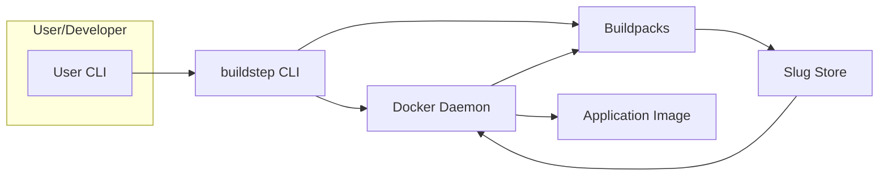
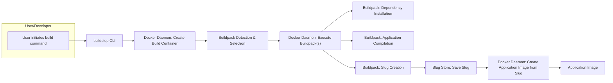

## Project Design Document: Buildstep (Improved)

**1. Introduction**

This document provides an enhanced and detailed design overview of the `buildstep` project (as found at [https://github.com/progrium/buildstep](https://github.com/progrium/buildstep)). It elaborates on the system's architecture, components, and data flow, providing a more robust foundation for subsequent threat modeling activities.

**2. Project Goals and Scope**

* **Goal:** To provide a clear, comprehensive, and more detailed architectural description of `buildstep`, suitable for in-depth threat analysis.
* **Scope:** This document covers the core functionality of `buildstep`, including the build process initiation, buildpack execution, image creation, slug management, and interactions with the underlying Docker environment. It focuses on the logical and physical components and their interactions during the build lifecycle.

**3. High-Level Architecture**

**Description:**

* **User/Developer:**  The entity interacting with `buildstep` to initiate application builds via the command-line interface.
* **buildstep CLI:** The primary command-line tool responsible for receiving user commands, orchestrating the build process, and interacting with the Docker daemon and buildpacks.
* **Docker Daemon:** The background service responsible for building, running, and managing Docker images and containers. It provides the containerization runtime environment.
* **Buildpacks:**  Executable scripts or programs that inspect the application source code, determine the necessary dependencies and build steps, and compile or prepare the application for execution within a Docker container.
* **Slug Store:**  The location where the compiled application artifact (the "slug") is temporarily stored. This can be within the Docker image layers or a dedicated volume.
* **Application Image:** The final, deployable Docker image containing the application, its dependencies, and the necessary runtime environment.

**4. Component Details**

* **buildstep CLI:**
    * **Function:**  Acts as the central control point for the build process, interpreting user commands and coordinating interactions between other components.
    * **Responsibilities:**
        * **Command Parsing and Validation:**  Receives and validates user input, ensuring correct command syntax and parameters.
        * **Docker Image Management:**  Pulls base images, tags intermediate and final images, and manages image lifecycle through the Docker API.
        * **Buildpack Discovery and Execution:**  Identifies and executes relevant buildpacks based on the application's characteristics.
        * **Slug Management:**  Creates, stores, and retrieves the application slug.
        * **Logging and Output Management:**  Captures and displays build process logs and output to the user.
        * **Error Handling:**  Manages and reports errors encountered during the build process.
    * **Key Interactions:**
        * **Docker Daemon:** Communicates with the Docker daemon via the Docker API to initiate container creation, image building, and other Docker operations.
        * **Buildpacks:** Executes buildpack scripts within the build container, providing the application source code as input.
        * **Slug Store:** Reads and writes the compiled application slug to the designated storage location.

* **Docker Daemon:**
    * **Function:**  Provides the core containerization functionality, executing build processes within isolated containers and managing Docker images.
    * **Responsibilities:**
        * **Image Building:**  Constructs Docker images based on Dockerfiles or build contexts provided by `buildstep`.
        * **Container Lifecycle Management:**  Creates, starts, stops, and destroys containers used for the build process.
        * **Resource Management:**  Allocates and manages resources (CPU, memory, etc.) for containers.
        * **Image Storage and Retrieval:**  Stores and retrieves Docker images from local or remote registries.
    * **Key Interactions:**
        * **buildstep CLI:** Receives instructions from the `buildstep` CLI to perform image and container operations.
        * **Buildpacks:** Provides the execution environment for buildpack scripts within build containers.
        * **Slug Store:**  May be the storage location for the slug, depending on the implementation.

* **Buildpacks:**
    * **Function:**  Automate the application build process by detecting the application type, installing dependencies, and preparing the application for execution.
    * **Responsibilities:**
        * **Application Detection:**  Analyzes the application source code to determine the programming language, framework, and required build tools.
        * **Dependency Resolution and Installation:**  Downloads and installs necessary libraries, packages, and runtime components.
        * **Compilation and Asset Preparation:**  Compiles source code, minifies assets, and performs other necessary build steps.
        * **Slug Creation:**  Packages the compiled application and its dependencies into a self-contained artifact (the slug).
        * **Process Type Definition:**  Defines the processes that should be started when the application container is run.
    * **Key Interactions:**
        * **buildstep CLI:**  Executed by the `buildstep` CLI within a build container.
        * **Docker Daemon:** Operates within a container managed by the Docker daemon.
        * **External Package Repositories:** May interact with package managers (e.g., npm, pip, Maven) to download dependencies.
        * **Slug Store:** Writes the generated slug to the designated storage location.

* **Slug Store:**
    * **Function:**  Provides temporary storage for the compiled application artifact (the slug) before it's incorporated into the final Docker image.
    * **Responsibilities:**
        * **Slug Persistence:**  Ensures the slug is stored reliably during the build process.
        * **Slug Access:**  Provides access to the stored slug for the Docker daemon during image creation.
    * **Key Interactions:**
        * **Buildpacks:** Receives the generated slug from the buildpacks.
        * **Docker Daemon:** Provides the slug to the Docker daemon for inclusion in the final application image.

**5. Data Flow**

**Detailed Flow:**

1. **User initiates build command:** The user executes a `buildstep` command, providing the application source code or a reference to it.
2. **buildstep CLI:** The CLI receives the command, parses it, and prepares the build environment.
3. **Docker Daemon: Create Build Container:** The CLI instructs the Docker daemon to create a temporary container to execute the build process. This container typically includes a base image with necessary build tools.
4. **Buildpack Detection & Selection:**  The `buildstep` CLI or the initial buildpack(s) analyze the application source code to determine the appropriate buildpacks to use.
5. **Docker Daemon: Execute Buildpack(s):** The Docker daemon executes the selected buildpacks within the build container.
6. **Buildpack: Dependency Installation:** The buildpack(s) download and install the necessary dependencies for the application, potentially interacting with external package repositories.
7. **Buildpack: Application Compilation:** The buildpack(s) compile the application source code and prepare it for execution.
8. **Buildpack: Slug Creation:** The buildpack(s) package the compiled application and its dependencies into a self-contained artifact known as the "slug."
9. **Slug Store: Save Slug:** The generated slug is saved to the designated Slug Store location.
10. **Docker Daemon: Create Application Image from Slug:** The Docker daemon uses the stored slug and a base image to create the final application Docker image. This often involves adding the slug as a layer in the image.
11. **Application Image:** The resulting Docker image, containing the built application, is ready for deployment.

**6. Security Considerations (For Threat Modeling)**

This section expands on potential security concerns to facilitate more effective threat modeling.

* **Buildpack Integrity and Provenance:**
    * **Risk:** Malicious actors could compromise buildpacks, injecting backdoors, malware, or vulnerabilities into the application image.
    * **Considerations:**
        * **Buildpack Verification:** Implement mechanisms to verify the authenticity and integrity of buildpacks (e.g., digital signatures, checksums).
        * **Trusted Sources:**  Restrict the use of buildpacks to trusted and well-maintained sources.
        * **Buildpack Sandboxing:** Isolate buildpack execution to limit the impact of potential compromises.
* **Dependency Vulnerabilities:**
    * **Risk:**  The build process might introduce dependencies with known security vulnerabilities.
    * **Considerations:**
        * **Dependency Scanning:** Integrate vulnerability scanning tools into the build process to identify and flag vulnerable dependencies.
        * **Software Bill of Materials (SBOM):** Generate SBOMs to track the components included in the final image.
        * **Dependency Pinning:** Encourage or enforce the pinning of dependency versions to avoid unexpected updates with vulnerabilities.
* **Source Code Exposure:**
    * **Risk:**  Sensitive information within the source code could be exposed during the build process or in the final image.
    * **Considerations:**
        * **Secure Source Code Handling:** Ensure secure storage and transfer of source code.
        * **Secret Management:** Implement secure mechanisms for handling secrets and credentials during the build process (e.g., using environment variables or dedicated secret management tools).
        * **Avoid Embedding Secrets:**  Prevent embedding secrets directly in the source code.
* **Docker Daemon Security:**
    * **Risk:**  A compromised Docker daemon could allow attackers to gain control over the build process and the resulting images.
    * **Considerations:**
        * **Regular Updates:** Keep the Docker daemon updated with the latest security patches.
        * **Secure Configuration:** Follow Docker security best practices for daemon configuration.
        * **Access Control:** Restrict access to the Docker daemon.
* **Slug Store Security:**
    * **Risk:**  Unauthorized access to the Slug Store could allow attackers to modify or replace the compiled application.
    * **Considerations:**
        * **Access Controls:** Implement appropriate access controls on the Slug Store location.
        * **Integrity Checks:**  Use checksums or other mechanisms to verify the integrity of the stored slug.
* **buildstep CLI Security:**
    * **Risk:**  Vulnerabilities in the CLI could be exploited to execute arbitrary commands or manipulate the build process.
    * **Considerations:**
        * **Input Validation:**  Thoroughly validate user input to prevent command injection attacks.
        * **Secure Coding Practices:**  Adhere to secure coding practices during CLI development.
        * **Regular Updates:** Keep the `buildstep` CLI updated with security patches.
* **Network Security during Build:**
    * **Risk:**  Man-in-the-middle attacks could compromise downloaded dependencies or other external resources.
    * **Considerations:**
        * **HTTPS Enforcement:** Ensure all communication with external resources (e.g., package repositories) uses HTTPS.
        * **Certificate Verification:**  Verify the authenticity of SSL/TLS certificates.
* **Logging and Auditing:**
    * **Risk:**  Insufficient logging can hinder incident response and security investigations.
    * **Considerations:**
        * **Comprehensive Logging:** Log all significant build activities, including buildpack execution, dependency downloads, and image creation.
        * **Secure Log Storage:** Store logs securely and protect them from unauthorized access or modification.

**7. Future Considerations (Beyond Initial Scope)**

* **Caching Mechanisms and Security:** How are build layers and dependencies cached? What are the risks associated with cache poisoning or insecure cache storage?
* **Multi-Tenancy Security:** If `buildstep` is used in a multi-tenant environment, how is isolation enforced between different users' builds to prevent cross-tenant contamination or information leakage?
* **Integration with CI/CD Systems Security:** How are credentials and access tokens managed when `buildstep` is integrated with CI/CD pipelines? What are the potential security implications of these integrations?
* **Custom Buildpack Management and Security:** How are custom buildpacks registered, managed, and secured? Are there mechanisms to scan custom buildpacks for vulnerabilities?
* **Supply Chain Security:** How does `buildstep` contribute to the overall software supply chain security? Are there mechanisms to track the provenance of the final application image?

**8. Conclusion**

This improved design document provides a more detailed and comprehensive architectural overview of the `buildstep` project. By elaborating on the components, data flow, and security considerations, it offers a stronger foundation for conducting thorough threat modeling and implementing appropriate security measures. The expanded security considerations section highlights key areas of potential risk that should be addressed to ensure the security and integrity of the application build process.
