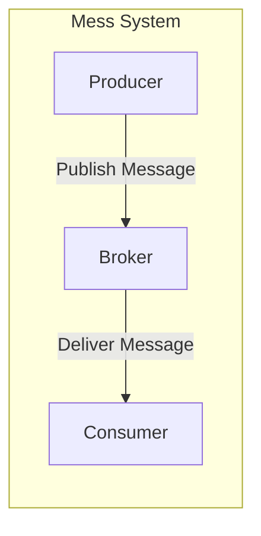
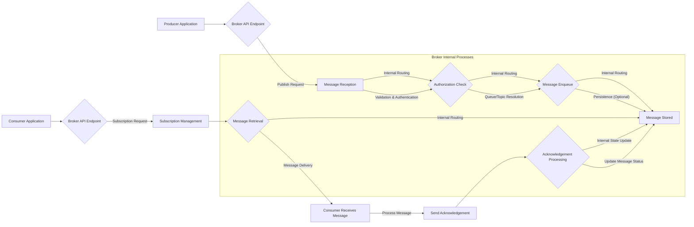

# Project Design Document: Mess - Lightweight Message Queue

**Version:** 1.1
**Date:** October 26, 2023
**Prepared By:** AI Software Architect

## 1. Introduction

This document provides an enhanced and more detailed design overview of the Mess project, a lightweight message queue system as found in the provided GitHub repository: [https://github.com/eleme/Mess](https://github.com/eleme/Mess). This revised document aims to provide an even clearer and more comprehensive articulation of the system's architecture, components, and data flow to facilitate a more in-depth threat modeling exercise. It will serve as a refined reference point for understanding the system's inner workings and identifying potential security vulnerabilities.

## 2. Goals and Scope

The primary goal of this document remains to provide a clear and detailed architectural description of Mess. The scope is expanded to include more granular details about component interactions and potential implementation choices. The scope includes:

*   High-level system architecture and component interaction with more detail.
*   Detailed descriptions of key components and their responsibilities, including potential internal mechanisms.
*   Refined data flow diagrams illustrating message processing with more specific steps.
*   More detailed deployment considerations and their implications.
*   Identification of technologies used with greater specificity.

This document continues to focus on the core functionality of the message queue and avoids delving into specific implementation details within the Go code unless they are crucial for understanding the architecture and potential security implications.

## 3. System Overview

Mess is designed as a distributed message queue system facilitating asynchronous communication between applications. It follows a traditional producer-consumer model, with brokers acting as intermediaries. The system aims to provide reliable, ordered (potentially), and efficient message delivery.



Key components of the Mess system include:

*   **Producer:** An application or service that creates and sends messages to the message queue. Producers are agnostic of the consumers.
*   **Broker:** The central component responsible for receiving messages from producers, storing them, and delivering them to the appropriate consumers. It manages queues, topics, and consumer subscriptions.
*   **Consumer:** An application or service that subscribes to specific topics or queues and receives messages from the broker for processing.

## 4. Component Details

This section provides a more detailed description of each key component within the Mess system, including potential internal mechanisms.

### 4.1. Broker

The Broker is the core of the Mess system, handling the complexities of message management. Its responsibilities include:

*   **Receiving Messages:** Accepting messages from producers via network protocols (e.g., TCP, potentially with protocols like gRPC or a custom binary protocol).
    *   **Message Validation:** Performing initial validation of incoming messages (e.g., size limits, format).
*   **Message Storage:** Persisting messages to durable storage (e.g., disk-based queue, embedded database like BoltDB, or a separate database). In-memory storage might be an option for non-persistent queues.
    *   **Queue Structures:** Managing the underlying data structures for queues (e.g., append-only logs, linked lists).
*   **Queue and Topic Management:** Creating, deleting, and managing queues or topics. This includes handling configuration and metadata for each queue/topic.
*   **Consumer Management:** Tracking active consumers, their subscriptions to specific queues/topics, and their connection status.
    *   **Subscription Persistence:** Storing consumer subscriptions to ensure messages are delivered even after consumer restarts.
*   **Message Delivery:**  Pushing messages to subscribed consumers based on the delivery semantics (e.g., at-least-once, at-most-once). This might involve:
    *   **Message Ordering:** Maintaining message order within a queue if required.
    *   **Message Filtering:** Potentially filtering messages based on consumer-specific criteria (if implemented).
*   **Acknowledgement Handling:** Managing message acknowledgements (ACKs) from consumers to track message processing status and handle redelivery in case of failures.
    *   **Dead-Letter Queues (DLQ):**  Potentially implementing DLQs for messages that fail to be processed after multiple attempts.
*   **Clustering (Potential):** Coordinating with other brokers in a cluster for high availability, fault tolerance, and increased throughput. This involves:
    *   **Leader Election:**  Electing a leader broker for coordination (e.g., using Raft or Paxos).
    *   **Data Replication:** Replicating messages across brokers for redundancy.
    *   **Partitioning:**  Distributing queues or topics across multiple brokers.
*   **API Endpoints:** Providing APIs for producers to publish messages and for consumers to subscribe and receive messages. These could be HTTP-based, gRPC, or custom protocols.

### 4.2. Producer

The Producer focuses on the task of sending messages to the broker. Its responsibilities include:

*   **Message Creation:** Generating messages, potentially serializing data into a specific format (e.g., JSON, Protocol Buffers).
*   **Connecting to Broker(s):** Establishing a persistent connection or opening connections as needed to one or more brokers. This might involve:
    *   **Broker Discovery:**  Mechanisms to discover available brokers (e.g., configuration, DNS lookup, service discovery).
    *   **Connection Pooling:**  Managing a pool of connections for efficiency.
*   **Message Publishing:** Sending messages to a specific topic or queue on the broker. This involves:
    *   **Message Routing:**  Specifying the target queue or topic for the message.
    *   **Protocol Handling:**  Formatting the message according to the broker's expected protocol.
*   **Acknowledgement Handling (Optional):**  Receiving confirmation from the broker that a message has been successfully received and potentially persisted. This allows for different levels of delivery guarantees.
*   **Error Handling:** Implementing logic to handle connection errors and message sending failures, potentially including retry mechanisms.

### 4.3. Consumer

The Consumer is responsible for receiving and processing messages from the broker. Its responsibilities include:

*   **Connecting to Broker(s):** Establishing a connection with one or more brokers. Similar to producers, this might involve broker discovery and connection management.
*   **Subscribing to Topics/Queues:** Registering interest in receiving messages from specific topics or queues. This involves:
    *   **Subscription Management:**  Potentially allowing consumers to dynamically subscribe and unsubscribe.
    *   **Subscription Types:**  Supporting different subscription models (e.g., exclusive consumer, shared subscription).
*   **Message Reception:** Receiving messages pushed by the broker. This might involve:
    *   **Long Polling:**  Maintaining an open connection to the broker and waiting for messages.
    *   **WebSockets:**  Using WebSockets for bidirectional communication.
    *   **Push Notifications:**  The broker actively pushing messages to the consumer.
*   **Message Processing:**  Executing business logic based on the content of the received message.
*   **Acknowledgement Sending:** Informing the broker about the success or failure of message processing.
    *   **Automatic vs. Manual Acknowledgements:** Supporting different acknowledgement modes.
    *   **Negative Acknowledgements (NACKs):**  Indicating that a message could not be processed, potentially triggering redelivery.
*   **Error Handling:**  Implementing mechanisms to handle message processing errors and communicate failures to the broker.

## 5. Data Flow

The typical data flow within the Mess system, with more detailed steps, can be described as follows:



Detailed steps in the data flow:

1. **Producer sends message:** The producer application sends a message publish request to the broker's API endpoint (e.g., HTTP endpoint, gRPC service).
2. **Broker receives message:** The broker receives the message publish request.
3. **Validation & Authentication:** The broker validates the message format and authenticates the producer (verifying its identity).
4. **Authorization Check:** The broker checks if the authenticated producer is authorized to publish to the specified queue or topic.
5. **Queue/Topic Resolution:** The broker determines the specific queue or topic the message should be added to.
6. **Message Enqueue:** The message is added to the in-memory queue or buffer for the target topic/queue.
7. **Persistence (Optional):** If persistence is enabled, the message is written to durable storage (e.g., disk).
8. **Message Stored:** The message is now stored and awaiting delivery.
9. **Consumer connects and subscribes:** The consumer application connects to a broker and sends a subscription request for a specific topic or queue.
10. **Subscription Management:** The broker registers the consumer's subscription.
11. **Message Retrieval:** When a message is available in a subscribed queue and ready for delivery to a consumer, the broker retrieves it.
12. **Message Delivery:** The broker delivers the message to the consumer application (e.g., via long polling response, WebSocket message).
13. **Consumer processes message:** The consumer application receives and processes the message.
14. **Acknowledgement sent:** The consumer application sends an acknowledgement (ACK) or negative acknowledgement (NACK) back to the broker.
15. **Acknowledgement Processing:** The broker receives the acknowledgement.
16. **Update Message Status:** The broker updates the message status based on the acknowledgement (e.g., removes it from the queue if ACKed, marks for redelivery if NACKed or timed out).

## 6. Deployment Architecture

Mess can be deployed in various configurations, each with its own trade-offs in terms of complexity, scalability, and availability.

*   **Single Broker Instance:** A single instance of the broker handles all messages. This is simple to set up but represents a single point of failure and has limited scalability.
    *   **Use Cases:** Development, testing, very low-traffic environments.
    *   **Limitations:** No redundancy, limited throughput.
*   **Clustered Brokers:** Multiple broker instances work together as a single logical unit. This provides high availability and scalability.
    *   **Leader-Follower Architecture:** One broker acts as the leader, handling writes, while followers replicate data.
    *   **Peer-to-Peer Architecture:** Brokers communicate directly to maintain consistency.
    *   **Use Cases:** Production environments requiring high availability and scalability.
    *   **Considerations:** Requires a consensus mechanism (e.g., Raft, Paxos), more complex setup and management.
*   **Load Balancer with Brokers:** A load balancer distributes traffic across multiple independent broker instances. This increases throughput but might require careful consideration of message ordering and consistency if not using a clustered setup.
    *   **Use Cases:** Scaling out read traffic, distributing load.
    *   **Considerations:** Message ordering might be affected if not using sticky sessions or consistent hashing.
*   **Containerized Deployment (e.g., Docker, Kubernetes):** Deploying brokers within containers allows for easier scaling, management, and resource utilization. Orchestration platforms like Kubernetes can automate deployment, scaling, and health checks.
    *   **Use Cases:** Modern cloud-native deployments.
    *   **Considerations:** Requires familiarity with containerization technologies.

```mermaid
graph LR
    subgraph "Single Broker Deployment"
        B["Broker Instance"]
    end
    P["Producer"] --> B
    C["Consumer"] --> B

    subgraph "Clustered Broker Deployment"
        subgraph "Broker Cluster"
            B1["Broker Instance 1"]
            B2["Broker Instance 2"]
            B3["Broker Instance 3"]
        end
    end
    P -- "Connects to Cluster" --> "Broker Cluster"
    "Broker Cluster" --> C -- "Connects to Cluster"

    subgraph "Load Balanced Brokers"
        LB["Load Balancer"]
        B4["Broker Instance A"]
        B5["Broker Instance B"]
        B6["Broker Instance C"]
    end
    P --> LB
    LB --> B4
    LB --> B5
    LB --> B6
    C --> LB
```

## 7. Security Considerations (Detailed)

This section expands on the initial security considerations, providing more specific examples of potential threats and mitigation strategies.

*   **Authentication and Authorization:**
    *   **Threats:** Unauthorized producers sending malicious messages, unauthorized consumers accessing sensitive data.
    *   **Considerations:** Implementing mechanisms to verify the identity of producers and consumers (e.g., API keys, TLS client certificates, OAuth 2.0). Implementing fine-grained authorization to control which producers can publish to which topics/queues and which consumers can subscribe to them.
*   **Message Confidentiality:**
    *   **Threats:** Sensitive message data being intercepted during transmission or accessed from storage.
    *   **Considerations:** Using TLS/SSL to encrypt communication between producers/consumers and brokers. Encrypting messages at rest in storage. Consider end-to-end encryption where the broker does not have access to the decrypted message content.
*   **Message Integrity:**
    *   **Threats:** Messages being tampered with during transmission or storage.
    *   **Considerations:** Using message signing or hashing to ensure message integrity. TLS/SSL also provides integrity checks.
*   **Broker Security:**
    *   **Threats:** Unauthorized access to the broker server, leading to data breaches or service disruption.
    *   **Considerations:** Securing the underlying operating system and network infrastructure. Implementing strong access control to broker configuration files and administrative interfaces. Regularly patching and updating the broker software.
*   **Denial of Service (DoS) Protection:**
    *   **Threats:** Attackers overwhelming the broker with a large number of messages or connections, making it unavailable.
    *   **Considerations:** Implementing rate limiting for producers and consumers. Setting limits on message sizes and queue lengths. Using connection throttling. Employing techniques like SYN cookies to mitigate SYN flood attacks.
*   **Inter-Broker Communication Security (for clustered deployments):**
    *   **Threats:** Malicious actors intercepting or tampering with communication between brokers in a cluster.
    *   **Considerations:** Encrypting communication between brokers (e.g., using TLS). Authenticating brokers to each other.
*   **Data Validation:**
    *   **Threats:** Malicious or malformed messages causing errors or vulnerabilities in consumers or the broker.
    *   **Considerations:** Implementing robust message validation on the broker side. Consumers should also validate messages they receive.
*   **Logging and Auditing:**
    *   **Threats:** Security incidents going undetected due to lack of logging.
    *   **Considerations:** Logging security-related events, such as authentication attempts, authorization failures, and administrative actions. Securely storing and regularly reviewing logs.

## 8. Technologies Used

Based on common message queue implementations and the nature of the project, the following technologies are likely used or could be considered:

*   **Go Programming Language:** The primary implementation language.
*   **Networking Libraries (Go Standard Library `net` package):** For handling network communication.
*   **Potentially gRPC:** For defining API contracts and efficient communication between components.
*   **Potentially HTTP/REST:** As an alternative API for simpler interactions.
*   **Message Serialization Formats (e.g., JSON, Protocol Buffers, MessagePack):** For encoding and decoding message payloads.
*   **Persistence Mechanisms:**
    *   **Disk-based Queues (Custom Implementation):**  Writing messages to files on disk.
    *   **Embedded Key-Value Stores (e.g., BoltDB, BadgerDB):** For storing messages and metadata.
    *   **Relational Databases (e.g., PostgreSQL, MySQL):** For more robust persistence and querying capabilities.
*   **Concurrency Primitives (Go Goroutines and Channels):** For handling concurrent message processing.
*   **Potentially a Consensus Algorithm Implementation (e.g., Raft library):** For coordination and leader election in a clustered environment.
*   **Testing Frameworks (Go's `testing` package):** For unit and integration tests.

## 9. Future Considerations

Potential future enhancements or changes that could impact the design and security include:

*   **Enhanced Security Features:** Implementation of more advanced authentication methods (e.g., Kerberos), more granular authorization policies (e.g., attribute-based access control), and integration with security information and event management (SIEM) systems.
*   **Message Encryption:** Adding built-in support for encrypting message payloads using standardized encryption algorithms.
*   **Improved Monitoring and Observability:**  Integrating with monitoring tools (e.g., Prometheus, Grafana) to expose key metrics and provide dashboards for system health and performance. Implementing distributed tracing for request tracking.
*   **Support for Different Message Delivery Semantics:** Implementing features like exactly-once delivery using techniques like idempotent message processing and transaction coordination.
*   **Schema Registry Integration:** Integrating with a schema registry to manage message schemas and ensure compatibility between producers and consumers.
*   **Pluggable Authentication/Authorization Modules:** Allowing for easier integration with different authentication and authorization providers.

This revised document provides a more detailed and comprehensive overview of the Mess project's architecture. This enhanced information will be invaluable for conducting a more thorough and effective threat modeling exercise to identify potential security vulnerabilities and design appropriate mitigation strategies.