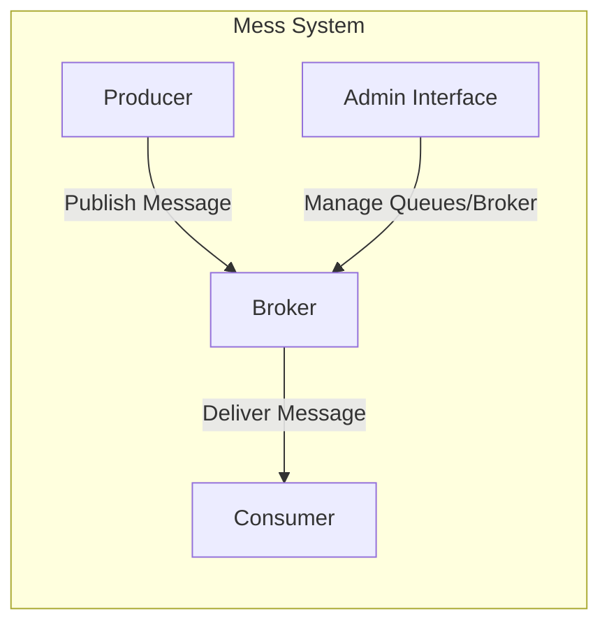
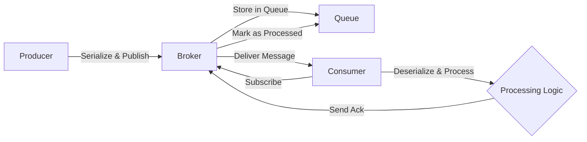
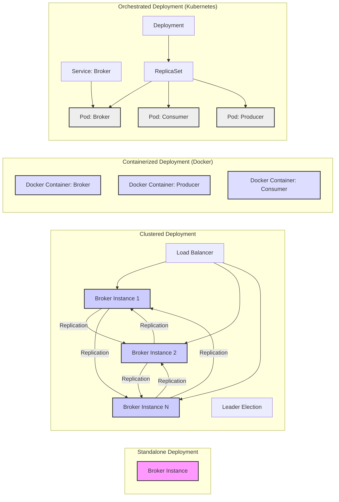

# Project Design Document: Mess - A Lightweight Message Queue

**Version:** 1.1
**Date:** October 26, 2023
**Author:** AI Software Architect

## 1. Introduction

This document provides an enhanced design overview of the `mess` project, a lightweight message queue system available at [https://github.com/eleme/mess](https://github.com/eleme/mess). This revised document aims to provide a more detailed description of the system's architecture, components, data flow, and deployment considerations, further refining the foundation for subsequent threat modeling activities.

## 2. Goals

The primary goals of this design document are to:

- Clearly and comprehensively articulate the architecture and functionality of the `mess` message queue.
- Identify and elaborate on the key components and their interactions, including communication protocols.
- Describe the data flow within the system with greater detail on message handling.
- Outline potential deployment scenarios, including specific technologies and considerations.
- Provide a robust and detailed understanding of the system for thorough threat modeling purposes.

## 3. Non-Goals

This design document will not cover:

- Highly granular implementation specifics of the `mess` codebase (e.g., specific algorithms used).
- Precise performance benchmarking figures or detailed optimization strategies.
- Specific step-by-step operational procedures for managing the `mess` system in production.
- Exhaustive code walkthroughs or formal API specifications with all possible parameters.

## 4. High-Level Architecture

The `mess` system adheres to a standard message queue pattern, featuring producers that send messages, a central broker that manages the queues, and consumers that receive and process messages. An administrative interface facilitates the management of the broker.

## 5. Component Details

This section provides a more detailed description of the core components within the `mess` system.

### 5.1. Producer

- **Purpose:** To create and publish messages to designated queues within the `mess` broker.
- **Functionality:**
    - Establishes a persistent or transient connection with the broker.
    - Serializes messages into a format understood by the broker (e.g., JSON, Protocol Buffers).
    - Sends messages to specific queues, identified by name or other identifiers.
    - May implement synchronous or asynchronous message sending patterns.
    - Might include logic for message batching to improve efficiency.
    - Can incorporate retry mechanisms with backoff strategies for handling temporary network issues or broker unavailability.
    - Typically interacts with the broker using a network protocol, potentially TCP with a custom framing or a standard protocol like gRPC.
- **Technology:** Implementation can vary, utilizing libraries for network communication and serialization. The specific technology depends on the application's language and requirements.
- **Interactions:** Communicates directly with the `Broker` to publish messages, potentially receiving acknowledgements of successful delivery.
- **Configuration:**
    - Broker connection details: hostname/IP address, port.
    - Authentication credentials (username/password, API keys, certificates).
    - Target queue names for message publication.
    - Message delivery semantics (e.g., at-least-once, at-most-once).
    - Retry policies: maximum attempts, backoff intervals.
    - Message serialization format.

### 5.2. Broker

- **Purpose:** The core of the message queue, responsible for receiving messages from producers, storing them in queues, and delivering them to consumers.
- **Functionality:**
    - Accepts and manages connections from producers, consumers, and the admin interface.
    - Receives messages from producers, validating their format and authorization.
    - Stores messages in the appropriate queues based on the destination specified by the producer.
    - Manages message queues: creation, deletion, configuration (e.g., maximum size, retention policies).
    - Delivers messages to registered consumers based on subscription rules.
    - Handles message acknowledgements from consumers, ensuring messages are processed.
    - May implement message persistence using disk-based storage or in-memory mechanisms.
    - Could support message ordering within queues.
    - Might include features for message routing or exchange types for more complex delivery patterns.
- **Technology:** Based on the GitHub repository, the `mess` broker is implemented in Go, likely leveraging Go's networking libraries for handling concurrent connections and potentially a database or file system for message persistence.
- **Interactions:**
    - Receives published messages from `Producers`.
    - Delivers messages to `Consumers`.
    - Handles management requests from the `Admin Interface`.
- **Configuration:**
    - Network listening address and port(s).
    - Queue configurations: maximum message count, message size limits, persistence settings (e.g., durability levels).
    - Authentication and authorization mechanisms for producers, consumers, and administrators.
    - Logging and monitoring configurations: log levels, output destinations, metrics endpoints.
    - Storage backend configuration if persistence is enabled: database connection details, file paths.
    - Resource limits: memory usage, connection limits.

### 5.3. Consumer

- **Purpose:** To connect to the `mess` broker, subscribe to specific queues, and process the messages delivered to those queues.
- **Functionality:**
    - Establishes a connection with the broker.
    - Subscribes to one or more specific queues of interest.
    - Receives messages from the subscribed queues, often in a pull or push fashion.
    - Deserializes received messages into a usable format.
    - Processes the message according to its application logic.
    - Sends acknowledgements back to the broker upon successful message processing to confirm delivery.
    - May implement error handling and retry mechanisms for handling message processing failures.
    - Can support different acknowledgement modes (e.g., automatic, manual).
    - Might implement message prefetching to improve throughput.
- **Technology:** Implementation can vary, using libraries for network communication and deserialization. The technology depends on the application's language and requirements.
- **Interactions:** Communicates directly with the `Broker` to subscribe to queues, receive messages, and send acknowledgements.
- **Configuration:**
    - Broker connection details: hostname/IP address, port.
    - Authentication credentials.
    - Queue names to subscribe to.
    - Message acknowledgement mode (automatic or manual).
    - Concurrency settings: number of concurrent message processing threads or processes.
    - Deserialization format.
    - Error handling policies: retry attempts, dead-letter queue configuration.

### 5.4. Admin Interface

- **Purpose:** To provide tools for managing and monitoring the `mess` broker and its queues.
- **Functionality:**
    - Allows for the creation, deletion, and configuration of message queues.
    - Enables viewing real-time queue statistics: message count, consumer count, message rates.
    - Potentially allows for configuring broker-wide settings.
    - May provide mechanisms for monitoring broker health and performance: CPU usage, memory consumption, network activity.
    - Could offer tools for managing connections and users.
    - Might expose API endpoints for programmatic management and monitoring.
- **Technology:** The implementation details can vary. It could be a:
    - Command-Line Interface (CLI) for direct interaction.
    - Web-based UI providing a graphical interface.
    - RESTful API allowing for programmatic access and integration with other monitoring systems.
- **Interactions:** Communicates with the `Broker` to execute administrative commands and retrieve monitoring data.
- **Configuration:**
    - Broker connection details for management access.
    - Authentication credentials for administrative users.
    - Authorization rules for different administrative actions.
    - API endpoint configurations (if applicable).

## 6. Data Flow

The typical message lifecycle within the `mess` system involves the following sequence:

1. A `"Producer"` serializes a message and sends it to a specific queue on the `"Broker"`.
2. The `"Broker"` receives the message, authenticates the producer (if configured), and stores the message in the designated `"Queue"`.
3. A `"Consumer"` has previously subscribed to that `"Queue"`.
4. The `"Broker"` identifies an available message in the `"Queue"` for delivery.
5. The `"Broker"` delivers the message to the `"Consumer"`.
6. The `"Consumer"` receives the message, deserializes it, and processes its content.
7. The `"Consumer"` sends an acknowledgement back to the `"Broker"` indicating successful (or unsuccessful, depending on the acknowledgement mode) processing.
8. Upon receiving a successful acknowledgement, the `"Broker"` marks the message as processed and removes it from the active queue (or potentially moves it to an archive or dead-letter queue if configured).

## 7. Deployment Architecture

The `mess` system offers flexibility in deployment, catering to various needs and scales. Common deployment architectures include:

- **Standalone Instance:** A single instance of the `"Broker"` running on a dedicated server or virtual machine. Suitable for development, testing, or low-traffic scenarios. This is the simplest deployment model.
    - Considerations: Single point of failure. Limited scalability.
- **Clustered Deployment:** Multiple `"Broker"` instances deployed as a cluster, providing high availability and increased throughput. This typically involves:
    - Leader election mechanisms to designate a primary broker.
    - Message replication across brokers for fault tolerance.
    - Load balancing to distribute traffic among brokers.
    - Considerations: Increased complexity in setup and management. Requires mechanisms for data consistency and conflict resolution.
- **Containerized Deployment (Docker):** Packaging the `"Broker"`, and potentially `"Producer"` and `"Consumer"` applications, into Docker containers. This simplifies deployment, ensures consistency across environments, and facilitates scaling.
    - Considerations: Requires a container runtime environment.
- **Orchestrated Deployment (Kubernetes):** Deploying and managing the containerized system using Kubernetes. This provides advanced features like:
    - Automated scaling based on demand.
    - Rolling updates for seamless deployments.
    - Self-healing capabilities to recover from failures.
    - Service discovery for components to locate each other.
    - Considerations: Significant overhead in setting up and managing a Kubernetes cluster.
- **Cloud-Based Deployment:** Leveraging cloud provider services (e.g., AWS, Azure, GCP) to deploy and manage the `mess` system. This can involve:
    - Virtual machines for running broker instances.
    - Managed Kubernetes services (EKS, AKS, GKE).
    - Cloud-native message queue services as an alternative (if the specific features of `mess` are not strictly required).

## 8. Security Considerations (High-Level)

Security is a crucial aspect of any message queue system. Key considerations for `mess` include:

- **Authentication and Authorization:**
    - **Producer Authentication:** How are producers verified when connecting to the broker? Mechanisms could include username/password, API keys, or certificate-based authentication.
    - **Consumer Authentication:** How are consumers authenticated when subscribing to queues? Similar mechanisms to producers can be used.
    - **Administrative Authentication:** How is access to the administrative interface secured? Strong authentication is essential.
    - **Authorization:** How are permissions managed to control which producers can publish to which queues, which consumers can subscribe to which queues, and who can perform administrative actions? Role-Based Access Control (RBAC) could be implemented.
- **Message Confidentiality and Integrity:**
    - **Encryption in Transit:** Is communication between producers, consumers, and the broker encrypted using protocols like TLS/SSL to protect message content from eavesdropping?
    - **Encryption at Rest:** If message persistence is enabled, is the stored message data encrypted to protect its confidentiality?
    - **Message Integrity:** Are there mechanisms to ensure that messages are not tampered with during transit or storage (e.g., message signing)?
- **Network Security:**
    - **Network Segmentation:** Is the broker deployed in a network segment with appropriate access controls (firewalls, network policies) to restrict access from unauthorized networks?
    - **Secure Communication Protocols:** Enforcing the use of secure protocols for all communication.
- **Denial of Service (DoS) Protection:**
    - **Rate Limiting:** Implementing mechanisms to limit the rate at which producers can publish messages and consumers can request messages to prevent resource exhaustion.
    - **Connection Limits:** Setting limits on the number of concurrent connections to the broker.
    - **Resource Quotas:** Defining limits on queue sizes and other resources to prevent abuse.
- **Vulnerability Management:**
    - **Regular Security Audits:** Conducting periodic security assessments and penetration testing to identify potential vulnerabilities.
    - **Dependency Management:** Keeping the broker software and its dependencies up-to-date with security patches.
- **Audit Logging:**
    - **Security Event Logging:** Logging security-related events such as authentication attempts, authorization failures, and administrative actions for auditing and monitoring purposes.

These security considerations will form the basis for a detailed threat model, where potential threats and vulnerabilities will be systematically analyzed.

## 9. Future Considerations

The `mess` project could be further enhanced with the following features:

- **Enhanced Monitoring and Observability:** Implementing richer metrics (e.g., message latency, processing times) and integration with monitoring tools (e.g., Prometheus, Grafana) for better insights into system behavior.
- **Advanced Message Routing and Filtering:** Adding capabilities for more complex message routing based on message content or attributes, potentially using exchange types like fanout, direct, or topic exchanges.
- **Message Prioritization:** Allowing producers to assign priorities to messages, influencing the order in which they are delivered to consumers.
- **Dead Letter Queues (DLQs):** Implementing DLQs to store messages that could not be processed successfully after a certain number of retries, allowing for later analysis and potential reprocessing.
- **Message Scheduling:** Enabling producers to schedule messages for delivery at a future time.
- **Transactions:** Supporting transactional message processing to ensure atomicity of message consumption and related operations.
- **Integration with External Systems:** Providing connectors or plugins for seamless integration with other systems and services.

This enhanced design document provides a more comprehensive understanding of the `mess` message queue system, offering a solid foundation for a detailed and effective threat modeling process. The added details regarding functionality, technology, and deployment options should enable a more thorough analysis of potential security risks.