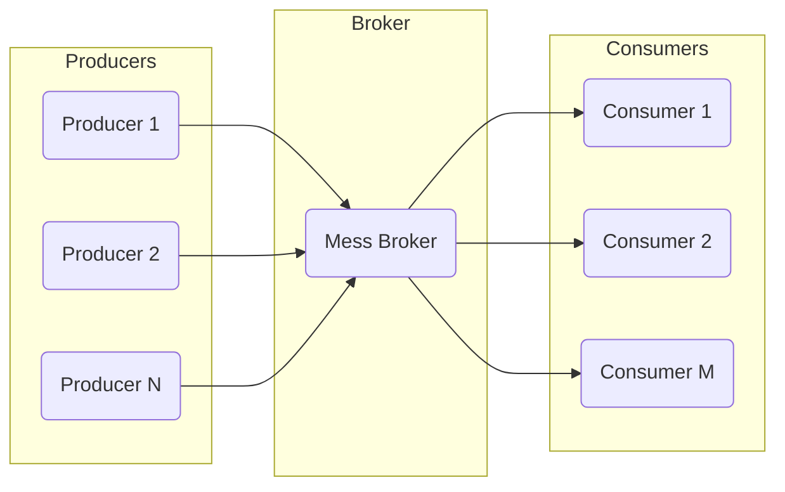
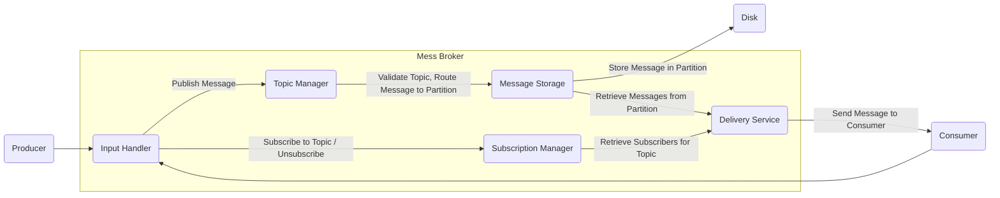

## Project Design Document: Mess - Lightweight Message Queue

**Version:** 1.1
**Date:** October 26, 2023
**Author:** AI Software Architect

### 1. Introduction

This document provides a detailed design overview of the `mess` project, a lightweight message queue system. This document aims to clearly articulate the system's architecture, components, and data flow, serving as a foundation for subsequent threat modeling activities. The information presented here is based on the project repository: [https://github.com/eleme/mess](https://github.com/eleme/mess). This revision includes more detail on component responsibilities and potential security considerations.

### 2. Goals and Non-Goals

* **Goals:**
    * Provide a simple and efficient message queue system suitable for internal service communication.
    * Support fundamental publish/subscribe messaging patterns for decoupling services.
    * Offer basic message persistence to ensure messages are not lost in case of broker restarts.
    * Be lightweight and easy to deploy, minimizing operational overhead.
    * Facilitate asynchronous communication between services, improving responsiveness and resilience.

* **Non-Goals:**
    * Implement advanced message routing based on content or complex criteria.
    * Provide strict, total message ordering guarantees across all topics and partitions (focus is on FIFO within a partition).
    * Offer enterprise-grade features such as distributed transactions spanning multiple brokers or sophisticated security models with fine-grained access control (at this initial stage).
    * Support a wide array of client libraries; the focus is on a core, well-defined protocol.

### 3. System Architecture

The `mess` system follows a standard message queue architecture with distinct roles for producers, the central broker, and consumers.

#### 3.1. High-Level Architecture

* **Producers:** Applications or services that generate and send messages to specific topics within the message queue.
* **Broker:** The core component responsible for receiving messages from producers, storing them (potentially persistently), and delivering them to subscribed consumers.
* **Consumers:** Applications or services that subscribe to specific topics and receive messages published to those topics.

#### 3.2. Detailed Broker Architecture

The `Mess Broker` internally is composed of several interacting modules, each with specific responsibilities:

* **Input Handler:**
    * Responsible for managing network connections with producers and consumers.
    * Handles the initial parsing and validation of incoming requests (publish, subscribe, unsubscribe).
    * May implement rate limiting or basic connection management.

* **Topic Manager:**
    * Manages the lifecycle of topics, including creation and potentially deletion.
    * Validates topic names and ensures they conform to defined rules.
    * Determines the specific storage partition for incoming messages based on the topic.

* **Subscription Manager:**
    * Maintains a registry of active subscriptions, mapping consumers to the topics they are interested in.
    * Handles requests for subscribing and unsubscribing to topics.
    * Optimizes the lookup of consumers for a given topic.

* **Message Storage:**
    * Responsible for the persistent storage of messages.
    * Likely utilizes a file-based system, potentially with partitioning for scalability and management.
    * Handles writing new messages to disk and retrieving messages for delivery.
    * May implement strategies for message retention and cleanup.

* **Delivery Service:**
    * Retrieves messages from the `Message Storage` based on active subscriptions.
    * Manages the delivery of messages to the appropriate consumers.
    * May implement mechanisms for message acknowledgement or retry (though not explicitly stated as a goal).

### 4. Components

This section provides a more detailed description of the key components interacting with the `mess` system.

* **Producer Client:**
    * A library or SDK integrated into producer applications to interact with the broker.
    * Handles the serialization of messages into a defined format (e.g., Protocol Buffers, JSON).
    * Manages the connection to the broker and handles potential network errors or retries.
    * Implements the protocol for publishing messages to specific topics.

* **Broker Server:**
    * The central application implementing the message queue functionality.
    * Listens on a defined network port for incoming connections from producers and consumers.
    * Orchestrates the internal components (`Input Handler`, `Topic Manager`, etc.) to process messages and manage subscriptions.
    * Responsible for maintaining the state of topics and subscriptions.

* **Consumer Client:**
    * A library or SDK used by consumer applications to connect to the broker and receive messages.
    * Handles the subscription process to specific topics.
    * Receives messages from the broker and deserializes them.
    * May implement logic for acknowledging message processing (if supported by the broker).
    * Manages the connection to the broker and handles potential disconnections and reconnections.

* **Message Storage (Persistence Layer):**
    * The underlying mechanism used by the broker to persist messages.
    * Could be implemented using:
        * Flat files, with each topic potentially having its own set of files or directories.
        * A simple embedded database for managing message metadata and storage locations.
        * Potentially a more robust database system if scalability and advanced features are required in the future.
    * Responsible for ensuring message durability and potentially implementing data recovery mechanisms.

### 5. Data Flow

The typical sequence of events for message processing within the `mess` system is as follows:

1. **Producer Publishes Message:** A `Producer Client` in a producer application sends a message, along with the target topic, to the `Broker Server`.
2. **Input Handler Receives Message:** The `Input Handler` on the `Broker Server` receives the incoming message over the network.
3. **Topic Manager Processing:** The `Input Handler` forwards the message to the `Topic Manager`. The `Topic Manager` validates the topic name and determines the appropriate storage location (partition) for the message.
4. **Message Storage:** The `Topic Manager` instructs the `Message Storage` component to persist the message. The message is written to the designated partition on the `Disk`.
5. **Consumer Subscribes:** A `Consumer Client` in a consumer application sends a subscription request for a specific topic to the `Broker Server`.
6. **Subscription Manager Update:** The `Input Handler` forwards the subscription request to the `Subscription Manager`, which updates its internal registry to associate the consumer with the requested topic.
7. **Delivery Service Retrieval:** When a new message arrives and is stored, or periodically, the `Delivery Service` queries the `Subscription Manager` to identify all consumers subscribed to the message's topic.
8. **Message Retrieval:** The `Delivery Service` retrieves the relevant message from the `Message Storage`.
9. **Message Delivery:** The `Delivery Service` sends the message to each of the identified `Consumer Clients`.
10. **Consumer Receives Message:** The `Consumer Client` receives the message from the `Broker Server` and makes it available to the consumer application for processing.

### 6. Security Considerations (For Threat Modeling)

This section outlines potential security considerations and areas of concern that should be thoroughly investigated during threat modeling.

* **Authentication and Authorization:**
    * **Producer Authentication:** How does the `Broker Server` verify the identity of producers connecting and publishing messages? Are API keys, TLS client certificates, or other mechanisms used?
    * **Consumer Authentication:** How are consumers authenticated when subscribing to topics?
    * **Authorization:** Are there mechanisms to control which producers can publish to specific topics? Are there access controls to restrict which consumers can subscribe to sensitive topics?

* **Message Confidentiality:**
    * **In-Transit Encryption:** Is communication between producers/consumers and the `Broker Server` encrypted using TLS/SSL to protect message content from eavesdropping?
    * **At-Rest Encryption:** Is message content encrypted when stored in the `Message Storage` to protect against unauthorized access to the underlying storage medium?

* **Message Integrity:**
    * **Message Tampering:** Are there mechanisms (e.g., message signing or checksums) to ensure that messages are not altered in transit or at rest?

* **Availability:**
    * **Broker Resilience:** What happens if the `Broker Server` becomes unavailable? Is there a mechanism for failover or redundancy?
    * **DoS Attacks:** How is the `Broker Server` protected against denial-of-service attacks from malicious producers flooding the system with messages or consumers creating excessive connections?

* **Input Validation:**
    * **Message Payload Validation:** Does the `Broker Server` validate the format and content of incoming messages to prevent injection attacks or other malicious payloads?
    * **Topic Name Validation:** Are there restrictions and validation rules for topic names to prevent naming conflicts or other issues?

* **Access Control to Storage:**
    * **Storage Security:** How is access to the underlying `Message Storage` (e.g., file system permissions, database access controls) secured to prevent unauthorized access or modification of stored messages?

* **Subscription Management Security:**
    * **Unauthorized Subscriptions:** How is the system protected against malicious actors subscribing to topics they shouldn't have access to?

### 7. Deployment

The `mess` broker is designed to be deployed as a standalone service. Common deployment strategies include:

* **Single Instance Deployment:** A single `Broker Server` instance is deployed for development, testing, or low-throughput environments where high availability is not a critical requirement.
* **Containerized Deployment (e.g., Docker):** Packaging the `Broker Server` into a container image simplifies deployment and management across different environments.
* **Clustered Deployment (Future Consideration):** While not explicitly detailed in the provided code, a future enhancement could involve deploying multiple `Broker Server` instances in a cluster to provide high availability and increased throughput. This would require mechanisms for leader election, data replication, and distributed consensus.

### 8. Future Considerations

* **Message Acknowledgements:** Implementing a mechanism for consumers to explicitly acknowledge the successful processing of messages, ensuring at-least-once or exactly-once delivery semantics.
* **Message Ordering Guarantees:** Exploring options for providing stronger message ordering guarantees beyond basic FIFO within a partition, potentially involving sequence numbers or distributed consensus.
* **Enhanced Security Features:** Implementing more sophisticated authentication and authorization mechanisms, such as role-based access control (RBAC), and exploring options for end-to-end encryption.
* **Monitoring and Logging:** Adding comprehensive monitoring and logging capabilities to track system performance, identify errors, and facilitate debugging.
* **Client Library Support:** Developing and maintaining client libraries for popular programming languages to ease integration for developers.
* **Message Queues and Dead Letter Queues:** Implementing support for dead letter queues (DLQs) to handle messages that cannot be processed successfully after a certain number of retries.

This revised design document provides a more detailed and comprehensive overview of the `mess` project, offering a stronger foundation for subsequent threat modeling activities. The added details on component responsibilities and expanded security considerations aim to facilitate a more thorough and effective security analysis.