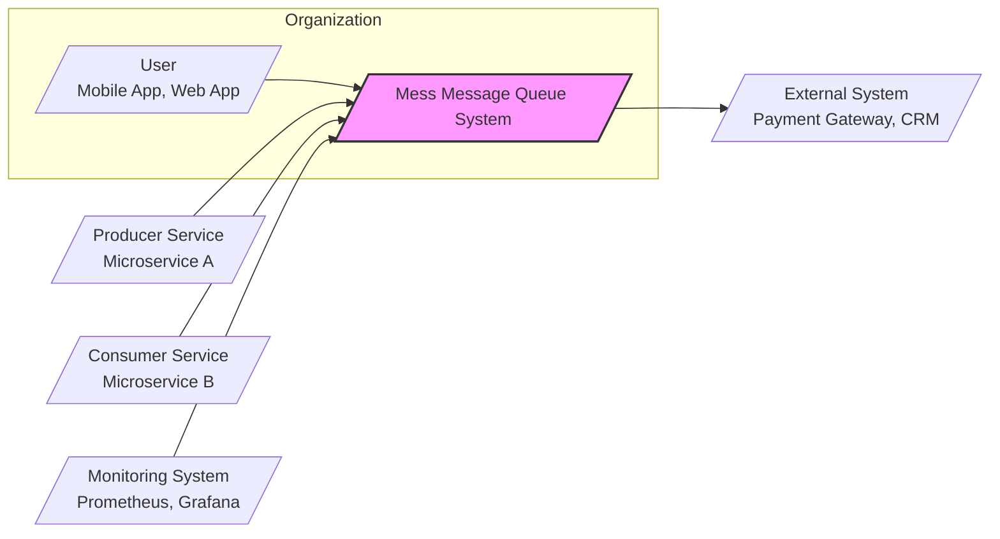

# BUSINESS POSTURE

- Business Priorities and Goals:
 - Goal: To provide a reliable, scalable, and high-performance message queue system.
 - Priority: Ensure efficient and asynchronous communication between different services and applications.
 - Goal: Enable decoupling of services to improve system resilience and maintainability.
 - Priority: Support high message throughput and low latency for time-sensitive operations.
 - Goal: Facilitate event-driven architectures and real-time data processing.
 - Priority: Minimize operational overhead and infrastructure costs.

- Business Risks:
 - Risk: Data loss or message corruption leading to inconsistencies and business process failures.
 - Risk: Service unavailability or performance degradation impacting dependent applications and user experience.
 - Risk: Unauthorized access to messages potentially exposing sensitive business data.
 - Risk: System vulnerabilities exploited by attackers leading to data breaches or service disruption.
 - Risk: Lack of auditability and traceability hindering incident response and compliance efforts.
 - Risk: Vendor lock-in if the message queue system is tightly coupled with a specific cloud provider or technology.

# SECURITY POSTURE

- Existing Security Controls:
 - security control: Access control lists (ACLs) for topic authorization (implementation details need to be verified in the code).
 - security control: Network segmentation to isolate message queue infrastructure (assumed best practice for cloud deployments).
 - security control: Regular security patching of underlying operating systems and dependencies (assumed operational procedure).
 - security control: Monitoring and logging of system events and errors (assumed for operational visibility).

- Accepted Risks:
 - accepted risk: Potential vulnerabilities in third-party dependencies.
 - accepted risk: Insider threats with access to infrastructure and configurations.
 - accepted risk: Denial-of-service attacks targeting message queue infrastructure.
 - accepted risk: Lack of end-to-end message encryption by default.

- Recommended Security Controls:
 - security control: Implement mutual TLS (mTLS) for inter-service communication to ensure authentication and encryption in transit.
 - security control: Integrate with centralized identity and access management (IAM) system for user and service account authentication and authorization.
 - security control: Implement robust input validation and sanitization to prevent injection attacks.
 - security control: Perform regular vulnerability scanning and penetration testing to identify and remediate security weaknesses.
 - security control: Establish a security incident response plan to effectively handle security breaches.
 - security control: Implement data encryption at rest for persistent message storage.
 - security control: Implement audit logging for all security-relevant events, including access attempts and configuration changes.
 - security control: Integrate with security information and event management (SIEM) system for centralized security monitoring and alerting.
 - security control: Implement rate limiting and traffic shaping to mitigate denial-of-service attacks.
 - security control: Conduct security code reviews and static/dynamic application security testing (SAST/DAST) as part of the software development lifecycle.

- Security Requirements:
 - Authentication:
  - requirement: The system must authenticate producers and consumers before allowing message operations.
  - requirement: Support for service-to-service authentication using API keys or tokens.
  - requirement: Integration with existing identity providers (e.g., OAuth 2.0, OpenID Connect) for user authentication if applicable.

 - Authorization:
  - requirement: Implement fine-grained authorization controls to manage access to topics and queues.
  - requirement: Role-based access control (RBAC) to define and enforce permissions for different user roles and service accounts.
  - requirement: Policy enforcement to ensure that only authorized entities can publish or consume messages from specific topics.

 - Input Validation:
  - requirement: Validate message payloads to prevent injection attacks and ensure data integrity.
  - requirement: Sanitize user-provided inputs to prevent cross-site scripting (XSS) or other injection vulnerabilities if a management UI is present.
  - requirement: Implement input validation at the API gateway or message broker level to reject malformed or malicious messages.

 - Cryptography:
  - requirement: Encrypt sensitive data in transit using TLS for all communication channels.
  - requirement: Consider end-to-end message encryption for highly sensitive data.
  - requirement: Implement data encryption at rest for persistent message storage to protect data confidentiality.
  - requirement: Securely manage cryptographic keys and certificates.

# DESIGN

- C4 CONTEXT



 - Context Diagram Elements:
  - Element:
   - Name: User
   - Type: Person
   - Description: End-users interacting with applications that utilize the message queue system.
   - Responsibilities: Initiating actions that trigger messages, receiving notifications or updates via messages.
   - Security controls: Authentication to applications, authorization within applications, input validation in applications.
  - Element:
   - Name: Producer Service
   - Type: Software System
   - Description: Microservices or applications that publish messages to the message queue.
   - Responsibilities: Generating and publishing messages to specific topics or queues, handling message delivery confirmations.
   - Security controls: Authentication to message queue, authorization to publish to specific topics, input validation of message payloads.
  - Element:
   - Name: Consumer Service
   - Type: Software System
   - Description: Microservices or applications that subscribe to topics or queues and process messages.
   - Responsibilities: Receiving and processing messages, acknowledging message consumption, handling message processing errors.
   - Security controls: Authentication to message queue, authorization to subscribe to specific topics, secure message processing logic.
  - Element:
   - Name: Monitoring System
   - Type: Software System
   - Description: System used to monitor the health, performance, and security of the message queue system.
   - Responsibilities: Collecting metrics, logs, and events from the message queue, providing dashboards and alerts.
   - Security controls: Secure access to monitoring data, audit logging of monitoring activities, secure communication channels.
  - Element:
   - Name: External System
   - Type: Software System
   - Description: External services or applications that the message queue system might interact with, such as payment gateways or CRM systems.
   - Responsibilities: Receiving messages from the message queue for external processing, sending data back to the message queue.
   - Security controls: Secure API communication, authentication and authorization for external system interactions, data validation and sanitization.
  - Element:
   - Name: Mess Message Queue System
   - Type: Software System
   - Description: The message queue system itself, responsible for message routing, storage, and delivery.
   - Responsibilities: Receiving messages from producers, storing messages, routing messages to consumers, ensuring message delivery, managing topics and queues.
   - Security controls: Authentication, authorization, input validation, encryption in transit and at rest, access control lists, audit logging, rate limiting, vulnerability management.

- C4 CONTAINER

```mermaid
graph LR
    subgraph "Mess Message Queue System"
        MessageBroker[/"Message Broker"\nGo Application/]
        Storage[/"Message Storage"\nPersistent Storage (e.g., Disk)/]
        ManagementAPI[/"Management API"\nGo Application/]
        ClientLibraries[/"Client Libraries"\nGo, Java, Python, etc./]
    end
    ProducerService --> ClientLibraries
    ConsumerService --> ClientLibraries
    ClientLibraries --> MessageBroker
    MessageBroker --> Storage
    ManagementAPI --> MessageBroker
    MonitoringSystem --> ManagementAPI

    style "Mess Message Queue System" fill:#ccf,stroke:#333,stroke-width:2px
```

 - Container Diagram Elements:
  - Element:
   - Name: Message Broker
   - Type: Container
   - Description: The core component of the message queue system, responsible for message routing, queuing, and delivery. Implemented in Go.
   - Responsibilities: Receiving messages from producers, storing messages temporarily or persistently, routing messages to consumers, managing topic and queue subscriptions, enforcing message delivery guarantees.
   - Security controls: Authentication and authorization of producers and consumers, input validation of messages, rate limiting, TLS encryption for communication, access control to internal APIs, audit logging.
  - Element:
   - Name: Message Storage
   - Type: Container
   - Description: Persistent storage for messages, ensuring durability and reliability. Could be implemented using disk storage, distributed file system, or a database.
   - Responsibilities: Persistently storing messages, providing efficient read and write operations, ensuring data integrity and consistency.
   - Security controls: Encryption at rest, access control to storage volumes, data backup and recovery mechanisms, integrity checks.
  - Element:
   - Name: Management API
   - Type: Container
   - Description: API for managing the message queue system, including topic/queue creation, configuration, monitoring, and administration. Implemented in Go.
   - Responsibilities: Providing an interface for system administration, exposing monitoring metrics, enabling configuration management, handling authentication and authorization for management operations.
   - Security controls: Authentication and authorization for management API access, input validation for API requests, audit logging of management operations, rate limiting, secure API design.
  - Element:
   - Name: Client Libraries
   - Type: Container
   - Description: Libraries for different programming languages (e.g., Go, Java, Python) that allow producer and consumer services to interact with the message queue.
   - Responsibilities: Providing APIs for publishing and consuming messages, handling connection management, message serialization/deserialization, implementing message delivery protocols.
   - Security controls: Secure coding practices in library development, input validation within libraries, TLS encryption for communication with the broker, secure key management if applicable.

- DEPLOYMENT

```mermaid
graph LR
    subgraph "Cloud Environment (e.g., AWS, GCP, Azure)"
        subgraph "Kubernetes Cluster"
            subgraph "Namespace: mess-mq"
                MessageBrokerInstance1[/"Message Broker Instance 1"\nPod/]
                MessageBrokerInstance2[/"Message Broker Instance 2"\nPod/]
                MessageBrokerInstance3[/"Message Broker Instance 3"\nPod/]
                StorageVolume[/"Persistent Volume"\nCloud Storage/]
                LoadBalancer[/"Load Balancer"\nCloud Load Balancer/]
            end
        end
        ProducerServiceInstance[/"Producer Service Instance"\nVM or Container/]
        ConsumerServiceInstance[/"Consumer Service Instance"\nVM or Container/]
        MonitoringSystemInstance[/"Monitoring System Instance"\nVM or Container/]
    end

    LoadBalancer --> MessageBrokerInstance1
    LoadBalancer --> MessageBrokerInstance2
    LoadBalancer --> MessageBrokerInstance3
    MessageBrokerInstance1 --> StorageVolume
    MessageBrokerInstance2 --> StorageVolume
    MessageBrokerInstance3 --> StorageVolume
    ProducerServiceInstance --> LoadBalancer
    ConsumerServiceInstance --> LoadBalancer
    MonitoringSystemInstance --> ManagementAPI

    style "Kubernetes Cluster" fill:#eee,stroke:#333,stroke-width:1px
    style "Namespace: mess-mq" fill:#ddd,stroke:#333,stroke-width:1px
    style "Cloud Environment (e.g., AWS, GCP, Azure)" fill:#fff,stroke:#333,stroke-width:2px
```

 - Deployment Diagram Elements:
  - Element:
   - Name: Cloud Environment (e.g., AWS, GCP, Azure)
   - Type: Infrastructure
   - Description: The cloud provider infrastructure where the message queue system is deployed.
   - Responsibilities: Providing compute, storage, networking, and managed services.
   - Security controls: Cloud provider security controls (physical security, network security, IAM), security configuration of cloud resources.
  - Element:
   - Name: Kubernetes Cluster
   - Type: Infrastructure
   - Description: A Kubernetes cluster used to orchestrate and manage the message queue containers.
   - Responsibilities: Container orchestration, service discovery, scaling, health monitoring, resource management.
   - Security controls: Kubernetes RBAC, network policies, pod security policies/admission controllers, security updates, cluster hardening.
  - Element:
   - Name: Namespace: mess-mq
   - Type: Infrastructure
   - Description: A Kubernetes namespace dedicated to the message queue system, providing isolation and resource management.
   - Responsibilities: Resource isolation, access control within the namespace.
   - Security controls: Kubernetes RBAC for namespace access, network policies within the namespace.
  - Element:
   - Name: Message Broker Instance 1/2/3
   - Type: Software Instance
   - Description: Instances of the Message Broker container running as Kubernetes pods.
   - Responsibilities: Message routing, queuing, and delivery within the Kubernetes cluster.
   - Security controls: Container security (image scanning, vulnerability management), resource limits, network policies, application-level security controls.
  - Element:
   - Name: Storage Volume
   - Type: Infrastructure
   - Description: Persistent volume provided by the cloud provider for storing message data.
   - Responsibilities: Persistent storage for messages, data durability.
   - Security controls: Cloud storage security controls (encryption at rest, access control), volume encryption, backup and recovery.
  - Element:
   - Name: Load Balancer
   - Type: Infrastructure
   - Description: Cloud load balancer distributing traffic to the Message Broker instances.
   - Responsibilities: Load balancing, high availability, external access point.
   - Security controls: Load balancer security configuration, TLS termination, DDoS protection.
  - Element:
   - Name: Producer Service Instance
   - Type: Software Instance
   - Description: Instances of producer services running in the cloud environment (VMs or containers).
   - Responsibilities: Publishing messages to the message queue.
   - Security controls: Application-level security controls, secure communication with the message queue.
  - Element:
   - Name: Consumer Service Instance
   - Type: Software Instance
   - Description: Instances of consumer services running in the cloud environment (VMs or containers).
   - Responsibilities: Consuming messages from the message queue.
   - Security controls: Application-level security controls, secure communication with the message queue, secure message processing.
  - Element:
   - Name: Monitoring System Instance
   - Type: Software Instance
   - Description: Instance of the monitoring system running in the cloud environment (VM or container).
   - Responsibilities: Monitoring the message queue system.
   - Security controls: Secure access to monitoring data, secure communication with the message queue management API.

- BUILD

```mermaid
graph LR
    Developer[/"Developer"/] --> SourceCodeRepository[/"Source Code Repository"\nGitHub/]
    SourceCodeRepository --> CI[/"CI/CD System"\nGitHub Actions, Jenkins/]
    CI --> BuildEnvironment[/"Build Environment"\nContainerized Build Agents/]
    BuildEnvironment --> BuildArtifacts[/"Build Artifacts"\nContainer Images, Binaries/]
    BuildArtifacts --> ArtifactRepository[/"Artifact Repository"\nContainer Registry, Binary Repository/]

    subgraph "CI/CD System"
        SecurityScanners[/"Security Scanners"\nSAST, DAST, Dependency Check/]
        Linters[/"Linters & Formatters"/]
    end
    CI --> SecurityScanners
    CI --> Linters
    SecurityScanners --> BuildArtifacts
    Linters --> BuildArtifacts

    style "CI/CD System" fill:#eee,stroke:#333,stroke-width:1px
```

 - Build Process Description:
  - Developer commits code changes to the Source Code Repository (e.g., GitHub).
  - CI/CD System (e.g., GitHub Actions, Jenkins) automatically triggers a build pipeline upon code changes.
  - The build process runs in a Build Environment (e.g., containerized build agents) to ensure consistency and isolation.
  - Build steps include:
   - Code checkout from the Source Code Repository.
   - Dependency resolution and download.
   - Code compilation and building binaries.
   - Running Linters and Formatters to enforce code quality and style.
   - Running Security Scanners (SAST, DAST, Dependency Check) to identify potential vulnerabilities.
   - Building container images (if applicable).
   - Creating Build Artifacts (container images, binaries, etc.).
  - Build Artifacts are pushed to an Artifact Repository (e.g., Container Registry, Binary Repository) for storage and distribution.
  - Security Controls in Build Process:
   - security control: Secure Source Code Repository (access control, branch protection).
   - security control: CI/CD Pipeline Security (access control, secure pipeline configuration).
   - security control: Build Environment Security (container image security, isolation).
   - security control: Static Application Security Testing (SAST) to identify code-level vulnerabilities.
   - security control: Dependency Scanning to identify vulnerable dependencies.
   - security control: Code Linters and Formatters to improve code quality and reduce potential issues.
   - security control: Artifact Repository Security (access control, vulnerability scanning of artifacts).
   - security control: Code signing and artifact verification to ensure integrity and authenticity.

# RISK ASSESSMENT

- Critical Business Processes:
 - Real-time event processing: Processing events in real-time for immediate actions or insights.
 - Asynchronous task execution: Offloading tasks to be processed asynchronously to improve application responsiveness.
 - Inter-service communication: Enabling reliable communication between microservices for distributed transactions and data consistency.
 - Order processing and fulfillment: Managing order workflows and ensuring reliable order processing.
 - Notification delivery: Delivering timely notifications to users or systems.

- Data Sensitivity:
 - Message payloads can contain sensitive business data, including:
  - Transactional data: Order details, payment information, customer data.
  - Personal Identifiable Information (PII): User names, email addresses, contact details.
  - Application secrets: API keys, tokens, configuration data (if improperly handled in messages).
 - Sensitivity level depends on the specific use case and data being transmitted. Data should be classified based on sensitivity (e.g., public, internal, confidential, restricted).

# QUESTIONS & ASSUMPTIONS

- Questions:
 - What is the expected message volume and throughput for the system?
 - What are the specific data sensitivity levels for messages being transmitted?
 - What are the compliance requirements for data handling and security (e.g., GDPR, HIPAA, PCI DSS)?
 - What is the existing security infrastructure and tooling available in the organization?
 - What are the performance and latency requirements for message delivery?
 - Are there any specific regulatory or industry standards that need to be adhered to?
 - What is the disaster recovery and business continuity plan for the message queue system?
 - What is the expected lifespan and scalability requirements for the system?
 - Are there any specific integration requirements with other systems or services?
 - What is the budget and timeline for implementing security controls?

- Assumptions:
 - BUSINESS POSTURE:
  - The message queue system is critical for business operations and requires high availability and reliability.
  - Data integrity and confidentiality are important business concerns.
  - The organization is willing to invest in security to protect the message queue system and its data.
 - SECURITY POSTURE:
  - Basic security controls are assumed to be in place, but there is room for improvement, especially in areas like authentication, authorization, and encryption.
  - The organization is aware of security risks and is looking to enhance the security posture of the message queue system.
  - Secure software development lifecycle (SSDLC) practices are being adopted or planned.
 - DESIGN:
  - The system is designed for cloud deployment and scalability.
  - A distributed architecture with multiple message broker instances is assumed for high availability.
  - Standard security best practices for cloud-native applications are applicable.
  - The build process includes basic security checks, but can be further strengthened.