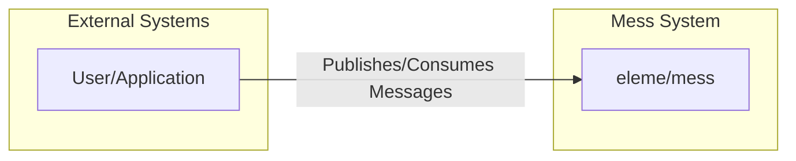
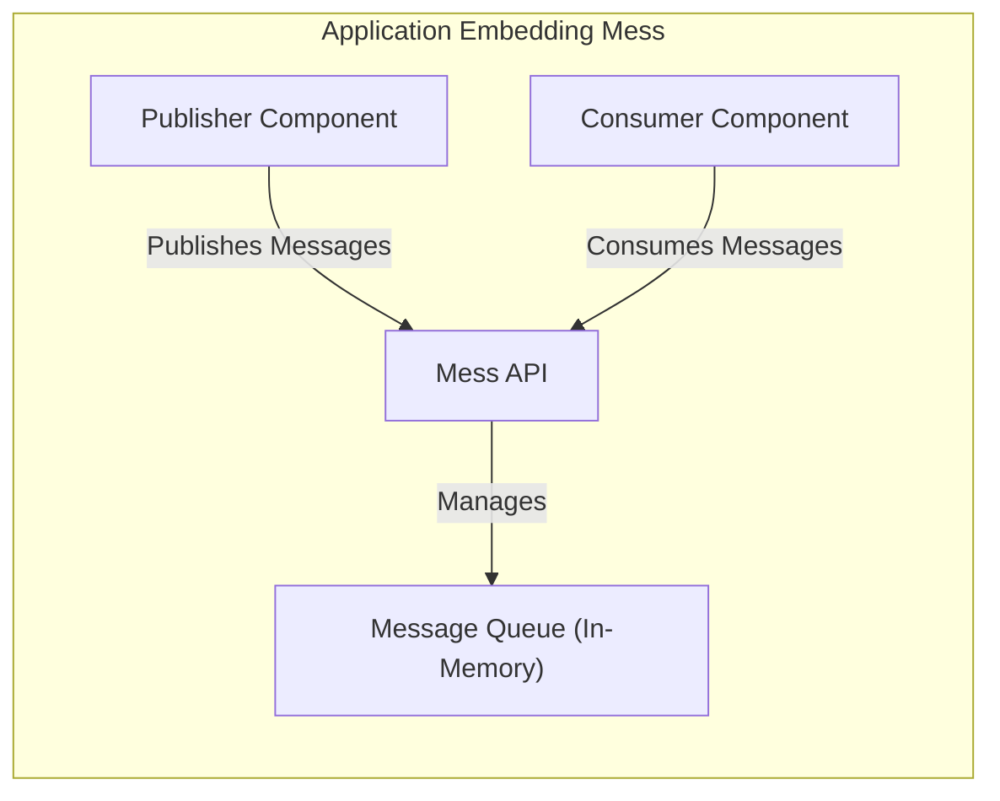
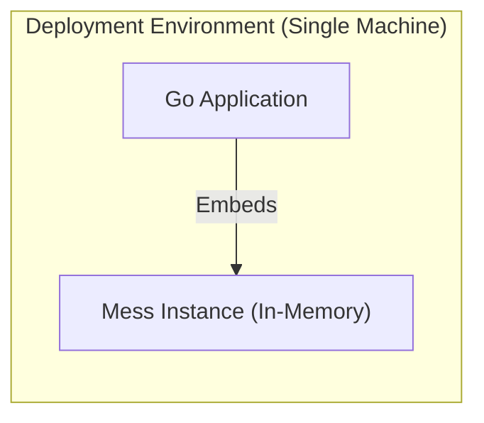
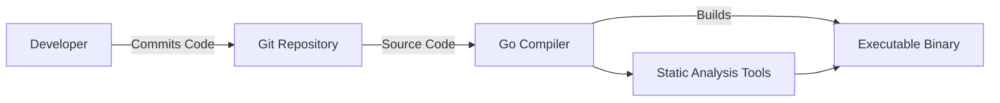

Okay, let's create a design document for the `eleme/mess` project.

# BUSINESS POSTURE

Business Priorities and Goals:

*   Provide a lightweight, embeddable message queue for Go applications.
*   Offer a simple API for publishing and consuming messages.
*   Minimize external dependencies to simplify integration and deployment.
*   Enable asynchronous communication between different parts of an application or between microservices.
*   Support in-memory message queuing for performance and simplicity in appropriate use cases.

Business Risks:

*   Data loss: If the application crashes before messages are processed, in-memory messages will be lost. This is a significant risk for applications requiring guaranteed message delivery.
*   Limited scalability: As an in-memory queue, `mess` is not designed for high-throughput, large-scale distributed systems. It's bound by the resources of a single machine.
*   Lack of persistence: The absence of built-in persistence mechanisms makes `mess` unsuitable for scenarios where message durability is critical.
*   Single point of failure: Since the queue resides within the application's memory space, the queue's availability is tied to the application's uptime.
*   Security: Limited built-in security features.

# SECURITY POSTURE

Existing Security Controls:

*   security control: Code simplicity: The project's small codebase and limited external dependencies reduce the attack surface. (Described in README.md and evident in the source code).
*   security control: Go's memory safety: Using Go helps prevent common memory-related vulnerabilities like buffer overflows. (Implicit in the choice of Go as the programming language).

Accepted Risks:

*   accepted risk: No built-in authentication or authorization mechanisms. The library assumes that the embedding application will handle access control.
*   accepted risk: No encryption of messages in transit or at rest (in memory). Sensitive data should be encrypted by the application before being published to the queue.
*   accepted risk: No protection against denial-of-service (DoS) attacks. An attacker could potentially flood the queue with messages, leading to resource exhaustion.
*   accepted risk: No input validation. It is assumed that the embedding application will validate data before publishing.

Recommended Security Controls:

*   security control: Consider adding optional support for message encryption. This could be implemented using a pluggable interface, allowing users to choose their preferred encryption method.
*   security control: Implement rate limiting or other mechanisms to mitigate the risk of DoS attacks.
*   security control: Provide guidance in the documentation on how to securely integrate `mess` into applications, including recommendations for input validation, encryption, and access control.

Security Requirements:

*   Authentication: Not directly applicable to the library itself, but the embedding application should authenticate users and services that interact with the queue.
*   Authorization: Not directly applicable to the library itself, but the embedding application should enforce authorization policies to control access to the queue (e.g., who can publish to or consume from specific topics).
*   Input Validation: The embedding application *must* validate all data before publishing it to the queue. `mess` itself should not perform any input validation.
*   Cryptography:
    *   The embedding application should encrypt sensitive data before publishing it to the queue.
    *   Consider providing optional support for message encryption within `mess` itself, as mentioned in the recommended security controls.

# DESIGN

## C4 CONTEXT

Element Descriptions:

*   Element:
    *   Name: User/Application
    *   Type: External System
    *   Description: The application or service that embeds the `mess` library.
    *   Responsibilities:
        *   Publishing messages to the queue.
        *   Consuming messages from the queue.
        *   Handling message processing logic.
        *   Implementing authentication and authorization.
        *   Validating input data.
        *   Encrypting sensitive data.
    *   Security controls:
        *   Authentication of users/services.
        *   Authorization to control access to queue operations.
        *   Input validation.
        *   Data encryption.

*   Element:
    *   Name: eleme/mess
    *   Type: System
    *   Description: The embedded message queue library.
    *   Responsibilities:
        *   Providing an API for publishing and consuming messages.
        *   Managing in-memory message storage.
        *   Handling message delivery to subscribers.
    *   Security controls:
        *   Code simplicity.
        *   Leveraging Go's memory safety.

## C4 CONTAINER

Element Descriptions:

*   Element:
    *   Name: Publisher Component
    *   Type: Container
    *   Description: A component within the embedding application responsible for publishing messages.
    *   Responsibilities:
        *   Creating messages.
        *   Validating message data (application's responsibility).
        *   Encrypting sensitive data (application's responsibility).
        *   Publishing messages via the Mess API.
    *   Security controls: Input validation, data encryption (implemented by the embedding application).

*   Element:
    *   Name: Consumer Component
    *   Type: Container
    *   Description: A component within the embedding application responsible for consuming messages.
    *   Responsibilities:
        *   Subscribing to topics.
        *   Receiving messages via the Mess API.
        *   Processing messages.
        *   Decrypting sensitive data (application's responsibility).
    *   Security controls: Data decryption (implemented by the embedding application).

*   Element:
    *   Name: Mess API
    *   Type: Container
    *   Description: The public interface provided by the `mess` library.
    *   Responsibilities:
        *   Exposing functions for publishing and subscribing.
        *   Managing interactions with the message queue.
    *   Security controls: Code simplicity.

*   Element:
    *   Name: Message Queue (In-Memory)
    *   Type: Container
    *   Description: The in-memory storage for messages.
    *   Responsibilities:
        *   Storing messages.
        *   Delivering messages to subscribers.
    *   Security controls: Go's memory safety.

## DEPLOYMENT

Possible Deployment Solutions:

1.  Embedded within a single Go application instance.
2.  Embedded within multiple instances of a Go application (each instance has its own independent queue).
3.  Embedded within different microservices, each running as separate processes or containers.

Chosen Solution (1. Embedded within a single Go application instance):

Element Descriptions:

*   Element:
    *   Name: Go Application
    *   Type: Node
    *   Description: The Go application that embeds the `mess` library.
    *   Responsibilities: Running the application logic, including publishing and consuming messages.
    *   Security controls: Implemented by the application developer (authentication, authorization, input validation, encryption).

*   Element:
    *   Name: Mess Instance (In-Memory)
    *   Type: Node
    *   Description: The in-memory message queue instance running within the Go application.
    *   Responsibilities: Storing and delivering messages within the application's memory space.
    *   Security controls: Go's memory safety.

## BUILD

Build Process:

1.  Developer writes code and commits to a Git repository (e.g., GitHub).
2.  The Go compiler builds the application, including the embedded `mess` library.  No separate build process is required for `mess` itself, as it's a library directly included in the application's source code.
3.  The build process can include static analysis tools (linters, security scanners) to identify potential vulnerabilities.
4.  The final output is a single executable binary.

Security Controls in Build Process:

*   security control: Use of Go's built-in build system (`go build`).
*   security control: Potential integration with static analysis tools (e.g., `go vet`, `staticcheck`, or security-focused linters) to identify code quality issues and potential vulnerabilities. This is the responsibility of the embedding application's build process.
*   security control: Dependency management using Go Modules, which helps ensure that the correct versions of dependencies are used and can be audited.

# RISK ASSESSMENT

Critical Business Processes:

*   Asynchronous task processing: `mess` facilitates asynchronous operations, which are critical for maintaining application responsiveness and decoupling components.
*   Inter-component communication: Within the application, `mess` enables different parts to communicate without direct dependencies.

Data Sensitivity:

*   The sensitivity of the data handled by `mess` depends entirely on the embedding application. `mess` itself does not inherently handle any specific type of data. The application developer is responsible for determining the sensitivity of the messages and implementing appropriate security measures (e.g., encryption). If sensitive data is passed through `mess` *without* encryption by the embedding application, it would be considered a high-risk vulnerability.

# QUESTIONS & ASSUMPTIONS

Questions:

*   What are the specific message throughput and latency requirements for applications using `mess`?
*   What types of data will be transmitted as messages? (This is crucial for determining the need for encryption and other security measures.)
*   Will `mess` be used for communication between different services, or only within a single application?
*   Are there any regulatory compliance requirements (e.g., GDPR, HIPAA) that apply to the data being processed?

Assumptions:

*   BUSINESS POSTURE: The primary use case for `mess` is for relatively low-volume, in-memory message queuing within a single application or between closely related services where message loss is acceptable in some failure scenarios.
*   SECURITY POSTURE: The embedding application is responsible for all aspects of security, including authentication, authorization, input validation, and data encryption. `mess` provides no built-in security features beyond the inherent memory safety of Go.
*   DESIGN: The deployment model will typically involve embedding `mess` directly within a Go application, resulting in a single instance of the queue running within the application's memory space.