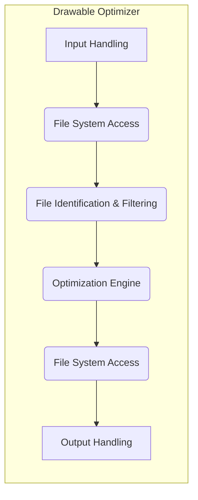
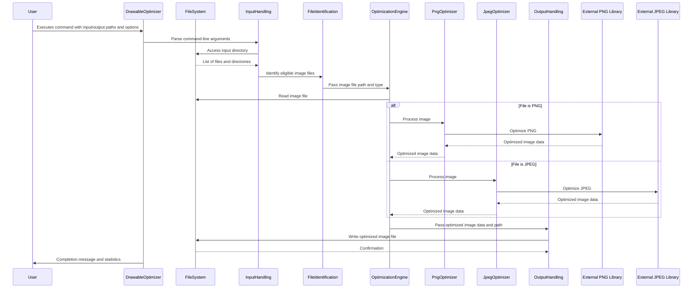

# Project Design Document: Drawable Optimizer

**Version:** 1.1
**Date:** October 26, 2023
**Author:** AI Software Architect

## 1. Introduction

This document provides a detailed design overview of the `drawable-optimizer` project, a command-line tool designed to optimize image drawables for Android applications. This document serves as a foundation for understanding the system's architecture, data flow, and components, which will be crucial for subsequent threat modeling activities.

The `drawable-optimizer` project aims to reduce the file size of image drawables (primarily PNG and JPEG) used in Android applications without significant loss of visual quality. This optimization helps in reducing the application's size, leading to faster download times, reduced storage usage on user devices, and potentially improved application performance.

This document outlines the key aspects of the tool, including its architecture, data flow, and the various components involved in the optimization process. This version includes more detail on component responsibilities and security considerations.

## 2. Goals and Non-Goals

### 2.1. Goals

*   **Efficient Image Optimization:** Reduce the file size of PNG and JPEG drawables using appropriate compression techniques without significant perceptual quality loss.
*   **Support for Common Android Drawable Types:** Handle various drawable densities and qualifiers by preserving the directory structure.
*   **Command-Line Interface:** Provide a user-friendly command-line interface for easy integration into build processes and automation scripts.
*   **Cross-Platform Compatibility:**  Operate on different operating systems (where a compatible Java Runtime Environment is available).
*   **Maintain Original Directory Structure:** Preserve the relative paths of the optimized drawables within the output directory to ensure seamless integration with existing Android projects.
*   **Configurable Optimization Levels:** Allow users to configure the level of optimization to balance file size reduction and potential quality impact.

### 2.2. Non-Goals

*   **Image Editing:** The tool is not intended for general image editing tasks like cropping, resizing, or color manipulation beyond the scope of optimization algorithms.
*   **Vector Drawable Optimization:** While the project name might suggest broader drawable optimization, the current focus is primarily on raster image formats (PNG and JPEG). Future versions might consider vector drawables.
*   **Lossy to Lossless Conversion:** The tool will not convert lossy formats (like JPEG) to lossless formats (like PNG) or vice versa. The optimization process will remain within the original format's capabilities.
*   **GUI Application:** The tool is designed as a command-line interface and does not aim to provide a graphical user interface.
*   **Real-time Optimization:** The tool operates on a batch basis, processing files provided as input. It is not designed for real-time or on-the-fly optimization during application runtime.

## 3. System Architecture

The `drawable-optimizer` follows a straightforward command-line application architecture. It takes input (a directory containing drawable files), processes these files using various optimization techniques, and outputs the optimized files to a specified directory.

### 3.1. High-Level Components

*   **Input Handling:**
    *   Parses command-line arguments provided by the user.
    *   Validates the input and output paths to ensure they are valid and accessible.
    *   Handles flags and options provided by the user, such as optimization level or specific file filters.
*   **File System Access:**
    *   Provides an abstraction layer for interacting with the underlying file system.
    *   Handles reading files from the input directory.
    *   Handles writing optimized files to the output directory.
    *   Manages directory creation and traversal.
*   **File Identification & Filtering:**
    *   Identifies eligible image files (PNG, JPEG) within the input directory and its subdirectories.
    *   Applies filtering rules based on file extensions, names, or directory patterns (if specified by the user).
    *   Determines the type of image file to select the appropriate optimization strategy.
*   **Optimization Engine:**
    *   The core component responsible for applying image optimization algorithms.
    *   Selects the appropriate optimization library or technique based on the file type (PNG or JPEG) and configured optimization level.
    *   Invokes external optimization tools or libraries.
    *   Manages the execution of optimization processes and handles their output.
*   **Output Handling:**
    *   Manages the creation of the output directory if it doesn't already exist.
    *   Writes the optimized drawable files to the specified output location, preserving the original relative directory structure from the input directory.
    *   Handles potential file overwriting scenarios based on user configuration.

## 4. Data Flow

The process of optimizing drawables involves the following steps:

### 4.1. Detailed Data Flow Steps

1. **User Invocation:** The user executes the `drawable-optimizer` command from the command line, providing the input directory, the desired output directory, and any optional configuration parameters.
2. **Input Parsing and Validation:** The `Input Handling` component parses the command-line arguments and validates the provided input and output paths, ensuring they are syntactically correct and accessible. It also processes any user-provided options.
3. **File System Traversal:** The `File System Access` component reads the contents of the input directory, recursively traversing subdirectories if the corresponding option is enabled.
4. **File Identification and Filtering:** The `File Identification & Filtering` component identifies files with relevant extensions (e.g., `.png`, `.jpg`, `.jpeg`). It may also apply filtering based on directory structure or other criteria specified by the user.
5. **Optimization Processing:** For each identified image file:
    *   The `Optimization Engine` determines the file type (PNG or JPEG).
    *   The `Optimization Engine` reads the file content using the `File System Access` component.
    *   For PNG files, the `Optimization Engine` invokes the `PngOptimizer`. The `PngOptimizer` may utilize external libraries like `pngquant` or `zopflipng` to perform lossy or lossless compression, respectively.
    *   For JPEG files, the `Optimization Engine` invokes the `JpegOptimizer`. The `JpegOptimizer` may utilize external libraries like `mozjpeg` or `Jpegoptim` for optimized JPEG encoding.
    *   The chosen optimization library processes the image data.
    *   The optimized image data is returned to the `Optimization Engine`.
6. **Output Writing:** The `Output Handling` component writes the optimized image file to the specified output directory. The original directory structure relative to the input directory is recreated in the output directory.
7. **Completion and Reporting:** The tool provides a summary or completion message to the user, indicating the number of files processed, the total size reduction achieved, and any potential errors encountered during the process.

## 5. Components

### 5.1. Core Modules

*   **`CommandLineParser`:** Responsible for parsing command-line arguments and options provided by the user. This might utilize libraries like JCommander or Apache Commons CLI.
*   **`FileSystemHandler`:** Provides an abstraction layer for file system operations, including reading files, writing files, creating directories, and listing directory contents. This helps in isolating the core logic from specific file system implementations.
*   **`FileIdentifier`:** Identifies eligible image files based on their extensions and potentially other criteria like MIME types. It also handles filtering based on user-defined patterns.
*   **`PngOptimizer`:** Implements PNG-specific optimization logic. This component interacts with external PNG optimization libraries (e.g., `pngquant`, `zopflipng`, `OptiPNG`) by invoking them as separate processes or using their Java bindings if available. It manages the parameters passed to these libraries based on the configured optimization level.
*   **`JpegOptimizer`:** Implements JPEG-specific optimization logic. This component interacts with external JPEG optimization libraries (e.g., `mozjpeg`, `Jpegoptim`) in a similar manner to the `PngOptimizer`.
*   **`OptimizationEngine`:** The central orchestrator for the optimization process. It receives file paths from the `FileIdentifier`, determines the file type, selects the appropriate optimizer (`PngOptimizer` or `JpegOptimizer`), and manages the execution of the optimization process.
*   **`OutputWriter`:** Handles writing the optimized files to the output directory. It ensures the output directory structure mirrors the input directory structure and handles potential file overwriting scenarios based on user configuration.
*   **`ConfigurationManager`:** Manages the tool's configuration settings, which can be provided through command-line arguments or potentially a configuration file. This includes settings like optimization level, whether to use lossy or lossless compression, and other parameters for the optimization libraries.
*   **`LoggingHandler`:** Provides logging functionality for tracking the progress of the optimization process, recording any errors or warnings, and providing feedback to the user. This might utilize logging frameworks like SLF4j or Logback.
*   **`ErrorHandler`:**  Handles exceptions and errors that occur during the optimization process. It provides informative error messages to the user and potentially logs detailed error information.

### 5.2. External Dependencies

*   **Java Runtime Environment (JRE):** The tool is written in Java and requires a compatible JRE to execute.
*   **Optimization Libraries (Native Executables or Java Bindings):**
    *   **pngquant:** For lossy compression of PNG images. Typically invoked as an external executable.
    *   **zopflipng:** For lossless compression of PNG images. Typically invoked as an external executable.
    *   **OptiPNG:** Another lossless PNG optimizer. Typically invoked as an external executable.
    *   **mozjpeg:** For optimized JPEG encoding. Typically invoked as an external executable.
    *   **Jpegoptim:** Another JPEG optimization tool. Typically invoked as an external executable.
*   **Command-Line Argument Parsing Library:** (e.g., JCommander, Apache Commons CLI) for parsing command-line arguments.
*   **Logging Framework:** (e.g., SLF4j, Logback, Log4j) for providing logging capabilities.

## 6. Security Considerations

This section outlines potential security considerations that will be further explored during the threat modeling process.

*   **Input Path Validation:** Insufficient validation of the input path could allow an attacker to specify arbitrary file paths, leading to path traversal vulnerabilities. This could enable the tool to access or modify files outside the intended input directory. **Mitigation:** Implement strict validation of the input path, ensuring it is a valid directory and preventing the use of relative paths that could traverse outside the intended scope.
*   **Output Path Validation:** Similar to input paths, inadequate validation of the output path could lead to writing optimized files to unintended locations, potentially overwriting critical system files. **Mitigation:** Validate the output path to ensure it is a valid directory and prevent writing to sensitive system locations. Provide clear warnings to the user if the output directory overlaps with the input directory.
*   **Dependency Vulnerabilities:** The external optimization libraries are third-party components and may contain security vulnerabilities. Using outdated or vulnerable versions of these libraries could expose the system to risks. **Mitigation:** Implement a robust dependency management strategy, regularly update dependencies to their latest stable versions, and consider using tools to scan for known vulnerabilities in dependencies.
*   **Resource Exhaustion:** Processing a large number of very large image files could potentially lead to excessive memory consumption or CPU usage, causing a denial-of-service condition. **Mitigation:** Implement safeguards to limit resource consumption, such as processing files in batches or setting limits on memory usage.
*   **Command Injection via External Libraries:** If the tool constructs commands to invoke external optimization libraries based on user-provided input without proper sanitization, it could be vulnerable to command injection attacks. An attacker could inject malicious commands into the arguments passed to these libraries. **Mitigation:** Avoid constructing commands directly from user input. If necessary, use parameterized commands or escape user-provided input to prevent the execution of arbitrary commands.
*   **Output File Overwriting:** If not handled carefully, the tool could potentially overwrite existing files in the output directory, leading to data loss. **Mitigation:** Provide clear options to the user regarding how to handle existing files in the output directory (e.g., overwrite, skip, create a new directory). Implement checks to prevent accidental overwriting of important files.
*   **Information Disclosure via Logging:**  Overly verbose logging could potentially expose sensitive information, such as file paths or internal system details. **Mitigation:** Carefully configure logging levels and ensure that sensitive information is not logged unnecessarily.

## 7. Future Considerations

*   **Support for WebP:** Adding support for optimizing the WebP image format, which is increasingly used in Android development.
*   **Lossless JPEG Optimization:** Exploring and integrating more advanced lossless JPEG optimization techniques.
*   **Granular Optimization Options:** Providing more fine-grained control over the parameters passed to the underlying optimization libraries, allowing users to fine-tune the optimization process.
*   **Integration with Build Systems:** Creating plugins or integrations for popular Android build systems like Gradle and Maven to automate the optimization process within the build pipeline.
*   **Reporting and Statistics Enhancements:** Providing more detailed reports on the optimization process, including per-file size reduction and estimated savings.
*   **Parallel Processing Improvements:** Enhancing parallel processing capabilities to further speed up optimization for large sets of images, potentially using multi-threading or asynchronous operations.
*   **GUI or Web Interface:**  Considering the development of a graphical user interface or a web-based interface for users who prefer a visual approach over the command line.
*   **Containerization:** Packaging the tool as a Docker container for easier deployment and portability.

This improved design document provides a more detailed and comprehensive overview of the `drawable-optimizer` project. It offers a stronger foundation for understanding the system's inner workings and will be invaluable for conducting a thorough threat modeling exercise to identify and mitigate potential security vulnerabilities.