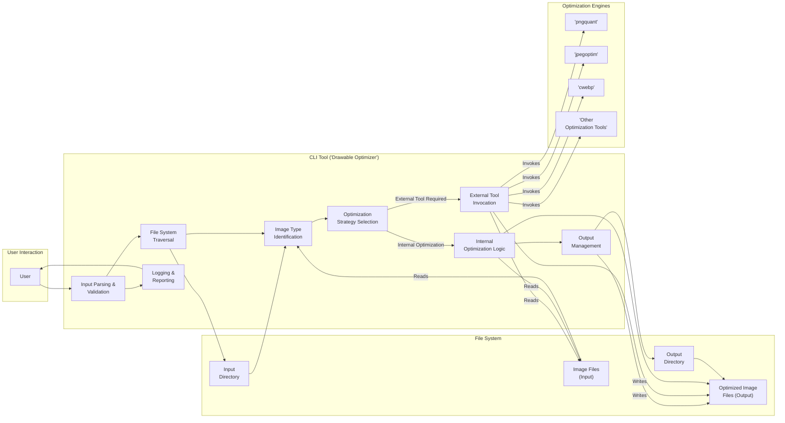

# Project Design Document: Drawable Optimizer

**Version:** 1.1
**Date:** October 26, 2023
**Author:** AI Software Architect

## 1. Introduction

This document provides an enhanced design overview of the `drawable-optimizer` project, a command-line tool for optimizing image drawables for Android applications. This detailed design serves as a crucial foundation for subsequent threat modeling activities by clearly outlining the system's architecture, components, data flow, and the technologies it utilizes.

## 2. Goals

*   Provide a robust command-line interface (CLI) for optimizing Android drawable resources.
*   Support a range of lossless and lossy optimization techniques applicable to various image formats, including PNG, JPG, and WebP.
*   Effectively reduce the file size of image drawables while minimizing perceptible loss of visual quality.
*   Enable users to explicitly define input and output directory paths.
*   Offer granular configuration options for optimization levels and strategies, catering to diverse needs.
*   Preserve the organizational structure of the input directory within the output directory.

## 3. Non-Goals

*   Developing a graphical user interface (GUI) for the tool.
*   Implementing real-time optimization or direct integration within the Android build process; this tool is designed for pre-build optimization workflows.
*   Incorporating advanced image editing or manipulation functionalities beyond the scope of optimization.
*   Automating the selection of optimal optimization settings for all image types; user-driven configuration remains a key aspect.

## 4. High-Level Architecture

The `drawable-optimizer` functions as a self-contained command-line utility. It accepts an input directory containing Android drawable resources and generates optimized versions of these resources in a designated output directory. The core operation involves iterating through the input directory, identifying eligible image files, applying specified optimization techniques, and storing the optimized images in the output directory.

*   **User:** Interacts with the tool through the command-line interface, providing essential parameters such as input and output directory paths and configuration settings.
*   **CLI Tool (Drawable Optimizer):** This represents the central application logic, responsible for:
    *   Parsing and validating user-provided command-line arguments.
    *   Traversing the input directory structure.
    *   Identifying and categorizing image files.
    *   Orchestrating the image optimization process.
*   **Image Optimization Engines:** These are external libraries or standalone binaries (e.g., `pngquant`, `jpegoptim`, `cwebp`) that perform the actual image optimization algorithms. The CLI tool interacts with these engines.
*   **File System:** The underlying operating system's file system is utilized for reading input image files and writing the optimized output files.

## 5. Detailed Design

The `drawable-optimizer`'s functionality is structured around these key components and processes:

### 5.1. Command-Line Interface (CLI)

*   **Input Parsing:**
    *   Receives command-line arguments provided by the user.
    *   Parses these arguments to extract critical information, including:
        *   `Input Directory Path`: The location of the original drawable resources.
        *   `Output Directory Path`: The destination for the optimized resources.
        *   `Optimization Mode`: Specifies the type of optimization (e.g., `lossless`, `lossy`, or a specific optimization tool).
        *   `Configuration Parameters`: Optional settings for the chosen optimization tools (e.g., quality level for lossy compression).
        *   `Recursive Processing Flag`: An option to process subdirectories within the input directory.
    *   Performs initial validation of input paths to ensure they are valid directories.
*   **Argument Validation:**
    *   Verifies that all mandatory arguments are present.
    *   Validates the format and acceptable range of provided parameter values.
    *   Provides clear and informative error messages to the user in case of invalid or missing arguments.

### 5.2. File System Traversal

*   **Directory Iteration:**
    *   Traverses the input directory structure, recursively exploring subdirectories if the corresponding flag is set.
    *   Identifies all files within the specified directory (and its subdirectories).
*   **File Type Identification:**
    *   Determines the type of each file encountered, typically based on its file extension (e.g., `.png`, `.jpg`, `.webp`).
    *   Filters the identified files to include only those with supported image file extensions.

### 5.3. Image Processing and Optimization

*   **Optimization Strategy Selection:**
    *   Selects the appropriate optimization strategy or external tool based on:
        *   The user-specified optimization mode.
        *   The identified file type of the image.
    *   Maps image file types to specific optimization tools (e.g., PNG files might be processed by `pngquant` or `optipng`).
*   **External Tool Invocation:**
    *   Executes the selected external optimization tool as a separate operating system process.
    *   Constructs the command-line arguments for the external tool, including:
        *   The path to the input image file.
        *   User-provided configuration parameters (if any).
        *   The path for the optimized output file (often overwriting the input or creating a new file).
    *   Captures the standard output and standard error streams from the external tool for logging and error reporting.
*   **Internal Optimization Logic (Potentially):**
    *   For certain basic lossless optimizations or format-specific operations, the tool might incorporate internal libraries or algorithms directly, avoiding the need to invoke external processes.
*   **Error Handling:**
    *   Monitors the exit codes of the external optimization tools to detect errors.
    *   Parses the captured output and error streams from external tools to provide more detailed error information to the user.
    *   Implements error handling logic to manage failed optimizations, potentially offering options to:
        *   Skip the problematic file and continue processing.
        *   Retry the optimization with different settings.
        *   Terminate the process with an error.

### 5.4. Output Management

*   **Directory Structure Recreation:**
    *   Replicates the directory structure of the input directory within the specified output directory.
    *   Dynamically creates any necessary subdirectories in the output path if they do not already exist.
*   **Optimized File Saving:**
    *   Saves the optimized image files to their corresponding locations within the output directory structure.
    *   Provides an option to overwrite existing files in the output directory if a file with the same name already exists.
*   **Logging and Reporting:**
    *   Provides real-time feedback to the user on the progress of the optimization process.
    *   Logs key information, including:
        *   The names of processed files.
        *   The optimization tools used for each file.
        *   The reduction in file size achieved.
        *   Any errors or warnings encountered during processing.

## 6. Data Flow Diagram

## 7. Technology Stack

*   **Programming Language:**  The primary programming language is likely Python, Node.js, Go, or Java, depending on the project's implementation.
*   **Command-Line Argument Parsing Library:** Libraries such as `argparse` (Python), `yargs` (Node.js), or `spf13/cobra` (Go) are commonly used for handling command-line arguments.
*   **File System Operations:**  Standard library functions provided by the chosen programming language for interacting with the file system (e.g., reading directories, creating files).
*   **Image Optimization Libraries/Binaries:**
    *   `pngquant`: For lossy compression of PNG images.
    *   `optipng`: For lossless optimization of PNG images.
    *   `jpegoptim`: For lossless optimization of JPEG images.
    *   `mozjpeg`:  An alternative for optimized JPEG encoding, often offering better compression.
    *   `cwebp`:  The command-line tool for encoding images in the WebP format.
    *   Potentially other specialized tools depending on the range of supported image formats and optimization techniques.
*   **Process Management:** Mechanisms for launching and managing external processes (the optimization tools).
*   **Logging Framework:** A logging library to record events, errors, and progress information during the optimization process.

## 8. Deployment Model

The `drawable-optimizer` is designed to be deployed as a self-contained, executable command-line tool. Users will typically download a pre-built binary or build the tool from source code. Execution occurs directly from the user's terminal or command prompt. The tool does not require a server infrastructure or a specific runtime environment beyond the necessary dependencies (e.g., a Python interpreter or Node.js runtime and the required external optimization tools).

## 9. Security Considerations (Focus for Threat Modeling)

This section outlines key security considerations that are crucial for identifying potential threats and vulnerabilities during the threat modeling process.

*   **Input Validation Vulnerabilities:**
    *   **Path Traversal:** Insufficient validation of the input and output directory paths could allow malicious users to specify paths outside the intended working directories, potentially leading to the reading or writing of arbitrary files on the system.
    *   **Command Injection via Filenames:** If filenames from the input directory are directly incorporated into commands executed by external optimization tools without proper sanitization, it could create command injection vulnerabilities.
*   **Dependency Management Risks:**
    *   **Vulnerable Dependencies:** Using outdated or vulnerable versions of external optimization tools or internal libraries could expose the system to known security flaws.
    *   **Supply Chain Attacks:** If the tool's dependencies are compromised, malicious code could be introduced into the optimization process.
*   **External Tool Execution Security:**
    *   **Command Injection:**  Careless construction of command-line arguments passed to external optimization tools could allow attackers to inject malicious commands.
    *   **Untrusted Binaries:** Relying on untrusted or unverified external optimization tools could introduce security risks if these tools are themselves malicious.
*   **Output Handling Vulnerabilities:**
    *   **Directory Traversal in Output:**  Improper handling of output paths could allow the tool to write optimized files to unintended locations, potentially overwriting critical system files or sensitive data.
    *   **Symlink Exploitation:** If the tool doesn't properly handle symbolic links in the input directory, it might be tricked into processing or writing files to unexpected locations.
*   **Error Handling and Information Disclosure:**
    *   **Verbose Error Messages:**  Error messages that reveal sensitive information about the system's internal workings, file paths, or configurations could be exploited by attackers.
*   **Resource Exhaustion (Denial of Service):**
    *   Processing a large number of very large image files could potentially exhaust system resources (CPU, memory, disk space), leading to a denial-of-service condition.
    *   Maliciously crafted input files designed to trigger excessive resource consumption in the optimization tools could also be a concern.

## 10. Future Considerations

*   Developing integrations with build systems like Gradle for Android projects, allowing for seamless optimization as part of the build process.
*   Implementing more intelligent optimization strategy selection based on a deeper analysis of image characteristics and content.
*   Expanding support for a wider range of image formats and incorporating new and emerging optimization tools.
*   Focusing on performance optimizations to improve the processing speed for large sets of image files.
*   Providing configuration options through a dedicated configuration file (e.g., YAML or JSON) in addition to command-line arguments for more complex setups.
*   Adding features for comparing the quality and file size of optimized images against the originals.

This improved design document provides a more detailed and refined overview of the `drawable-optimizer` project, with a stronger emphasis on security considerations relevant to threat modeling. The enhanced descriptions of components, data flow, and potential vulnerabilities will facilitate a more thorough and effective security analysis.