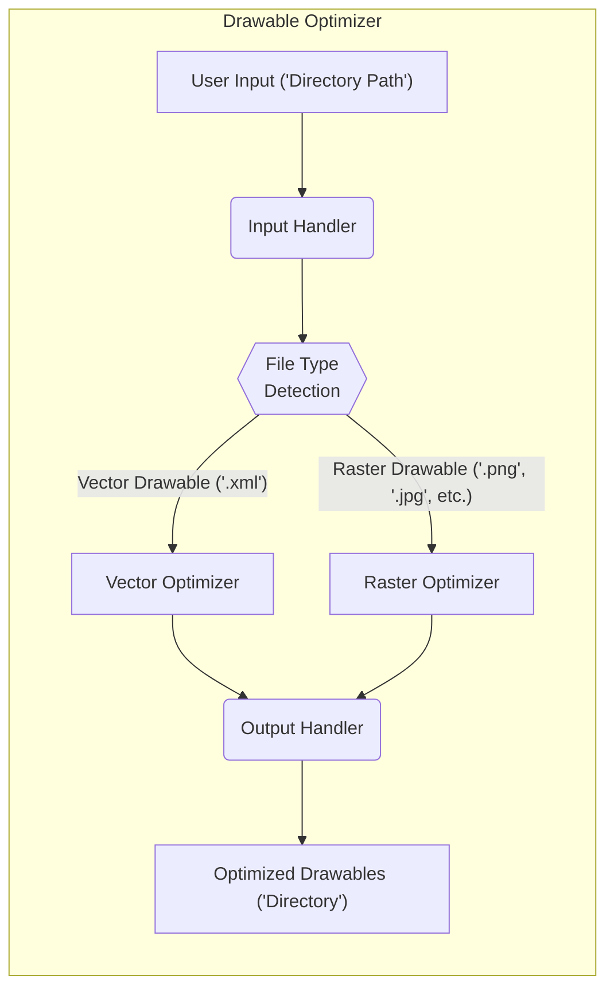
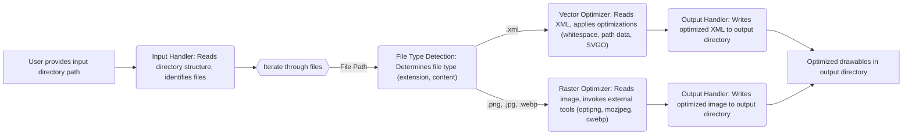

# Project Design Document: Drawable Optimizer

**Version:** 1.1
**Date:** October 26, 2023
**Author:** Gemini (AI Language Model)

## 1. Introduction

This document provides an enhanced and more detailed design overview of the `drawable-optimizer` project, a command-line tool designed to optimize Android drawable resources (images). This document builds upon the previous version, providing further clarity and detail crucial for comprehensive threat modeling activities. This document is intended for developers, security engineers, and anyone involved in the security assessment of the `drawable-optimizer` project.

### 1.1. Purpose

The primary purpose of this document is to provide a clear, comprehensive, and more granular description of the design of the `drawable-optimizer` tool. This enhanced document will serve as a more robust reference point for security assessments, specifically threat modeling, to identify potential vulnerabilities and security risks with greater precision.

### 1.2. Scope

This document covers the design of the core functionality of the `drawable-optimizer` tool in detail, including:

*   Detailed mechanisms for input handling of drawable resources, including error handling.
*   Specific optimization processes and algorithms used for different drawable types.
*   Detailed steps involved in output generation of optimized resources, including file handling.
*   A comprehensive overview of configuration options and their potential security implications.
*   Error handling and logging mechanisms.

### 1.3. Goals

The goals of this enhanced design document are to:

*   Provide an even clearer and more detailed description of the system's architecture.
*   Identify the key components and their interactions with greater specificity.
*   Detail the data flow within the system, including data transformations at each stage.
*   Highlight important design decisions relevant to security with more context and examples.

## 2. System Overview

The `drawable-optimizer` is a command-line tool that takes a directory of Android drawable resources as input and outputs an optimized version of those resources. The tool aims to reduce the size of image files without significantly impacting their visual quality, employing different optimization strategies based on the drawable type.

### 2.1. High-Level Architecture

### 2.2. Key Components

*   **Input Handler:** Responsible for receiving the input directory path from the user via command-line arguments. It performs initial validation, such as checking if the path exists and is a directory. It iterates through the files within the directory, potentially recursively based on configuration. It also handles potential errors like invalid paths or insufficient permissions.
*   **File Type Detection:** Determines the type of each drawable file. While primarily relying on file extensions, a more robust implementation might also perform rudimentary content inspection (e.g., checking for XML header for vector drawables, magic numbers for image formats) to mitigate potential bypasses.
*   **Vector Optimizer:**  Handles the optimization of vector drawable files (typically XML files). This component leverages XML parsing libraries to analyze and manipulate the file content. Optimization techniques include:
    *   Removing comments and unnecessary whitespace.
    *   Shortening path data by applying precision reduction or using alternative path commands.
    *   Utilizing libraries like SVGO (or similar) with configurable optimization passes.
*   **Raster Optimizer:** Handles the optimization of raster drawable files. This component utilizes external command-line tools for format-specific optimization.
    *   **PNG:** Employs lossless compression tools like OptiPNG, ZopfliPNG, or Pngquant. Configuration options might include compression levels and bit depth reduction.
    *   **JPG/JPEG:** Uses lossy compression tools like MozJPEG, Guetzli, or Jpegoptim. Configuration options include quality settings and progressive encoding.
    *   **WEBP:** Uses the `cwebp` tool with configurable quality, compression method, and other encoding parameters.
    *   The component also handles potential resizing based on density qualifiers if configured, using image processing libraries.
*   **Output Handler:** Responsible for writing the optimized drawable files to the specified output directory. It recreates the original directory structure if configured. It handles potential file overwriting based on user settings and manages file permissions for the output files. Error handling includes scenarios like insufficient disk space or write permissions.

## 3. Detailed Design

This section provides a more granular look at the individual components and their interactions, including data transformations and potential error conditions.

### 3.1. Input Handler

*   **Functionality:**
    *   Receives the input directory path as a command-line argument using libraries designed for argument parsing.
    *   Performs validation checks:
        *   Verifies that the provided path exists using file system APIs.
        *   Checks if the path is a directory using file system APIs.
        *   Handles potential `FileNotFoundException` or similar errors.
        *   Checks for read permissions on the directory.
    *   Iterates through the directory contents using file system traversal methods.
    *   If recursive processing is enabled, it recursively traverses subdirectories.
    *   Filters files based on common drawable extensions ('.xml', '.png', '.jpg', '.jpeg', '.webp').
    *   Passes the absolute file path to the File Type Detection component.
*   **Inputs:**
    *   Command-line arguments: Input directory path, and potentially other configuration options.
*   **Outputs:**
    *   Absolute file path of a potential drawable resource.
    *   Error messages if the input path is invalid or inaccessible.

### 3.2. File Type Detection

*   **Functionality:**
    *   Receives an absolute file path as input.
    *   Determines the file type:
        *   Primarily based on the file extension (case-insensitive comparison).
        *   Optionally, performs basic content inspection:
            *   For '.xml' files, checks for the XML declaration (`<?xml`).
            *   For image files, checks for magic numbers (e.g., PNG header, JPEG SOI).
    *   Routes the file path and identified type to the appropriate optimizer component.
    *   Handles cases where the file type cannot be determined.
*   **Inputs:**
    *   Absolute file path.
*   **Outputs:**
    *   File path and identified type (e.g., "vector", "raster", "unknown").
    *   Potentially an error or warning if the file type is ambiguous or unsupported.

### 3.3. Vector Optimizer

*   **Functionality:**
    *   Receives the file path of a vector drawable (.xml).
    *   Reads the XML content of the file using an XML parsing library (e.g., ElementTree in Python, JAXB in Java).
    *   Applies optimization techniques:
        *   **Whitespace and Comment Removal:** Removes unnecessary whitespace, comments, and potentially unused attributes.
        *   **Path Data Optimization:**
            *   Shortens path data by reducing the precision of floating-point numbers.
            *   Converts absolute path commands to relative commands where possible.
            *   Merges or simplifies path segments.
        *   **SVGO Integration (Optional):** If configured, executes SVGO as an external process or uses an SVGO library to apply a wider range of optimizations based on configured plugins.
    *   Writes the optimized XML content to the output directory using appropriate encoding.
*   **Inputs:**
    *   File path of a vector drawable (.xml).
*   **Outputs:**
    *   Optimized vector drawable file in the output directory.
    *   Potentially logs detailing the optimizations applied.
*   **Dependencies:**
    *   XML parsing library.
    *   Potentially an external SVG optimization library (e.g., SVGO) or its bindings.

### 3.4. Raster Optimizer

*   **Functionality:**
    *   Receives the file path of a raster drawable.
    *   Determines the specific raster format (PNG, JPG, WEBP) based on the identified type.
    *   Applies format-specific optimization techniques by invoking external command-line tools:
        *   **PNG:**
            *   Executes `optipng` with configurable optimization levels.
            *   Executes `zopflipng` with configurable iterations.
            *   Optionally executes `pngquant` for lossy compression with configurable quality settings and number of colors.
        *   **JPG/JPEG:**
            *   Executes `jpegtran` for lossless optimization (e.g., removing metadata, optimizing Huffman tables).
            *   Executes `mozjpeg` with configurable quality settings and progressive encoding options.
            *   Optionally executes `guetzli` for high-quality lossy compression.
        *   **WEBP:**
            *   Executes `cwebp` with configurable quality, compression method (lossy/lossless), and other encoding parameters.
    *   Handles density qualifiers (e.g., `mdpi`, `hdpi`) if configured:
        *   May involve resizing images using image processing libraries (e.g., Pillow in Python, ImageMagick).
        *   Requires careful handling of aspect ratios and potential quality loss during resizing.
    *   Writes the optimized raster drawable file to the output directory.
    *   Handles potential errors during the execution of external tools (e.g., non-zero exit codes).
*   **Inputs:**
    *   File path of a raster drawable (.png, .jpg, .jpeg, .webp).
*   **Outputs:**
    *   Optimized raster drawable file in the output directory.
    *   Potentially logs detailing the optimization tools used and their output.
*   **Dependencies:**
    *   External command-line tools for image optimization (`optipng`, `zopflipng`, `pngquant`, `jpegtran`, `mozjpeg`, `guetzli`, `cwebp`).
    *   Potentially image processing libraries for resizing.

### 3.5. Output Handler

*   **Functionality:**
    *   Receives the optimized drawable content (string or binary data) and the original file path.
    *   Constructs the output file path based on the output directory and the `keep original structure` configuration.
    *   Creates the necessary directory structure in the output directory if it doesn't exist.
    *   Writes the optimized drawable content to the output file.
    *   Handles potential file overwriting based on the `overwrite existing files` configuration.
    *   Sets appropriate file permissions for the output file.
    *   Handles potential errors such as:
        *   Insufficient disk space.
        *   Write permission errors.
        *   Errors during file creation or writing.
*   **Inputs:**
    *   Optimized drawable content (string or binary data).
    *   Original file path.
    *   Output directory path.
    *   Configuration settings (e.g., overwrite, keep structure).
*   **Outputs:**
    *   Optimized drawable file in the output directory.
    *   Error messages if file writing fails.

## 4. Data Flow

The following diagram illustrates the detailed flow of data through the `drawable-optimizer` tool, highlighting data transformations at each stage:

## 5. Configuration

The `drawable-optimizer` tool supports various configuration options, which can be provided through command-line arguments or a configuration file (e.g., YAML, JSON). These options significantly impact the tool's behavior and security.

*   **Input Directory:** Specifies the directory containing the drawable resources to be optimized.
*   **Output Directory:** Specifies the directory where the optimized resources will be saved.
*   **Recursive Processing:** A boolean flag to enable or disable recursive processing of subdirectories.
*   **Vector Optimization Level:**  Controls the aggressiveness of vector optimizations, potentially mapping to different SVGO plugin configurations or internal optimization strategies.
*   **Raster Optimization Level/Quality:**
    *   For PNG: Compression level (e.g., 1-7 for OptiPNG), use of lossless or lossy tools (Pngquant).
    *   For JPG/JPEG: Quality setting (e.g., 0-100 for MozJPEG), use of progressive encoding.
    *   For WEBP: Quality setting, compression method (lossy/lossless), effort level.
*   **Lossless/Lossy Preference:** Allows the user to prioritize lossless or lossy optimization for raster images where both are applicable.
*   **Overwrite Existing Files:** A boolean flag to determine whether to overwrite existing files in the output directory.
*   **Keep Original Structure:** A boolean flag to maintain the original directory structure in the output directory.
*   **Density Specific Optimization:**
    *   Enable/disable density-based optimization.
    *   Specify target densities for resizing.
*   **External Tool Paths:** Allows specifying custom paths to the external optimization tools. This can be a security risk if not handled carefully.
*   **Logging Level:** Controls the verbosity of the tool's logging output.

## 6. Security Considerations (For Threat Modeling)

This section provides a more detailed analysis of potential security considerations relevant for threat modeling, categorized for clarity:

*   **Input Validation:**
    *   **Path Traversal:** Insufficient validation of the input directory path could allow attackers to specify paths outside the intended directory, potentially accessing or modifying sensitive files. Mitigation: Use secure path handling functions and canonicalize paths.
    *   **Malicious Files:** The tool should not assume all files within the input directory are valid drawable resources. Processing arbitrary files could lead to unexpected behavior or vulnerabilities in the optimizers. Mitigation: Implement robust file type validation based on content, not just extensions.
*   **Processing:**
    *   **Command Injection:** When executing external command-line tools, improper sanitization of user-provided configuration options (e.g., custom tool paths, optimization levels) could lead to command injection vulnerabilities, allowing arbitrary code execution. Mitigation: Avoid constructing shell commands directly; use parameterized execution or safe wrappers. Validate and sanitize all user inputs used in commands.
    *   **Dependency Vulnerabilities:** The tool relies on external libraries and command-line tools, which may contain security vulnerabilities. Mitigation: Regularly update dependencies, use dependency scanning tools, and consider using sandboxing or containerization.
    *   **Resource Exhaustion:** Processing extremely large or numerous image files could lead to denial-of-service by exhausting system resources (CPU, memory, disk space). Mitigation: Implement resource limits, timeouts, and error handling for large inputs.
    *   **Arbitrary Code Execution via Dependencies:** Vulnerabilities in image processing libraries or XML parsing libraries could potentially be exploited to achieve arbitrary code execution. Mitigation: Keep libraries updated and follow secure coding practices.
*   **Output Handling:**
    *   **Directory Traversal (Output):** Incorrect handling of output paths could allow writing optimized files to arbitrary locations on the file system. Mitigation: Canonicalize output paths and strictly control where files are written.
    *   **File Overwrite:** If the "overwrite existing files" option is enabled without proper checks, the tool could potentially overwrite important system files or other critical data. Mitigation: Implement checks to prevent overwriting critical files or provide clear warnings to the user.
    *   **Insecure Permissions:** Output files might be created with overly permissive permissions, potentially exposing them to unauthorized access. Mitigation: Set appropriate file permissions for output files.
*   **Configuration:**
    *   **Insecure Defaults:** Default configuration settings might be insecure (e.g., allowing very aggressive lossy compression that degrades quality significantly without user awareness). Mitigation: Choose secure default settings and provide clear documentation on the implications of different options.
    *   **Configuration File Vulnerabilities:** If a configuration file is used, vulnerabilities in the parsing logic could be exploited. If the file is not properly protected, it could be modified by an attacker. Mitigation: Use secure configuration file formats and parsing libraries. Ensure the configuration file has appropriate permissions.
    *   **Exposure of Sensitive Information:** Logging might inadvertently expose sensitive information, such as file paths or configuration details. Mitigation: Carefully review logging output and avoid logging sensitive data.

## 7. Deployment Considerations

The `drawable-optimizer` is typically deployed as a command-line tool executed locally on a developer's machine or within a CI/CD pipeline.

*   **Local Execution:** The security context is that of the user running the tool. Potential risks include the user's permissions and the security of their local environment.
*   **CI/CD Pipeline:** The tool runs within the CI/CD environment, which might have its own security considerations. Secrets management for any credentials needed by the tool is crucial. The tool's access to the codebase and build artifacts needs to be carefully controlled.

## 8. Future Considerations

*   **GUI Interface:**  Developing a graphical user interface could improve usability for some users.
*   **Plugin Architecture:**  Implementing a plugin architecture would allow for easier extension with new optimization techniques or support for additional file formats without modifying the core codebase. This would require careful consideration of plugin security.
*   **Cloud-Based Service:**  Offering the optimization as a cloud service could provide scalability and accessibility but introduces new security challenges related to data privacy, access control, and infrastructure security.
*   **Improved Error Handling and Reporting:** Providing more informative error messages and detailed reports on the optimization process.

This enhanced document provides a more detailed and comprehensive design overview of the `drawable-optimizer` project, offering a stronger foundation for thorough threat modeling and security assessments.