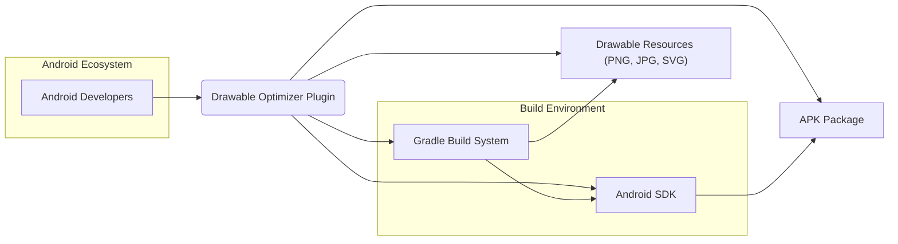
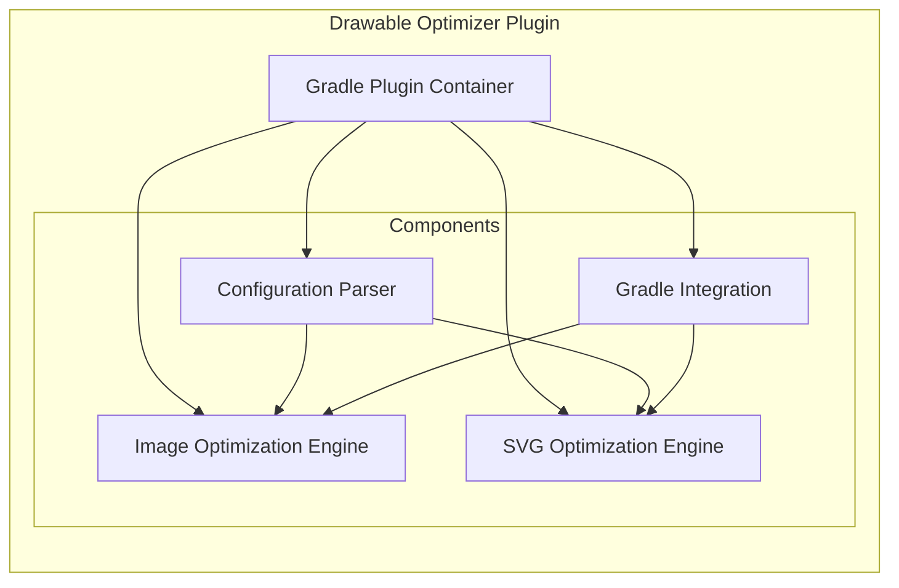
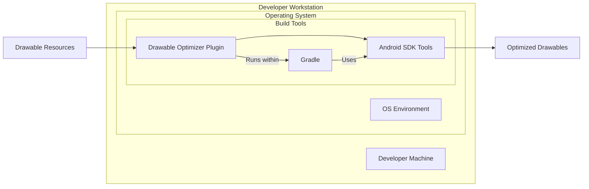
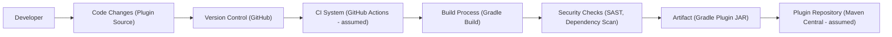

# BUSINESS POSTURE

- Business Priorities and Goals:
  - Reduce the size of Android application packages (APKs).
  - Improve application performance by reducing resource loading times.
  - Decrease bandwidth consumption for application distribution.
  - Enhance user experience by providing faster application downloads and installations.
- Business Risks:
  - Risk of introducing defects into drawable resources during optimization, potentially leading to visual artifacts or application crashes.
  - Risk of increasing build times if the optimization process is not efficient.
  - Risk of incompatibility with certain drawable formats or Android versions if the optimization is not thoroughly tested.
  - Supply chain risk associated with using external libraries for optimization, which could introduce vulnerabilities if compromised.

# SECURITY POSTURE

- Existing Security Controls:
  - security control: Source code hosted on GitHub, providing version control and transparency. (Implemented: GitHub Repository)
  - security control: Gradle plugin distribution through a package repository (e.g., Maven Central), which typically includes checksum verification. (Implemented: Package Repository - assumed)
- Accepted Risks:
  - accepted risk: Reliance on external libraries for image optimization, which may contain undiscovered vulnerabilities.
  - accepted risk: Potential for denial-of-service if the plugin is used to process extremely large or malformed drawable files.
- Recommended Security Controls:
  - security control: Implement dependency scanning to identify known vulnerabilities in used libraries.
  - security control: Regularly update dependencies to incorporate security patches.
  - security control: Integrate static analysis security testing (SAST) into the build process to identify potential code-level vulnerabilities in the plugin itself.
  - security control: Consider code signing the plugin to ensure integrity and authenticity of the distributed artifact.
- Security Requirements:
  - Authentication: Not applicable as this is a build-time tool and does not handle user authentication.
  - Authorization: Not applicable as this is a build-time tool and does not manage access control.
  - Input Validation:
    - Requirement: Implement robust input validation for all drawable files processed by the plugin to prevent processing of malicious or malformed files that could lead to unexpected behavior or denial of service.
    - Requirement: Validate configuration parameters provided to the plugin to ensure they are within expected ranges and formats.
  - Cryptography: Not directly applicable as drawable optimization typically does not involve cryptographic operations. However, if future features involve secure handling of drawables (e.g., encrypted drawables), cryptographic requirements would need to be considered.

# DESIGN

- C4 CONTEXT

  - Context Diagram Elements:
    - - Name: Android Developers
      - Type: Person
      - Description: Software engineers who develop Android applications and use the Drawable Optimizer Plugin to reduce APK size.
      - Responsibilities: Use the plugin in their Android projects to optimize drawable resources. Configure the plugin according to their project needs.
      - Security controls: Responsible for using the plugin correctly and securely within their development environment.
    - - Name: Drawable Optimizer Plugin
      - Type: Software System
      - Description: A Gradle plugin that automates the optimization of Android drawable resources (PNG, JPG, SVG) to reduce APK size.
      - Responsibilities: Optimize drawable files. Integrate with the Gradle build process. Provide configuration options for optimization.
      - Security controls: Input validation of drawable files. Dependency scanning of optimization libraries.
    - - Name: Gradle Build System
      - Type: Software System
      - Description: The build automation tool used for Android projects. The Drawable Optimizer Plugin integrates with Gradle to perform optimization during the build process.
      - Responsibilities: Execute build tasks, including running Gradle plugins. Manage project dependencies.
      - Security controls: Plugin verification and execution within the Gradle environment. Dependency management and resolution.
    - - Name: Android SDK
      - Type: Software System
      - Description: The Software Development Kit provided by Google for Android development. It includes tools and libraries used in the Android build process.
      - Responsibilities: Provide tools and libraries for building Android applications. Package resources into the APK.
      - Security controls: SDK tools are assumed to be secure and regularly updated by Google.
    - - Name: Drawable Resources (PNG, JPG, SVG)
      - Type: Data Store
      - Description: Image files in various formats used as drawables in Android applications. These are the input to the Drawable Optimizer Plugin.
      - Responsibilities: Store drawable assets for the Android application.
      - Security controls: File system permissions to control access to drawable resources. Input validation by the plugin when processing these files.
    - - Name: APK Package
      - Type: Data Store
      - Description: The Android Package Kit file, which is the distribution package for Android applications. The Drawable Optimizer Plugin aims to reduce the size of this package.
      - Responsibilities: Contain the compiled application code, resources, and assets. Be distributed to end-users.
      - Security controls: APK signing to ensure integrity and authenticity.

- C4 CONTAINER

  - Container Diagram Elements:
    - - Name: Gradle Plugin Container
      - Type: Container
      - Description: Represents the Drawable Optimizer Plugin as a whole, running within the Gradle build process. It encapsulates all the components of the plugin.
      - Responsibilities: Orchestrate the drawable optimization process. Manage configuration and integration with Gradle.
      - Security controls: Plugin verification by Gradle. Resource isolation within the Gradle environment.
    - - Name: Configuration Parser
      - Type: Component
      - Description: Responsible for parsing the plugin's configuration from the Gradle build script (e.g., `build.gradle` file).
      - Responsibilities: Read and validate plugin configuration parameters. Provide configuration data to other components.
      - Security controls: Input validation of configuration parameters to prevent injection or misconfiguration.
    - - Name: Image Optimization Engine
      - Type: Component
      - Description: Handles the optimization of raster image formats like PNG and JPG. Likely uses external libraries for image compression and optimization.
      - Responsibilities: Process PNG and JPG drawable files. Apply optimization algorithms to reduce file size.
      - Security controls: Input validation of image files. Dependency scanning of image optimization libraries. Error handling during image processing.
    - - Name: SVG Optimization Engine
      - Type: Component
      - Description: Handles the optimization of SVG (Scalable Vector Graphics) drawable files. Likely uses external libraries for SVG optimization.
      - Responsibilities: Process SVG drawable files. Apply optimization algorithms to reduce file size and complexity.
      - Security controls: Input validation of SVG files. Dependency scanning of SVG optimization libraries. Error handling during SVG processing.
    - - Name: Gradle Integration
      - Type: Component
      - Description: Provides the interface and logic for integrating the plugin with the Gradle build lifecycle.
      - Responsibilities: Register plugin tasks with Gradle. Hook into the build process to execute optimization tasks at the appropriate time.
      - Security controls: Adherence to Gradle plugin API security guidelines. Secure handling of Gradle project context and build environment.

- DEPLOYMENT

  - Deployment Diagram Elements:
    - - Name: Developer Machine
      - Type: Node
      - Description: The local computer used by an Android developer to build and test applications.
      - Responsibilities: Host the development environment, including the operating system, build tools, and source code.
      - Security controls: Operating system security controls (firewall, antivirus). User account controls. File system permissions.
    - - Name: OS Environment
      - Type: Container
      - Description: The operating system environment on the developer's machine (e.g., Windows, macOS, Linux).
      - Responsibilities: Provide the runtime environment for build tools and applications. Manage system resources.
      - Security controls: Operating system level security features. Regular OS updates and patching.
    - - Name: Gradle
      - Type: Container
      - Description: The Gradle build system installed on the developer's machine.
      - Responsibilities: Execute build scripts, manage dependencies, run plugins.
      - Security controls: Gradle plugin verification. Secure execution environment.
    - - Name: Drawable Optimizer Plugin
      - Type: Container
      - Description: The deployed instance of the Drawable Optimizer Plugin running within the Gradle environment on the developer's machine.
      - Responsibilities: Optimize drawable resources during the build process.
      - Security controls: Input validation. Dependency scanning. Resource limits.
    - - Name: Android SDK Tools
      - Type: Container
      - Description: Tools from the Android SDK used during the build process, potentially invoked by the plugin or Gradle.
      - Responsibilities: Compile resources, package APKs, and other build-related tasks.
      - Security controls: Assumed to be secure tools provided by Google. Regular SDK updates.
    - - Name: Drawable Resources
      - Type: Data Store
      - Description: The drawable resource files located in the Android project on the developer's machine.
      - Responsibilities: Store the original drawable assets.
      - Security controls: File system permissions.
    - - Name: Optimized Drawables
      - Type: Data Store
      - Description: The optimized drawable resource files generated by the plugin, typically replacing the original files or placed in a separate output directory.
      - Responsibilities: Store the optimized drawable assets.
      - Security controls: File system permissions.

- BUILD

  - Build Diagram Elements:
    - - Name: Developer
      - Type: Person
      - Description: A software developer who contributes to the development of the Drawable Optimizer Plugin.
      - Responsibilities: Write and maintain the plugin's source code. Commit code changes to version control.
      - Security controls: Secure coding practices. Code review process. Access control to the code repository.
    - - Name: Code Changes (Plugin Source)
      - Type: Data
      - Description: Modifications to the plugin's source code made by developers.
      - Responsibilities: Represent the plugin's codebase.
      - Security controls: Version control history and integrity. Code review process.
    - - Name: Version Control (GitHub)
      - Type: System
      - Description: GitHub repository hosting the plugin's source code.
      - Responsibilities: Store and manage the plugin's source code. Track changes and versions. Facilitate collaboration.
      - Security controls: Access control to the repository. Authentication and authorization for code changes. Audit logging.
    - - Name: CI System (GitHub Actions - assumed)
      - Type: System
      - Description: Continuous Integration system, assumed to be GitHub Actions, that automates the build, test, and release process of the plugin.
      - Responsibilities: Automate build process. Run tests. Perform security checks. Publish artifacts.
      - Security controls: Secure build environment. Access control to CI configurations. Audit logging. Secrets management for build credentials.
    - - Name: Build Process (Gradle Build)
      - Type: Process
      - Description: The automated Gradle build process defined for the plugin, executed by the CI system.
      - Responsibilities: Compile source code. Package plugin artifacts (JAR). Run unit tests.
      - Security controls: Build script integrity. Dependency management. Controlled build environment.
    - - Name: Security Checks (SAST, Dependency Scan)
      - Type: Process
      - Description: Automated security checks integrated into the build process, including Static Application Security Testing (SAST) and dependency vulnerability scanning.
      - Responsibilities: Identify potential security vulnerabilities in the code and dependencies. Generate security reports.
      - Security controls: SAST tool configuration and accuracy. Dependency scanning tool and vulnerability database.
    - - Name: Artifact (Gradle Plugin JAR)
      - Type: Data
      - Description: The compiled and packaged Gradle plugin artifact (JAR file) produced by the build process.
      - Responsibilities: Distributable plugin artifact.
      - Security controls: Code signing of the JAR artifact. Checksum verification.
    - - Name: Plugin Repository (Maven Central - assumed)
      - Type: System
      - Description: Repository for distributing Gradle plugins, assumed to be Maven Central.
      - Responsibilities: Host and distribute the plugin artifact. Make the plugin available to Android developers.
      - Security controls: Repository security controls. Artifact verification (checksums, signatures). Access control for publishing.

# RISK ASSESSMENT

- Critical Business Processes:
  - Android application development and build process.
  - Distribution of Android applications to end-users.
- Data to Protect:
  - Drawable resources: Sensitivity is generally low to medium, depending on the content of the images. Potential confidentiality concerns if drawables contain sensitive information (e.g., branding assets, logos). Integrity is important to ensure correct application functionality and visual appearance.
  - Plugin integrity: High sensitivity. Compromise of the plugin could lead to widespread impact on applications using it. Integrity and availability are critical.

# QUESTIONS & ASSUMPTIONS

- Questions:
  - What specific image optimization libraries are used by the plugin for PNG, JPG, and SVG formats?
  - Is there any input validation implemented for drawable files to prevent processing of malicious or malformed files?
  - What is the process for updating dependencies, including security patches for optimization libraries?
  - Is there a code signing process in place for the distributed plugin artifact?
  - What type of static analysis security testing (SAST) is performed, if any?
  - How are configuration parameters validated to prevent potential misconfiguration vulnerabilities?
- Assumptions:
  - The plugin is intended for use by Android developers to optimize drawable resources in their applications.
  - The plugin is distributed through a public Gradle plugin repository like Maven Central.
  - The build process for the plugin is automated using a CI/CD system, likely GitHub Actions.
  - Security checks, such as dependency scanning and potentially SAST, are or will be integrated into the build process.
  - Developers using the plugin are responsible for ensuring the security of their own development environments and applications.