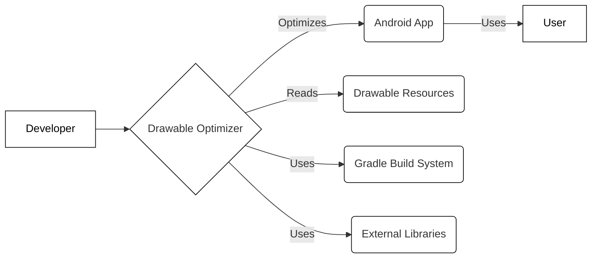
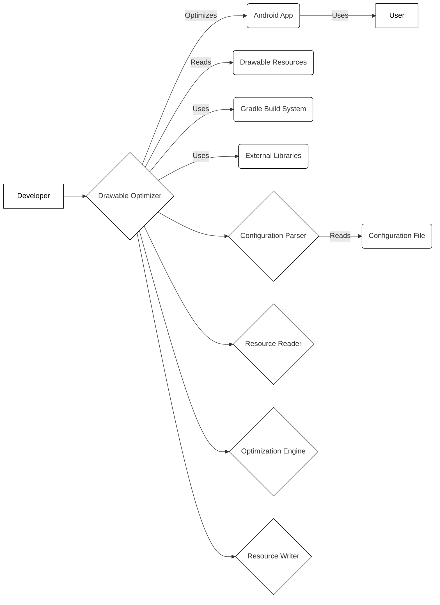
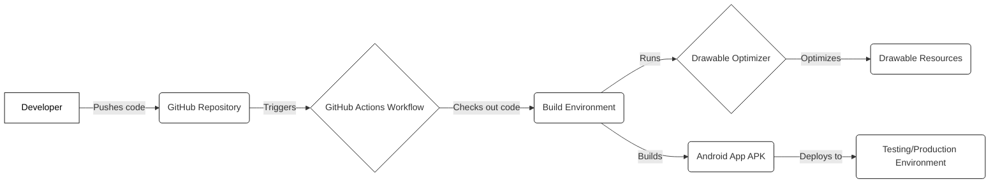
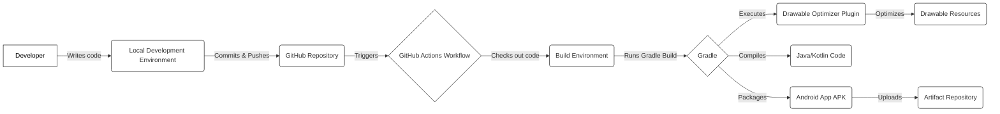

# BUSINESS POSTURE

Business Priorities and Goals:

*   Reduce the size of Android application packages (APKs) by optimizing drawable resources.
*   Improve application performance by reducing memory usage associated with drawables.
*   Automate the optimization process to integrate seamlessly into the development workflow.
*   Provide a customizable tool that allows developers to configure optimization settings.
*   Support various image formats commonly used in Android development.

Most Important Business Risks:

*   Incompatibility: Optimized drawables may not render correctly on all Android versions or devices, leading to visual glitches or application crashes.
*   Performance Degradation: Aggressive optimization settings might degrade image quality or introduce unexpected performance issues.
*   Integration Issues: The tool may not integrate smoothly with all build systems or development environments, causing disruptions in the workflow.
*   Security Vulnerabilities: If not properly secured, the tool itself or its dependencies could introduce vulnerabilities into the application build process.
*   Maintenance Overhead: The tool requires ongoing maintenance and updates to support new Android versions, image formats, and optimization techniques.

# SECURITY POSTURE

Existing Security Controls:

*   security control: The project is open-source, allowing for community review and contributions to identify and address potential security issues. (Described in the GitHub repository)
*   security control: The project uses Gradle as a build system, which offers some built-in security features like dependency verification. (Described in build.gradle files)

Accepted Risks:

*   accepted risk: The tool relies on external libraries (e.g., `com.android.tools.build:gradle`, `org.ow2.asm:asm`). Vulnerabilities in these dependencies could impact the security of the tool.
*   accepted risk: The tool modifies the application's resources, which could potentially introduce subtle bugs or vulnerabilities if not handled carefully.

Recommended Security Controls:

*   security control: Implement dependency scanning to automatically identify and report known vulnerabilities in project dependencies.
*   security control: Integrate static analysis tools (e.g., FindBugs, PMD, or Android Lint) to detect potential security issues in the codebase.
*   security control: Conduct regular security reviews of the code to identify and address potential vulnerabilities.
*   security control: Sign the released artifacts to ensure their integrity and authenticity.

Security Requirements:

*   Authentication: Not applicable, as the tool is a command-line utility that doesn't require user authentication.
*   Authorization: Not applicable, as the tool operates on local files and doesn't interact with external services that require authorization.
*   Input Validation:
    *   The tool should validate user-provided input, such as file paths and configuration options, to prevent injection attacks or unexpected behavior.
    *   The tool should handle invalid or corrupted image files gracefully, without crashing or exposing sensitive information.
*   Cryptography:
    *   If the tool interacts with remote resources (e.g., to download updates or report usage statistics), it should use secure communication protocols (e.g., HTTPS) and validate certificates.
    *   If the tool stores sensitive data (which it shouldn't), it should use appropriate encryption mechanisms.

# DESIGN

## C4 CONTEXT

Element Descriptions:

*   Element 1:
    *   Name: Developer
    *   Type: Person
    *   Description: The person who uses the Drawable Optimizer tool.
    *   Responsibilities: Configures and runs the tool, integrates it into the build process.
    *   Security controls: Uses a secure development environment, follows secure coding practices.

*   Element 2:
    *   Name: Drawable Optimizer
    *   Type: Software System
    *   Description: The tool that optimizes drawable resources in an Android project.
    *   Responsibilities: Parses configuration, reads drawable resources, applies optimization algorithms, writes optimized resources.
    *   Security controls: Input validation, dependency scanning, static analysis, regular security reviews.

*   Element 3:
    *   Name: Android App
    *   Type: Software System
    *   Description: The Android application that benefits from the optimized drawables.
    *   Responsibilities: Displays optimized drawables to the user.
    *   Security controls: Standard Android security best practices.

*   Element 4:
    *   Name: User
    *   Type: Person
    *   Description: The end-user of the Android application.
    *   Responsibilities: Interacts with the application.
    *   Security controls: None directly related to the Drawable Optimizer.

*   Element 5:
    *   Name: Drawable Resources
    *   Type: Data
    *   Description: The input files (e.g., PNG, XML) that the tool optimizes.
    *   Responsibilities: Provide visual elements for the Android application.
    *   Security controls: None directly. Relies on the security of the file system.

*   Element 6:
    *   Name: Gradle Build System
    *   Type: Software System
    *   Description: The build system used to build the Android application and integrate the Drawable Optimizer.
    *   Responsibilities: Manages dependencies, compiles code, packages the application.
    *   Security controls: Dependency verification, secure configuration.

*   Element 7:
    *   Name: External Libraries
    *   Type: Software System
    *   Description: Third-party libraries used by the Drawable Optimizer.
    *   Responsibilities: Provide functionality for image processing, XML parsing, etc.
    *   Security controls: Relies on the security of the libraries themselves. Dependency scanning is crucial.

## C4 CONTAINER

Element Descriptions:

*   Element 1-7 are the same as in C4 Context diagram.

*   Element 8:
    *   Name: Configuration Parser
    *   Type: Container
    *   Description: Parses the configuration file provided by the developer.
    *   Responsibilities: Reads the configuration file, validates the settings, and makes them available to other components.
    *   Security controls: Input validation to prevent injection attacks or unexpected behavior.

*   Element 9:
    *   Name: Resource Reader
    *   Type: Container
    *   Description: Reads the drawable resources from the Android project.
    *   Responsibilities: Locates drawable files, parses their content, and prepares them for optimization.
    *   Security controls: Input validation to handle invalid or corrupted image files gracefully.

*   Element 10:
    *   Name: Optimization Engine
    *   Type: Container
    *   Description: Applies the optimization algorithms to the drawable resources.
    *   Responsibilities: Implements various optimization techniques, such as resizing, color palette reduction, and vectorization.
    *   Security controls: None specific, but relies on the correctness of the algorithms to avoid introducing vulnerabilities.

*   Element 11:
    *   Name: Resource Writer
    *   Type: Container
    *   Description: Writes the optimized drawable resources back to the Android project.
    *   Responsibilities: Replaces the original drawable files with the optimized versions.
    *   Security controls: Ensures that the output files are written with appropriate permissions.

*   Element 12:
    *   Name: Configuration File
    *   Type: Data
    *   Description: A file (e.g., XML, YAML, or JSON) that contains the configuration settings for the Drawable Optimizer.
    *   Responsibilities: Specifies which optimization techniques to apply and their parameters.
    *   Security controls: None directly. Relies on the security of the file system.

## DEPLOYMENT

Possible Deployment Solutions:

1.  **Local Machine:** The tool is run directly on the developer's machine as part of the local build process.
2.  **CI/CD Pipeline:** The tool is integrated into a CI/CD pipeline (e.g., GitHub Actions, Jenkins, GitLab CI) and runs automatically on a build server.
3.  **Cloud Build Service:** The tool is run on a cloud-based build service (e.g., Google Cloud Build, AWS CodeBuild).

Chosen Solution (for detailed description): **CI/CD Pipeline (GitHub Actions)**

Element Descriptions:

*   Element 1:
    *   Name: Developer
    *   Type: Person
    *   Description: The person who develops the Android application and uses the Drawable Optimizer.
    *   Responsibilities: Writes code, configures the build process, and triggers builds.
    *   Security controls: Uses a secure development environment, follows secure coding practices.

*   Element 2:
    *   Name: GitHub Repository
    *   Type: Software System
    *   Description: The source code repository hosted on GitHub.
    *   Responsibilities: Stores the application code, build scripts, and configuration files.
    *   Security controls: GitHub's built-in security features, such as access control, branch protection, and vulnerability scanning.

*   Element 3:
    *   Name: GitHub Actions Workflow
    *   Type: Software System
    *   Description: The CI/CD pipeline defined in a YAML file in the GitHub repository.
    *   Responsibilities: Automates the build, test, and deployment process.
    *   Security controls: GitHub Actions' security features, such as secrets management and environment protection.

*   Element 4:
    *   Name: Build Environment
    *   Type: Node
    *   Description: The virtual machine or container where the build process runs.
    *   Responsibilities: Provides the necessary tools and resources to build the Android application.
    *   Security controls: Isolated environment, limited access, regular security updates.

*   Element 5:
    *   Name: Drawable Optimizer
    *   Type: Software System
    *   Description: The tool that optimizes drawable resources. (Same as in previous diagrams)
    *   Responsibilities: Parses configuration, reads drawable resources, applies optimization algorithms, writes optimized resources.
    *   Security controls: Input validation, dependency scanning, static analysis, regular security reviews.

*   Element 6:
    *   Name: Drawable Resources
    *   Type: Data
    *   Description: The input files (e.g., PNG, XML) that the tool optimizes.
    *   Responsibilities: Provide visual elements for the Android application.
    *   Security controls: None directly. Relies on the security of the build environment.

*   Element 7:
    *   Name: Android App APK
    *   Type: Software System
    *   Description: The final Android application package.
    *   Responsibilities: Contains the compiled code, resources, and manifest file.
    *   Security controls: Standard Android security best practices, code signing.

*   Element 8:
    *   Name: Testing/Production Environment
    *   Type: Node
    *   Description: The environment where the Android application is deployed for testing or production use.
    *   Responsibilities: Runs the Android application.
    *   Security controls: Depends on the specific environment (e.g., Google Play Store, internal testing platform).

## BUILD

Build Process Description:

1.  **Developer Writes Code:** The developer writes code and configuration for the Drawable Optimizer plugin in their local development environment.
2.  **Commit and Push:** The developer commits the changes and pushes them to the GitHub repository.
3.  **GitHub Actions Trigger:** The push to the repository triggers a GitHub Actions workflow.
4.  **Checkout Code:** The workflow checks out the code from the repository into a build environment.
5.  **Run Gradle Build:** The workflow executes the Gradle build script.
6.  **Execute Drawable Optimizer Plugin:** The Gradle build script applies the Drawable Optimizer plugin.
7.  **Optimize Drawables:** The plugin optimizes the drawable resources in the project.
8.  **Compile Code:** Gradle compiles the Java/Kotlin code.
9.  **Package APK:** Gradle packages the compiled code, optimized resources, and manifest file into an Android App APK.
10. **Upload Artifact:** The APK is uploaded to an artifact repository (e.g., GitHub Packages, Artifactory).

Security Controls in Build Process:

*   security control: **Dependency Scanning:** Gradle can be configured to use dependency scanning tools (e.g., OWASP Dependency-Check) to identify known vulnerabilities in project dependencies.
*   security control: **Static Analysis:** Static analysis tools (e.g., FindBugs, PMD, Android Lint) can be integrated into the Gradle build process to detect potential security issues in the codebase.
*   security control: **Code Signing:** The APK should be signed with a developer certificate to ensure its integrity and authenticity.
*   security control: **Secure Build Environment:** The GitHub Actions build environment should be configured securely, with limited access and regular security updates.
*   security control: **Secrets Management:** Sensitive data, such as API keys or signing keys, should be stored securely using GitHub Actions secrets.
*   security control: **Supply Chain Security:** Use trusted sources for dependencies and verify their integrity.

# RISK ASSESSMENT

Critical Business Processes to Protect:

*   **Application Build Process:** Ensuring the integrity and security of the build process is crucial to prevent malicious code from being injected into the application.
*   **Application Performance:** Maintaining or improving application performance is essential for a positive user experience.
*   **Application Stability:** Preventing crashes or visual glitches caused by the optimization process is critical.

Data to Protect and Sensitivity:

*   **Source Code:** The source code of the Drawable Optimizer and the Android application itself is sensitive and should be protected from unauthorized access. (Sensitivity: Medium)
*   **Drawable Resources:** The drawable resources are part of the application's intellectual property and should be protected. (Sensitivity: Low to Medium, depending on the originality of the resources)
*   **Configuration Files:** Configuration files may contain sensitive information, such as API keys or optimization settings. (Sensitivity: Low to High, depending on the content)
*   **Build Artifacts (APK):** The APK file is the final product and should be protected from tampering. (Sensitivity: Medium)
*   **User Data:** The Drawable Optimizer itself does not handle user data. However, the Android application it optimizes might. (Sensitivity: Varies greatly depending on the application)

# QUESTIONS & ASSUMPTIONS

Questions:

*   What specific image formats are supported by the Drawable Optimizer?
*   What optimization algorithms are used by the tool?
*   What are the default optimization settings, and how can they be customized?
*   How does the tool handle errors or unexpected input?
*   Are there any known limitations or compatibility issues with specific Android versions or devices?
*   What is the process for reporting bugs or security vulnerabilities?
*   Is there a mechanism for the tool to check for updates or new versions?
*   Does the tool collect any usage statistics or telemetry data? If so, what data is collected, and how is it used?

Assumptions:

*   **BUSINESS POSTURE:** The primary goal is to reduce APK size and improve application performance without significantly impacting visual quality.
*   **BUSINESS POSTURE:** The project has a moderate risk appetite, willing to accept some risk of minor visual glitches in exchange for significant size reduction.
*   **SECURITY POSTURE:** The project follows basic security best practices, but there is room for improvement.
*   **SECURITY POSTURE:** The developers are aware of the potential security risks associated with using external libraries and modifying application resources.
*   **DESIGN:** The tool is primarily used as a Gradle plugin integrated into the Android build process.
*   **DESIGN:** The tool operates on local files and doesn't require network access (except possibly for downloading updates or dependencies).
*   **DESIGN:** The tool is designed to be customizable and extensible, allowing developers to add new optimization techniques or support additional image formats.
*   **DESIGN:** The build process is automated using Gradle and GitHub Actions.