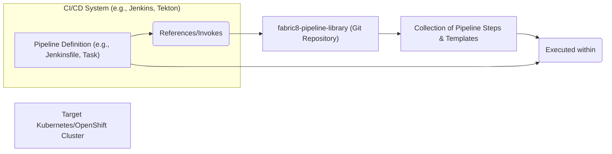
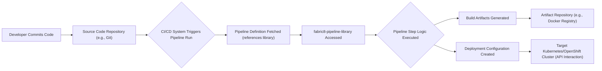

## Project Design Document: fabric8-pipeline-library

**Document Version:** 1.1
**Date:** October 26, 2023
**Author:** AI Software Architect

### 1. Introduction

This document provides an enhanced design overview of the `fabric8-pipeline-library` project, accessible at [https://github.com/fabric8io/fabric8-pipeline-library](https://github.com/fabric8io/fabric8-pipeline-library). This revised document is specifically tailored to facilitate comprehensive threat modeling activities. It details the project's architecture, key components, and data flow, emphasizing aspects relevant to identifying potential security vulnerabilities and attack vectors. This document aims to provide a clear understanding of the library's structure and intended usage within CI/CD pipelines on Kubernetes and OpenShift.

### 2. Goals and Objectives

The primary goal of the `fabric8-pipeline-library` is to empower development teams with a curated collection of reusable and robust pipeline steps and templates, streamlining the creation of secure and efficient CI/CD workflows within Kubernetes and OpenShift environments. The specific objectives include:

*   **Simplifying and Accelerating Pipeline Development:**  Offer pre-built, well-tested pipeline components, reducing the time and effort required to construct CI/CD pipelines from scratch. For example, instead of writing custom scripts for building Docker images, developers can leverage a pre-existing step.
*   **Enforcing Consistency and Best Practices:** Promote standardized approaches for common CI/CD tasks, ensuring uniformity and adherence to recommended practices across different projects. This includes consistent methods for testing, security scanning, and deployment.
*   **Improving Operational Efficiency and Reducing Redundancy:** Minimize the duplication of effort by providing reusable steps, eliminating the need for teams to implement the same logic repeatedly. This centralizes common functionalities like interacting with artifact repositories or Kubernetes APIs.
*   **Enhancing Pipeline Security Posture:**  Provide secure and vetted pipeline components, reducing the risk of introducing vulnerabilities through custom-built steps. This includes steps that incorporate security scanning tools and secure secret management practices.
*   **Lowering the Barrier to Entry for Kubernetes/OpenShift CI/CD:** Make it easier for teams new to Kubernetes and OpenShift to adopt and implement effective CI/CD practices by providing readily available and understandable building blocks.

### 3. Scope

This design document encompasses the essential architectural elements and functionalities of the `fabric8-pipeline-library` that are pertinent to threat modeling. The scope includes:

*   The organizational structure and categorization of pipeline steps and templates within the library.
*   The intended mechanisms for integrating and utilizing the library's components within various CI/CD systems (e.g., how a Jenkinsfile or Tekton Task would reference a library step).
*   The flow of data and control when a pipeline step from the library is executed.
*   The interactions between the library's components and the target Kubernetes/OpenShift environment, including API calls and resource access.

This document explicitly excludes:

*   The internal implementation details of individual pipeline steps' code. The focus is on the interface and intended function of the steps.
*   The configuration and operational management of the underlying CI/CD platform itself (e.g., setting up Jenkins agents, configuring Tekton Pipelines).
*   The detailed security configurations and network policies of the target Kubernetes/OpenShift cluster. We assume a basic level of security within the cluster.

### 4. High-Level Architecture

The `fabric8-pipeline-library` acts as a central repository of reusable pipeline building blocks. CI/CD systems consume these blocks to construct and execute pipelines. The library itself is passive; it provides the definitions and logic that are actively invoked by the CI/CD engine.

*   **"CI/CD System (e.g., Jenkins, Tekton)"**: Represents the CI/CD orchestration platform responsible for running the pipelines. Examples include Jenkins, Tekton Pipelines, GitLab CI, etc.
*   **"Pipeline Definition (e.g., Jenkinsfile, Task)"**:  The declarative or imperative configuration that defines the sequence of steps in a CI/CD pipeline. This definition includes references to components within the `fabric8-pipeline-library`.
*   **"fabric8-pipeline-library (Git Repository)"**: The central repository (likely a Git repository) where the reusable pipeline steps and templates are stored and versioned.
*   **"Collection of Pipeline Steps & Templates"**: The actual content of the library, consisting of individual, pre-defined units of work (steps) and pre-configured workflows (templates).
*   **"Target Kubernetes/OpenShift Cluster"**: The Kubernetes or OpenShift environment where applications are built, tested, and ultimately deployed by the pipelines.

### 5. Component Details

The `fabric8-pipeline-library` is organized into distinct types of reusable components:

*   **Individual Pipeline Steps:** These are atomic, self-contained units of work designed to perform a specific, well-defined task within a pipeline. Examples include:
    *   `"build-docker-image"`:  A step to build a Docker image from a Dockerfile.
    *   `"run-unit-tests"`: A step to execute unit tests for a given project.
    *   `"deploy-to-kubernetes"`: A step to deploy an application to a Kubernetes cluster using `kubectl`.
    *   `"perform-static-analysis"`: A step to run static code analysis tools like SonarQube or Checkstyle.
    *   `"publish-artifact"`: A step to upload build artifacts to an artifact repository like Nexus or Artifactory.
*   **Composable Pipeline Snippets:**  Smaller, reusable fragments of pipeline logic that can be incorporated into larger pipeline definitions. These might handle common tasks like setting up environment variables or checking out code.
*   **End-to-End Pipeline Templates:** Pre-configured, complete pipeline definitions that combine multiple pipeline steps to implement common CI/CD workflows. These provide a starting point for typical application build, test, and deployment scenarios. Examples include:
    *   `"java-maven-kaniko-deploy"`: A template for building a Java Maven project, building a Docker image with Kaniko, and deploying to Kubernetes.
    *   `"nodejs-npm-helm-deploy"`: A template for building a Node.js project, packaging it with Helm, and deploying to Kubernetes.
*   **Shared Utility Scripts and Functions:** Reusable scripts or functions (e.g., shell scripts, Python functions) that can be invoked by pipeline steps to perform common operations or calculations.
*   **Configuration as Code:**  Configuration files (e.g., `.yamllint.yaml`, `.hadolint.yaml`) that define settings for linters, security scanners, or other tools used within the pipeline steps.
*   **Comprehensive Documentation and Examples:**  Documentation explaining how to use the various components, including usage examples and parameter descriptions.

### 6. Data Flow

The data flow illustrates how the `fabric8-pipeline-library`'s components are utilized within a typical CI/CD pipeline execution:

1. **"Developer Commits Code"**: A developer commits changes to the application's source code.
2. **"Source Code Repository (e.g., Git)"**: The version control system where the application's source code is stored.
3. **"CI/CD System Triggers Pipeline Run"**: An event (e.g., a code commit, a scheduled trigger) initiates a pipeline execution within the CI/CD system.
4. **"Pipeline Definition Fetched (references library)"**: The CI/CD system retrieves the pipeline definition, which contains instructions and references to steps within the `fabric8-pipeline-library`.
5. **"fabric8-pipeline-library Accessed"**: The CI/CD system accesses the `fabric8-pipeline-library` (typically by cloning the Git repository or accessing it through a package manager) to retrieve the code and configuration for the referenced pipeline steps.
6. **"Pipeline Step Logic Executed"**: The CI/CD system executes the logic defined within the pipeline steps from the `fabric8-pipeline-library`. This may involve running scripts, invoking tools, or interacting with external systems.
7. **"Build Artifacts Generated"**: Pipeline steps may produce build artifacts, such as Docker images, compiled binaries, or packaged applications.
8. **"Deployment Configuration Created"**: Steps involved in deployment may generate or utilize deployment configuration files, such as Kubernetes manifests or Helm charts.
9. **"Artifact Repository (e.g., Docker Registry)"**: Build artifacts are typically pushed to an artifact repository for storage and distribution.
10. **"Target Kubernetes/OpenShift Cluster (API Interaction)"**: Deployment steps interact with the Kubernetes or OpenShift API to deploy the application using the generated deployment configurations.

### 7. Security Considerations (For Threat Modeling)

The security of the `fabric8-pipeline-library` and its usage within CI/CD pipelines is paramount. Potential threats and vulnerabilities to consider include:

*   **Compromised Pipeline Steps (Supply Chain Attack):**
    *   **Threat:** Malicious actors could inject malicious code into pipeline steps within the library, potentially compromising any pipeline that uses those steps.
    *   **Example:** A compromised step could exfiltrate secrets, inject vulnerabilities into build artifacts, or modify deployment configurations.
*   **Insecure Secrets Management:**
    *   **Threat:** Pipeline steps might handle sensitive credentials (API keys, passwords, tokens) insecurely, exposing them in logs, environment variables, or source code.
    *   **Example:** A step might directly embed a database password in a script instead of using a secure secrets management solution.
*   **Insufficient Input Validation:**
    *   **Threat:** Pipeline steps might not properly validate inputs, leading to vulnerabilities like command injection or path traversal.
    *   **Example:** A step that takes a filename as input might be vulnerable if it doesn't sanitize the input, allowing an attacker to specify arbitrary file paths.
*   **Vulnerable Dependencies:**
    *   **Threat:** Pipeline steps might rely on external libraries or tools with known security vulnerabilities.
    *   **Example:** A pipeline step might use an outdated version of a security scanning tool with a known bypass.
*   **Unauthorized Modification of the Library:**
    *   **Threat:**  Insufficient access controls on the `fabric8-pipeline-library` repository could allow unauthorized individuals to modify or introduce malicious steps.
    *   **Example:** An attacker gaining access to the Git repository could introduce a backdoor into a widely used pipeline step.
*   **Lack of Logging and Auditing:**
    *   **Threat:** Insufficient logging and auditing of pipeline step execution can hinder security monitoring and incident response.
    *   **Example:** If pipeline step executions are not logged, it becomes difficult to track down the source of a security breach.
*   **Code Injection via Pipeline Definitions:**
    *   **Threat:** If pipeline definitions allow for arbitrary code execution or unsanitized parameterization, attackers could inject malicious code.
    *   **Example:** A pipeline definition might allow users to specify arbitrary shell commands that are then executed by a pipeline step.
*   **Exposure of Sensitive Data in Logs or Artifacts:**
    *   **Threat:** Pipeline steps might inadvertently expose sensitive data (e.g., API responses, configuration details) in pipeline logs or generated artifacts.
    *   **Example:** A debugging statement in a pipeline step might print sensitive environment variables to the console.
*   **Insufficient Permissions:**
    *   **Threat:** Pipeline steps might be granted excessive permissions within the CI/CD system or the target Kubernetes/OpenShift cluster, allowing them to perform actions beyond their intended scope.
    *   **Example:** A build step might have permissions to modify Kubernetes deployments, which is unnecessary for its core function.
*   **Data Security During Pipeline Execution:**
    *   **Threat:** Sensitive data processed during pipeline execution (e.g., during testing or deployment) might not be adequately protected in transit or at rest.
    *   **Example:** Database credentials might be passed in plain text between pipeline steps.

### 8. Deployment

The `fabric8-pipeline-library` is typically deployed as a version-controlled Git repository. CI/CD systems integrate with the library through various mechanisms:

*   **Direct Git Repository Access:** CI/CD systems can directly clone or fetch the `fabric8-pipeline-library` Git repository. Pipeline definitions then reference specific steps or templates within the repository using file paths or predefined identifiers.
*   **Packaging and Distribution as a Shared Library:** The library's components might be packaged and distributed as a shared library or plugin within the CI/CD system's ecosystem. This allows for easier management and versioning within the CI/CD platform.
*   **Containerized Pipeline Steps:** Individual pipeline steps might be packaged as container images and stored in a container registry. CI/CD systems can then pull and execute these containerized steps.

The chosen deployment method depends on the specific CI/CD system being used and the organizational preferences for managing reusable pipeline components.

### 9. Future Considerations

Future development of the `fabric8-pipeline-library` could focus on enhancing its security and usability:

*   **Enhanced Security Auditing and Scanning of Pipeline Steps:** Implement automated processes to regularly audit and scan the library's components for vulnerabilities.
*   **Formalized Security Review Process for Contributions:** Establish a rigorous security review process for any new contributions or modifications to the library.
*   **Integration with Secrets Management Solutions:**  Ensure all pipeline steps seamlessly integrate with secure secrets management solutions (e.g., HashiCorp Vault, Kubernetes Secrets).
*   **Improved Input Validation Framework:** Develop a standardized framework for input validation within pipeline steps to prevent common injection attacks.
*   **Fine-grained Access Control for Library Modifications:** Implement more granular access controls for managing contributions and modifications to the library.
*   **Standardized Logging and Auditing Practices:** Enforce consistent logging and auditing practices across all pipeline steps within the library.
*   **Policy Enforcement and Compliance Checks:** Introduce mechanisms to enforce security policies and compliance checks within the pipelines using the library's components.

This enhanced design document provides a more detailed and security-focused overview of the `fabric8-pipeline-library`, serving as a valuable resource for conducting thorough threat modeling activities.