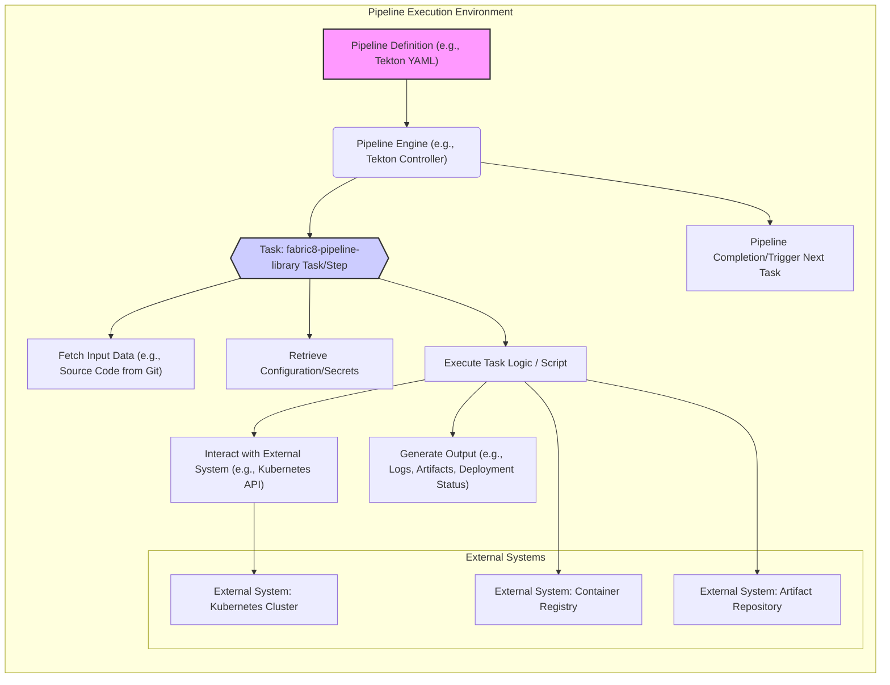

# Project Design Document: fabric8-pipeline-library

**Version:** 1.1
**Date:** October 26, 2023
**Author:** AI Software Architect

## 1. Introduction

This document details the design of the `fabric8-pipeline-library`, a collection of reusable components and utilities designed to streamline the creation of CI/CD pipelines, particularly within Kubernetes and OpenShift environments. This document serves as a blueprint for understanding the library's architecture, data flow, and core elements, forming a crucial foundation for subsequent threat modeling activities.

## 2. Goals and Objectives

The primary objectives of the `fabric8-pipeline-library` are to:

* Provide readily usable pipeline components for common CI/CD tasks.
* Simplify the process of defining and managing complex pipelines.
* Enforce consistent practices and standards across different pipelines.
* Enhance the maintainability and reduce redundancy in pipeline definitions.
* Improve the efficiency and reliability of pipeline executions through optimized components.

## 3. System Architecture

The `fabric8-pipeline-library` is conceived as a set of modular resources – functions, scripts, and potentially container images – that are invoked within the context of a CI/CD pipeline execution engine. It's not a standalone application but a library consumed by orchestration platforms like Tekton or Jenkins.

### 3.1 Key Components

* **Pipeline Tasks/Steps:** These represent discrete actions within a pipeline. Examples include:
    *  Building and pushing container images (e.g., a task named `"build-and-push-image"`).
    *  Deploying applications to Kubernetes/OpenShift (e.g., a task named `"deploy-to-kubernetes"`).
    *  Executing various types of tests (e.g., `"run-unit-tests"`, `"run-integration-tests"`).
    *  Performing static analysis on code (e.g., `"static-code-analysis"`).
    *  Managing Git operations such as tagging or branching (e.g., `"git-tag-release"`).
    *  Provisioning or managing resources on cloud platforms (e.g., `"create-cloud-resource"`).
    *  Sending notifications via different channels (e.g., `"send-slack-notification"`, `"send-email"`).
* **Shared Libraries/Utilities:** These are reusable code segments or functions designed for use across multiple pipeline tasks. Examples include:
    *  Helper functions for authenticating and interacting with Kubernetes APIs.
    *  Utilities for managing and manipulating environment variables within pipeline steps.
    *  Functions for parsing and validating configuration files used by pipeline tasks.
* **Container Images (Potentially):** Certain tasks might be packaged as container images to ensure consistent execution environments and manage specific dependencies required by the task. These images encapsulate the necessary tools and runtime libraries.
* **Documentation and Examples:** Comprehensive documentation and practical examples are essential for users to understand how to effectively integrate and utilize the library's components within their pipelines.

### 3.2 Interactions with External Systems

Pipelines leveraging the `fabric8-pipeline-library` will interact with a variety of external systems depending on the specific tasks being executed. Understanding these interactions is crucial for threat modeling:

* **Source Code Management Systems:**
    *  Examples: GitHub, GitLab, Bitbucket.
    *  Interaction: Pipelines will fetch source code repositories.
* **Container Registries:**
    *  Examples: Docker Hub, Quay.io, private registries.
    *  Interaction: Pipelines will push built container images and pull necessary base images.
* **Kubernetes/OpenShift Clusters:**
    *  Interaction: Pipelines will deploy applications, manage Kubernetes resources, and potentially retrieve cluster information.
* **Artifact Repositories:**
    *  Examples: Nexus, Artifactory, cloud storage buckets.
    *  Interaction: Pipelines may store build artifacts, binaries, or other generated files.
* **Secret Management Systems:**
    *  Examples: HashiCorp Vault, Kubernetes Secrets, cloud provider secret managers.
    *  Interaction: Pipelines will retrieve sensitive information like API keys, passwords, and certificates.
* **Notification Services:**
    *  Examples: Slack, Microsoft Teams, email servers.
    *  Interaction: Pipelines will send notifications regarding pipeline status, build results, and deployment outcomes.
* **Cloud Provider APIs:**
    *  Examples: AWS, Azure, Google Cloud Platform APIs.
    *  Interaction: Pipelines might interact with cloud services for infrastructure provisioning, resource management, or accessing cloud-specific features.
* **Monitoring and Logging Systems:**
    *  Examples: Prometheus, Grafana, Elasticsearch, Splunk.
    *  Interaction: Pipelines may integrate with these systems to report metrics, logs, and trace information.

### 3.3 Data Flow

A typical pipeline execution utilizing the `fabric8-pipeline-library` follows these stages:

1. **Pipeline Definition:** A user defines the pipeline workflow using a pipeline orchestration engine's specific syntax (e.g., Tekton YAML, Jenkinsfile). This definition includes references to specific tasks and utilities provided by the `fabric8-pipeline-library`.
2. **Pipeline Execution Trigger:** An event, such as a code commit to a repository, a scheduled trigger, or a manual initiation, starts the pipeline execution process.
3. **Task Invocation:** The pipeline engine begins executing the defined tasks sequentially. When a task originating from the `fabric8-pipeline-library` is encountered, the corresponding code (script or container image) is invoked within the pipeline's execution environment.
4. **Data Processing and Interaction:** The invoked task performs its designated operation. This may involve:
    * Fetching necessary data from external systems (e.g., downloading source code from Git).
    * Transforming data according to the task's logic (e.g., building a container image from source code).
    * Interacting with external systems to perform actions (e.g., deploying a container to a Kubernetes cluster via the Kubernetes API).
5. **Output Generation:** The task generates output as a result of its execution. This output can include:
    * Newly built container images pushed to a container registry.
    * Deployment manifests applied to a Kubernetes cluster.
    * Test results indicating success or failure.
    * Log files capturing the execution details of the task.
6. **Pipeline Completion or Next Task:** Upon successful or failed completion of a task, the pipeline engine proceeds to the next defined task in the workflow or concludes the pipeline execution.

## 4. Security Considerations (High-Level)

While this document primarily focuses on the design, it's crucial to acknowledge key security considerations that will be thoroughly examined during subsequent threat modeling:

* **Supply Chain Security:** Ensuring the integrity and trustworthiness of the library's components, dependencies, and any container images it utilizes.
* **Secrets Management:** Securely handling sensitive credentials, API keys, and other secrets used within pipeline tasks, preventing exposure or misuse.
* **Access Control and Authorization:** Implementing mechanisms to control who can define, execute, and modify pipelines and the `fabric8-pipeline-library` itself.
* **Input Validation and Sanitization:** Validating all input data received by pipeline tasks to prevent injection vulnerabilities and other malicious inputs.
* **Logging and Auditing:** Maintaining comprehensive and auditable logs of pipeline executions, actions performed, and access attempts.
* **Dependency Management:** Securely managing and regularly updating the library's dependencies to address known vulnerabilities.
* **Container Security:** Ensuring the security of any container images provided by the library, including vulnerability scanning and secure build practices.
* **Network Security:** Securing communication channels between pipeline components and external systems, utilizing encryption and appropriate network policies.

## 5. Dependencies

The `fabric8-pipeline-library` will likely depend on various technologies and libraries. Examples include:

* **Programming Languages and Associated Libraries:**
    * Go (for potentially building CLI tools or Kubernetes controllers).
    * Python (for scripting and utility functions, leveraging libraries like `requests`, `PyYAML`).
    * Bash (for shell scripting within pipeline tasks).
* **Kubernetes Client Libraries:**
    * `client-go` (for Go-based components interacting with Kubernetes).
    * `kubernetes` Python client.
* **Cloud Provider SDKs:**
    * AWS SDK for Go or Python (`aws-sdk-go`, `boto3`).
    * Azure SDK for Go or Python (`azure-sdk-for-go`, `azure-sdk-for-python`).
    * Google Cloud SDK for Go or Python (`cloud.google.com/go`, `google-cloud-python`).
* **Specific Command-Line Tools:**
    * `kubectl` (for interacting with Kubernetes clusters).
    * `docker` or `podman` (for container image operations).
    * `git` (for interacting with Git repositories).
    * `helm` (for managing Kubernetes packages).
* **Pipeline Orchestration Engine APIs/SDKs:**
    * Tekton Pipelines Go libraries.
    * Jenkins client libraries or APIs.

## 6. Deployment

The `fabric8-pipeline-library` itself is not deployed as a running application. Instead, its components are made available for use within pipeline definitions through several methods:

* **Git Repository Hosting:** The library's code (scripts, functions) is hosted in a Git repository. Users can then reference specific scripts or functions within their pipeline definitions by cloning the repository or specifying paths within it.
* **Container Image Distribution:** Specific tasks that require encapsulated environments are packaged as container images and pushed to a container registry. Pipeline definitions then reference these images to execute those tasks.
* **Packaging as Shared Libraries/Plugins:** For pipeline engines like Jenkins, the library's functionalities might be packaged as a shared library or a plugin that can be installed and utilized within Jenkins pipelines.

## 7. Future Considerations

Potential future enhancements for the `fabric8-pipeline-library` include:

* **Expanding the Catalog of Pipeline Tasks:** Adding support for a wider range of common CI/CD operations and integrating with more tools and services.
* **Improving Documentation and Examples:** Providing more detailed documentation, tutorials, and practical examples to facilitate easier adoption and usage.
* **Enhancing Test Coverage and Quality:** Increasing the test coverage of the library's components to ensure reliability and stability.
* **Adding Support for More Pipeline Orchestration Engines:** Expanding compatibility to include other popular pipeline platforms beyond Tekton and Jenkins.
* **Implementing a Robust Versioning and Release Strategy:** Establishing a clear versioning scheme and release process to manage updates and changes effectively.

This revised design document offers a more detailed and structured understanding of the `fabric8-pipeline-library`, providing a solid foundation for conducting a comprehensive threat modeling exercise to identify and address potential security vulnerabilities.