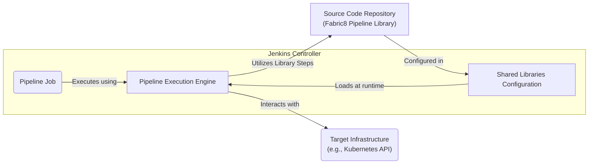
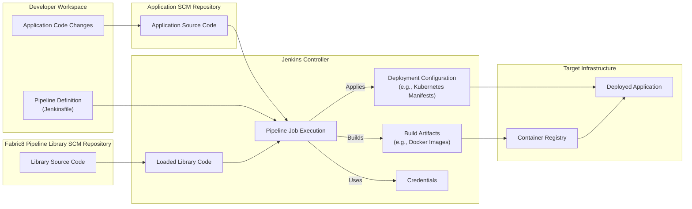

# Project Design Document: Fabric8 Pipeline Library

**Version:** 1.1
**Date:** October 26, 2023
**Author:** AI Software Architect

## 1. Introduction

This document provides an enhanced and detailed design overview of the Fabric8 Pipeline Library project, located at [https://github.com/fabric8io/fabric8-pipeline-library](https://github.com/fabric8io/fabric8-pipeline-library). This revised document aims to provide a more comprehensive articulation of the architecture, components, and data flow of the library, specifically tailored for subsequent threat modeling activities. The intended audience includes security engineers, developers, and operations personnel involved in the development, deployment, and maintenance of systems utilizing this library. This version includes more granular details and clarifies certain aspects for better understanding and threat identification.

## 2. Project Overview

The Fabric8 Pipeline Library is a curated collection of reusable and pre-defined Jenkins Pipeline shared libraries. These libraries encapsulate common, often complex, tasks and recommended best practices for building, testing, and deploying applications, with a strong emphasis on Kubernetes and cloud-native environments. The core objective of this library is to significantly simplify and enforce standardization in pipeline creation, thereby minimizing code duplication, promoting consistency across diverse projects, and reducing the learning curve for new teams.

## 3. System Architecture

The Fabric8 Pipeline Library, while not a traditional application, possesses a distinct architecture defined by its organizational structure and its interaction model with Jenkins. It's essentially a structured collection of Groovy code and resources that Jenkins dynamically loads and executes.

### 3.1. Key Components

*   **`vars/` Directory:** This directory is the primary interface of the library. It contains Groovy files, each defining global variables and, more importantly, reusable pipeline steps (functions or methods). These files act as the entry points for pipeline authors to leverage the library's functionality. Each file typically encapsulates a specific function (e.g., `dockerBuild.groovy`) or a set of related functions (e.g., `kubernetesDeploy.groovy`).
*   **`src/` Directory:** This directory houses supporting Groovy classes and utility functions that are internally utilized by the pipeline steps defined in the `vars/` directory. This promotes modularity, code reuse within the library itself, and helps in organizing complex logic. These classes are not directly exposed to pipeline authors.
*   **`resources/` Directory:** This directory can contain static resources such as configuration files (e.g., default settings for tools), templates (e.g., YAML manifests for Kubernetes), or supporting scripts (e.g., shell scripts for specific tasks). These resources are accessed and utilized by the pipeline steps during execution.
*   **`Jenkinsfile` (Example Usage):** While the library itself doesn't contain an executable `Jenkinsfile`, example `Jenkinsfile`s are often provided within the repository or documentation to demonstrate the correct usage and integration patterns of the library within actual pipeline definitions. These examples are crucial for understanding how to consume the library's functionalities.
*   **Jenkins Controller:** The central Jenkins instance responsible for managing and executing pipelines. It's the runtime environment where the Fabric8 Pipeline Library is loaded, interpreted, and executed. The Jenkins Controller manages the configuration of shared libraries.
*   **Source Code Management (SCM) Repository (e.g., Git):** The repository (typically Git) where the complete source code of the Fabric8 Pipeline Library is stored, versioned, and managed. This repository is accessed by the Jenkins Controller to load the library.
*   **Target Infrastructure/Platforms (e.g., Kubernetes Clusters, Cloud Provider APIs):** The external systems and platforms that the pipelines, utilizing the library's steps, interact with to build, test, and deploy applications. The library often contains steps specifically designed to interact with these environments' APIs and tools.

### 3.2. Architectural Diagram

### 3.3. Component Interaction

1. **Configuration:** A Jenkins administrator configures the "Global Pipeline Libraries" setting within the Jenkins Controller. This configuration involves specifying the source code repository URL (e.g., Git URL), optional credentials for accessing the repository, and potentially a specific branch or tag of the library to use.
2. **Loading and Synchronization:** When a pipeline job that references the library starts, or periodically based on Jenkins' configuration, the Jenkins Controller fetches or synchronizes the library code from the configured SCM repository. This ensures the Jenkins instance has the latest version of the library.
3. **Resolution and Execution:** When the Jenkins Pipeline engine encounters a call to a function or variable defined within the library (typically using the `@Library` annotation in the `Jenkinsfile`), it resolves this call by accessing the loaded library code. The corresponding Groovy script from the `vars/` directory is then executed.
4. **Internal Logic Execution:** The executed Groovy script may utilize supporting classes and functions from the `src/` directory and access resources from the `resources/` directory to perform its intended actions.
5. **Interaction with External Systems:** Many pipeline steps within the library are designed to interact with external systems, such as container registries (to push or pull images), Kubernetes clusters (to deploy applications), cloud provider APIs (to manage infrastructure), and other development tools. This interaction often involves using configured credentials.

## 4. Data Flow

The data flow within the context of the Fabric8 Pipeline Library encompasses the movement of source code, pipeline definitions, configuration data, build artifacts, and deployment instructions.

### 4.1. Data Flow Diagram

### 4.2. Data Flow Description

1. **Code Development:** Developers create and modify application code, committing changes to the Application SCM Repository.
2. **Pipeline Definition:** Developers define the CI/CD pipeline logic in a `Jenkinsfile`, often referencing and utilizing steps provided by the Fabric8 Pipeline Library. This `Jenkinsfile` is typically stored alongside the application code in the Application SCM Repository.
3. **Library Synchronization:** When a pipeline run is triggered, the Jenkins Controller synchronizes the Fabric8 Pipeline Library code from its configured SCM Repository.
4. **Pipeline Execution and Library Invocation:** The Jenkins Pipeline engine executes the `Jenkinsfile`. When a step from the Fabric8 Pipeline Library is encountered, the engine invokes the corresponding Groovy script from the loaded library.
5. **Data Processing and Transformation:** The library's steps process various types of data, including:
    *   Application source code (retrieved from the Application SCM Repository).
    *   Configuration data (potentially from configuration management systems or within the library's `resources/` directory).
    *   Credentials (securely retrieved from Jenkins' credential store).
6. **Artifact Creation:** Pipeline steps may compile code, build container images (pushing them to a Container Registry), and generate other build artifacts.
7. **Configuration Application:** Pipeline steps often apply deployment configurations (e.g., Kubernetes manifests) to the Target Infrastructure.
8. **Deployment to Target:** Built artifacts are deployed to the Target Infrastructure based on the applied configuration.

## 5. Security Considerations

This section details potential security considerations relevant to the Fabric8 Pipeline Library, providing a foundation for subsequent threat modeling.

*   **Supply Chain Vulnerabilities:** The integrity of the Fabric8 Pipeline Library's code is paramount. A compromised library could introduce vulnerabilities into all pipelines utilizing it.
    *   **Threat:** Malicious code injection into the library's repository.
    *   **Mitigation:** Strict access controls to the library's repository, code review processes, and potentially signing of library releases.
    *   **Threat:** Use of vulnerable or malicious dependencies within the library.
    *   **Mitigation:** Regular dependency scanning and updates, use of dependency management tools with vulnerability checks.
*   **Credential Exposure and Management:** Pipelines frequently require access to sensitive credentials. Insecure handling within the library poses a significant risk.
    *   **Threat:** Hardcoding credentials within the library's code.
    *   **Mitigation:** Enforce the use of Jenkins Credentials plugin and avoid storing secrets directly in the codebase.
    *   **Threat:** Logging or inadvertently exposing credentials during pipeline execution.
    *   **Mitigation:** Implement secure logging practices and avoid printing sensitive information.
*   **Insufficient Access Controls:** Lack of proper access controls can lead to unauthorized modification or execution of pipelines and the library itself.
    *   **Threat:** Unauthorized modification of the library code.
    *   **Mitigation:** Implement robust role-based access control (RBAC) in Jenkins and the library's repository.
    *   **Threat:** Unauthorized execution of pipelines with elevated privileges.
    *   **Mitigation:** Apply the principle of least privilege to pipeline execution roles.
*   **Input Validation Failures:** Pipeline steps might be vulnerable to injection attacks if they don't properly validate inputs.
    *   **Threat:** Injection of malicious commands or scripts through pipeline parameters.
    *   **Mitigation:** Implement robust input validation and sanitization within the library's steps.
*   **Insecure Communication:** If the library interacts with external services over insecure channels, data can be intercepted.
    *   **Threat:** Man-in-the-middle attacks during communication with external APIs.
    *   **Mitigation:** Enforce the use of HTTPS and other secure communication protocols.
*   **Lack of Logging and Auditing:** Insufficient logging makes it difficult to detect and investigate security incidents.
    *   **Threat:** Undetected malicious activity within pipeline executions.
    *   **Mitigation:** Implement comprehensive logging of pipeline executions and library usage.
*   **Overly Permissive Functionality:** Some library steps might offer overly broad functionality, increasing the attack surface.
    *   **Threat:** Misuse of powerful library functions for malicious purposes.
    *   **Mitigation:** Design library steps with specific and well-defined purposes, adhering to the principle of least privilege.

## 6. Deployment Considerations

Deploying the Fabric8 Pipeline Library involves configuring it within the Jenkins Controller. Key considerations include:

*   **Jenkins Global Configuration:** The library is typically configured under "Manage Jenkins" -> "Global Tool Configuration" or "Configure System" -> "Global Pipeline Libraries".
*   **SCM Configuration:**  Specify the Git repository URL of the Fabric8 Pipeline Library. Choose the appropriate protocol (e.g., HTTPS, SSH) and provide necessary credentials if the repository is private.
*   **Branch or Tag Selection:**  Pinning the library to a specific branch or tag is recommended for stability and to avoid unexpected changes from newer versions.
*   **Update Schedule:** Configure how often Jenkins should check for updates to the library from the SCM repository.
*   **Load Implicitly:**  Optionally configure the library to be loaded implicitly in all pipelines, or require explicit declaration using `@Library`. Explicit declaration is generally recommended for better control and clarity.
*   **Testing in a Non-Production Environment:** Before deploying a new version of the library to a production Jenkins instance, thoroughly test it in a non-production environment to identify potential issues.

## 7. Assumptions and Constraints

*   It is assumed that the Jenkins Controller has network access to the Fabric8 Pipeline Library's SCM repository.
*   It is assumed that appropriate credentials for accessing the library's repository are securely managed within Jenkins.
*   The security of the Jenkins Controller itself is considered a prerequisite for the secure operation of the library.
*   The effectiveness of the library's security relies on the correct and secure usage of its steps within individual pipeline definitions.

## 8. Future Considerations

*   **Formal Security Audits:** Conducting regular security audits of the library's codebase by security professionals.
*   **Vulnerability Scanning Integration:** Integrating automated vulnerability scanning tools into the library's development process.
*   **Improved Documentation and Usage Examples:** Providing more comprehensive documentation and clear usage examples, including security best practices.
*   **Community Security Guidelines:** Establishing clear guidelines for community contributions to ensure security standards are maintained.
*   **Fine-grained Access Control within the Library:** Exploring mechanisms for more granular access control to specific functions or resources within the library.

This enhanced design document provides a more detailed and nuanced understanding of the Fabric8 Pipeline Library, making it a more effective resource for identifying and mitigating potential security threats. The added details and clarifications aim to facilitate a more thorough and accurate threat modeling process.