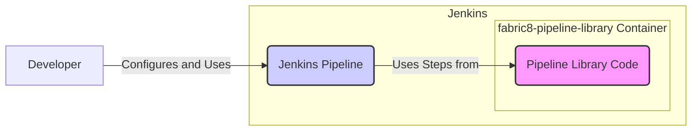

# BUSINESS POSTURE

This project, the `fabric8-pipeline-library`, aims to provide a collection of reusable and standardized Jenkins pipeline shared libraries specifically designed for the Fabric8 ecosystem.

- Business Priorities and Goals:
 - Goal: Streamline and simplify the creation and maintenance of CI/CD pipelines for applications deployed within the Fabric8 platform.
 - Goal: Promote consistency and best practices in pipeline design and implementation across different projects and teams using Fabric8.
 - Goal: Reduce development time and effort by providing pre-built, tested, and reusable pipeline components.
 - Priority: Enhance developer productivity and accelerate software delivery within Fabric8 environments.
 - Priority: Improve the reliability and maintainability of CI/CD pipelines.

- Business Risks:
 - Risk: Security vulnerabilities within the pipeline library could be inherited by all pipelines utilizing it, potentially compromising deployed applications and infrastructure.
 - Risk: Improperly configured or misused pipeline components could lead to insecure deployments, data breaches, or service disruptions.
 - Risk: Lack of ongoing maintenance and updates to the library could result in compatibility issues, security vulnerabilities, and reduced effectiveness over time.
 - Risk: Dependency on a community-driven library introduces a risk of inconsistent quality, delayed updates, or project abandonment.
 - Risk: Inadequate documentation or complex usage patterns could hinder adoption and lead to misconfigurations.

# SECURITY POSTURE

- Existing Security Controls:
 - security control: Code review process for contributions to the library (location: GitHub repository contribution guidelines and pull request process).
 - security control: Static code analysis might be performed on the library code (location: potentially integrated into CI/CD pipelines used to build and test the library itself, details not explicitly provided in the repository).
 - security control: Version control using Git (location: GitHub repository).
 - security control: Access control to the GitHub repository (location: GitHub repository settings).
 - accepted risk: Reliance on community contributions may introduce vulnerabilities if not thoroughly vetted.
 - accepted risk: Potential for misconfiguration by users integrating the library into their pipelines.

- Recommended Security Controls:
 - recommended security control: Implement automated security scanning (SAST, DAST, dependency scanning) as part of the library's CI/CD pipeline to proactively identify vulnerabilities.
 - recommended security control: Establish a clear process for reporting and addressing security vulnerabilities in the library.
 - recommended security control: Provide comprehensive documentation and examples that emphasize secure usage patterns and highlight potential security pitfalls.
 - recommended security control: Implement input validation and sanitization within the pipeline library functions to prevent injection attacks in pipelines using the library.
 - recommended security control: Regularly update dependencies of the library to patch known vulnerabilities.

- Security Requirements:
 - Authentication:
  - Requirement: The library itself does not directly handle authentication. Authentication is assumed to be managed by the Jenkins instance and the Fabric8 platform where the pipelines are executed.
  - Requirement: Pipelines using the library might need to authenticate to external systems (e.g., artifact repositories, cloud providers). Secure credential management practices should be enforced in pipeline examples and documentation.
 - Authorization:
  - Requirement: Authorization is managed by Jenkins and Fabric8. Access to use and modify pipelines using the library should be controlled based on roles and responsibilities.
  - Requirement: The library should not introduce any authorization bypass vulnerabilities in pipelines that use it.
 - Input Validation:
  - Requirement: All pipeline steps provided by the library should perform robust input validation to prevent injection attacks (e.g., command injection, script injection) if user-provided input is used.
  - Requirement: Documentation should clearly specify the expected input types and formats for each pipeline step.
 - Cryptography:
  - Requirement: If the library handles sensitive data or secrets (which should be minimized), it should utilize secure cryptographic practices for storage and transmission.
  - Requirement: Pipelines using the library might need to handle cryptographic operations (e.g., signing artifacts, encrypting data). The library should provide secure and easy-to-use functions for common cryptographic tasks if applicable, or guide users to use secure external tools.

# DESIGN

## C4 CONTEXT

```mermaid
graph LR
    subgraph Fabric8 Ecosystem
        center("fabric8-pipeline-library")
    end
    Developer --> |Uses| center
    Jenkins --> |Executes Pipelines using| center
    Fabric8 Platform --> |Integrates with Pipelines from| center
    Artifact Repository --> |Publishes/Retrieves Artifacts via Pipelines from| center
    Container Registry --> |Pushes/Pulls Images via Pipelines from| center
    External Systems --> |Interacts via Pipelines from| center

    style center fill:#f9f,stroke:#333,stroke-width:2px
```

- Context Diagram Elements:
 - Element: fabric8-pipeline-library
  - Name: fabric8-pipeline-library
  - Type: Software System
  - Description: A collection of reusable Jenkins pipeline shared libraries designed to simplify and standardize CI/CD pipelines within the Fabric8 ecosystem.
  - Responsibilities: Provides reusable pipeline steps and utilities for common CI/CD tasks such as building, testing, deploying, and managing applications within Fabric8.
  - Security controls: Code review, static analysis (potentially), version control, access control to the repository.
 - Element: Developer
  - Name: Developer
  - Type: Person
  - Description: Software developers who use the Fabric8 platform and need to create CI/CD pipelines for their applications.
  - Responsibilities: Defines and configures CI/CD pipelines using the `fabric8-pipeline-library` components. Develops and maintains applications deployed via these pipelines.
  - Security controls: Authentication to Jenkins and Fabric8, authorization to access and modify pipelines. Secure coding practices in application development.
 - Element: Jenkins
  - Name: Jenkins
  - Type: Software System
  - Description: A widely used open-source automation server that executes CI/CD pipelines.
  - Responsibilities: Executes pipelines defined using the `fabric8-pipeline-library`. Manages pipeline execution environment and resources. Provides pipeline execution logs and status.
  - Security controls: Authentication and authorization for user access, access control to jobs and pipelines, secure agent communication, plugin security management.
 - Element: Fabric8 Platform
  - Name: Fabric8 Platform
  - Type: Software System
  - Description: An open-source DevOps platform built on Kubernetes, providing a suite of tools and services for application development, deployment, and management.
  - Responsibilities: Provides the target environment for applications deployed by pipelines. Integrates with Jenkins for CI/CD workflows. Manages application lifecycle and infrastructure.
  - Security controls: Kubernetes RBAC, network policies, security context constraints, image security scanning, audit logging.
 - Element: Artifact Repository
  - Name: Artifact Repository
  - Type: External System
  - Description: A repository (e.g., Nexus, Artifactory) used to store and manage build artifacts (e.g., JAR files, WAR files).
  - Responsibilities: Stores artifacts produced by build pipelines. Provides artifacts for deployment pipelines. Manages artifact versions and dependencies.
  - Security controls: Authentication and authorization for artifact access, access control lists, secure artifact storage, vulnerability scanning of artifacts.
 - Element: Container Registry
  - Name: Container Registry
  - Type: External System
  - Description: A registry (e.g., Docker Hub, private registry) used to store and manage container images.
  - Responsibilities: Stores container images built by pipelines. Provides container images for deployment to Kubernetes. Manages image versions and tags.
  - Security controls: Authentication and authorization for image access, access control policies, image vulnerability scanning, content trust.
 - Element: External Systems
  - Name: External Systems
  - Type: External System
  - Description: Represents various external systems that pipelines might interact with, such as databases, APIs, cloud services, monitoring systems, etc.
  - Responsibilities: Provides services and data accessed by applications deployed via pipelines. Receives notifications or data from pipelines.
  - Security controls: Authentication and authorization for access, network security controls, API security measures, data encryption in transit and at rest.

## C4 CONTAINER



- Container Diagram Elements:
 - Element: fabric8-pipeline-library Container
  - Name: fabric8-pipeline-library Container
  - Type: Container (Conceptual)
  - Description: Represents the collection of Groovy scripts and resources that constitute the pipeline library. It's not a runtime container in the Docker sense, but a logical grouping of code within the Jenkins environment.
  - Responsibilities: Provides reusable pipeline steps, functions, and utilities. Encapsulates pipeline logic and best practices.
  - Security controls: Code review, static analysis (potentially), version control, access control to the repository. Input validation within library functions.
 - Element: Jenkins Pipeline
  - Name: Jenkins Pipeline
  - Type: Container (Conceptual)
  - Description: Represents a Jenkins pipeline defined by a developer, which utilizes steps and functions from the `fabric8-pipeline-library`.
  - Responsibilities: Orchestrates the CI/CD process for an application. Defines the sequence of steps to build, test, and deploy the application. Uses library components to simplify pipeline definition.
  - Security controls: Pipeline as Code (version control of pipeline definitions), access control to pipeline jobs, secure credential management within pipelines, adherence to secure pipeline design principles.

## DEPLOYMENT

The `fabric8-pipeline-library` itself is not deployed as a standalone application. It is used within Jenkins environments to define and execute CI/CD pipelines. The deployment context is therefore the Jenkins environment and the target environments where applications are deployed by these pipelines.

We will focus on a typical deployment scenario where Jenkins is running within a Kubernetes cluster (potentially within the Fabric8 platform itself) and pipelines deploy applications to the same or a different Kubernetes cluster.

```mermaid
graph LR
    subgraph Kubernetes Cluster (Jenkins)
        subgraph Jenkins Namespace
            jenkins("Jenkins Master")
            jenkins_agent("Jenkins Agent")
        end
    end
    subgraph Kubernetes Cluster (Target Environment)
        namespace("Application Namespace")
        application("Deployed Application")
    end

    Developer --> |Configures Pipelines| jenkins
    jenkins --> |Executes Pipeline Steps on| jenkins_agent
    jenkins_agent --> |Deploys Application to| namespace

    style jenkins fill:#f9f,stroke:#333,stroke-width:2px
    style jenkins_agent fill:#ccf,stroke:#333,stroke-width:2px
    style application fill:#eef,stroke:#333,stroke-width:2px
```

- Deployment Diagram Elements:
 - Element: Kubernetes Cluster (Jenkins)
  - Name: Kubernetes Cluster (Jenkins)
  - Type: Infrastructure
  - Description: A Kubernetes cluster where the Jenkins master and agents are deployed. This could be the same cluster as the Fabric8 platform or a dedicated Jenkins cluster.
  - Responsibilities: Provides the runtime environment for Jenkins. Manages resources for Jenkins master and agents. Ensures high availability and scalability of Jenkins.
  - Security controls: Kubernetes RBAC, network policies, node security hardening, security context constraints, audit logging, monitoring.
 - Element: Jenkins Namespace
  - Name: Jenkins Namespace
  - Type: Environment
  - Description: A Kubernetes namespace within the Jenkins cluster dedicated to running Jenkins components.
  - Responsibilities: Provides isolation and resource management for Jenkins within the cluster.
  - Security controls: Kubernetes namespace isolation, resource quotas, network policies.
 - Element: Jenkins Master
  - Name: Jenkins Master
  - Type: Software
  - Description: The central controller of the Jenkins automation server. Manages jobs, schedules builds, and orchestrates agents.
  - Responsibilities: Manages Jenkins configuration and plugins. Schedules and monitors pipeline executions. Provides user interface and API for Jenkins.
  - Security controls: Jenkins security realm (authentication and authorization), access control to jobs and configurations, CSRF protection, secret management, plugin security management.
 - Element: Jenkins Agent
  - Name: Jenkins Agent
  - Type: Software
  - Description: Executes pipeline steps on behalf of the Jenkins master. Can be dynamically provisioned and scaled.
  - Responsibilities: Executes build and deployment tasks. Provides execution environment for pipeline steps. Communicates with Jenkins master.
  - Security controls: Secure communication with Jenkins master (agent-to-master security), agent isolation, resource limits, security context constraints.
 - Element: Kubernetes Cluster (Target Environment)
  - Name: Kubernetes Cluster (Target Environment)
  - Type: Infrastructure
  - Description: A Kubernetes cluster where applications are deployed by the pipelines. This could be the same cluster as Jenkins or a separate cluster.
  - Responsibilities: Provides the runtime environment for deployed applications. Manages application resources and networking. Ensures application availability and scalability.
  - Security controls: Kubernetes RBAC, network policies, node security hardening, security context constraints, audit logging, monitoring, image security scanning.
 - Element: Application Namespace
  - Name: Application Namespace
  - Type: Environment
  - Description: A Kubernetes namespace within the target environment cluster where the application is deployed.
  - Responsibilities: Provides isolation and resource management for the deployed application.
  - Security controls: Kubernetes namespace isolation, resource quotas, network policies, service accounts.
 - Element: Deployed Application
  - Name: Deployed Application
  - Type: Software
  - Description: The application deployed by the Jenkins pipeline using the `fabric8-pipeline-library`.
  - Responsibilities: Provides the business functionality. Serves user requests. Processes data.
  - Security controls: Application-level security controls (authentication, authorization, input validation, etc.), secure configuration, vulnerability management, monitoring and logging.

## BUILD

```mermaid
graph LR
    Developer --> |Code Changes, Pull Request| github("GitHub Repository")
    github --> |Webhook, Trigger Build| ci("CI System (e.g., Jenkins)")
    ci --> |Checkout Code, Run Tests, Build Library, Security Scans| build_process("Build Process")
    build_process --> |Publish Artifacts (e.g., to Maven Central)| artifact_repo("Artifact Repository (e.g., Maven Central)")

    style github fill:#f9f,stroke:#333,stroke-width:2px
    style ci fill:#ccf,stroke:#333,stroke-width:2px
    style build_process fill:#eef,stroke:#333,stroke-width:2px
    style artifact_repo fill:#dde,stroke:#333,stroke-width:2px
```

- Build Diagram Elements:
 - Element: GitHub Repository
  - Name: GitHub Repository
  - Type: Code Repository
  - Description: The GitHub repository `fabric8io/fabric8-pipeline-library` where the library code is hosted and version controlled.
  - Responsibilities: Stores the source code of the library. Manages version history and branches. Facilitates collaboration through pull requests.
  - Security controls: Access control to the repository, branch protection rules, commit signing (optional), vulnerability scanning of dependencies (GitHub Dependabot).
 - Element: CI System (e.g., Jenkins)
  - Name: CI System
  - Type: Automation Server
  - Description: A CI system (e.g., Jenkins, GitHub Actions) that automates the build, test, and release process of the library.
  - Responsibilities: Triggers builds on code changes. Executes build process steps. Runs automated tests and security scans. Publishes build artifacts.
  - Security controls: Authentication and authorization for CI system access, access control to build jobs, secure credential management, build isolation, audit logging.
 - Element: Build Process
  - Name: Build Process
  - Type: Software Process
  - Description: The sequence of steps involved in building and testing the library, including code checkout, dependency resolution, compilation, unit testing, integration testing, static analysis, security scanning, and artifact packaging.
  - Responsibilities: Compiles the library code. Runs automated tests to ensure quality. Performs security checks to identify vulnerabilities. Packages the library for distribution.
  - Security controls: Secure build environment, dependency vulnerability scanning, static application security testing (SAST), software composition analysis (SCA), build artifact signing.
 - Element: Artifact Repository (e.g., Maven Central)
  - Name: Artifact Repository
  - Type: Artifact Storage
  - Description: An artifact repository (e.g., Maven Central, Sonatype Nexus) where the built library artifacts (e.g., JAR files) are published for consumption by users.
  - Responsibilities: Stores and manages released versions of the library. Provides access to library artifacts for users. Ensures artifact integrity and availability.
  - Security controls: Authentication and authorization for artifact publishing and access, secure artifact storage, artifact signing, vulnerability scanning of published artifacts.

# RISK ASSESSMENT

- Critical Business Processes:
 - Process: Software Development and Delivery - The library directly impacts the efficiency and security of the software development and delivery process for applications within the Fabric8 ecosystem. Failures or vulnerabilities in the library can disrupt development workflows and compromise deployed applications.
 - Process: CI/CD Pipeline Automation - The library is fundamental to automating CI/CD pipelines. Its reliability and security are crucial for maintaining the integrity and automation of these pipelines.

- Data to Protect and Sensitivity:
 - Data: Pipeline Definitions - Pipeline definitions that utilize the library might contain sensitive information such as credentials, API keys, and configuration details. These definitions need to be protected from unauthorized access and modification. Sensitivity: High.
 - Data: Build Artifacts - Build artifacts produced by pipelines using the library might contain intellectual property or sensitive data. These artifacts need to be protected from unauthorized access and tampering. Sensitivity: Medium to High (depending on the application).
 - Data: Logs and Audit Trails - Logs generated by pipelines and the library itself can contain sensitive information and are crucial for security monitoring and incident response. Sensitivity: Medium.
 - Data: Source Code of the Library - The source code of the library itself is intellectual property and needs to be protected from unauthorized access and modification. Sensitivity: Medium.

# QUESTIONS & ASSUMPTIONS

- BUSINESS POSTURE:
 - Question: What is the intended scope of support and maintenance for this library? Is there a dedicated team or community responsible for ongoing updates and security patches?
 - Assumption: The primary business goal is to improve developer productivity and standardize CI/CD within Fabric8 environments, even if it's a community-driven project.

- SECURITY POSTURE:
 - Question: Are there any existing security scanning or testing processes in place for the library's development and release?
 - Question: What is the process for reporting and addressing security vulnerabilities in the library?
 - Assumption: Security is a concern, but the current focus might be more on functionality and usability rather than comprehensive security controls.

- DESIGN:
 - Question: Is there a specific artifact repository intended for publishing releases of the library?
 - Question: Are there any specific deployment environments or platforms that the library is primarily designed to support beyond Kubernetes and Fabric8?
 - Assumption: The library is primarily intended for use within Kubernetes and Fabric8 environments, and Jenkins is the primary CI/CD system. The build process is assumed to be automated using a CI system, although specific details are not provided in the repository.