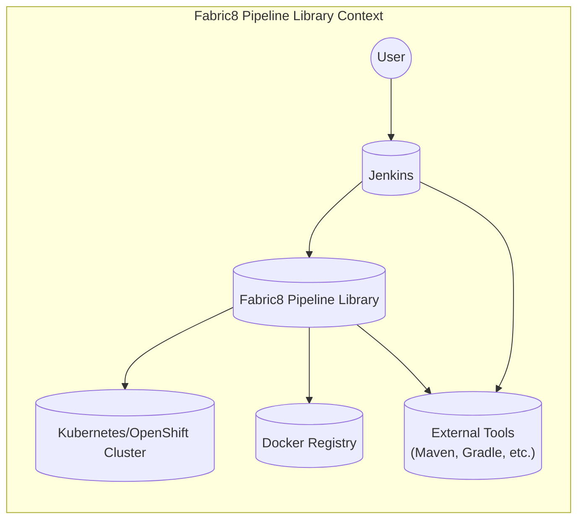
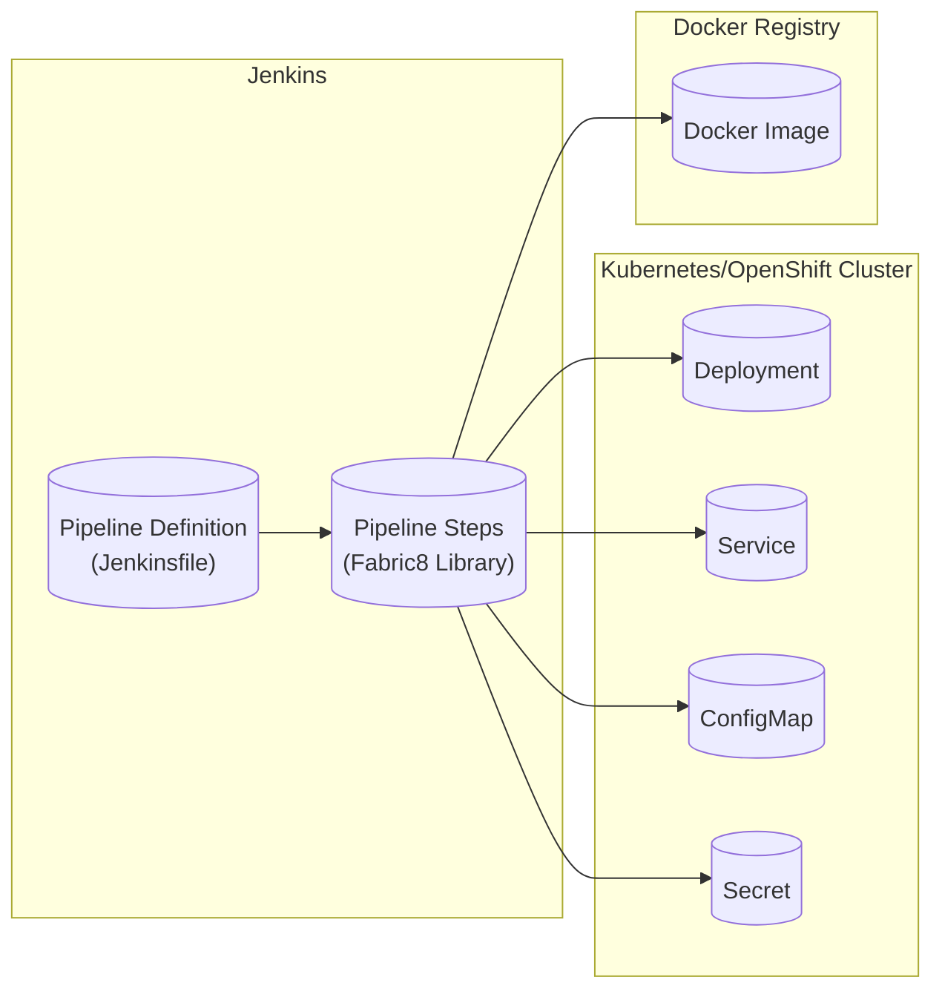
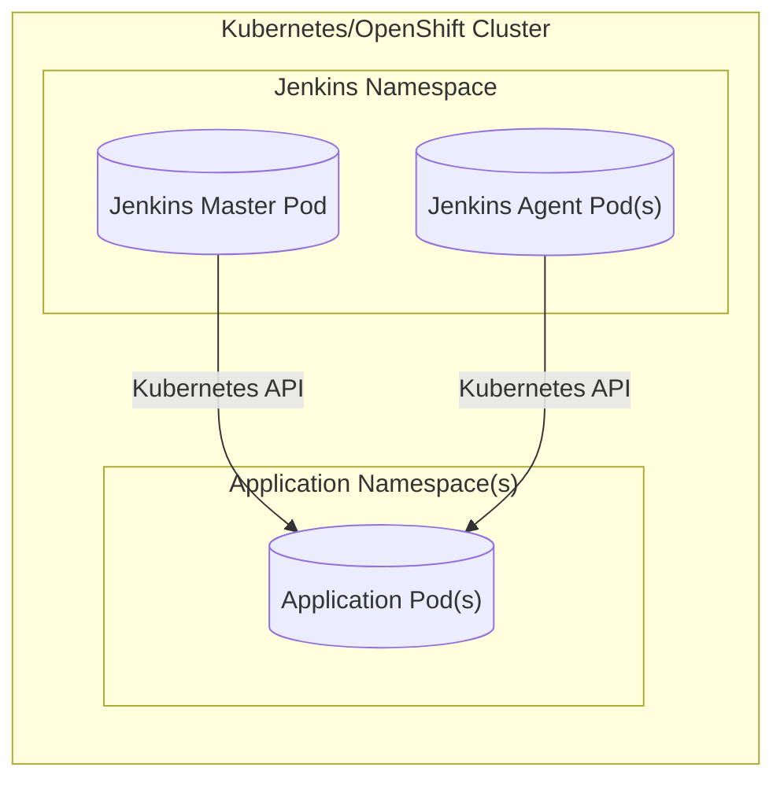
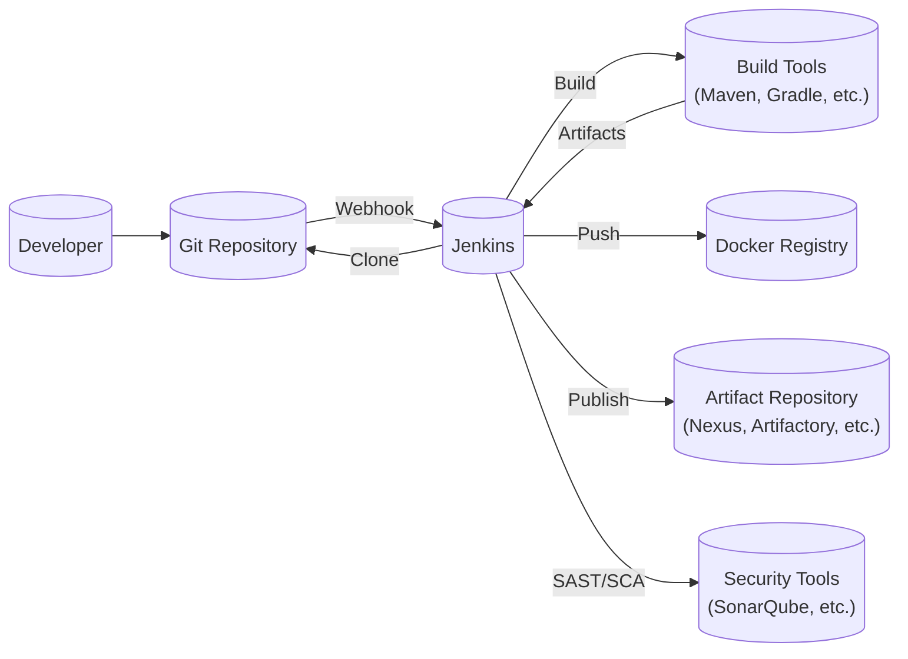

Okay, let's create a design document for the Fabric8 Pipeline Library.

# BUSINESS POSTURE

Business Priorities and Goals:

*   Enable Continuous Delivery (CD) for applications deployed on Kubernetes and OpenShift.
*   Provide reusable, configurable, and extensible pipeline components for Jenkins.
*   Simplify and standardize the process of building, testing, and deploying applications.
*   Promote best practices for DevOps and cloud-native development.
*   Reduce the time and effort required to create and maintain CI/CD pipelines.
*   Improve the overall efficiency and reliability of the software delivery process.
*   Support a wide range of application types and deployment scenarios.

Business Risks:

*   Unauthorized access to Jenkins and the Kubernetes/OpenShift cluster, potentially leading to malicious deployments or data breaches.
*   Vulnerabilities in the pipeline library itself or its dependencies, which could be exploited to compromise the build and deployment process.
*   Incorrectly configured pipelines, leading to deployment failures, security vulnerabilities, or data loss.
*   Lack of visibility and auditability of pipeline executions, making it difficult to track changes and identify the root cause of issues.
*   Supply chain attacks targeting the library or its dependencies.
*   Inability to scale the pipeline infrastructure to meet the demands of large or complex projects.
*   Incompatibility with future versions of Jenkins, Kubernetes, or OpenShift.

# SECURITY POSTURE

Existing Security Controls:

*   security control: The library leverages Jenkins' built-in security features, including authentication and authorization mechanisms. (Described in Jenkins documentation and configuration).
*   security control: The library interacts with Kubernetes/OpenShift through their respective APIs, relying on the security controls provided by these platforms (e.g., RBAC, network policies). (Described in Kubernetes/OpenShift documentation).
*   security control: The library promotes the use of secure coding practices through its examples and documentation. (Described in the repository's README and examples).
*   security control: The library uses declarative pipelines, which are more secure by design than scripted pipelines.
*   security control: The library is open source, allowing for community review and contributions to improve security.

Accepted Risks:

*   accepted risk: The library relies on the security of the underlying Jenkins, Kubernetes, and OpenShift infrastructure. Any vulnerabilities in these platforms could impact the security of the pipelines.
*   accepted risk: The library's functionality can be extended through custom scripts and plugins, which may introduce security risks if not carefully reviewed and tested.
*   accepted risk: The library depends on external tools and libraries, which may have their own vulnerabilities.

Recommended Security Controls:

*   security control: Implement static code analysis (SAST) and dynamic application security testing (DAST) within the pipelines to identify vulnerabilities in the applications being deployed.
*   security control: Use a software composition analysis (SCA) tool to scan for known vulnerabilities in the library's dependencies and the application's dependencies.
*   security control: Implement robust logging and monitoring of pipeline executions to detect and respond to security incidents.
*   security control: Enforce the principle of least privilege for all users and service accounts involved in the pipeline.
*   security control: Regularly review and update the library and its dependencies to address security vulnerabilities.
*   security control: Implement a secrets management solution to securely store and manage sensitive information used in the pipelines (e.g., API keys, passwords).
*   security control: Sign the released artifacts to ensure their integrity and authenticity.

Security Requirements:

*   Authentication:
    *   All users and systems interacting with the pipeline must be authenticated.
    *   Support for multi-factor authentication (MFA) is highly recommended.
    *   Integration with existing identity providers (e.g., LDAP, Active Directory, OAuth) should be supported.

*   Authorization:
    *   Access to pipeline resources and functionality must be controlled through role-based access control (RBAC).
    *   The principle of least privilege must be enforced.
    *   Fine-grained access control should be supported to restrict access to specific stages, environments, or resources within the pipeline.

*   Input Validation:
    *   All inputs to the pipeline, including user inputs, parameters, and external data, must be validated to prevent injection attacks and other vulnerabilities.
    *   Input validation should be performed at multiple levels, including the Jenkins UI, the pipeline scripts, and the underlying tools.

*   Cryptography:
    *   Sensitive data, such as passwords, API keys, and certificates, must be encrypted both in transit and at rest.
    *   Strong cryptographic algorithms and protocols must be used.
    *   Key management practices must be secure and follow industry best practices.

# DESIGN

## C4 CONTEXT

Element Descriptions:

*   Element:
    *   Name: User
    *   Type: Person
    *   Description: A developer or operator who interacts with Jenkins to trigger and manage pipelines.
    *   Responsibilities: Initiates pipeline executions, monitors progress, and reviews results.
    *   Security controls: Authentication, Authorization (RBAC).

*   Element:
    *   Name: Jenkins
    *   Type: Software System
    *   Description: The CI/CD automation server that hosts and executes the pipelines.
    *   Responsibilities: Manages pipeline definitions, schedules executions, and provides a user interface.
    *   Security controls: Authentication, Authorization (RBAC), Audit Logging, Secrets Management.

*   Element:
    *   Name: Fabric8 Pipeline Library
    *   Type: Software System
    *   Description: A collection of reusable pipeline steps and functions for building and deploying applications on Kubernetes/OpenShift.
    *   Responsibilities: Provides building blocks for creating CI/CD pipelines, simplifies interaction with Kubernetes/OpenShift, and promotes best practices.
    *   Security controls: Secure Coding Practices, Dependency Management, Input Validation.

*   Element:
    *   Name: Kubernetes/OpenShift Cluster
    *   Type: Software System
    *   Description: The container orchestration platform where applications are deployed.
    *   Responsibilities: Manages application deployments, scaling, and networking.
    *   Security controls: RBAC, Network Policies, Pod Security Policies, Secrets Management.

*   Element:
    *   Name: Docker Registry
    *   Type: Software System
    *   Description: A repository for storing and retrieving Docker images.
    *   Responsibilities: Stores container images built by the pipeline.
    *   Security controls: Authentication, Authorization, Image Scanning.

*   Element:
    *   Name: External Tools
    *   Type: Software System
    *   Description: Various tools used in the build and deployment process (e.g., Maven, Gradle, npm, Git).
    *   Responsibilities: Build application code, manage dependencies, and perform other tasks.
    *   Security controls: Secure Configuration, Dependency Management, Vulnerability Scanning.

## C4 CONTAINER

Element Descriptions:

*   Element:
    *   Name: Pipeline Definition (Jenkinsfile)
    *   Type: Container
    *   Description: Defines the CI/CD pipeline using a declarative or scripted syntax.
    *   Responsibilities: Specifies the stages, steps, and configuration of the pipeline.
    *   Security controls: Code Review, Version Control, Access Control.

*   Element:
    *   Name: Pipeline Steps (Fabric8 Library)
    *   Type: Container
    *   Description: Reusable components provided by the Fabric8 Pipeline Library.
    *   Responsibilities: Execute specific tasks within the pipeline, such as building, testing, and deploying applications.
    *   Security controls: Secure Coding Practices, Input Validation, Dependency Management.

*   Element:
    *   Name: Deployment
    *   Type: Container
    *   Description: A Kubernetes/OpenShift resource that manages the deployment of application pods.
    *   Responsibilities: Ensures the desired number of application replicas are running and handles updates.
    *   Security controls: RBAC, Resource Quotas, Pod Security Policies.

*   Element:
    *   Name: Service
    *   Type: Container
    *   Description: A Kubernetes/OpenShift resource that provides a stable endpoint for accessing application pods.
    *   Responsibilities: Exposes the application to internal or external traffic.
    *   Security controls: Network Policies, RBAC.

*   Element:
    *   Name: ConfigMap
    *   Type: Container
    *   Description: A Kubernetes/OpenShift resource that stores configuration data for applications.
    *   Responsibilities: Provides a way to manage application configuration separately from the application code.
    *   Security controls: RBAC, Encryption (if storing sensitive data).

*   Element:
    *   Name: Secret
    *   Type: Container
    *   Description: A Kubernetes/OpenShift resource that stores sensitive information, such as passwords and API keys.
    *   Responsibilities: Securely manages sensitive data used by applications.
    *   Security controls: RBAC, Encryption at Rest.

*   Element:
    *   Name: Docker Image
    *   Type: Container
    *   Description: A packaged application artifact that contains the application code, dependencies, and runtime environment.
    *   Responsibilities: Provides a consistent and reproducible way to deploy applications.
    *   Security controls: Image Scanning, Vulnerability Management.

## DEPLOYMENT

Possible Deployment Solutions:

1.  Jenkins running inside Kubernetes/OpenShift: This is a common approach, where Jenkins is deployed as a pod within the same cluster as the applications being deployed.
2.  Jenkins running outside Kubernetes/OpenShift: Jenkins can also be deployed on a separate server or VM outside the cluster.
3.  Jenkins as a Service (CloudBees CI, etc.): Managed Jenkins offerings can also be used.

Chosen Solution (for detailed description): Jenkins running inside Kubernetes/OpenShift.

Element Descriptions:

*   Element:
    *   Name: Jenkins Master Pod
    *   Type: Node
    *   Description: The main Jenkins controller, running as a pod within the Kubernetes/OpenShift cluster.
    *   Responsibilities: Manages pipeline executions, schedules jobs, and provides the Jenkins UI.
    *   Security controls: RBAC, Network Policies, Resource Quotas, Secrets Management.

*   Element:
    *   Name: Jenkins Agent Pod(s)
    *   Type: Node
    *   Description: Jenkins agents, running as pods within the Kubernetes/OpenShift cluster, that execute pipeline steps.
    *   Responsibilities: Execute build, test, and deployment tasks.
    *   Security controls: RBAC, Network Policies, Resource Quotas, Secrets Management.

*   Element:
    *   Name: Application Pod(s)
    *   Type: Node
    *   Description: Pods running the application being deployed.
    *   Responsibilities: Run the application code.
    *   Security controls: RBAC, Network Policies, Pod Security Policies, Secrets Management.

*   Element:
    *   Name: Jenkins Namespace
    *   Type: Logical Boundary
    *   Description: Kubernetes namespace where Jenkins is deployed.
    *   Responsibilities: Isolates Jenkins resources from other applications.
    *   Security controls: RBAC, Network Policies.

*   Element:
    *   Name: Application Namespace(s)
    *   Type: Logical Boundary
    *   Description: Kubernetes namespace(s) where applications are deployed.
    *   Responsibilities: Isolates application resources.
    *   Security controls: RBAC, Network Policies.

## BUILD

Build Process Description:

1.  Developer commits code changes to the Git repository.
2.  A webhook triggers a build in Jenkins.
3.  Jenkins clones the repository.
4.  Jenkins uses build tools (Maven, Gradle, etc.) to compile the code and build the application artifacts.
5.  Jenkins runs security tools (SAST, SCA) to identify vulnerabilities.
6.  Jenkins pushes the Docker image to a Docker registry.
7.  Jenkins publishes other artifacts (e.g., JAR files) to an artifact repository.

Security Controls:

*   security control: Git repository access control (authentication and authorization).
*   security control: Webhook security (authentication and validation).
*   security control: Secure build environment (isolated Jenkins agents).
*   security control: Dependency management (using a curated list of approved dependencies).
*   security control: SAST and SCA scanning to identify vulnerabilities.
*   security control: Secure artifact storage (authentication and authorization for Docker registry and artifact repository).
*   security control: Signing of build artifacts.

# RISK ASSESSMENT

Critical Business Processes:

*   Software delivery pipeline: The ability to continuously build, test, and deploy applications is critical for the business.
*   Application availability and performance: The deployed applications must be available and performant to meet business needs.
*   Data security and privacy: Sensitive data handled by the applications and the pipeline must be protected.

Data Sensitivity:

*   Application code: May contain proprietary business logic or intellectual property (Confidential).
*   Configuration data: May contain sensitive information, such as database credentials or API keys (Secret).
*   Deployment artifacts: May contain vulnerabilities that could be exploited (Confidential).
*   User data: Data processed by the applications may be subject to privacy regulations (Confidential/Secret, depending on the specific data).
*   Build artifacts: May contain information about internal systems (Confidential).

# QUESTIONS & ASSUMPTIONS

Questions:

*   What specific compliance requirements (e.g., PCI DSS, HIPAA) must the pipeline adhere to?
*   What are the specific performance and scalability requirements for the pipeline?
*   What is the existing infrastructure and tooling landscape?
*   What level of access do developers have to the production environment?
*   Are there any specific security policies or guidelines that must be followed?
*   What kind of applications will be deployed using this library (web, mobile, microservices, etc.)?
*   What are the specific non-functional requirements (performance, scalability, availability)?

Assumptions:

*   BUSINESS POSTURE: The organization has a moderate risk appetite and prioritizes security, but also needs to maintain agility and speed of delivery.
*   SECURITY POSTURE: The underlying Jenkins, Kubernetes, and OpenShift infrastructure is securely configured and maintained.
*   DESIGN: Developers have a basic understanding of Kubernetes/OpenShift concepts. The library will be used primarily for deploying applications to Kubernetes/OpenShift. The primary deployment target is Kubernetes/OpenShift.