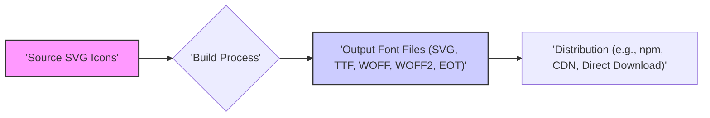
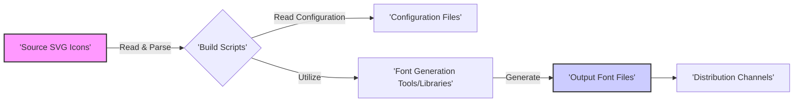

# Project Design Document: font-mfizz

**Version:** 1.1
**Date:** October 26, 2023
**Author:** Gemini (AI Language Model)

## 1. Introduction

This document provides an enhanced and detailed design overview of the `font-mfizz` project. `font-mfizz` is a curated collection of vector icons meticulously crafted and provided in various web-compatible font formats (SVG, TTF, WOFF, WOFF2, EOT). This document aims to clearly articulate the project's architecture, components, and data flow with greater precision, specifically for the purpose of facilitating thorough and effective threat modeling activities.

## 2. Goals and Objectives

The primary goals and objectives of the `font-mfizz` project are:

*   To offer a well-maintained and comprehensive library of commonly used icons, addressing a wide range of potential use cases.
*   To provide these icons in a diverse set of standard web font formats, ensuring optimal compatibility across different browsers and platforms.
*   To uphold the visual quality, consistency in design, and adherence to best practices for all icons within the collection.
*   To establish and maintain a transparent, efficient, and reproducible build process for generating the font files from the source vector graphics.
*   To enable straightforward integration of these icons into web development projects, simplifying the process for developers.
*   To ensure the project is easily maintainable and extensible for future icon additions or format updates.

## 3. High-Level Architecture

The `font-mfizz` project employs a build-centric architecture. The fundamental process involves transforming source SVG icons into distributable font files.

*   **Source SVG Icons:** This represents the initial collection of individual SVG files. Each file contains the vector definition for a single icon. These are considered the single source of truth for the icon designs.
*   **Build Process:** This is the central component, orchestrating the conversion of the SVG icons into the various target font formats. This process involves multiple steps and utilizes specific tools and configurations.
*   **Output Font Files:** These are the resulting font files generated by the build process. They are the artifacts that are ultimately distributed and used within web projects. The variety of formats ensures broad compatibility.
*   **Distribution:** This encompasses the methods used to make the generated font files accessible to end-users. This can include package managers, CDNs, or direct downloads.

## 4. Component Details

The core functionality of `font-mfizz` resides within its build process. Here's a more detailed breakdown of the key components:

*   **Source SVG Directory Structure:**
    *   Organized directory containing individual SVG files.
    *   Each SVG file ideally represents a single, optimized icon.
    *   Filename conventions are crucial for mapping SVG files to icon names and potentially character codes during the build.
    *   Metadata within the SVG files (e.g., viewBox) might be considered by the build process.

*   **Configuration Management:**
    *   Defines the parameters and instructions for the font generation process.
    *   May involve multiple configuration files specifying:
        *   Glyph mapping: Explicitly associating SVG files with specific character codes or names.
        *   Font metadata: Information like font family name, version, license details, and description.
        *   Target font formats: Specifying which font formats (TTF, WOFF, etc.) to generate.
        *   Optimization settings: Parameters for optimizing SVG paths or font file sizes.
        *   Templating configurations: If CSS or other files are generated as part of the build.

*   **Build Scripts and Orchestration:**
    *   Automate the entire process of converting SVG icons to font files.
    *   Likely implemented using scripting languages such as Node.js (with npm) or Python.
    *   May leverage build automation tools like Make, Gulp, or Webpack to manage dependencies and tasks.
    *   Key steps typically include:
        *   **SVG Parsing and Processing:** Reading and potentially optimizing the SVG files (e.g., removing unnecessary metadata, simplifying paths).
        *   **Glyph Data Extraction:** Extracting path data and other relevant information from the SVG files.
        *   **Font Generation:** Utilizing font generation tools or libraries to create the font files in the specified formats.
        *   **Metadata Injection:** Embedding font name, version, and other metadata into the generated font files.
        *   **File Organization and Output:** Placing the generated font files into designated output directories.
        *   **CSS/Documentation Generation (Optional):**  Creating accompanying CSS files or documentation that demonstrate how to use the icons.

*   **Font Generation Tools and Libraries:**
    *   The underlying software responsible for the actual font conversion.
    *   Commonly used tools include:
        *   FontForge (a powerful, scriptable, open-source font editor).
        *   Command-line utilities specifically designed for font conversion (e.g., those provided by font editors or libraries).
        *   Programming language libraries that offer font manipulation and generation capabilities (e.g., within Python or Node.js).

*   **Output Directories and Artifacts:**
    *   Designated locations where the generated font files are stored after a successful build.
    *   Typically organized by font format (e.g., a `ttf` directory, a `woff` directory).
    *   May also include other generated artifacts like CSS files, example HTML files, or documentation.

## 5. Data Flow

The data flow within the `font-mfizz` project is a sequential process, starting with the source SVGs and culminating in the final distributable font files.

*   The build scripts initiate the process by reading and parsing the source SVG icon files.
*   The build scripts then read the configuration files to understand the parameters and instructions for the font generation process.
*   The build scripts invoke and utilize the designated font generation tools or libraries, passing the parsed SVG data and configuration settings.
*   The font generation tools process the SVG data and configuration, resulting in the creation of the output font files in the specified formats.
*   Finally, the generated font files are prepared for distribution through various channels.

## 6. Technology Stack

The `font-mfizz` project likely utilizes the following technologies:

*   **Source Files:**
    *   SVG (Scalable Vector Graphics) - The fundamental format for the icon designs.

*   **Build Tools & Languages:**
    *   Primary scripting language: Likely Node.js with npm for package management and build scripting, or Python.
    *   Potential build automation tools: Make, Gulp, Webpack, or similar tools for managing the build process.

*   **Font Generation Libraries/Tools:**
    *   Core font generation tool: FontForge (often used via its command-line interface).
    *   Potential scripting language libraries for font manipulation: Libraries available within Python or Node.js that provide programmatic access to font creation and modification.

*   **Output Formats:**
    *   TTF (TrueType Font) - A widely compatible font format.
    *   WOFF (Web Open Font Format) - An optimized font format for web use.
    *   WOFF2 (Web Open Font Format 2) - A further improved and compressed version of WOFF.
    *   EOT (Embedded Open Type) - A font format primarily used by older versions of Internet Explorer.
    *   SVG (as a font format) - Allows embedding vector graphics directly within the font.

## 7. Security Considerations (For Threat Modeling)

This section outlines initial security considerations to guide future threat modeling activities:

*   **Supply Chain Vulnerabilities:**
    *   Compromised dependencies within the build scripts (e.g., vulnerabilities in npm packages used by the build process).
    *   Lack of integrity verification for font generation tools or libraries used in the build.

*   **Build Environment Security:**
    *   Unauthorized access to the build environment potentially leading to malicious modifications of build scripts or configurations.
    *   Injection of malicious code into the build process to compromise the generated font files.

*   **Output Integrity and Tampering:**
    *   Potential for attackers to tamper with the generated font files before or during distribution, injecting malicious code or altering the appearance of icons.
    *   Lack of signing or checksum verification for the distributed font files.

*   **Source SVG Integrity:**
    *   Compromise of the source SVG files, potentially leading to the inclusion of malicious content or visually misleading icons in the generated fonts.

*   **Configuration Security:**
    *   Exposure of sensitive configuration details that could be exploited to manipulate the build process or gain unauthorized access.

*   **Distribution Channel Security:**
    *   Compromise of the distribution channels (e.g., npm account, CDN) allowing for the distribution of malicious or tampered font files.

## 8. Deployment and Distribution

The `font-mfizz` project achieves deployment and distribution through several common methods:

*   **Package Managers (e.g., npm):** Publishing the generated font files and associated assets (like CSS) as a package on platforms like npm, allowing developers to easily integrate the icons into their projects using standard package management tools.
*   **Content Delivery Networks (CDNs):** Hosting the font files on a CDN. This provides benefits such as improved loading times due to geographic distribution and caching. Users can then reference the font files directly from the CDN URLs.
*   **Direct Download:** Providing the font files as a downloadable archive (e.g., a ZIP file) on the project's website or repository. This allows users to manually include the files in their projects.

End-users integrate the `font-mfizz` icons into their web projects by:

*   Including the provided CSS file (either directly or via a preprocessor like Sass) in their project. This CSS file defines the icon classes and references the font files.
*   Using the appropriate HTML elements with the corresponding icon class names to display the desired icons.

## 9. Future Considerations and Potential Enhancements

Possible future developments and improvements for the `font-mfizz` project include:

*   **Expansion of Icon Sets:** Adding new icon sets or variations to cater to a broader range of design needs.
*   **Build Process Optimization:** Further enhancing the build process for improved performance, reduced build times, and increased efficiency.
*   **Automated Release and Deployment:** Implementing automated workflows for releasing new versions and deploying the font files to distribution channels.
*   **Enhanced Customization Options:** Providing more options for users to customize the font generation process, such as selecting specific icon subsets or adjusting font metrics.
*   **Improved Documentation:** Creating more comprehensive documentation, including usage examples, API references (if applicable), and contribution guidelines.
*   **Accessibility Considerations:**  Ensuring the generated fonts and associated CSS are accessible and follow accessibility best practices.

## 10. Glossary

*   **SVG (Scalable Vector Graphics):** An XML-based vector image format that allows for resolution-independent graphics.
*   **TTF (TrueType Font):** A widely adopted font format, historically significant and still commonly used.
*   **WOFF (Web Open Font Format):** A font format specifically designed for web use, offering compression and metadata embedding.
*   **WOFF2 (Web Open Font Format 2):** A successor to WOFF, providing even better compression for faster loading times.
*   **EOT (Embedded Open Type):** A font format created by Microsoft, primarily used for compatibility with older Internet Explorer versions.
*   **Glyph:** A visual representation of a character or symbol within a font.
*   **CDN (Content Delivery Network):** A distributed network of servers that deliver web content to users based on their geographic location, improving performance.
*   **npm:** The package manager for Node.js, used for managing project dependencies and distributing JavaScript packages.

This improved design document provides a more detailed and structured overview of the `font-mfizz` project. The enhanced descriptions of components, data flow, and security considerations offer a stronger foundation for conducting thorough threat modeling activities.