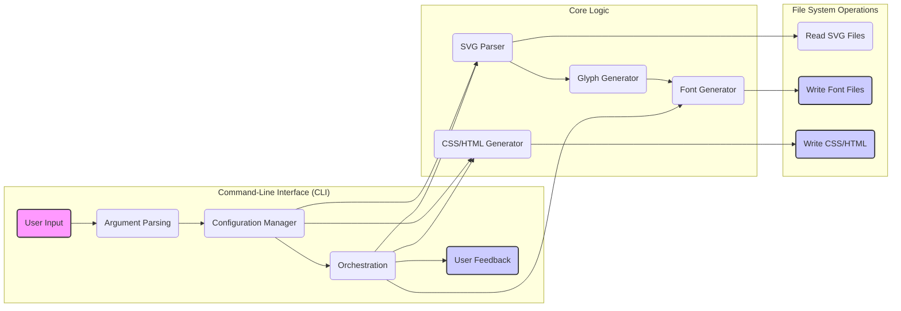
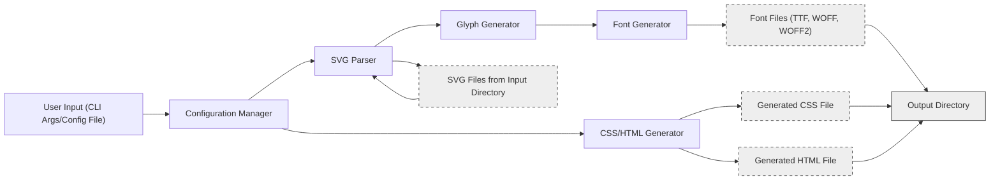

# Project Design Document: Font Mfizz

**Version:** 1.1
**Date:** October 26, 2023
**Author:** AI Software Architect

## 1. Project Overview

Font Mfizz is a versatile tool designed to streamline the creation of icon fonts from a collection of Scalable Vector Graphics (SVG) files. It functions both as a standalone command-line application and as a library that can be integrated into other Java-based projects. The primary goal is to automate the generation of various font formats (including TTF, WOFF, and WOFF2) along with corresponding Cascading Style Sheets (CSS) and HyperText Markup Language (HTML) examples, thereby simplifying the incorporation of scalable vector icons into web development workflows.

## 2. Goals

*   Provide a user-friendly and efficient mechanism for transforming SVG files into icon fonts.
*   Support the generation of multiple industry-standard font formats: TrueType Font (TTF), Web Open Font Format (WOFF), and Web Open Font Format 2.0 (WOFF2).
*   Automatically generate accompanying CSS stylesheets and HTML demonstration files to facilitate easy integration and usage of the generated icon font.
*   Offer a range of customization options, including the ability to specify the font name, CSS class prefixes for icons, and other relevant font properties.
*   Enable usage both as a command-line tool for direct execution and as a library for integration within larger Java software projects.

## 3. Non-Goals

*   Developing a graphical user interface (GUI) for interacting with the font generation process. The focus remains on command-line and programmatic usage.
*   Functioning as an SVG editor or providing SVG optimization capabilities. Input SVGs are expected to be pre-optimized.
*   Providing services for hosting or managing the generated font files. The tool is responsible for generation, not deployment.
*   Directly supporting raster image formats as input. Conversion to SVG format is a prerequisite for using Font Mfizz.
*   Implementing advanced font hinting or kerning algorithms beyond the basic glyph outline generation provided by underlying font libraries.

## 4. Architecture

The Font Mfizz architecture comprises several interconnected components, each with specific responsibilities:

*   **Command-Line Interface (CLI) Module:**
    *   Serves as the primary entry point for users interacting with Font Mfizz as a standalone tool.
    *   Utilizes a command-line argument parsing library to interpret user-provided options and configurations.
    *   Orchestrates the execution flow by invoking the necessary core logic components based on user input.
    *   Provides feedback to the user through console output, including progress updates, success messages, and error notifications.
*   **Configuration Management Module:**
    *   Responsible for loading, validating, and managing configuration settings that govern the font generation process.
    *   Supports configuration input through command-line arguments and potentially external configuration files (e.g., YAML, JSON, or properties files).
    *   Manages key configuration parameters such as the input directory containing SVG files, the desired output directory for generated files, the font family name, the CSS class prefix for icons, and the target font formats.
*   **SVG Parsing Module:**
    *   Handles the process of reading and parsing individual SVG files located in the specified input directory.
    *   Employs an SVG parsing library to extract relevant vector path data, view box dimensions, and potentially metadata associated with each icon.
    *   Implements error handling to gracefully manage malformed or invalid SVG files.
*   **Glyph Generation Module:**
    *   Takes the parsed SVG path data and transforms it into glyph representations suitable for inclusion in a font file.
    *   Assigns unique Unicode code points to each generated glyph, ensuring proper character mapping within the font.
    *   May perform basic transformations or optimizations on the glyph paths to ensure consistency and compatibility.
*   **Font Generation Module:**
    *   Leverages a dedicated font generation library (e.g., Apache FontBox, OpenJDK Font Rendering Subsystem) to create the actual font files in the specified formats (TTF, WOFF, WOFF2).
    *   Embeds the generated glyph outlines into the font file structure.
    *   Sets essential font metadata, such as the font family name, copyright information, and version details, based on the provided configuration.
*   **CSS/HTML Generation Module:**
    *   Automates the creation of example CSS and HTML files that demonstrate how to utilize the generated icon font within a web project.
    *   Generates CSS rules, typically using the configured class prefix, to associate each icon with its corresponding glyph in the font.
    *   Creates a basic HTML file showcasing the rendered icons, providing a visual reference for developers.
*   **File System Interaction Module:**
    *   Provides an abstraction layer for interacting with the file system.
    *   Handles reading SVG files from the input directory.
    *   Manages the writing of generated font files, CSS stylesheets, and HTML examples to the designated output directory.
    *   Encapsulates file and directory operations, potentially including error handling for file access issues.
*   **Logging and Error Handling Module:**
    *   Implements a logging mechanism to record events and potential errors that occur during the font generation process.
    *   Utilizes a logging framework (e.g., SLF4j, Logback) to provide configurable logging levels and output destinations.
    *   Handles exceptions gracefully, providing informative error messages to the user to aid in troubleshooting.

## 5. Data Flow

The typical flow of data within Font Mfizz during the font generation process is as follows:

*   The user initiates the process by invoking the CLI, providing configuration details either through command-line arguments or a configuration file.
*   The CLI module parses the input and passes the configuration data to the Configuration Manager.
*   The Configuration Manager loads and validates the provided configuration settings.
*   The Orchestration component within the CLI module initiates the core font generation workflow.
*   The SVG Parser module reads individual SVG files from the input directory specified in the configuration.
*   The Glyph Generator module processes the parsed SVG data, converting vector paths into glyph representations and assigning Unicode code points.
*   The Font Generator module utilizes the generated glyphs and configuration parameters to create the font files in the desired formats (TTF, WOFF, WOFF2).
*   The CSS/HTML Generator module uses the configuration and information about the generated glyphs to create example CSS and HTML files for demonstration and integration purposes.
*   The File System Interaction module handles the writing of the generated font files, CSS, and HTML to the specified output directory.
*   The CLI module provides feedback to the user, indicating the success or failure of the font generation process.

## 6. Security Considerations

Security is a crucial aspect of any software project. Here are some potential security considerations for Font Mfizz:

*   **SVG Input Validation and Sanitization:**
    *   **Threat:** Maliciously crafted SVG files could contain embedded scripts or external entity references (XXE attacks) that could be exploited by the SVG parsing library.
    *   **Mitigation:** Implement robust input validation to sanitize SVG content, removing potentially harmful elements and attributes. Use an SVG parsing library that is known to be secure and regularly updated against vulnerabilities. Consider sandboxing the parsing process.
*   **Dependency Vulnerabilities:**
    *   **Threat:** The project relies on external libraries for various functionalities. Vulnerabilities in these dependencies could be exploited if not properly managed.
    *   **Mitigation:** Employ a dependency management tool (e.g., Maven Dependency Check, OWASP Dependency-Check) to regularly scan project dependencies for known vulnerabilities. Keep dependencies updated to their latest stable versions.
*   **Output Directory Security:**
    *   **Threat:** Improper handling of the output directory path could allow an attacker to write generated files to arbitrary locations on the file system (path traversal vulnerability).
    *   **Mitigation:** Implement strict validation and sanitization of the output directory path provided by the user. Ensure that the application has the necessary permissions to write to the intended output directory and no more.
*   **Configuration Injection:**
    *   **Threat:** If configuration settings are loaded from external sources without proper sanitization, it could be possible for an attacker to inject malicious configuration values.
    *   **Mitigation:** Sanitize and validate all configuration data loaded from external sources. Avoid directly executing code or commands based on configuration values.
*   **Resource Exhaustion (Denial of Service):**
    *   **Threat:** Processing a large number of complex SVG files or a single extremely complex SVG could consume excessive system resources (CPU, memory), leading to a denial-of-service condition.
    *   **Mitigation:** Implement safeguards such as setting limits on the number of input files or the complexity of individual SVG files. Consider using asynchronous processing or resource management techniques to prevent resource exhaustion.
*   **Logging Sensitive Information:**
    *   **Threat:** Logging sensitive information (e.g., file paths, user inputs) could expose it to unauthorized access.
    *   **Mitigation:** Avoid logging sensitive information. If logging is necessary, ensure that logs are stored securely and access is restricted.

## 7. Technologies Used

*   **Programming Language:** Java
*   **Build Automation Tool:** Maven or Gradle
*   **Font Generation Library:** Likely Apache FontBox for creating TTF fonts, and potentially libraries like `woff2` for WOFF2 conversion.
*   **SVG Parsing Library:**  Likely Apache Batik or a similar XML parsing library with SVG support (e.g., JDOM, dom4j).
*   **Command-Line Argument Parsing Library:**  Likely JCommander, Apache Commons CLI, or Picocli for handling command-line arguments.
*   **Logging Framework:**  SLF4j (Simple Logging Facade for Java) as an abstraction layer, with a concrete implementation like Logback or Log4j.
*   **Configuration Management:** Potentially using libraries like SnakeYAML for YAML parsing or Jackson for JSON parsing if configuration files are supported.

## 8. Deployment Model

Font Mfizz is designed for flexible deployment and usage:

*   **Standalone Command-Line Tool:** The project can be packaged as an executable JAR (Java Archive) file. Users can download this JAR and execute it directly from their command line interface, providing the necessary arguments to configure the font generation process. This is the primary mode of interaction for many users.
*   **Library Integration:** Developers can include Font Mfizz as a dependency in their own Java-based software projects. This allows them to programmatically invoke the font generation capabilities of Font Mfizz within their applications, providing more fine-grained control and integration possibilities. This is typically achieved by adding the Font Mfizz JAR as a dependency in their project's build configuration (e.g., `pom.xml` for Maven, `build.gradle` for Gradle).

## 9. Future Considerations

*   **Advanced SVG Optimization Integration:** Explore integrating established SVG optimization libraries (e.g., SVGO via a Java wrapper) to automatically reduce the file size of input SVG files before font generation.
*   **Expanded Font Format Support:** Investigate adding support for additional font formats beyond TTF, WOFF, and WOFF2, based on user demand and evolving web standards.
*   **Optional Web-Based Interface:** Consider developing a simple web interface as an alternative way to interact with Font Mfizz, potentially simplifying usage for non-technical users or providing a visual configuration experience. This would likely be a separate project or module.
*   **Build System Plugins/Integrations:** Develop plugins or integrations for popular build systems like Gradle and Maven to streamline the font generation process within existing development workflows. This would allow developers to generate icon fonts as part of their regular build process.
*   **Live Reload/Watch Mode:** Implement a "watch" mode that monitors the input SVG directory for changes. When a change is detected, the font generation process would automatically re-run, providing a more efficient development experience.