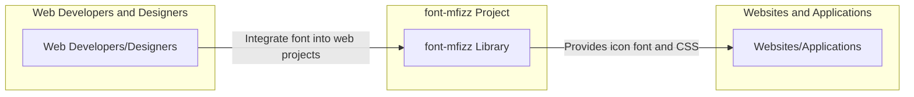
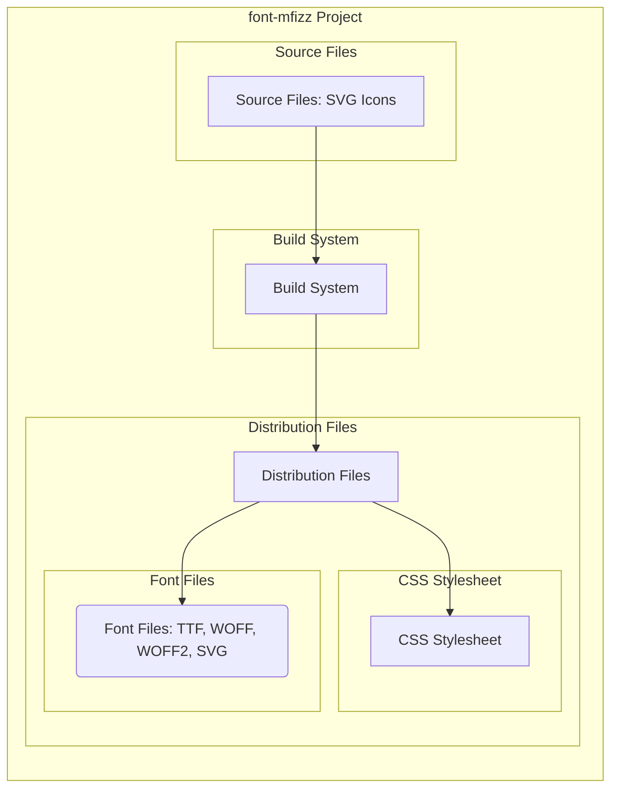
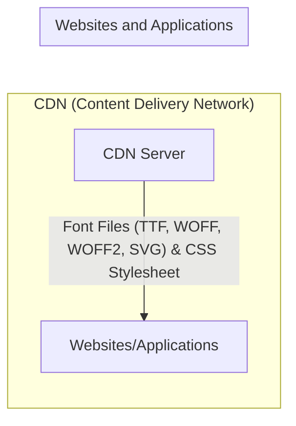

# BUSINESS POSTURE

This project, `font-mfizz`, provides an iconic font for web developers. The primary business goal is to offer a free, open-source, and high-quality icon set that simplifies the integration of icons into web projects. This aims to enhance user interface design and improve the visual appeal of web applications.

Business priorities include:
- Providing a comprehensive and versatile icon set.
- Ensuring ease of use and integration for developers.
- Maintaining compatibility across different browsers and platforms.
- Fostering community adoption and contribution.
- Ensuring the project remains open-source and freely accessible.

Most important business risks that need to be addressed:
- Risk of low adoption if the icon set is not perceived as useful or comprehensive enough.
- Risk of security vulnerabilities in the font files or associated CSS, potentially leading to website compromise if used.
- Risk of supply chain attacks if build dependencies are compromised.
- Risk of licensing issues if dependencies or included assets are not properly licensed.
- Risk of project abandonment if not actively maintained, leading to outdated icons or security vulnerabilities remaining unpatched.

# SECURITY POSTURE

Existing security controls:
- security control: Open-source project with public code repository on GitHub. This allows for community review and potential identification of vulnerabilities. Implemented: GitHub repository.
- security control: MIT License. This ensures clarity on usage rights and reduces legal risks associated with using the font. Implemented: LICENSE file in the repository.

Accepted risks:
- accepted risk: Reliance on community contributions for security vulnerability identification and patching.
- accepted risk: Potential vulnerabilities in build tools and dependencies used to create the font.
- accepted risk: Lack of dedicated security team actively monitoring the project for vulnerabilities.

Recommended security controls:
- recommended security control: Implement automated security scanning of the codebase and build artifacts for known vulnerabilities (e.g., using GitHub Actions with vulnerability scanning tools).
- recommended security control: Establish a clear process for reporting and handling security vulnerabilities.
- recommended security control: Regularly update build tools and dependencies to their latest secure versions.
- recommended security control: Consider code signing the font files to ensure integrity and authenticity.
- recommended security control: Implement Subresource Integrity (SRI) when including the font CSS and font files on web pages to prevent tampering.

Security requirements:

Authentication:
- Not applicable. The font is a publicly available resource and does not require authentication.

Authorization:
- Not applicable. Access to the font is public and does not require authorization.

Input validation:
- security requirement: While the font itself is a static asset, the build process involves processing SVG files. Input validation should be applied to ensure that SVG files are parsed safely and do not introduce vulnerabilities (e.g., XML External Entity attacks). Implemented: within build scripts (needs verification).
- security requirement: Ensure that CSS generated is valid and does not contain any malicious code. Implemented: within build scripts (needs verification).

Cryptography:
- security requirement: Serve font files and CSS over HTTPS to ensure confidentiality and integrity during transmission. Implemented: Web server/CDN configuration where the font is hosted.
- security requirement: Consider using Subresource Integrity (SRI) hashes for CSS and font files to ensure integrity when loaded by web browsers. Implemented: Web page integration.

# DESIGN

## C4 CONTEXT



### Context Diagram Elements

- Name: Web Developers/Designers
  - Type: Person
  - Description: Users who integrate the font-mfizz library into their web projects for icon display.
  - Responsibilities: Integrate the font-mfizz CSS and font files into their web projects. Utilize the provided icon classes in their HTML and CSS.
  - Security controls: Responsible for securely integrating the font into their web projects, including using HTTPS and SRI.

- Name: font-mfizz Library
  - Type: Software System
  - Description: The icon font library itself, consisting of font files (TTF, WOFF, WOFF2, SVG) and a CSS stylesheet.
  - Responsibilities: Provide a set of vector icons as a font. Generate CSS classes for using the icons. Be easily integrable into web projects.
  - Security controls: Secure build process, input validation of SVG sources, serving font files and CSS over HTTPS.

- Name: Websites/Applications
  - Type: Software System
  - Description: Web applications and websites that utilize the font-mfizz library to display icons to end-users.
  - Responsibilities: Display icons using the font-mfizz library. Ensure proper loading and rendering of the font and CSS.
  - Security controls: Use HTTPS to load font files and CSS. Implement SRI for font files and CSS.

## C4 CONTAINER



### Container Diagram Elements

- Name: Source Files: SVG Icons
  - Type: Data Store
  - Description: Collection of SVG files representing the vector icons. These are the source of truth for the font.
  - Responsibilities: Store the vector icon definitions in SVG format. Be the input for the build system.
  - Security controls: Access control to prevent unauthorized modification of source icons. Input validation during build process.

- Name: Build System
  - Type: Software System
  - Description: Automated system responsible for processing the source SVG icons and generating the distribution files (font files and CSS stylesheet).
  - Responsibilities: Convert SVG icons into font formats (TTF, WOFF, WOFF2). Generate CSS stylesheet with icon classes. Perform any necessary optimizations and transformations.
  - Security controls: Secure build environment. Dependency scanning. Input validation of SVG files. Output validation of font files and CSS.

- Name: Distribution Files
  - Type: Data Store
  - Description: Collection of generated font files (TTF, WOFF, WOFF2, SVG) and the CSS stylesheet, ready for distribution and integration into web projects.
  - Responsibilities: Provide the final artifacts of the font-mfizz project. Be hosted on a CDN or web server for public access.
  - Security controls: Integrity checks of generated files. Secure storage and distribution.

  - Name: Font Files: TTF, WOFF, WOFF2, SVG
    - Type: File
    - Description: The actual font files in different formats to ensure cross-browser compatibility.
    - Responsibilities: Contain the vector icon data in font format. Be served to web browsers for rendering icons.
    - Security controls: Code signing (optional). Served over HTTPS. SRI hashes.

  - Name: CSS Stylesheet
    - Type: File
    - Description: CSS file that defines classes for each icon, allowing developers to easily use the font in their HTML.
    - Responsibilities: Provide CSS classes for icon usage. Define font-face rules to load the font.
    - Security controls: Output validation to prevent malicious CSS. Served over HTTPS. SRI hashes.

## DEPLOYMENT

For a font library, the typical deployment is via a Content Delivery Network (CDN) or a standard web server for public access. We will describe deployment to a CDN in detail.



### Deployment Diagram Elements

- Name: CDN (Content Delivery Network)
  - Type: Infrastructure
  - Description: A network of geographically distributed servers that host the font files and CSS stylesheet for fast and reliable delivery to users worldwide.
  - Responsibilities: Host and serve the font files and CSS stylesheet. Provide fast content delivery. Ensure high availability.
  - Security controls: CDN provider's security controls (DDoS protection, access controls, etc.). HTTPS delivery.

- Name: CDN Server
  - Type: Node
  - Description: Individual server within the CDN infrastructure that stores and serves the font files and CSS.
  - Responsibilities: Serve font files and CSS. Handle client requests.
  - Security controls: Server hardening. Access controls. Regular security updates. HTTPS configuration.

- Name: Websites/Applications
  - Type: Software System
  - Description: Web applications and websites that consume the font-mfizz library from the CDN.
  - Responsibilities: Request and load font files and CSS from the CDN. Render icons using the font.
  - Security controls: Implement SRI for loaded resources. Use HTTPS for all requests.

## BUILD

```mermaid
flowchart LR
    subgraph "Developer Workstation"
        Developer[Developer]
        SourceCode[Source SVG Files]
    end
    subgraph "Build System (e.g., GitHub Actions)"
        BuildEnv[Build Environment]
        FontBuildTools[Font Build Tools]
        SecurityScanners[Security Scanners (SAST, Linters)]
        ArtifactStorage[Artifact Storage]
    end

    Developer --> SourceCode
    SourceCode --> BuildEnv
    BuildEnv --> FontBuildTools
    FontBuildTools --> SecurityScanners
    SecurityScanners --> ArtifactStorage
    ArtifactStorage --> DistributionFiles[Distribution Files (Font Files, CSS)]
```

### Build Diagram Elements

- Name: Developer
  - Type: Person
  - Description: Software developer working on the font-mfizz project, creating and modifying SVG icons.
  - Responsibilities: Create and maintain SVG icon files. Commit changes to the source code repository.
  - Security controls: Secure workstation. Code review process.

- Name: Source SVG Files
  - Type: Data Store
  - Description: Repository containing the source SVG files for the icons. Managed under version control (e.g., Git).
  - Responsibilities: Store the source code of the project. Track changes and versions.
  - Security controls: Access control to the repository. Version control system integrity.

- Name: Build Environment
  - Type: Infrastructure
  - Description: Automated environment (e.g., GitHub Actions, Jenkins) where the build process is executed.
  - Responsibilities: Provide a consistent and reproducible build environment. Automate the build process.
  - Security controls: Secure build environment. Access control to build system. Audit logging.

- Name: Font Build Tools
  - Type: Software System
  - Description: Software tools used to generate font files from SVG sources (e.g., FontForge, specific scripts).
  - Responsibilities: Convert SVG files to font formats. Optimize font files. Generate CSS stylesheet.
  - Security controls: Keep build tools updated. Dependency scanning of build tools. Input validation during SVG processing.

- Name: Security Scanners (SAST, Linters)
  - Type: Software System
  - Description: Automated security scanning tools integrated into the build pipeline to detect potential vulnerabilities and code quality issues.
  - Responsibilities: Perform static analysis security testing (SAST) on the codebase. Run linters to enforce code style and identify potential issues.
  - Security controls: Regularly updated scanner rules. Configuration to detect relevant security issues.

- Name: Artifact Storage
  - Type: Data Store
  - Description: Storage location for the generated build artifacts (font files and CSS stylesheet) before distribution.
  - Responsibilities: Securely store build artifacts. Provide access to artifacts for distribution.
  - Security controls: Access control to artifact storage. Integrity checks of stored artifacts.

- Name: Distribution Files (Font Files, CSS)
  - Type: Data Store
  - Description: Final output of the build process, ready for deployment to CDN or web server.
  - Responsibilities: Be the distributable package of the font-mfizz library.
  - Security controls: Integrity checks. Code signing (optional).

# RISK ASSESSMENT

What are critical business process we are trying to protect?
- The critical business process is providing a functional, reliable, and secure icon font library to web developers. This includes the build, distribution, and availability of the font.

What data we are trying to protect and what is their sensitivity?
- We are trying to protect:
    - Source SVG icon files: Sensitivity is moderate. Loss or unauthorized modification could disrupt the project and potentially introduce malicious icons.
    - Build process and build environment: Sensitivity is high. Compromise could lead to supply chain attacks by injecting malicious code into the font files or CSS.
    - Distribution files (font files and CSS): Sensitivity is moderate. Integrity and availability are important to ensure users are getting the intended and safe font library.

# QUESTIONS & ASSUMPTIONS

Questions:
- What is the intended audience for this font library in terms of security sensitivity? Are they primarily used in public-facing websites or also in more sensitive internal applications?
- Are there any specific security concerns or past incidents related to font files or icon libraries that are relevant to this project?
- What is the current build process and what tools are being used? Is there any existing automation or CI/CD pipeline?
- Are there any existing security scanning or code quality checks in place during the build process?
- What is the planned distribution method for the font library? Will it be hosted on a CDN, npm, or other platforms?

Assumptions:
- BUSINESS POSTURE:
    - The primary goal is to provide a free and open-source icon font for general web development use.
    - Community adoption and ease of use are key success metrics.
    - Security is important to maintain trust and prevent misuse, but not the absolute highest priority compared to functionality and usability for a public, open-source project.
- SECURITY POSTURE:
    - Currently, security controls are minimal, typical for many open-source projects focused on functionality first.
    - The project is willing to improve security posture by implementing recommended controls.
    - The target deployment environment will support HTTPS and SRI.
- DESIGN:
    - The build process is currently manual or semi-automated and can be improved with a more robust CI/CD pipeline.
    - Distribution will likely be via CDN or similar public hosting.
    - The project is relatively simple in architecture, focused on generating and distributing static assets (font files and CSS).