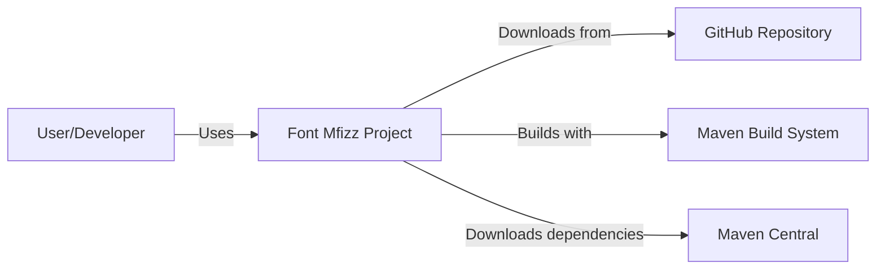
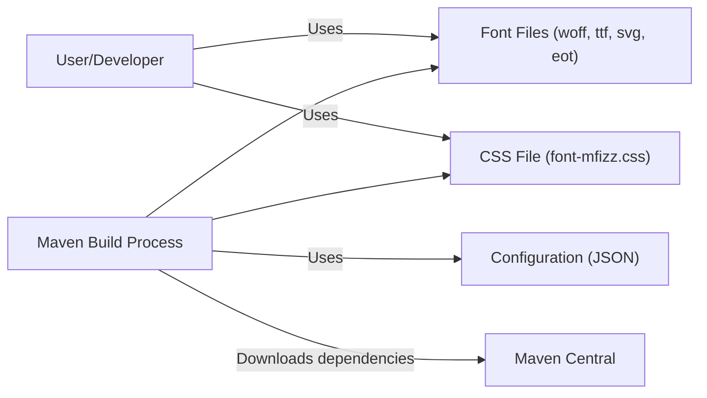
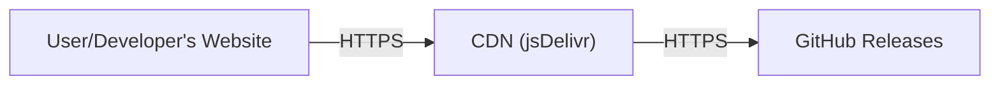
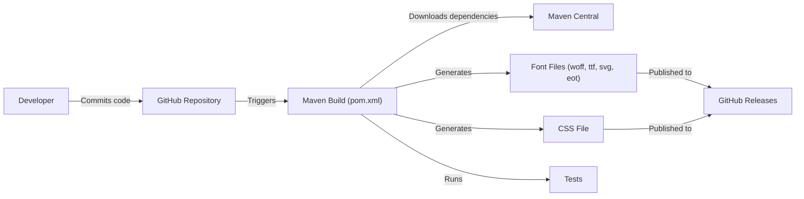

Okay, let's create a design document for the `font-mfizz` project.

# BUSINESS POSTURE

Business Priorities and Goals:

*   Provide a free, open-source, and easily embeddable icon font (MFizz) for developers.
*   Offer a wide range of development-related icons.
*   Ensure the font is lightweight and performs well.
*   Maintain a well-documented and easy-to-use project.
*   Provide build tools to customize the font.

Business Risks:

*   Malicious modification of the font files (e.g., during distribution) could lead to security vulnerabilities in applications using the font.
*   Lack of updates or maintenance could lead to the font becoming outdated or incompatible with newer technologies.
*   Insufficient documentation or support could hinder adoption.
*   Vulnerabilities in the build process could allow for the injection of malicious code.

# SECURITY POSTURE

Existing Security Controls:

*   security control: The project is hosted on GitHub, which provides inherent security features like access control, code scanning (if enabled), and audit trails.
*   security control: Version control (Git) allows tracking changes and reverting to previous states if necessary.
*   security control: The project uses a permissive open-source license (MIT), which encourages community scrutiny and contributions.
*   security control: The build process is defined in a `pom.xml` file (Maven), which provides a standardized and reproducible build.

Accepted Risks:

*   accepted risk: The project does not appear to have dedicated security audits or penetration testing.
*   accepted risk: The project relies on external dependencies (Maven plugins, Java libraries), which could introduce vulnerabilities.
*   accepted risk: The project's documentation does not explicitly address security considerations for users embedding the font.

Recommended Security Controls:

*   Implement a Content Security Policy (CSP) configuration example in the documentation to guide users on mitigating potential XSS risks when using the font.
*   Provide checksums (e.g., SHA-256) for released font files to allow users to verify their integrity.
*   Consider enabling GitHub's built-in security features like code scanning and dependency analysis.
*   Document best practices for securely serving the font files (e.g., using HTTPS, setting appropriate cache headers).
*   Regularly update dependencies to address known vulnerabilities.
*   Consider signing releases.

Security Requirements:

*   Authentication: Not directly applicable to this project, as it's a static font resource. However, access to the GitHub repository and build system should be protected with strong authentication.
*   Authorization: Not directly applicable, but repository access should be managed based on the principle of least privilege.
*   Input Validation: Not directly applicable to the font itself. However, any build scripts or tools should validate inputs to prevent injection vulnerabilities.
*   Cryptography: Not directly used in the font itself. However, HTTPS should be used when serving the font, and checksums should be provided for integrity verification.

# DESIGN

## C4 CONTEXT

C4 Context Element List:

*   User/Developer
    *   Name: User/Developer
    *   Type: Person
    *   Description: A developer who integrates the Font Mfizz icon font into their web application or project.
    *   Responsibilities: Downloads the font, includes it in their project, and uses the provided CSS classes to display icons.
    *   Security controls: Should follow security best practices when embedding the font, such as using a Content Security Policy.

*   Font Mfizz Project
    *   Name: Font Mfizz Project
    *   Type: Software System
    *   Description: The core project, providing the icon font and build tools.
    *   Responsibilities: Provides the font files, CSS, and build scripts.
    *   Security controls: Version control, open-source license, build process defined in `pom.xml`.

*   GitHub Repository
    *   Name: GitHub Repository
    *   Type: External System
    *   Description: The source code repository and hosting platform for the project.
    *   Responsibilities: Stores the project's source code, manages versions, and provides collaboration tools.
    *   Security controls: GitHub's built-in security features (access control, code scanning, audit trails).

*   Maven Build System
    *   Name: Maven Build System
    *   Type: External System
    *   Description: The build automation tool used to compile and package the project.
    *   Responsibilities: Manages dependencies, compiles code, and generates build artifacts.
    *   Security controls: Uses a standardized `pom.xml` file for reproducible builds.

*   Maven Central
    *   Name: Maven Central
    *   Type: External System
    *   Description: Central repository for Java libraries and Maven artifacts.
    *   Responsibilities: Provides access to project dependencies.
    *   Security controls: Relies on Maven Central's security measures.

## C4 CONTAINER

C4 Container Element List:

*   User/Developer
    *   Name: User/Developer
    *   Type: Person
    *   Description: A developer who integrates the Font Mfizz icon font into their web application or project.
    *   Responsibilities: Downloads the font, includes it in their project, and uses the provided CSS classes to display icons.
    *   Security controls: Should follow security best practices when embedding the font, such as using a Content Security Policy.

*   Font Files
    *   Name: Font Files (woff, ttf, svg, eot)
    *   Type: Container
    *   Description: The actual font files in various formats for cross-browser compatibility.
    *   Responsibilities: Provide the glyphs for the icons.
    *   Security controls: Checksums should be provided for integrity verification.

*   CSS File
    *   Name: CSS File (font-mfizz.css)
    *   Type: Container
    *   Description: The CSS file that defines the classes and styles for using the icons.
    *   Responsibilities: Maps icon names to the corresponding glyphs in the font files.
    *   Security controls: Should be served with appropriate security headers (e.g., X-Content-Type-Options).

*   Maven Build Process
    *   Name: Maven Build Process
    *   Type: Container
    *   Description: The build process defined in the `pom.xml` file.
    *   Responsibilities: Generates the font files and CSS based on the configuration.
    *   Security controls: Uses a standardized build system, should be regularly updated to address vulnerabilities in dependencies.

*   Configuration
    *   Name: Configuration (JSON)
    *   Type: Container
    *   Description: Configuration files (likely JSON) that define the icons to be included in the font.
    *   Responsibilities: Controls the content and customization of the generated font.
    *   Security controls: Should be validated to prevent injection vulnerabilities.

*   Maven Central
    *   Name: Maven Central
    *   Type: External System
    *   Description: Central repository for Java libraries and Maven artifacts.
    *   Responsibilities: Provides access to project dependencies.
    *   Security controls: Relies on Maven Central's security measures.

## DEPLOYMENT

Possible Deployment Solutions:

1.  Direct download from GitHub: Users download the font files directly from the GitHub repository.
2.  Content Delivery Network (CDN): The font files are hosted on a CDN like jsDelivr or UNPKG.
3.  Self-hosting: Users download the font files and host them on their own web servers.
4.  Package managers: Users install font using package managers like npm.

Chosen Deployment Solution (CDN - jsDelivr):

Deployment Element List:

*   User/Developer's Website
    *   Name: User/Developer's Website
    *   Type: Deployment Node
    *   Description: The website or application where the Font Mfizz icon font is used.
    *   Responsibilities: Serves the website content, including the font files.
    *   Security controls: Should use HTTPS, implement a Content Security Policy, and set appropriate security headers.

*   CDN (jsDelivr)
    *   Name: CDN (jsDelivr)
    *   Type: Deployment Node
    *   Description: A Content Delivery Network that hosts the Font Mfizz files.
    *   Responsibilities: Provides fast and reliable delivery of the font files to users.
    *   Security controls: Uses HTTPS, provides caching, and has its own security measures.

*   GitHub Releases
    *   Name: GitHub Releases
    *   Type: Deployment Node
    *   Description: The release section of the GitHub repository, where tagged versions of the font are published.
    *   Responsibilities: Stores the official releases of the font files.
    *   Security controls: GitHub's built-in security features.

## BUILD

Build Process Description:

1.  A developer commits code changes to the GitHub repository.
2.  The changes trigger the Maven build process, defined in the `pom.xml` file.
3.  Maven downloads necessary dependencies from Maven Central.
4.  Maven executes build steps, including:
    *   Reading configuration files (likely JSON) that define the icons.
    *   Generating the font files in various formats (woff, ttf, svg, eot).
    *   Generating the CSS file.
    *   Running tests.
5.  The generated font files and CSS are published as a GitHub Release.

Build Security Controls:

*   security control: The build process is automated using Maven, ensuring consistency and reproducibility.
*   security control: Dependencies are managed through Maven, allowing for version control and vulnerability scanning (if enabled).
*   security control: The build process can be integrated with CI/CD pipelines (e.g., GitHub Actions) for automated testing and security checks.
*   security control: Tests are executed as part of the build.

# RISK ASSESSMENT

Critical Business Processes:

*   Providing a reliable and accessible icon font for developers.
*   Maintaining the integrity and security of the font files.

Data to Protect:

*   Source code of the font and build tools (low sensitivity, publicly available).
*   Configuration files (low sensitivity, publicly available).
*   Generated font files (low sensitivity, publicly available, but integrity is crucial).
*   User data: None directly handled by the project.

# QUESTIONS & ASSUMPTIONS

Questions:

*   Are there any specific security requirements or compliance standards that the project needs to adhere to?
*   What is the expected frequency of updates and maintenance for the font?
*   Are there any plans to integrate with other platforms or tools?
*   What is the process for reporting and addressing security vulnerabilities?

Assumptions:

*   BUSINESS POSTURE: The primary goal is to provide a free and useful resource for developers, with a focus on ease of use and accessibility.
*   SECURITY POSTURE: The project relies on the inherent security of GitHub and Maven, along with basic security best practices.
*   DESIGN: The design is relatively simple, with a focus on generating static font files and CSS. The deployment model assumes users will either download the files directly, use a CDN, or self-host.