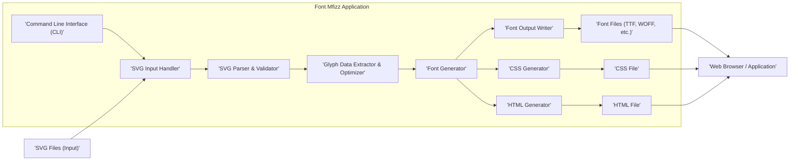

# Project Design Document: Font Mfizz

**Version:** 1.1
**Date:** October 26, 2023
**Author:** AI Software Architect

## 1. Introduction

This document provides an enhanced and more detailed design overview of the Font Mfizz project, an open-source command-line tool for creating icon fonts from SVG files. This document aims to provide a clear and comprehensive understanding of the project's architecture, components, and data flow, specifically tailored to facilitate thorough threat modeling activities. This revision includes more detailed descriptions and expands on potential security considerations.

## 2. Goals

*   Provide a comprehensive and detailed architectural overview of the Font Mfizz project.
*   Clearly identify key components, their specific responsibilities, and their interactions.
*   Thoroughly describe the data flow within the system, highlighting potential transformation and validation points.
*   Serve as a robust and informative foundation for subsequent threat modeling exercises, enabling the identification of potential vulnerabilities and attack vectors.

## 3. Project Overview

Font Mfizz is a command-line tool developed in Java that automates the process of generating various web font formats (e.g., TTF, WOFF, EOT, SVG) from a collection of SVG files. It streamlines the creation of icon fonts by taking a directory of SVG assets as input and producing ready-to-use font files along with accompanying CSS and HTML examples for seamless integration into web development workflows.

## 4. System Architecture

The Font Mfizz system is designed with a modular architecture, comprising several distinct components that work in concert to achieve the desired font generation functionality.

### 4.1. Component Descriptions

*   **Command Line Interface (CLI):** This is the primary interface for interacting with Font Mfizz. It's responsible for:
    *   Receiving and parsing user-provided command-line arguments, such as the input directory, output directory, desired font name, and other configuration options.
    *   Validating the provided input parameters to ensure they are valid and within expected ranges.
    *   Orchestrating the execution flow by invoking the appropriate components in the correct sequence.
    *   Handling errors and providing feedback to the user.
*   **SVG Input Handler:** This component manages the retrieval of SVG files. Its responsibilities include:
    *   Locating SVG files within the specified input directory.
    *   Filtering files based on expected file extensions (e.g., `.svg`).
    *   Reading the content of each identified SVG file.
    *   Potentially handling recursive directory traversal if configured.
*   **SVG Parser & Validator:** This crucial component is responsible for interpreting the content of the SVG files. Its functions include:
    *   Parsing the XML structure of the SVG file.
    *   Validating the SVG content against expected schemas or rules to ensure it's well-formed and conforms to the requirements for font glyph generation.
    *   Extracting relevant vector graphics data, such as path definitions, view box dimensions, and potentially metadata like icon names or descriptions.
    *   Handling potential errors or malformed SVG content gracefully.
*   **Glyph Data Extractor & Optimizer:** This component processes the parsed SVG data to prepare it for font generation. Its tasks involve:
    *   Extracting the necessary path data and attributes required to represent each icon as a glyph.
    *   Potentially optimizing the path data to reduce file size or improve rendering performance (e.g., simplifying paths, removing redundant points).
    *   Mapping SVG elements to font glyph properties (e.g., Unicode code points, glyph names).
    *   Handling potential inconsistencies or issues in the extracted data.
*   **Font Generator:** This is the core engine for creating the actual font files. It leverages a font generation library to:
    *   Take the extracted and processed glyph data as input.
    *   Generate font outlines in the specified formats (TTF, WOFF, EOT, SVG).
    *   Handle font metadata, such as font name, family, and version.
    *   Potentially apply hinting or other font optimization techniques.
*   **Font Output Writer:** This component manages the output of the generated font files. Its responsibilities include:
    *   Writing the generated font data to files in the specified output directory.
    *   Naming the output files according to the configured font name and format.
    *   Handling potential file system errors (e.g., insufficient permissions, disk space issues).
*   **CSS Generator:** This component creates the stylesheet necessary to use the generated icon font in web projects. It:
    *   Generates CSS rules that map the font glyphs to specific character codes or class names.
    *   Allows for customization of CSS output (e.g., class name prefixes).
    *   Ensures the generated CSS is valid and compatible with web browsers.
*   **HTML Generator:** This component provides a sample HTML file for demonstration and testing purposes. It:
    *   Generates a basic HTML structure that includes the generated CSS and examples of how to use the icon font.
    *   Facilitates quick verification of the generated font.
*   **SVG Files (Input):** These are the source files containing the vector graphics definitions for the icons. The security of the overall process heavily relies on the integrity of these input files.
*   **Font Files (TTF, WOFF, etc.):** These are the resulting font files that can be embedded in web pages or applications.
*   **CSS File:** The generated stylesheet for using the icon font.
*   **HTML File:** The example HTML file demonstrating icon usage.
*   **Web Browser / Application:** The environment where the generated font is ultimately used by end-users.

## 5. Data Flow

The process of generating icon fonts with Font Mfizz involves a sequential flow of data through its components:

1. The user initiates the process by executing the Font Mfizz application through the **'Command Line Interface (CLI)'**, providing necessary input parameters like the location of **'SVG Files (Input)'** and the desired output directory.
2. The **'CLI'** validates the input and instructs the **'SVG Input Handler'** to locate and retrieve the SVG files from the specified directory.
3. The **'SVG Input Handler'** reads the content of each SVG file and passes it to the **'SVG Parser & Validator'**.
4. The **'SVG Parser & Validator'** parses the XML structure of each SVG file, validates its content against expected standards, and extracts the relevant vector graphics data. Any invalid or malformed SVG files may be flagged or cause the process to halt.
5. The extracted data is then passed to the **'Glyph Data Extractor & Optimizer'**, which processes and potentially optimizes the path data and other attributes required to represent each icon as a font glyph.
6. The optimized glyph data is then fed into the **'Font Generator'**, which utilizes a font generation library to create the actual **'Font Files (TTF, WOFF, etc.)'** in the desired formats.
7. The generated font files are then written to the specified output directory by the **'Font Output Writer'**.
8. Simultaneously, the **'Font Generator'** provides necessary information to the **'CSS Generator'**, which creates the **'CSS File'** for styling and referencing the generated icons.
9. The **'Font Generator'** also provides information to the **'HTML Generator'**, which creates a sample **'HTML File'** demonstrating how to use the generated font and CSS.
10. Finally, the generated **'Font Files (TTF, WOFF, etc.)'**, **'CSS File'**, and **'HTML File'** are available for use in a **'Web Browser / Application'**.

## 6. Security Considerations (Detailed)

This section expands on the initial security considerations, providing more specific examples of potential threats and mitigation strategies.

*   **Malicious SVG Files (Input Validation Vulnerabilities):**
    *   **Threat:** Processing maliciously crafted SVG files could exploit vulnerabilities in the **'SVG Parser & Validator'**, leading to:
        *   **XML External Entity (XXE) Injection:** Attackers could embed external entity references in SVG files to access local files or internal network resources.
        *   **Denial of Service (DoS):**  Complex or deeply nested SVG structures could consume excessive processing resources, leading to application slowdown or crashes.
        *   **Server-Side Request Forgery (SSRF):** If the SVG parser attempts to resolve external resources specified in the SVG, it could be tricked into making requests to internal or external systems.
        *   **Code Injection (less likely but possible):** In extremely rare cases, vulnerabilities in the parsing library could potentially be exploited for code execution.
    *   **Mitigation:**
        *   Utilize a robust and well-maintained SVG parsing library with known security best practices.
        *   Implement strict input validation and sanitization of SVG content, disallowing external entity references and potentially dangerous SVG features.
        *   Employ a sandboxed environment for SVG parsing to limit the impact of potential exploits.
        *   Regularly update the SVG parsing library to patch known vulnerabilities.
*   **Dependency Vulnerabilities:**
    *   **Threat:** Font Mfizz relies on external Java libraries for SVG parsing and font generation. Vulnerabilities in these dependencies could be exploited if not properly managed.
    *   **Mitigation:**
        *   Employ a dependency management tool (e.g., Maven, Gradle) to track and manage dependencies.
        *   Regularly scan dependencies for known vulnerabilities using security scanning tools (e.g., OWASP Dependency-Check).
        *   Keep dependencies updated to their latest stable and secure versions.
        *   Consider using Software Composition Analysis (SCA) tools for continuous monitoring of dependency security.
*   **Output Directory Control and File Overwriting:**
    *   **Threat:** If the user has write access to sensitive system directories and specifies such a directory as the output, the application could potentially overwrite critical system files.
    *   **Mitigation:**
        *   Clearly document the application's behavior regarding output directory selection and advise users on secure practices.
        *   Implement checks to prevent writing to known sensitive system directories.
        *   Consider using more restrictive file permissions for the output directory.
*   **Command Injection (If External Processes are Used):**
    *   **Threat:** If Font Mfizz were to execute external commands based on user input (e.g., for specific font format conversions), this could introduce command injection vulnerabilities.
    *   **Mitigation:**
        *   Avoid executing external commands based on untrusted user input.
        *   If external commands are absolutely necessary, sanitize and validate input rigorously using whitelisting techniques.
        *   Utilize secure methods for executing external processes, avoiding shell execution where possible.
*   **Information Disclosure through Error Handling and Logging:**
    *   **Threat:** Verbose error messages or overly detailed logging could inadvertently reveal sensitive information about the system's internal workings, file paths, or configurations.
    *   **Mitigation:**
        *   Implement secure logging practices, avoiding the logging of sensitive data.
        *   Provide generic error messages to users while logging more detailed information securely for debugging purposes.
        *   Restrict access to log files.
*   **Resource Exhaustion:**
    *   **Threat:** Processing extremely large or complex SVG files could potentially lead to excessive memory consumption or CPU usage, resulting in a denial-of-service condition.
    *   **Mitigation:**
        *   Implement safeguards to limit the resources consumed during SVG processing (e.g., setting memory limits, timeouts).
        *   Consider techniques for streaming or processing SVG data in chunks to reduce memory footprint.
*   **Configuration Security:**
    *   **Threat:** If Font Mfizz uses configuration files, insecurely configured settings could introduce vulnerabilities.
    *   **Mitigation:**
        *   Ensure default configurations are secure.
        *   Provide clear documentation on secure configuration practices.
        *   Avoid storing sensitive information directly in configuration files; consider using environment variables or secure storage mechanisms.

## 7. Technologies Used

*   **Programming Language:** Java (known for its platform independence and extensive libraries).
*   **SVG Parsing Library:**  Likely a robust Java library such as **Apache Batik** (provides comprehensive SVG parsing and rendering capabilities) or **JSVG** (another popular option for SVG processing in Java). The specific choice impacts the potential vulnerabilities related to SVG handling.
*   **Font Generation Library:**  Potentially **Apache FOP** (while primarily a formatting output processor, it can generate fonts) or a more specialized font generation library like **FontBox** (part of the PDFBox project) or a dedicated library for TrueType or OpenType font creation. The capabilities and security of this library are critical for the integrity of the generated fonts.
*   **Build Tool:**  Likely **Maven** or **Gradle** for managing dependencies, building the project, and running tests. These tools themselves have security considerations related to plugin management and build script integrity.

## 8. Future Considerations

*   **Web Interface:** Introducing a web interface could simplify usage but would introduce new security considerations related to web application security (e.g., authentication, authorization, cross-site scripting (XSS), cross-site request forgery (CSRF)).
*   **API Integration:** Providing an API for programmatic access would require careful consideration of API security best practices, including authentication, authorization, and rate limiting.
*   **Plugin Support:** Allowing users to extend functionality with plugins could introduce security risks if plugins are not properly vetted and sandboxed. A robust plugin security model would be necessary.

This enhanced design document provides a more detailed and security-focused overview of the Font Mfizz project. This information is intended to be a valuable resource for conducting a comprehensive threat model and identifying potential security vulnerabilities.