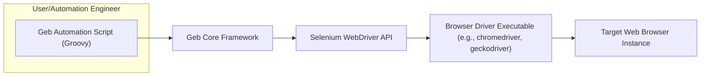
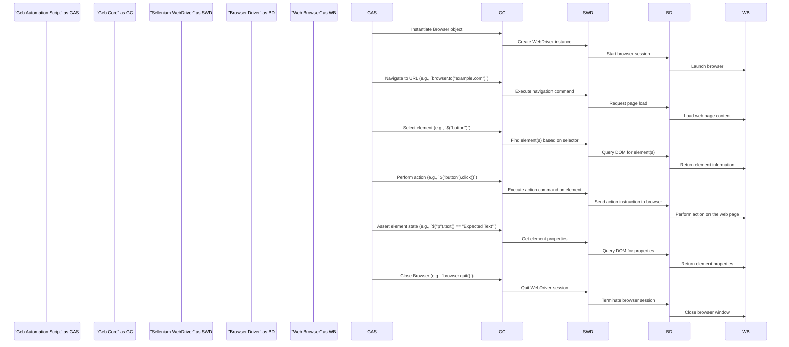

# Project Design Document: Geb - Browser Automation Framework

**Version:** 1.1
**Date:** October 26, 2023
**Author:** Gemini (AI Language Model)

## 1. Introduction

This document provides an enhanced design overview of the Geb browser automation framework. Geb is a powerful, Groovy-based library designed to simplify and enhance browser automation by providing an expressive and intuitive layer over Selenium WebDriver. This document details Geb's architecture, core components, and data flow, serving as a robust foundation for subsequent threat modeling activities. The improvements in this version aim to provide greater clarity and detail for security analysis.

## 2. Goals and Objectives

The primary goals of Geb are to:

*   Offer a highly readable and maintainable syntax for browser automation tasks.
*   Abstract the underlying complexities of Selenium WebDriver, making automation more accessible.
*   Provide a rich and flexible API for interacting with web page elements and browser functionalities.
*   Support diverse browser configurations and execution environments.
*   Enable the creation of efficient, reliable, and easily understood automated tests and automation scripts.

## 3. High-Level Architecture

Geb's architecture centers around providing an abstraction layer over Selenium WebDriver. Users author Geb scripts, typically in Groovy, leveraging Geb's Domain Specific Language (DSL). Geb interprets these scripts, translating the high-level instructions into specific commands for Selenium WebDriver. Selenium then interacts with the browser driver to control the web browser.

**Components:**

*   **Geb Automation Script (Groovy):** The code written by users to define the browser automation logic using Geb's expressive syntax. This script interacts directly with the Geb Core.
*   **Geb Core Framework:** The heart of Geb, responsible for parsing and interpreting Geb scripts, managing browser instances and sessions, and orchestrating interactions with the Selenium WebDriver API.
*   **Selenium WebDriver API:** A standardized API providing language-specific bindings to control web browsers. Geb utilizes this API to send commands to the browser driver.
*   **Browser Driver Executable (e.g., chromedriver, geckodriver):** A browser-specific executable that translates Selenium WebDriver commands into instructions that the target web browser can understand and execute.
*   **Target Web Browser Instance:** The actual instance of the web browser (e.g., Chrome, Firefox, Safari) being automated by Geb.

## 4. Detailed Design

### 4.1. Key Components

*   **`Browser` Object:** The primary interface for interacting with the browser. It encapsulates the WebDriver instance, manages browser lifecycle (start/stop), handles configuration settings (e.g., browser type, timeouts), and provides methods for navigation (`to()`), window management, and accessing core functionalities.
*   **`Navigator` Object:** Offers a fluent and powerful API for locating and interacting with elements on a web page. It uses CSS selectors, XPath expressions, and other strategies to identify elements within the Document Object Model (DOM). It supports chaining of selectors for precise targeting and provides methods for actions like `click()`, `sendKeys()`, and retrieving element properties.
*   **`Page` Object:** Represents a specific web page or a distinct section of a web application. It encapsulates the structure, content, and behavior of that page, promoting code reusability and maintainability. Page objects define locators for key elements and methods for interacting with those elements, abstracting away the underlying HTML structure from the test logic.
*   **`Module` Object:** Similar to `Page` objects but designed for representing reusable components or widgets that appear across multiple pages (e.g., a login form, a navigation menu). Modules can be included within `Page` objects or other `Module` objects, fostering a component-based approach to automation.
*   **Content DSL (Domain Specific Language):** Geb's expressive syntax for interacting with page content. It provides intuitive ways to access elements (e.g., `$("h1")`, `$("#username")`), assert their properties (e.g., `title == "My Page"`), and perform actions. This DSL simplifies common browser automation tasks.
*   **Configuration Management:** Geb allows for flexible configuration of various aspects, including browser settings, driver locations, timeouts (implicit and explicit waits), and reporting options. Configuration can be managed programmatically or through external configuration files.
*   **Waiting and Synchronization Mechanisms:** Geb provides robust mechanisms for handling asynchronous operations and ensuring that elements are in the expected state before interaction. This includes implicit waits (waiting a default amount of time for elements to appear) and explicit waits (waiting for specific conditions to be met).

### 4.2. Core Interactions and Data Flow

The typical execution flow of a Geb script involves these steps:

1. **Initialization:** The Geb `Browser` object is instantiated, potentially with specific configurations. This may involve starting a new browser session by invoking the appropriate WebDriver.
2. **Navigation:** The script uses the `Browser` object's navigation methods (e.g., `to("https://example.com")`) to load a specific URL in the browser. This translates to a navigation command sent to the WebDriver.
3. **Element Location:** The `Navigator` object is employed to locate specific elements on the loaded web page using selectors. Geb translates these selectors into commands for the WebDriver to query the browser's DOM.
4. **Interaction with Elements:** Actions are performed on the located elements, such as clicking buttons (`$("button").click()`), entering text into input fields (`$("#input").value("text")`), or selecting options from dropdowns. These actions are converted into corresponding WebDriver commands.
5. **State Assertion:** The script verifies the state of the web page or specific elements using Geb's assertion capabilities. This involves querying the browser's DOM through WebDriver to retrieve element properties and comparing them against expected values.
6. **Page Transitions:** Navigation to different pages or interactions that trigger page reloads follow a similar pattern of element location and interaction on the newly loaded page.
7. **Browser Closure:**  The `Browser` object is closed, which terminates the WebDriver session and closes the associated browser window.

## 5. Key Technologies

*   **Groovy:** The primary programming language for writing Geb scripts and the language in which the Geb framework is implemented.
*   **Selenium WebDriver:** The foundational library for browser automation that Geb leverages for interacting with web browsers.
*   **HTML (HyperText Markup Language):** The markup language that defines the structure of web pages, which Geb interacts with.
*   **CSS (Cascading Style Sheets):** Used for styling web pages and is a common mechanism for selecting elements in Geb scripts.
*   **JavaScript:** A scripting language used for dynamic behavior on web pages. Geb can interact with JavaScript elements and events.
*   **Browser-Specific Drivers (e.g., ChromeDriver, GeckoDriver, SafariDriver, EdgeDriver):**  Essential executables that facilitate communication between Selenium WebDriver and specific web browsers.
*   **Build Tools (e.g., Gradle, Maven):** Commonly used for managing dependencies and building Geb projects.

## 6. Deployment Model

Geb is typically deployed as a library within a larger software project, primarily for testing or automation purposes. The deployment process involves:

*   **Dependency Management:** Adding Geb as a dependency to the project's build configuration file (e.g., `build.gradle` for Gradle, `pom.xml` for Maven). This allows the build tool to download and manage the Geb library and its dependencies.
*   **Driver Configuration:** Ensuring that the appropriate browser driver executables are available on the system where the Geb scripts will be executed. This often involves placing the driver executables in a directory included in the system's PATH environment variable or configuring the driver location within the Geb configuration.
*   **Test Execution Environment:** Geb scripts are typically executed within a testing framework (e.g., Spock, JUnit) or directly as Groovy scripts. The execution environment needs to have the necessary dependencies and driver configurations in place.

## 7. Security Considerations (For Threat Modeling)

This section outlines potential security considerations relevant for threat modeling Geb-based automation.

*   **Geb Script Injection Vulnerabilities:**
    *   **Threat:** Malicious actors could potentially inject arbitrary code into Geb scripts if input is not properly sanitized or validated. This could lead to unintended actions within the browser or access to sensitive information.
    *   **Example:**  If a Geb script dynamically constructs selectors based on user input without proper sanitization, a malicious user could inject crafted input to target unintended elements or execute arbitrary JavaScript.
*   **Dependency Chain Vulnerabilities:**
    *   **Threat:** Geb relies on Selenium WebDriver and other underlying libraries. Vulnerabilities in these dependencies could be exploited through Geb.
    *   **Example:** A known vulnerability in a specific version of Selenium WebDriver could be leveraged if a Geb project uses that vulnerable version.
*   **Sensitive Data Exposure in Scripts and Logs:**
    *   **Threat:** Geb scripts might handle sensitive information (e.g., passwords, API keys). Improper handling, logging, or storage of this data could lead to exposure.
    *   **Example:**  Hardcoding credentials directly in Geb scripts or logging sensitive data during test execution could create security risks.
*   **Insecure Browser Configurations:**
    *   **Threat:** If the browser instances launched by Geb are not configured securely, they could be vulnerable to attacks.
    *   **Example:** Running browsers with disabled security features or using outdated browser versions could expose the automation environment to risks.
*   **Browser Driver Security:**
    *   **Threat:** Malicious or compromised browser drivers could be used to intercept or manipulate browser interactions.
    *   **Example:** Using browser drivers from untrusted sources could introduce malware or allow unauthorized access.
*   **Cross-Site Scripting (XSS) via Geb Automation:**
    *   **Threat:** While Geb automates browser actions, if the *application under test* has XSS vulnerabilities, Geb scripts could inadvertently trigger or be affected by them.
    *   **Example:** A Geb script interacting with a vulnerable web application might unknowingly execute malicious JavaScript injected into the page.
*   **Insufficient Access Controls for Geb Scripts and Execution Environment:**
    *   **Threat:** Unauthorized access to Geb scripts or the environment where they are executed could allow malicious modification or execution of automation tasks.
    *   **Example:** Lack of proper permissions on the file system where Geb scripts are stored could allow unauthorized users to alter the scripts.
*   **Man-in-the-Middle (MITM) Attacks on Browser Communication:**
    *   **Threat:** If the communication between the Geb script, WebDriver, and the browser is not secured (e.g., using HTTPS), it could be susceptible to MITM attacks.
    *   **Example:**  An attacker could intercept communication to steal session cookies or manipulate data being sent to the browser.

## 8. Future Considerations

*   **Enhanced Reporting and Logging Capabilities:** Providing more detailed and customizable reporting options for test execution and debugging.
*   **Improved Integration with Cloud-Based Browser Providers:**  Streamlining the integration with services like Sauce Labs, BrowserStack, and Selenium Grid in the cloud.
*   **Visual Testing Integration:**  Adding built-in support or easier integration with visual testing libraries for automated UI verification.
*   **Performance Optimization for Large-Scale Automation:**  Further optimizing Geb's performance and resource utilization for handling large suites of automated tests.
*   **Advanced Browser Interaction APIs:**  Expanding the API to support more complex browser interactions and scenarios.