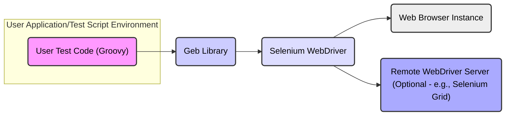

## Project Design Document: Geb Browser Automation Library

**Document Version:** 1.1
**Date:** October 26, 2023
**Author:** Gemini (AI Language Model)
**Project:** Geb Browser Automation Library
**Project URL:** https://github.com/geb/geb

### 1. Introduction

This document provides a detailed architectural design overview of the Geb browser automation library. Its primary purpose is to serve as a basis for threat modeling activities, enabling security professionals to understand the system's components, interactions, and potential vulnerabilities. This document outlines the key elements of the Geb ecosystem and how they interact.

### 2. Project Overview

Geb is a Groovy-based library that simplifies browser automation by providing a more expressive and user-friendly interface over Selenium WebDriver. It's primarily used for writing automated functional and integration tests for web applications, allowing developers and testers to simulate user interactions with web browsers programmatically. Geb abstracts away some of the complexities of the underlying Selenium WebDriver API.

### 3. System Architecture

The following diagram illustrates the high-level architecture of a system utilizing the Geb library:

**Components Description:**

*   **User Test Code (Groovy):**  This represents the Groovy scripts written by users to define automated browser interactions. These scripts utilize the Geb API to control the browser.
*   **Geb Library:** The core Geb library provides the Groovy DSL and abstractions. It acts as an intermediary, translating user-friendly Geb commands into Selenium WebDriver instructions.
*   **Selenium WebDriver:** A lower-level browser automation framework that Geb depends on. It provides the direct interface to control web browsers. Specific browser drivers (e.g., ChromeDriver, GeckoDriver) are used by WebDriver to communicate with particular browser instances.
*   **Web Browser Instance:**  The actual instance of a web browser (e.g., Chrome, Firefox, Safari, Edge) that is being automated. Geb, through Selenium, sends commands to this instance.
*   **Remote WebDriver Server (Optional):**  A server, such as Selenium Grid, that allows for running browser automation tests on different machines, operating systems, and browsers in parallel. This adds a network communication layer.

### 4. Data Flow

The following outlines the typical sequence of data flow during the execution of a Geb-based browser automation script:

1. The **User Test Code** initiates an action using the Geb API (e.g., navigating to a URL, clicking a button, entering text).
2. The **Geb Library** receives the command and processes it, potentially performing internal logic or transformations.
3. The **Geb Library** translates the Geb command into one or more corresponding calls to the **Selenium WebDriver API**.
4. **Selenium WebDriver** constructs a request conforming to the WebDriver wire protocol (typically JSON over HTTP).
5. This request is sent to the **Web Browser Instance** (or the **Remote WebDriver Server** if configured).
6. The **Web Browser Instance** (or the remote server) receives the request and executes the corresponding browser action.
7. The **Web Browser Instance** sends a response back to **Selenium WebDriver**, again using the WebDriver wire protocol. This response indicates the success or failure of the action and may include data about the browser's state.
8. **Selenium WebDriver** parses the response and provides the result back to the **Geb Library**.
9. The **Geb Library** processes the result and makes it available to the **User Test Code**, allowing for assertions, further actions, and data extraction.

### 5. Key Interactions and Interfaces

*   **User Test Code to Geb Library:** Interaction occurs through method calls and property access within the Geb's Groovy DSL. Data passed includes selectors, text values, and expected states.
*   **Geb Library to Selenium WebDriver:** Interaction happens via the Selenium WebDriver Java API. Data exchanged consists of commands to manipulate the browser (e.g., find elements, click, send keys) and queries for browser state.
*   **Selenium WebDriver to Web Browser Instance:** Communication uses the WebDriver wire protocol, a RESTful API over HTTP. Data is exchanged in JSON format, defining actions to be performed by the browser and responses containing the results.
*   **Selenium WebDriver to Remote WebDriver Server:**  Also uses the WebDriver wire protocol (JSON over HTTP). The communication includes session management information and commands to be executed on the remote browser instance.

### 6. Deployment Considerations

Geb is typically deployed as a library within a larger application or test suite. Key deployment aspects include:

*   **Local Development Environment:** Developers will include Geb as a dependency in their projects (e.g., using Gradle or Maven). They will also need the appropriate browser drivers installed locally.
*   **Continuous Integration (CI) Pipelines:** Geb tests are frequently executed as part of CI pipelines. This often involves setting up environments with the necessary browsers and drivers, potentially using containerization (e.g., Docker).
*   **Test Environments:**  Geb tests might be run against dedicated test environments, which could be staging environments or isolated testing infrastructure. These environments need to have the target web application deployed and accessible.
*   **Cloud-Based Testing Platforms:** Geb can be integrated with cloud-based browser testing services (e.g., Sauce Labs, BrowserStack), which manage the browser infrastructure. This involves configuring Geb to connect to the cloud provider's WebDriver endpoints.

### 7. Dependencies

Geb relies on several key dependencies:

*   **Selenium WebDriver:** The fundamental browser automation framework. Specific versions of WebDriver are required, and compatibility with browser versions is important.
*   **Browser Drivers (e.g., ChromeDriver, GeckoDriver):**  These are separate executables that WebDriver uses to control specific browser types. Version compatibility between the driver, the browser, and WebDriver is crucial.
*   **Groovy:** The programming language in which Geb is written and the language used to write Geb tests. The Geb library relies on specific Groovy language features.
*   **SLF4j (Simple Logging Facade for Java):** Used by Geb for logging. Users can choose a specific logging implementation (e.g., Logback, Log4j).
*   **HTTP Client Libraries (e.g., Apache HttpClient):** Geb or its dependencies might use HTTP clients for communication, particularly with remote WebDriver servers.
*   **JSON Processing Libraries:** Since the WebDriver protocol uses JSON, libraries for parsing and generating JSON are necessary.

It's important to manage these dependencies effectively using build tools to ensure compatibility and avoid dependency conflicts.

### 8. Configuration

Geb can be configured through several mechanisms to customize its behavior:

*   **`GebConfig.groovy`:** A configuration file placed in the classpath of the test project. This file allows setting various options, such as:
    *   The default browser to use (`driver = { new ChromeDriver() }`).
    *   Reporting options (e.g., screenshot on failure).
    *   Base URL for tests.
    *   Environment-specific configurations.
*   **System Properties:** Certain Geb settings can be overridden using Java system properties when running the tests. For example, specifying a different WebDriver implementation.
*   **Command-line Arguments:** When executing Geb tests from the command line (e.g., using Gradle or the Geb command-line runner), specific configurations can be passed as arguments.
*   **Environment Variables:**  Similar to system properties, environment variables can be used to configure certain aspects of Geb's behavior.

### 9. Security Considerations for Threat Modeling

When considering Geb for threat modeling, focus on potential vulnerabilities introduced by its use and the security implications of its interactions:

*   **Dependency Vulnerabilities:**  Outdated or vulnerable versions of Geb's dependencies (especially Selenium WebDriver and browser drivers) can introduce security risks. Threat actors could exploit known vulnerabilities in these components to compromise the testing environment or even the target application if the testing environment is not properly isolated.
*   **Insecure Storage of Test Credentials:** If Geb tests interact with applications requiring authentication, hardcoding credentials in test scripts or storing them insecurely (e.g., in plain text configuration files) exposes them to potential compromise.
*   **Exposure of Sensitive Information in Test Logs and Reports:** Test logs and reports might inadvertently contain sensitive data from the application under test or the testing process itself. This information could be exposed if access to these logs is not properly controlled.
*   **Cross-Site Scripting (XSS) via Test Input:** While Geb primarily drives the browser, if test scripts inject malicious scripts as input into the application under test, this could be a vector for identifying XSS vulnerabilities. However, the risk here is more about *discovering* the vulnerability than Geb *creating* it.
*   **Man-in-the-Middle Attacks on WebDriver Communication:** If communicating with a remote WebDriver server (e.g., Selenium Grid) over an insecure network (without HTTPS), the communication could be intercepted, potentially exposing session information or allowing malicious commands to be injected.
*   **Insufficient Isolation of Browser Instances:** If browser instances are not properly isolated between tests, one test might affect the state of another, potentially leading to unreliable results or even security vulnerabilities if sensitive data persists.
*   **Unauthorized Access to Testing Infrastructure:**  If the infrastructure where Geb tests are executed is not properly secured, unauthorized individuals could gain access and potentially modify tests, steal credentials, or disrupt the testing process.
*   **Code Injection through Geb Extensions or Customizations:** If users develop custom extensions or plugins for Geb, vulnerabilities in this custom code could introduce security risks.
*   **Denial of Service (DoS) through Resource Exhaustion:** Maliciously crafted Geb tests could potentially overload the application under test or the testing infrastructure, leading to a denial of service.

### 10. Future Considerations (Potential Extensions and Changes)

*   **Improved Integration with Cloud Testing Platforms:**  Further streamlining the configuration and use of Geb with various cloud-based browser testing services.
*   **Enhanced Reporting and Analytics:**  Providing more comprehensive reporting features and data analytics on test execution.
*   **Support for New Browser Features and APIs:**  Keeping pace with the evolving web browser landscape and incorporating support for new browser functionalities.
*   **Improved Error Handling and Debugging Capabilities:**  Making it easier to diagnose and resolve issues in Geb tests.
*   **More Robust Element Locators and Strategies:**  Expanding the options for identifying and interacting with web page elements.

This document provides a comprehensive architectural overview of the Geb library, specifically tailored for threat modeling. It highlights the key components, data flows, and potential security considerations that should be examined further during a formal threat modeling exercise.
