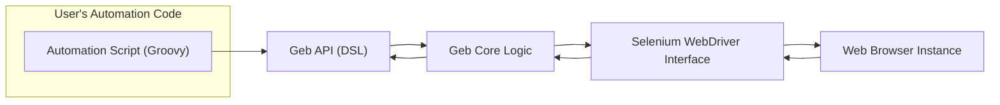

# Project Design Document: Geb - Browser Automation Library

**Version:** 1.1
**Date:** October 26, 2023
**Author:** AI Software Architect

## 1. Introduction

This document provides an enhanced and detailed design overview of the Geb browser automation library, as found in the GitHub repository [https://github.com/geb/geb](https://github.com/geb/geb). This document aims to provide a comprehensive and clear understanding of the system's architecture, components, and data flow, which is crucial for subsequent threat modeling activities.

Geb is a powerful Groovy-based library designed to simplify web browser automation. By providing a high-level, expressive Domain Specific Language (DSL) built on top of Selenium WebDriver, Geb enables developers and testers to write concise and maintainable scripts for interacting with web applications. This includes tasks such as automated testing, web scraping, and general browser-driven workflows.

## 2. Goals and Objectives

The primary goals and objectives of the Geb library are:

*   **Expressive DSL:** To offer a fluent and intuitive Groovy DSL that mirrors the way users naturally interact with web browsers.
*   **Simplified Element Interaction:** To abstract away the complexities of locating and manipulating web elements, making interactions more straightforward.
*   **Robust Abstraction:** To provide a reliable and stable abstraction layer over the underlying Selenium WebDriver, shielding users from its intricacies.
*   **Maintainable Automation:** To facilitate the creation of automation scripts that are easy to read, understand, and maintain over time.
*   **Increased Productivity:** To enhance the productivity of developers and testers by reducing the boilerplate code required for browser automation.

## 3. Architectural Overview

Geb's architecture is structured in a layered fashion, where each layer builds upon the previous one to provide increasing levels of abstraction. This design simplifies the interaction with the browser while leveraging the power of Selenium WebDriver.

**Key Architectural Components:**

*   **User's Automation Code (Groovy):** This represents the Groovy scripts written by users to define the automated browser interactions using Geb's specific syntax and features.
*   **Geb API (DSL):** This is the public-facing interface of the Geb library. It provides a rich set of methods and properties, forming the Groovy-based DSL for interacting with browser elements and performing actions.
*   **Geb Core Logic:** This component houses the internal workings of Geb. It receives calls from the Geb API, interprets them, and translates them into corresponding commands for Selenium WebDriver. It also manages browser state and handles synchronization.
*   **Selenium WebDriver Interface:** This layer acts as the bridge between Geb and the actual browser. Geb utilizes the Selenium WebDriver API to send commands to and receive responses from the web browser.
*   **Web Browser Instance:** This is the actual web browser application (e.g., Chrome, Firefox) that is being automated. Selenium WebDriver controls this instance based on the commands received.

## 4. Component Details

This section provides a more detailed breakdown of the key components within the Geb library and their specific functionalities.

*   **`Browser` Object:**
    *   The primary entry point for all browser interactions within a Geb script.
    *   Provides methods for:
        *   Navigating to URLs (`to()`).
        *   Managing browser windows and tabs (`go()`, `back()`, `forward()`, `window()`).
        *   Executing JavaScript within the browser context (`js.exec()`, `js.evaluate()`).
        *   Accessing page content and elements using the content DSL.
        *   Managing cookies and local storage.
        *   Capturing screenshots.
    *   Internally manages the lifecycle of the underlying `WebDriver` instance.
*   **`Navigator`:**
    *   Specifically responsible for handling browser navigation.
    *   Offers methods for:
        *   Navigating to specific URLs (`to()`).
        *   Moving back and forward in the browser history (`back()`, `forward()`).
        *   Reloading the current page (`reload()`).
*   **Content DSL (Domain Specific Language):**
    *   A central and powerful feature of Geb, enabling declarative definition of web page structure and elements using Groovy closures.
    *   Allows users to define:
        *   **Element Mappings:** Associating meaningful names with specific web elements based on CSS selectors, XPath expressions, or attributes. Example: `loginButton { $("input", value: "Login") }`.
        *   **Page Fragments:** Defining reusable sections of a page.
        *   **At Checks:** Verifying that the browser is currently on the expected page. Example: `static at = { title == "Login Page" }`.
*   **Page Objects:**
    *   A widely adopted design pattern that Geb strongly encourages for organizing automation code.
    *   Encapsulates the elements, content definitions, and interactions specific to a particular web page.
    *   Promotes:
        *   Code reusability: Common page elements and interactions can be reused across multiple tests.
        *   Maintainability: Changes to the UI only require updates in the corresponding page object.
        *   Readability: Makes automation scripts easier to understand.
*   **Modules:**
    *   Reusable components that encapsulate specific parts of a web page or common interaction patterns that might appear on multiple pages.
    *   Similar to page objects but typically represent smaller, more granular units of functionality.
    *   Example: A module for a common navigation bar or a login form.
*   **Waiting and Synchronization Mechanisms:**
    *   Crucial for handling the asynchronous nature of web applications. Geb provides several mechanisms:
        *   **Implicit Waits:** Configured globally, telling WebDriver to wait a certain amount of time when trying to find an element if it's not immediately present.
        *   **Explicit Waits:** Allow for more fine-grained control, waiting for specific conditions to be met before proceeding (e.g., an element to be visible, clickable, or contain specific text). Methods like `waitFor()` are used.
        *   **`at` Checks:** Used to ensure the browser is on the correct page before attempting to interact with its elements.
*   **Configuration (`GebConfig.groovy`):**
    *   Geb's behavior can be customized through a configuration file (`GebConfig.groovy`) or programmatically.
    *   Key configuration options include:
        *   Specifying the `WebDriver` implementation to use (e.g., `ChromeDriver`, `FirefoxDriver`).
        *   Setting browser capabilities and options.
        *   Configuring reporting settings (e.g., screenshotting).
        *   Defining the base URL for the application under test.
        *   Setting implicit wait times.
*   **Reporting and Logging:**
    *   Geb integrates with logging frameworks (like SLF4j) to provide detailed information about script execution.
    *   Often used in conjunction with testing frameworks to generate comprehensive reports, including:
        *   Test execution status (pass/fail).
        *   Screenshots captured during test execution.
        *   Detailed logs of browser interactions and Geb activity.

## 5. Data Flow

The data flow within a typical Geb automation script can be broken down into the following sequence of interactions:

```mermaid
graph LR
    subgraph "User's Automation Script"
        A["Initiates Action (e.g., click)"]
    end
    B["Geb API Method Call (e.g., `loginButton.click()`)"]
    C["Geb Core: Resolves Element using Content DSL"]
    D["Geb Core: Translates to WebDriver Command"]
    E["Selenium WebDriver: Sends Command to Browser"]
    F["Web Browser: Executes Command & Updates State"]
    G["Web Browser: Returns Response to WebDriver"]
    H["Selenium WebDriver: Receives Response"]
    I["Geb Core: Processes Response & Updates State"]
    J["Geb API: Returns Control/Result to Script"]

    A --> B
    B --> C
    C --> D
    D --> E
    E --> F
    F --> G
    G --> H
    H --> I
    I --> J
```

**Detailed Data Flow Description:**

1. The user's automation script initiates an action, such as clicking a login button.
2. This action is expressed as a call to a Geb API method, for example, `loginButton.click()`.
3. The Geb Core component receives this call and uses the Content DSL definition associated with `loginButton` to locate the corresponding web element on the current page.
4. Once the element is located, Geb Core translates the high-level action (e.g., `click()`) into a specific command understood by Selenium WebDriver.
5. Selenium WebDriver takes this command and sends it to the actual web browser instance.
6. The web browser executes the command, which might involve interacting with the DOM, sending requests to the server, and updating the page's state.
7. The web browser sends a response back to Selenium WebDriver, indicating the outcome of the command.
8. Selenium WebDriver receives this response.
9. Geb Core receives the response from WebDriver, processes it, and updates its internal representation of the browser's state if necessary.
10. Finally, the Geb API returns control to the user's automation script, potentially providing information about the result of the action.

## 6. Security Considerations (Pre-Threat Modeling)

Before conducting a formal threat model, it's crucial to consider potential security implications related to Geb's design and usage:

*   **Dependency Vulnerabilities:** Geb relies on Selenium WebDriver and other transitive dependencies. Security vulnerabilities in these dependencies could be exploited if not properly managed and updated. Regularly scanning dependencies for known vulnerabilities is essential.
*   **Configuration Management:** Sensitive information, such as credentials for accessing test environments or cloud services, might be present in Geb configuration files. Secure storage and management of these configurations are critical. Avoid storing secrets in plain text.
*   **Browser Security Context:** Geb operates within the security context of the web browser being automated. While Geb itself doesn't directly introduce browser vulnerabilities, it's important to be aware of potential browser-related security risks, especially when automating untrusted websites.
*   **Remote WebDriver Security:** When using remote WebDriver setups (e.g., Selenium Grid), the communication channel between the Geb script and the remote browser instance needs to be secured (e.g., using HTTPS). Unauthorized access to the WebDriver server could allow malicious actions.
*   **Script Injection Risks:** User-written Geb scripts have significant power to interact with the browser and potentially execute arbitrary JavaScript. If these scripts are not carefully reviewed or if they incorporate external, untrusted data, they could be susceptible to injection attacks.
*   **Data Exposure through Automation:** Geb scripts can access and manipulate data displayed on web pages. Care must be taken to prevent unintentional logging or exposure of sensitive data during automation runs. Secure logging practices should be implemented.
*   **Insecure Defaults:** Ensure that Geb's default configurations do not introduce security weaknesses. Review default settings related to logging, reporting, and browser capabilities.
*   **Access Control for Automation Infrastructure:** The infrastructure used to run Geb automation scripts (e.g., CI/CD servers, test environments) should have appropriate access controls to prevent unauthorized modification or execution of scripts.

## 7. Deployment Model

Geb is primarily deployed as a library dependency within a Groovy or Java-based project. It is not a standalone executable application.

*   **Local Development:** Developers include Geb as a dependency in their project's build file (e.g., `build.gradle` for Gradle projects or `pom.xml` for Maven projects). This allows them to write and execute Geb scripts locally.
*   **Test Automation Frameworks:** Geb is commonly integrated with test automation frameworks like Spock (a popular Groovy testing framework) or JUnit (a Java testing framework). This enables the creation of structured and organized test suites.
*   **Continuous Integration/Continuous Delivery (CI/CD) Pipelines:** Geb scripts are frequently executed as part of CI/CD pipelines to automate testing during the software development lifecycle. This ensures that changes are tested automatically before deployment.
*   **Cloud-Based Testing Services:** Geb can be used with cloud-based browser testing platforms (e.g., Sauce Labs, BrowserStack) by configuring Geb to connect to remote WebDriver instances provided by these services.
*   **Headless Environments:** Geb can be used in headless environments (without a graphical user interface) by configuring WebDriver to use a headless browser implementation (e.g., Chrome Headless, Firefox Headless). This is common in CI/CD environments.

## 8. Technology Stack

*   **Primary Programming Language:** Groovy
*   **Core Browser Automation Library:** Selenium WebDriver
*   **Build Automation Tools (Commonly Used):** Gradle, Maven
*   **Testing Frameworks (Commonly Integrated With):** Spock, JUnit
*   **Logging Framework:** SLF4j (typically used for logging within Geb and related projects)
*   **Supported Web Browsers:**  The range of supported browsers depends on the configured Selenium WebDriver implementation and the available browser drivers (e.g., ChromeDriver for Chrome, GeckoDriver for Firefox, SafariDriver for Safari, EdgeDriver for Edge).

## 9. Assumptions and Constraints

*   It is assumed that users of Geb have a working knowledge of Groovy programming and basic web technologies (HTML, CSS, JavaScript).
*   Geb's functionality and reliability are inherently tied to the underlying Selenium WebDriver library. Any limitations or issues within WebDriver may affect Geb.
*   The behavior of Geb scripts can be influenced by the specific web browser being automated and its version. Browser-specific quirks may require adjustments in automation scripts.
*   This design document reflects the current understanding of the Geb project based on the publicly available information in the provided GitHub repository. Future development and changes to the project may alter the design.

## 10. Future Considerations

*   **Improved Shadow DOM Support:** Enhancing Geb's ability to interact with elements within the Shadow DOM, which is becoming increasingly common in modern web applications.
*   **Enhanced Reporting and Dashboarding:** Providing more built-in reporting features or integrations with advanced reporting tools to offer better insights into test execution and failures.
*   **Integration with Accessibility Testing Tools:**  Facilitating the integration of accessibility testing tools to ensure web applications are accessible to users with disabilities.
*   **Advanced Browser Management Features:**  Adding more sophisticated features for managing browser profiles, extensions, and other browser-specific settings.
*   **Improved Error Handling and Resilience:**  Enhancing Geb's ability to gracefully handle errors and recover from unexpected situations during automation runs.
*   **First-Class Support for Web Components:** Providing more streamlined ways to interact with custom web components.

This enhanced design document provides a more in-depth understanding of the Geb browser automation library's architecture, components, and data flow. This detailed information is essential for conducting a comprehensive threat model to identify and mitigate potential security vulnerabilities associated with its use.