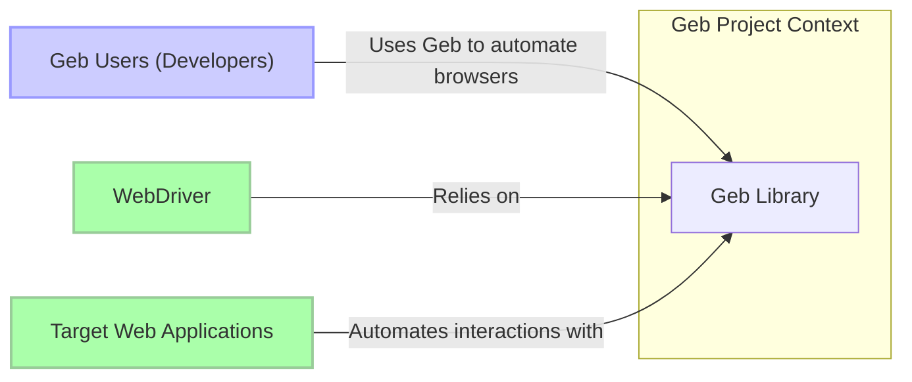
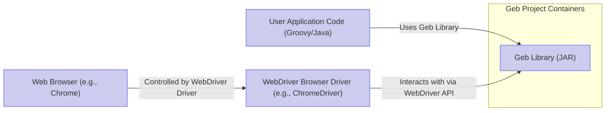
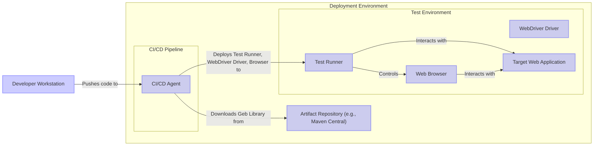
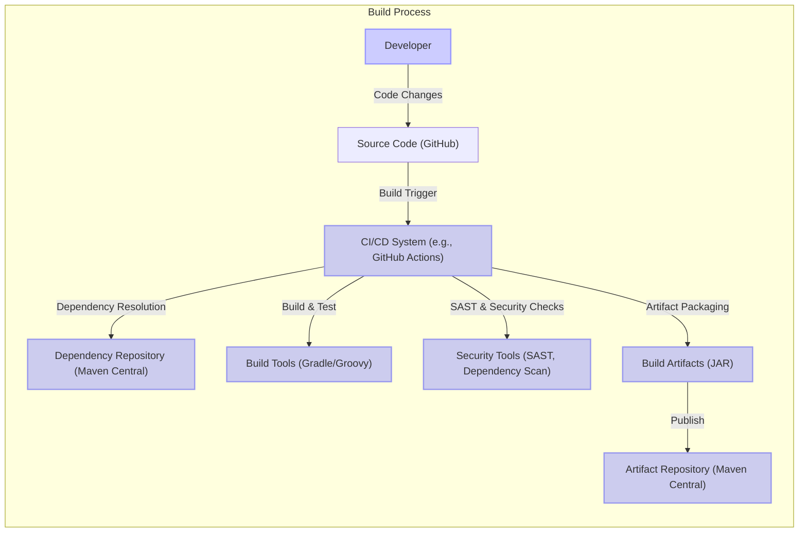

# BUSINESS POSTURE

The Geb project is a library for browser automation, primarily used for web testing and web scraping.

- Business priorities and goals:
  - Provide a user-friendly and expressive DSL for browser automation.
  - Offer a robust and reliable abstraction over WebDriver.
  - Enable efficient and maintainable automated tests for web applications.
  - Support rapid development and iteration of automated tests.
  - Facilitate web scraping tasks by simplifying browser interactions.

- Most important business risks:
  - Risk of vulnerabilities in the Geb library itself, potentially leading to security issues in projects that depend on it.
  - Risk of misuse of Geb for malicious automation, such as denial-of-service attacks or unauthorized data scraping.
  - Risk of data breaches if Geb is used to automate interactions with sensitive data without proper security considerations in user applications.
  - Risk of compatibility issues with different WebDriver versions or web browsers, impacting the reliability of automated tests.
  - Risk of performance bottlenecks in automated tests if Geb is not used efficiently, leading to slow feedback loops in development.

# SECURITY POSTURE

- Security controls:
  - security control: Public GitHub repository with issue tracking and pull request review process. (Implemented: GitHub repository)
  - security control: Open-source licensing, allowing community review and contributions. (Implemented: GitHub repository - LICENSE file)

- Accepted risks:
  - accepted risk: Vulnerabilities may be discovered in the library code due to its complexity and open-source nature.
  - accepted risk: Malicious actors may attempt to contribute malicious code through pull requests.
  - accepted risk: Users may misuse Geb in insecure ways, leading to security vulnerabilities in their own applications.
  - accepted risk: Dependencies of Geb may have vulnerabilities that could indirectly affect Geb users.

- Recommended security controls:
  - security control: Implement automated dependency scanning to identify and address vulnerabilities in Geb's dependencies.
  - security control: Integrate static analysis security testing (SAST) tools into the build process to detect potential security flaws in the Geb codebase.
  - security control: Conduct regular security code reviews, especially for critical components and contributions from external developers.
  - security control: Provide security guidelines and best practices for Geb users, focusing on secure handling of credentials, input validation, and data sanitization in automated tests and scraping scripts.
  - security control: Establish a process for reporting and handling security vulnerabilities in Geb, including a security policy and contact information.

- Security requirements:
  - Authentication:
    - Not directly applicable to the Geb library itself. Authentication is the responsibility of the web applications being tested or automated using Geb, and the user applications that utilize Geb. Geb should provide mechanisms to handle authentication flows in web applications securely (e.g., handling credentials, session management).
  - Authorization:
    - Not directly applicable to the Geb library itself. Authorization is the responsibility of the web applications being tested or automated using Geb, and the user applications that utilize Geb. Geb should not bypass or undermine the authorization mechanisms of target web applications.
  - Input validation:
    - Geb should encourage and facilitate input validation in user applications that interact with web applications. This includes validating inputs before submitting forms, interacting with web elements, and processing data scraped from web pages. Geb itself should be robust against malformed or unexpected inputs from WebDriver and web browsers.
  - Cryptography:
    - Geb itself may not directly implement cryptographic functions. However, if Geb is used to handle sensitive data (e.g., passwords, API keys) in automated tests or scraping scripts, it is crucial to ensure that user applications utilize secure storage and transmission mechanisms for such data. Geb should not introduce vulnerabilities related to cryptography, such as storing credentials in plaintext or using weak encryption algorithms.

# DESIGN

## C4 CONTEXT

- Context Diagram Elements:
  - Element:
    - Name: Geb Library
    - Type: System
    - Description: Browser automation library written in Groovy, providing a DSL for interacting with web browsers through WebDriver.
    - Responsibilities:
      - Abstracting WebDriver API and providing a higher-level DSL.
      - Handling browser interactions (navigation, element selection, form submission, etc.).
      - Providing reporting and logging capabilities for automated tests.
    - Security controls:
      - Input validation of internal APIs.
      - Secure coding practices in development.
      - Dependency management to avoid vulnerable libraries.

  - Element:
    - Name: Geb Users (Developers)
    - Type: Person
    - Description: Software developers and testers who use Geb to write automated tests and scripts for web applications.
    - Responsibilities:
      - Writing secure and reliable automated tests using Geb.
      - Properly handling credentials and sensitive data in tests.
      - Validating inputs and sanitizing outputs when interacting with web applications through Geb.
    - Security controls:
      - Secure development practices in user applications.
      - Following security guidelines provided by Geb and WebDriver.
      - Implementing proper authentication and authorization in their test environments.

  - Element:
    - Name: WebDriver
    - Type: System
    - Description:  API and protocol that allows Geb to control web browsers. WebDriver implementations (e.g., ChromeDriver, GeckoDriver) are specific to each browser.
    - Responsibilities:
      - Translating Geb commands into browser-specific instructions.
      - Managing browser sessions and interactions.
      - Providing access to browser elements and functionalities.
    - Security controls:
      - Security controls are implemented by WebDriver implementations (e.g., browser vendors).
      - Geb relies on the security of the underlying WebDriver.

  - Element:
    - Name: Target Web Applications
    - Type: System
    - Description: Web applications that are being tested or automated using Geb.
    - Responsibilities:
      - Providing the functionality and content that Geb users interact with.
      - Implementing their own security controls (authentication, authorization, input validation, etc.).
    - Security controls:
      - Web application security controls (authentication, authorization, input validation, output encoding, etc.).
      - Protection against common web vulnerabilities (OWASP Top 10).

## C4 CONTAINER

- Container Diagram Elements:
  - Element:
    - Name: Geb Library (JAR)
    - Type: Container
    - Description:  The Geb library packaged as a JAR file, distributed through Maven Central or similar repositories. Contains the Groovy code implementing the Geb DSL and WebDriver abstraction.
    - Responsibilities:
      - Providing the Geb API for user applications.
      - Managing communication with WebDriver.
      - Handling Geb DSL parsing and execution.
    - Security controls:
      - Code reviews and static analysis during development.
      - Dependency scanning to ensure secure dependencies.
      - Input validation within the library's API.

  - Element:
    - Name: User Application Code (Groovy/Java)
    - Type: Container
    - Description:  The Groovy or Java code written by Geb users that utilizes the Geb library to automate browser interactions. This code is typically part of a testing framework or a web scraping application.
    - Responsibilities:
      - Defining automated tests or scraping scripts using Geb API.
      - Handling application-specific logic and data.
      - Managing test execution and reporting.
    - Security controls:
      - Secure coding practices in user application development.
      - Input validation and output sanitization in user application code.
      - Secure handling of credentials and sensitive data within the application.

  - Element:
    - Name: WebDriver Browser Driver (e.g., ChromeDriver)
    - Type: Container
    - Description:  A browser-specific driver that implements the WebDriver protocol and allows Geb to communicate with a particular web browser. Examples include ChromeDriver for Chrome, GeckoDriver for Firefox, etc.
    - Responsibilities:
      - Translating WebDriver commands into browser-specific instructions.
      - Managing browser processes and sessions.
      - Providing access to browser functionalities through the WebDriver API.
    - Security controls:
      - Security controls are implemented by browser driver developers (often browser vendors).
      - Geb relies on the security of the chosen WebDriver driver.
      - Users should use up-to-date and trusted WebDriver drivers.

  - Element:
    - Name: Web Browser (e.g., Chrome)
    - Type: Container
    - Description:  A web browser application (e.g., Chrome, Firefox, Safari) that is controlled by WebDriver through the browser driver.
    - Responsibilities:
      - Rendering web pages and executing JavaScript code.
      - Handling user interactions (simulated by WebDriver).
      - Enforcing browser security policies.
    - Security controls:
      - Browser security features (sandboxing, content security policy, etc.).
      - Regular browser updates to patch security vulnerabilities.
      - Geb relies on the security of the web browser.

## DEPLOYMENT

Geb library itself is not deployed as a standalone application. It is deployed as a dependency within user applications. The deployment diagram below illustrates a typical deployment scenario where Geb is used in a test automation project executed in a CI/CD environment.

- Deployment Diagram Elements:
  - Element:
    - Name: CI/CD Agent
    - Type: Container
    - Description:  A server or virtual machine running a CI/CD pipeline (e.g., Jenkins, GitHub Actions). Responsible for building, testing, and deploying software. In this context, it executes automated tests using Geb.
    - Responsibilities:
      - Running test automation jobs.
      - Downloading Geb library and dependencies.
      - Deploying test environment components.
      - Executing tests and collecting results.
    - Security controls:
      - Access control to CI/CD system.
      - Secure configuration of CI/CD pipelines.
      - Secrets management for credentials used in tests.

  - Element:
    - Name: Test Runner
    - Type: Container
    - Description:  Environment where automated tests are executed. This could be a virtual machine, container, or cloud-based test execution platform. Runs the user application code that uses Geb.
    - Responsibilities:
      - Executing Geb-based automated tests.
      - Managing test execution environment.
      - Reporting test results.
    - Security controls:
      - Isolation of test environment from production.
      - Access control to test environment.
      - Secure configuration of test environment.

  - Element:
    - Name: WebDriver Driver
    - Type: Container
    - Description:  WebDriver driver instance deployed in the test environment, specific to the browser being used for testing.
    - Responsibilities:
      - Facilitating communication between Test Runner and Web Browser.
      - Controlling the Web Browser instance.
    - Security controls:
      - Use of trusted and up-to-date WebDriver drivers.
      - Secure configuration of WebDriver driver.

  - Element:
    - Name: Web Browser
    - Type: Container
    - Description:  Web browser instance deployed in the test environment, used for executing automated tests.
    - Responsibilities:
      - Rendering web application UI.
      - Executing JavaScript code in the web application.
      - Interacting with the web application as instructed by WebDriver.
    - Security controls:
      - Use of secure browser configurations.
      - Regular browser updates.

  - Element:
    - Name: Target Web Application
    - Type: Container
    - Description:  Instance of the web application being tested, deployed in a test environment.
    - Responsibilities:
      - Providing the application functionality for testing.
      - Simulating production environment behavior.
    - Security controls:
      - Test environment should mirror production security configurations as closely as possible.
      - Data in test environment should be anonymized or synthetic to protect sensitive information.

  - Element:
    - Name: Artifact Repository (e.g., Maven Central)
    - Type: Container
    - Description:  Repository where Geb library and its dependencies are stored and distributed.
    - Responsibilities:
      - Hosting Geb library artifacts.
      - Providing access to Geb library for download.
    - Security controls:
      - Repository security controls (access control, integrity checks).
      - Geb project relies on the security of the artifact repository.

## BUILD

- Build Process Elements:
  - Element:
    - Name: Developer
    - Type: Person
    - Description:  Software developer contributing to the Geb project.
    - Responsibilities:
      - Writing and committing code changes.
      - Performing local builds and tests.
      - Participating in code reviews.
    - Security controls:
      - Secure coding practices.
      - Code review process.
      - Access control to source code repository.

  - Element:
    - Name: Source Code (GitHub)
    - Type: Container
    - Description:  GitHub repository hosting the Geb project source code.
    - Responsibilities:
      - Version control of source code.
      - Collaboration platform for development.
      - Triggering CI/CD pipelines on code changes.
    - Security controls:
      - Access control to repository (authentication and authorization).
      - Branch protection rules.
      - Audit logging of repository activities.

  - Element:
    - Name: CI/CD System (e.g., GitHub Actions)
    - Type: Container
    - Description:  Automated CI/CD system used to build, test, and publish the Geb library.
    - Responsibilities:
      - Automating the build process.
      - Running unit and integration tests.
      - Performing security checks (SAST, dependency scanning).
      - Packaging and publishing build artifacts.
    - Security controls:
      - Secure configuration of CI/CD pipelines.
      - Secrets management for build credentials.
      - Access control to CI/CD system.
      - Audit logging of build activities.

  - Element:
    - Name: Dependency Repository (Maven Central)
    - Type: Container
    - Description:  Repository hosting Geb's dependencies (and potentially plugins).
    - Responsibilities:
      - Providing dependencies required for building Geb.
    - Security controls:
      - Geb project relies on the security of Maven Central.
      - Dependency scanning helps mitigate risks from vulnerable dependencies.

  - Element:
    - Name: Build Tools (Gradle/Groovy)
    - Type: Container
    - Description:  Tools used to compile, build, and package the Geb library (Gradle build system, Groovy compiler).
    - Responsibilities:
      - Compiling Groovy code.
      - Managing build process.
      - Packaging JAR files.
    - Security controls:
      - Use of trusted build tools versions.
      - Secure configuration of build tools.

  - Element:
    - Name: Security Tools (SAST, Dependency Scan)
    - Type: Container
    - Description:  Static analysis security testing (SAST) tools and dependency scanning tools integrated into the CI/CD pipeline.
    - Responsibilities:
      - Identifying potential security vulnerabilities in the Geb codebase.
      - Detecting vulnerable dependencies.
      - Reporting security findings to developers.
    - Security controls:
      - Configuration and maintenance of security tools.
      - Review and remediation of security findings.

  - Element:
    - Name: Build Artifacts (JAR)
    - Type: Container
    - Description:  JAR file containing the compiled Geb library, ready for distribution.
    - Responsibilities:
      - Packaging the Geb library for distribution.
    - Security controls:
      - Integrity checks (e.g., checksums) for build artifacts.
      - Signing of JAR files (optional).

  - Element:
    - Name: Artifact Repository (Maven Central)
    - Type: Container
    - Description:  Public artifact repository (Maven Central) where the built Geb library is published for users to download.
    - Responsibilities:
      - Hosting and distributing the Geb library JAR.
      - Making Geb library available to users.
    - Security controls:
      - Repository security controls (access control, integrity checks).
      - Geb project relies on the security of Maven Central for distribution.

# RISK ASSESSMENT

- Critical business processes we are trying to protect:
  - For the Geb project itself: Maintaining the integrity, availability, and confidentiality of the Geb library code and build process. Ensuring the library is free from vulnerabilities and safe for users to use.
  - For users of Geb: Ensuring the reliability and security of their automated tests and web scraping scripts. Protecting sensitive data handled during automation processes.

- Data we are trying to protect and their sensitivity:
  - Geb library source code: Confidentiality (to prevent unauthorized access and modification), Integrity (to ensure code is not tampered with), Availability (to ensure continuous development and maintenance). Sensitivity: High.
  - Geb build artifacts (JAR): Integrity (to ensure users download untampered and safe library versions), Availability (to ensure users can access and use the library). Sensitivity: Medium.
  - User application code using Geb: Confidentiality (if it contains sensitive business logic or credentials), Integrity (to ensure tests are reliable and not manipulated), Availability (to ensure tests can be executed when needed). Sensitivity: Varies depending on the user application.
  - Sensitive data handled during automation (credentials, PII): Confidentiality (to prevent unauthorized access), Integrity (to ensure data is not modified or corrupted), Availability (to ensure data is accessible when needed for automation). Sensitivity: High to Critical, depending on the data.

# QUESTIONS & ASSUMPTIONS

- BUSINESS POSTURE:
  - Assumption: The primary business goal is to provide a valuable and reliable tool for developers to automate browser interactions, primarily for testing purposes.
  - Question: Are there specific target industries or use cases that Geb is primarily focused on? Understanding this could help prioritize certain security risks.

- SECURITY POSTURE:
  - Assumption: Current security posture relies on standard open-source development practices and community contributions.
  - Question: Are there any existing security policies or documented security practices for the Geb project? Are there any historical security incidents or vulnerability reports related to Geb?
  - Question: What is the process for handling security vulnerability reports for Geb? Is there a dedicated security team or contact?

- DESIGN:
  - Assumption: Geb is primarily used as a library dependency in Groovy or Java projects.
  - Question: Are there any plans to distribute Geb in other forms (e.g., as a standalone service or container)? This could impact the deployment and security considerations.
  - Question: What are the performance and scalability requirements for Geb? Understanding these requirements can influence design decisions and potential security implications related to performance.
  - Question: Are there any specific regulatory compliance requirements that Geb or its users need to adhere to (e.g., GDPR, HIPAA)? This could introduce additional security requirements.