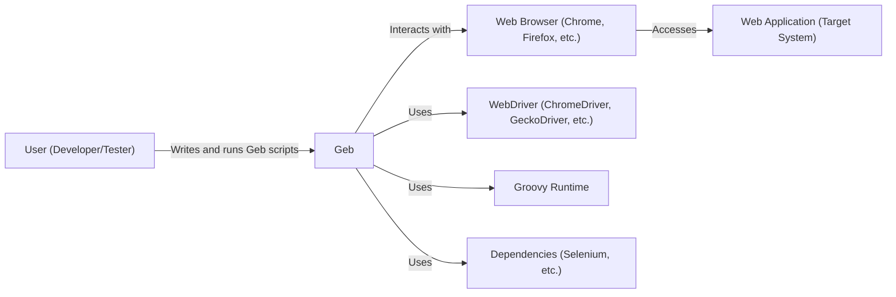
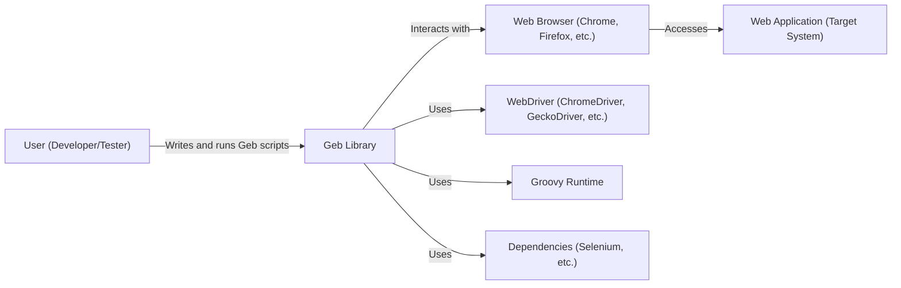
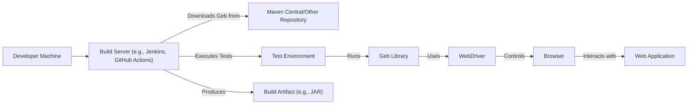
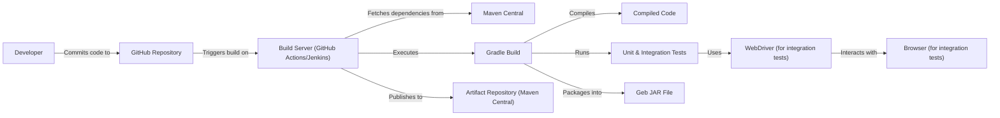

Okay, let's create a design document for the Geb project, focusing on aspects relevant for threat modeling.

# BUSINESS POSTURE

Geb is an open-source browser automation solution. It leverages the power of WebDriver, providing a Groovy-based DSL to interact with web browsers.  It's primarily used for functional web testing, scraping, and automating web-based tasks.

Business Priorities:

*   Provide a reliable and efficient browser automation tool.
*   Maintain a user-friendly API for ease of use.
*   Ensure compatibility with various browsers and WebDriver implementations.
*   Foster a strong community and maintain the project's longevity.
*   Reduce the complexity of writing and maintaining web tests.

Business Goals:

*   Increase adoption by developers and testers.
*   Become a preferred choice for Groovy-based browser automation.
*   Maintain a high level of quality and stability.

Most Important Business Risks:

*   **Security vulnerabilities in Geb itself or its dependencies (especially WebDriver) could allow attackers to execute arbitrary code or compromise systems running tests.** This is the most critical risk, given Geb's core function of interacting with browsers, which are often attack vectors.
*   Incompatibility with new browser or WebDriver versions could render Geb unusable, impacting users' testing and automation pipelines.
*   Lack of maintenance or community support could lead to the project becoming obsolete.
*   Poor performance or reliability could deter users and damage the project's reputation.
*   Steep learning curve or complex configuration could limit adoption.

# SECURITY POSTURE

Existing Security Controls:

*   security control: Geb relies on the security features of WebDriver, which handles the low-level browser interaction. WebDriver implementations themselves have security considerations and updates. (Described in WebDriver documentation)
*   security control: Geb's core functionality is focused on browser interaction, not on handling sensitive data directly.  It primarily executes user-provided scripts. (Described in Geb's source code and documentation)
*   security control: Geb's build process likely includes unit and integration tests to verify functionality and prevent regressions. (Described in the build configuration files within the repository)
*   security control: Geb is open source, allowing for community scrutiny and contributions to identify and fix potential security issues. (Described in GitHub repository)
*   security control: Geb uses SLF4J for logging, which allows for configurable logging levels and destinations. This can be used to monitor Geb's activity and detect potential issues. (Described in Geb's source code and documentation)

Accepted Risks:

*   accepted risk: Geb executes user-provided Groovy scripts, which inherently carries the risk of executing malicious code if the user's script is compromised or intentionally malicious. This is a fundamental aspect of Geb's design.
*   accepted risk: Geb depends on external libraries (WebDriver, Groovy, etc.), and vulnerabilities in these dependencies could impact Geb's security.
*   accepted risk: Geb's primary focus is functional testing, not security testing. While it can be used to test security aspects of a web application, it's not a dedicated security testing tool.

Recommended Security Controls:

*   security control: Implement a robust dependency management process, including regular scanning for known vulnerabilities in dependencies (e.g., using tools like Dependabot or Snyk).
*   security control: Provide clear documentation and guidelines on secure usage of Geb, emphasizing the risks of executing untrusted scripts and recommending best practices for secure test development.
*   security control: Consider adding static analysis tools to the build process to identify potential security issues in Geb's codebase.
*   security control: Explore options for sandboxing or isolating the execution of Geb scripts to limit the potential impact of malicious code. This is a complex undertaking but would significantly enhance security.

Security Requirements:

*   Authentication: Geb itself does not handle authentication directly. It interacts with web applications, which may have their own authentication mechanisms. Geb scripts will need to handle authentication as required by the target application.
*   Authorization: Similar to authentication, Geb does not manage authorization. It relies on the authorization mechanisms of the target web application.
*   Input Validation: Geb does not perform input validation on user-provided scripts. It's crucial for users to validate any input used within their Geb scripts to prevent injection vulnerabilities. Geb should, however, validate its own configuration inputs.
*   Cryptography: Geb does not directly handle cryptography. If interaction with encrypted data or secure protocols (HTTPS) is required, it relies on the underlying WebDriver and browser capabilities.

# DESIGN

## C4 CONTEXT

C4 Context Element List:

*   User (Developer/Tester):
    *   Name: User
    *   Type: Person
    *   Description: The developer or tester who writes and executes Geb scripts.
    *   Responsibilities: Writing Geb scripts, configuring Geb, running tests, analyzing results.
    *   Security controls: Secure coding practices, access controls on test environments.

*   Geb:
    *   Name: Geb
    *   Type: Software System
    *   Description: The browser automation library.
    *   Responsibilities: Providing a DSL for browser interaction, managing WebDriver, executing user scripts.
    *   Security controls: Dependency management, secure coding practices, reliance on WebDriver security.

*   Browser:
    *   Name: Web Browser
    *   Type: Software System
    *   Description: The web browser (e.g., Chrome, Firefox) used for automation.
    *   Responsibilities: Rendering web pages, executing JavaScript, interacting with the user.
    *   Security controls: Browser security features, sandboxing, regular updates.

*   WebApplication:
    *   Name: Web Application
    *   Type: Software System
    *   Description: The target web application being tested or automated.
    *   Responsibilities: Providing the functionality being tested.
    *   Security controls: Web application security controls (authentication, authorization, input validation, etc.).

*   WebDriver:
    *   Name: WebDriver
    *   Type: Software System
    *   Description: The WebDriver implementation (e.g., ChromeDriver, GeckoDriver).
    *   Responsibilities: Providing a standardized interface for controlling the browser.
    *   Security controls: WebDriver security features, regular updates.

*   Groovy:
    *   Name: Groovy Runtime
    *   Type: Software System
    *   Description: The environment for running Groovy code.
    *   Responsibilities: Executing Geb scripts written in Groovy.
    *   Security controls: Secure configuration of the Groovy runtime.

*   Dependencies:
    *   Name: Dependencies
    *   Type: Software System
    *   Description: External libraries used by Geb (e.g., Selenium).
    *   Responsibilities: Providing supporting functionality.
    *   Security controls: Dependency management, vulnerability scanning.

## C4 CONTAINER

Since Geb is a library, the container diagram is essentially an extension of the context diagram.

C4 Container Element List:

*   User (Developer/Tester):
    *   Name: User
    *   Type: Person
    *   Description: The developer or tester who writes and executes Geb scripts.
    *   Responsibilities: Writing Geb scripts, configuring Geb, running tests, analyzing results.
    *   Security controls: Secure coding practices, access controls on test environments.

*   Geb Library:
    *   Name: Geb Library
    *   Type: Library
    *   Description: The core Geb library code.
    *   Responsibilities: Providing a DSL for browser interaction, managing WebDriver, executing user scripts.
    *   Security controls: Dependency management, secure coding practices, reliance on WebDriver security.

*   Browser:
    *   Name: Web Browser
    *   Type: Software System
    *   Description: The web browser (e.g., Chrome, Firefox) used for automation.
    *   Responsibilities: Rendering web pages, executing JavaScript, interacting with the user.
    *   Security controls: Browser security features, sandboxing, regular updates.

*   WebApplication:
    *   Name: Web Application
    *   Type: Software System
    *   Description: The target web application being tested or automated.
    *   Responsibilities: Providing the functionality being tested.
    *   Security controls: Web application security controls (authentication, authorization, input validation, etc.).

*   WebDriver:
    *   Name: WebDriver
    *   Type: Software System
    *   Description: The WebDriver implementation (e.g., ChromeDriver, GeckoDriver).
    *   Responsibilities: Providing a standardized interface for controlling the browser.
    *   Security controls: WebDriver security features, regular updates.

*   Groovy:
    *   Name: Groovy Runtime
    *   Type: Software System
    *   Description: The environment for running Groovy code.
    *   Responsibilities: Executing Geb scripts written in Groovy.
    *   Security controls: Secure configuration of the Groovy runtime.

*   Dependencies:
    *   Name: Dependencies
    *   Type: Software System
    *   Description: External libraries used by Geb (e.g., Selenium).
    *   Responsibilities: Providing supporting functionality.
    *   Security controls: Dependency management, vulnerability scanning.

## DEPLOYMENT

Geb is a library, and its "deployment" is typically as a dependency within a user's project.  There are several ways this can happen:

1.  **Dependency Management System (Gradle, Maven):**  The most common approach. Users add Geb as a dependency in their build configuration (e.g., `build.gradle` or `pom.xml`). The build system automatically downloads Geb and its dependencies from a repository (e.g., Maven Central).
2.  **Manual Download:** Users can manually download the Geb JAR file and add it to their project's classpath. This is less common and not recommended.
3.  **Bundled with Application:** In rare cases, Geb might be bundled directly within an application, but this is atypical.

We'll describe the most common scenario (Gradle/Maven dependency).

Deployment Element List:

*   Developer Machine:
    *   Name: Developer Machine
    *   Type: Infrastructure Node
    *   Description: The developer's workstation where code is written and tests are initiated.
    *   Responsibilities: Code development, test execution, build initiation.
    *   Security controls: Local security measures, access controls.

*   Build Server:
    *   Name: Build Server
    *   Type: Infrastructure Node
    *   Description: The server that builds the project and runs tests (e.g., Jenkins, GitHub Actions).
    *   Responsibilities: Building the project, running tests, managing dependencies.
    *   Security controls: Access controls, secure configuration, vulnerability scanning of the build environment.

*   Maven Central/Other Repository:
    *   Name: Maven Central/Other Repository
    *   Type: Infrastructure Node
    *   Description: The repository where Geb and its dependencies are stored.
    *   Responsibilities: Providing access to Geb and its dependencies.
    *   Security controls: Repository security measures, integrity checks.

*   Test Environment:
    *   Name: Test Environment
    *   Type: Infrastructure Node
    *   Description: The environment where tests are executed.
    *   Responsibilities: Running the tests, providing the necessary infrastructure.
    *   Security controls: Isolation from production, access controls, secure configuration.

*   Geb Library:
    *   Name: Geb Library
    *   Type: Library
    *   Description: The Geb library code.
    *   Responsibilities: Providing browser automation functionality.
    *   Security controls: Dependency management, secure coding practices.

*   WebDriver:
    *   Name: WebDriver
    *   Type: Software System
    *   Description: The WebDriver implementation.
    *   Responsibilities: Controlling the browser.
    *   Security controls: WebDriver security features, regular updates.

*   Browser:
    *   Name: Browser
    *   Type: Software System
    *   Description: The web browser.
    *   Responsibilities: Rendering web pages, executing JavaScript.
    *   Security controls: Browser security features, sandboxing.

*   Web Application:
    *   Name: Web Application
    *   Type: Software System
    *   Description: The target web application.
    *   Responsibilities: Providing the functionality being tested.
    *   Security controls: Web application security controls.

* Build Artifact:
    * Name: Build Artifact
    * Type: Artifact
    * Description: Project build output, e.g. JAR file.
    * Responsibilities: Containing project code and dependencies.
    * Security controls: Build artifact signing.

## BUILD

Geb's build process, as seen in the GitHub repository, uses Gradle. The process generally involves:

1.  **Code Checkout:** The build server checks out the Geb source code from the GitHub repository.
2.  **Dependency Resolution:** Gradle resolves and downloads Geb's dependencies (Selenium, Groovy, etc.) from Maven Central or other configured repositories.
3.  **Compilation:** The Groovy and Java code is compiled.
4.  **Testing:** Unit and integration tests are executed.
5.  **Packaging:** The compiled code and resources are packaged into JAR files.
6.  **Publishing:** The JAR files are published to a repository (typically Maven Central for releases).

Security Controls in the Build Process:

*   security control: **Dependency Management:** Gradle handles dependency resolution, but it's crucial to use a tool like Dependabot or Snyk to scan for vulnerabilities in dependencies.
*   security control: **Automated Testing:** The build process includes unit and integration tests, which help to identify bugs and regressions early.
*   security control: **Code Analysis (Potential):** While not currently evident in the repository, adding static analysis tools (e.g., FindBugs, SpotBugs, PMD) to the Gradle build could help identify potential security vulnerabilities in the Geb codebase.
*   security control: **Secure Build Environment:** The build server itself should be secured, with appropriate access controls and security hardening.

# RISK ASSESSMENT

Critical Business Processes to Protect:

*   **Automated Testing:** Geb's primary function is to enable automated testing of web applications. Disruption of this capability would impact users' ability to test their software.
*   **Web Scraping:** Geb can be used for web scraping. If used for critical data gathering, disruption or compromise of this process could have significant consequences.
*   **Web Task Automation:** Geb can automate various web-based tasks. If these tasks are critical to business operations, their disruption would be a significant risk.

Data to Protect and Sensitivity:

*   **Geb Scripts (Low to High Sensitivity):** Geb scripts themselves may contain sensitive information, such as credentials for accessing test environments or web applications. The sensitivity depends on the specific script and the environment it interacts with.
*   **Test Data (Low to High Sensitivity):** Test data used in Geb scripts may contain sensitive information, depending on the nature of the application being tested.
*   **Web Application Data (Low to High Sensitivity):** Geb interacts with web applications, which may handle data of varying sensitivity, from publicly available information to highly confidential data. Geb itself doesn't store this data, but it interacts with it.
*   **Build Artifacts (Medium Sensitivity):** Geb build artifacts (JAR files) contain the compiled code. While not directly containing user data, compromised artifacts could be used to inject malicious code.

# QUESTIONS & ASSUMPTIONS

Questions:

*   Are there any specific security certifications or compliance requirements that Geb needs to adhere to (e.g., for use in regulated industries)?
*   What is the expected threat model for users of Geb? Are they primarily concerned with malicious actors, accidental misuse, or both?
*   What level of support is provided for users who encounter security issues with Geb?
*   Is there a process for handling security vulnerabilities reported by external researchers?
*   Are there any plans to add features that would enhance Geb's security posture, such as sandboxing or code signing?
*   What are the specific security configurations and hardening measures applied to the build server and test environments?

Assumptions:

*   BUSINESS POSTURE: Geb is primarily used in development and testing environments, not in production.
*   BUSINESS POSTURE: Users are responsible for securing their own test environments and the web applications they interact with using Geb.
*   SECURITY POSTURE: Geb relies heavily on the security of WebDriver and the underlying browser.
*   SECURITY POSTURE: Users are aware of the risks of executing untrusted Groovy scripts and take appropriate precautions.
*   DESIGN: The primary deployment method is via dependency management systems like Gradle and Maven.
*   DESIGN: The build process is automated using Gradle and potentially a CI/CD system like GitHub Actions.
*   DESIGN: Geb doesn't have any specific data storage requirements.