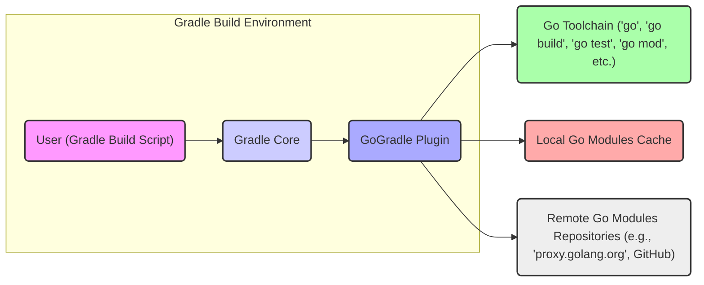

# Project Design Document: GoGradle

**Version:** 1.1
**Date:** October 26, 2023
**Author:** AI Software Architect

## 1. Introduction

This document provides a detailed design overview of the GoGradle project, a Gradle plugin designed to facilitate the building, testing, and management of Go projects within the Gradle build system. The primary purpose of this document is to serve as a comprehensive resource for subsequent threat modeling activities. It aims to provide a clear and thorough understanding of the system's architecture, components, interactions, and data flow to enable effective identification of potential security vulnerabilities.

## 2. Goals and Non-Goals

### 2.1. Goals

*   To thoroughly describe the architecture and functionality of the GoGradle plugin.
*   To clearly identify the key components of the system and their interactions with each other and external entities.
*   To explicitly outline the flow of data within the plugin and between the plugin and external systems.
*   To establish a precise understanding of the system's boundaries, responsibilities, and dependencies.
*   To serve as the definitive basis for identifying potential security vulnerabilities and attack vectors during the threat modeling process.

### 2.2. Non-Goals

*   This document does not aim to provide implementation-level details of the GoGradle plugin's source code.
*   It is not intended to be a comprehensive security analysis or threat assessment; that is the objective of the subsequent threat modeling exercise.
*   A detailed explanation of the internal workings of the Gradle build system is outside the scope of this document.
*   The specifics of the Go toolchain's implementation details are not covered here.

## 3. System Overview

GoGradle acts as a bridge between the Gradle build system, which is predominantly used in Java and JVM-based projects, and the Go programming language ecosystem. It empowers developers to manage Go project dependencies, compile Go source code, execute tests, and perform other essential Go-related build tasks directly within the familiar Gradle environment. This integration simplifies the management of projects that utilize both Java/JVM and Go components, allowing developers to leverage Gradle's powerful features for their Go codebase.

## 4. Architecture

The following diagram illustrates the high-level architecture and key interactions within the GoGradle plugin:

### 4.1. Components

*   **User (Gradle Build Script):** This represents the developer who authors the `build.gradle` file, defining the Go-specific build tasks and configurations. This is the primary interface for interacting with the GoGradle plugin. The build script contains instructions on how Go code should be compiled, tested, and managed.
*   **Gradle Core:** The foundational component of the Gradle build system. It is responsible for parsing and executing the `build.gradle` script, managing plugins, and orchestrating the overall build process. It provides the runtime environment for the GoGradle plugin.
*   **GoGradle Plugin:** This is the core subject of this design document. It's a Gradle plugin, likely implemented in Java or Kotlin, that acts as the intermediary between Gradle and the Go ecosystem. Its key responsibilities include:
    *   **Configuration Parsing:** Interpreting and validating Go-specific configurations defined in the `build.gradle` file (e.g., source directories, Go SDK path, build targets, dependency declarations).
    *   **Dependency Management:** Managing Go dependencies using Go Modules. This involves interacting with the Go toolchain to resolve, download, and manage dependencies specified in `go.mod` files.
    *   **Go Toolchain Invocation:**  Executing the Go command-line tools (e.g., `go build`, `go test`, `go mod`) with the appropriate arguments based on the Gradle configuration. This includes constructing the command-line arguments and handling the execution of these external processes.
    *   **Output Handling:** Capturing and processing the output (standard output and standard error) from the invoked Go toolchain commands. This may involve parsing the output for build status, test results, or error messages.
    *   **Artifact Integration:** Integrating the build artifacts produced by the Go toolchain (e.g., executables, libraries) into the Gradle build output structure, making them available for subsequent Gradle tasks.
*   **Go Toolchain:** This refers to the suite of command-line tools provided by the Go programming language distribution. These tools are essential for performing Go-specific tasks and include:
    *   `go`: The main Go command-line tool, used for various operations.
    *   `go build`:  Compiles Go source code into executable binaries or libraries.
    *   `go test`: Executes Go test files.
    *   `go mod`: Manages Go module dependencies.
    *   Other Go tools (e.g., `go fmt`, `go vet`).
*   **Local Go Modules Cache:** This is a local directory on the build machine where downloaded Go modules (dependencies) are stored. This caching mechanism speeds up subsequent builds by avoiding redundant downloads of the same dependencies.
*   **Remote Go Modules Repositories:** These are remote servers (e.g., `proxy.golang.org`, GitHub, private module repositories) that host Go modules. The Go toolchain interacts with these repositories to download dependencies that are not already present in the local cache.

### 4.2. Data Flow

The typical sequence of data flow during a GoGradle build process involving the GoGradle plugin is as follows:

1. The **User** initiates a Gradle build by executing a command (e.g., `gradle build`) on the command line.
2. **Gradle Core** loads and parses the `build.gradle` file for the project.
3. When **Gradle Core** encounters tasks or configurations related to the GoGradle plugin, it invokes the **GoGradle Plugin**.
4. The **GoGradle Plugin** reads and interprets Go-specific configurations from the `build.gradle` file, such as source directories, dependency declarations, and build targets.
5. If the build process requires resolving Go dependencies, the **GoGradle Plugin** interacts with the **Go Toolchain** (specifically using `go mod`). This may involve:
    *   Reading the `go.mod` file to identify required dependencies.
    *   Querying **Remote Go Modules Repositories** over the network to locate and download the necessary modules.
    *   Storing the downloaded modules in the **Local Go Modules Cache**.
6. For the compilation phase, the **GoGradle Plugin** invokes the **Go Toolchain** (using `go build`). This involves:
    *   Providing the Go compiler with the locations of the Go source code.
    *   Specifying output directories and naming conventions for the compiled binaries.
    *   Potentially passing other build flags and environment variables.
    *   The **Go Toolchain** reads the source code and produces compiled binaries or libraries.
7. For running tests, the **GoGradle Plugin** invokes the **Go Toolchain** (using `go test`). This involves:
    *   Specifying the directories containing Go test files.
    *   Potentially passing test flags and environment variables.
    *   The **Go Toolchain** executes the tests and generates test results.
8. The **GoGradle Plugin** captures the standard output and standard error streams from the **Go Toolchain** during compilation and testing. This output may contain build status, error messages, and test results.
9. The **GoGradle Plugin** integrates the build artifacts produced by the **Go Toolchain** into the Gradle build output structure. This typically involves copying the compiled binaries to designated output directories managed by Gradle.
10. **Gradle Core** continues with the remaining build tasks, potentially utilizing the Go build artifacts generated by the GoGradle plugin.

## 5. Security Considerations (For Threat Modeling)

This section outlines potential security considerations that will be the focus of subsequent threat modeling activities.

*   **Dependency Management Vulnerabilities:**
    *   **Malicious Dependencies:** The risk of downloading and using compromised or backdoored Go modules from **Remote Go Modules Repositories**.
    *   **Dependency Confusion/Substitution Attacks:**  The possibility of the plugin inadvertently using an internal or malicious dependency instead of the intended public one due to naming conflicts or repository misconfigurations.
    *   **Vulnerable Dependencies:**  The inclusion of Go modules with known security vulnerabilities.
*   **Go Toolchain Interaction Risks:**
    *   **Command Injection:** If the **GoGradle Plugin** does not properly sanitize inputs when constructing commands for the **Go Toolchain**, a malicious `build.gradle` file could inject arbitrary commands for execution on the build machine.
    *   **Path Traversal:** Vulnerabilities in how the plugin handles file paths provided in the `build.gradle` could allow attackers to access or modify files outside the intended project scope.
    *   **Exposure of Sensitive Information:**  Improper handling of environment variables or build arguments passed to the **Go Toolchain** could inadvertently expose sensitive information.
*   **Gradle Plugin Security Concerns:**
    *   **Plugin Tampering:** If the GoGradle plugin artifact itself is compromised (e.g., through a compromised repository), it could inject malicious code into the build process of any project using it.
    *   **Configuration Injection:**  Vulnerabilities in how the plugin parses and utilizes configuration data from the `build.gradle` file could be exploited to manipulate the build process or execute arbitrary code.
*   **Build Environment Security Posture:**
    *   The security of the environment where the Gradle build is executed is paramount. A compromised build machine could lead to the injection of malicious code, exfiltration of source code or build artifacts, or other malicious activities.
*   **Output Handling and Logging:**
    *   **Information Leakage:**  The plugin might inadvertently log or output sensitive information (e.g., API keys, credentials) from the Go toolchain's output.
    *   **Log Forging:**  A malicious actor might be able to manipulate the plugin's logging mechanisms to hide malicious activities.

## 6. Dependencies

The GoGradle plugin relies on the following key dependencies:

*   **Gradle Core:** The fundamental build automation system that provides the plugin execution environment.
*   **Specific Gradle API Versions:** The plugin is likely built against specific versions of the Gradle API, creating a dependency on those versions for proper functionality.
*   **Go Toolchain Executables:** The presence of the Go command-line tools (`go`, `go build`, etc.) on the system's PATH is a critical dependency. The plugin relies on these external executables to perform Go-related tasks.
*   **Network Connectivity:**  Essential for downloading Go modules from remote repositories during the dependency resolution process.
*   **Remote Go Modules Repositories:** External services that host Go dependencies. The security and availability of these repositories are crucial for the build process.

## 7. Deployment

The GoGradle plugin is typically deployed by declaring it as a dependency within the `plugins` block of a Gradle project's `build.gradle` or `settings.gradle` file. Gradle then automatically resolves and downloads the plugin from a configured repository (e.g., Gradle Plugin Portal, Maven Central). Once applied, the plugin extends Gradle's functionality with Go-specific tasks and configurations.

## 8. Future Considerations

*   **Support for Advanced Go Features:**  Potential future enhancements could include support for more advanced Go features like cgo, build tags, and cross-compilation.
*   **Improved Error Reporting and Diagnostics:** Enhancing the plugin's ability to provide more detailed and actionable error messages when Go build failures occur.
*   **Integration with IDEs:**  Improving integration with popular Integrated Development Environments (IDEs) to provide a smoother development experience for Go projects within a Gradle environment.
*   **Performance Optimizations:** Exploring opportunities to optimize the plugin's performance, particularly in scenarios with large Go projects or complex dependency graphs.

This revised document provides a more detailed and structured overview of the GoGradle project's design, specifically tailored to facilitate effective threat modeling. The enhanced descriptions of components, data flow, and initial security considerations should provide a solid foundation for identifying and mitigating potential security risks.
